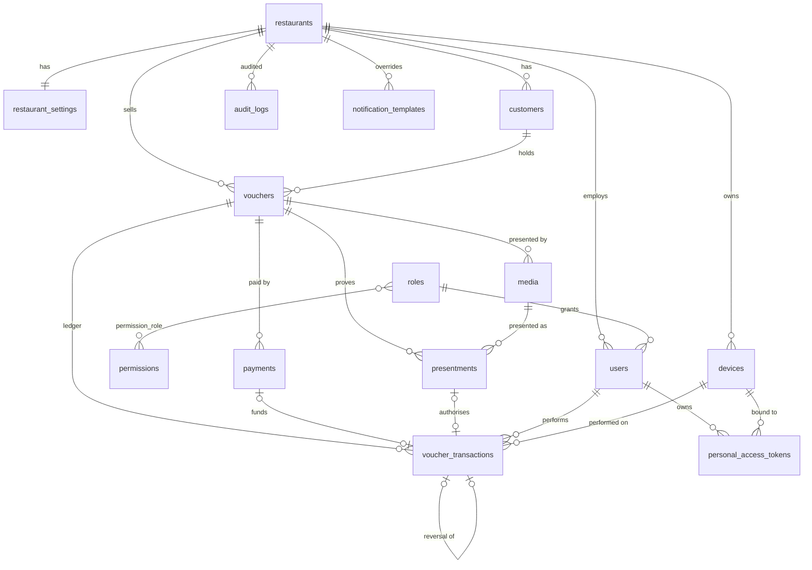

# Database schema

- **MySQL 8.4**, `utf8mb4_unicode_ci`, InnoDB, `READ-COMMITTED`. SQLite is supported for development and tests.
- **Every primary key is a UUID** (`CHAR(36)`); Eloquent generates time-ordered UUIDv7 values.
- **Money** columns are integer minor units (cents). Balances are `UNSIGNED`, so the database refuses a negative
  balance.
- **Financial history is append-only.** `voucher_transactions`, `payments` and `audit_logs` reject `UPDATE` and
  `DELETE` with database triggers and are hash-chained per restaurant. Foreign keys from financial tables are
  `RESTRICT`. Restaurants, users, devices and customers are soft-deleted.

## Installing the schema

The schema is defined by seven migrations, `backend/database/migrations/2026_01_01_000001` … `000007`. A new
database is created with:

```bash
php artisan migrate --seed
```

A database that was created from an earlier schema is rebuilt once with:

```bash
php artisan migrate:fresh --seed        # drops every table, creates the schema, seeds reference data
```

Reference data (roles and permissions, guest e-mail templates, system settings) is seeded idempotently; the Laravel
containers seed it on every start. Demo data is seeded only in `local`, `testing` and `staging`, or with
`SEED_DEMO_DATA=true`. After `migrate:fresh` on a server, create the platform administrator again
(`php artisan platform:create-admin`).

MySQL runs with `--log-bin-trust-function-creators=1` (set in `docker-compose.coolify.yml`), so the application's
database user can create the append-only triggers while binary logging is on.

## Entity relationships



## Tables

### Platform (`000001`)

**`restaurants`** — the tenant. `name`, `slug` (unique), `legal_name`, `vat_number`, contact and address, `country`,
`currency` (ISO 4217), `timezone`, `locale`, `status` (`active` / `suspended`), `plan`, `suspended_at`,
`suspension_reason`, timestamps, `deleted_at` (archived).

**`restaurant_settings`** (1:1) — the restaurant's voucher rules:

| Column | Default | Meaning |
|---|---|---|
| `validity_months` | `NULL` | `NULL` = vouchers have no expiry; otherwise at least 36 |
| `min_voucher_value` | 500 | Smallest sale |
| `max_voucher_balance` | 50000 | Cap for sales, reloads and reversals |
| `max_debit_per_transaction` | 25000 | Per redemption |
| `max_debit_per_voucher_per_day` | 50000 | Per voucher and restaurant-local day |
| `max_redemptions_per_voucher_per_hour` | 10 | 0 = off |
| `allow_reload`, `allow_partial_redemption`, `send_customer_emails` | true | |
| `brand_color`, `receipt_footer` | | Print sheet and e-mails |

The money limits cannot exceed the platform ceilings in `config/giftcard.php → limits`.

**`system_settings`** — platform key/value configuration (`platform.support_email`, `platform.maintenance_notice`,
`app.min_version.android`, `app.min_version.ios`, …), JSON values.

### Access control (`000002`)

**`roles`**, **`permissions`**, **`permission_role`** — system roles `platform_admin`, `owner`, `manager`, `waiter`
with `rank` and `scope`. Permissions are the strings of `App\Enums\Permission` (`vouchers.redeem`, …); the mapping is
seeded from `RoleSlug::defaultPermissions()`.

**`users`** — `restaurant_id` (NULL for platform staff), `role_id`, `name`, `email` (unique), `password` (bcrypt),
`status` (`active` / `inactive`), `locale`, `last_login_at/ip`, `password_changed_at`, `failed_login_attempts`,
`locked_until`, `remember_token`, soft deletes.

**`password_reset_tokens`** (60 min) and **`invitation_tokens`** (72 h) — separate hashed token stores of the two
password brokers. **`sessions`** — Laravel session store (`user_id` is a UUID).

### Devices and customers (`000003`)

**`devices`** — terminals: `restaurant_id`, `registered_by`, `name`, `type`, `fingerprint` (SHA-256 of restaurant id
and the client's `X-Device-Id`; unique per restaurant), `platform`, `status` (`active` / `revoked`), `last_seen_at`,
`last_ip`, `last_user_id`, `revoked_at`, soft deletes.

**`personal_access_tokens`** — Sanctum tokens with UUID ids: `tokenable_type/id`, `restaurant_id`, `device_id`
(set for waiter app tokens, NULL for integration tokens), `name`, `token` (SHA-256, unique), `abilities`,
`last_used_at`, `last_used_ip`, `expires_at`, `revoked_at`, `revoked_by`. Revocation sets `revoked_at`; rows are kept.

**`customers`** — `restaurant_id`, `first_name`, `last_name`, `email`, `phone`, `notes`, `marketing_consent`,
`anonymized_at`, soft deletes. Indexed by `(restaurant_id, email)` and `(restaurant_id, last_name)`.

### Vouchers, media, presentments, payments, ledger (`000004`)

**`vouchers`**

| Column | Notes |
|---|---|
| `restaurant_id`, `customer_id` | Tenant; optional customer |
| `kind` | `card` or `digital`. A voucher is spent either with its physical card or with its QR, never both |
| `voucher_number` | 16-digit, Luhn-valid, random; unique per restaurant. Internal: staff and support only, never printed, never a credential |
| `status` | `active`, `blocked`, `expired` (an empty voucher is `active` with balance 0) |
| `currency` | From the restaurant |
| `initial_value`, `balance`, `total_loaded`, `total_redeemed` | Cents, unsigned. `total_loaded` = sale + reloads |
| `expires_at` | Last second of the last valid day (restaurant timezone, stored in UTC); `NULL` = no expiry |
| `blocked_at`, `blocked_reason`, `expired_at` | Status details |
| `issued_by`, `recipient_name`, `notes`, `last_used_at`, timestamps | |

Indexes: `(restaurant_id, voucher_number)` unique, `(restaurant_id, status, created_at)`, `status`, `expires_at`.

**`media`** — how a voucher is presented: `voucher_id`, `type` (`printable_qr`), `role` (`spend`), `status`
(`active` / `revoked`), `secret_hash` (SHA-256 of the 256-bit secret, unique; the secret itself is never stored),
`created_by`, `revoked_at`, `revoked_by`, `revoke_reason`. At most one active printable QR per voucher.

**`presentments`** — proofs of presence: `voucher_id`, `medium_id`, `purpose` (`spend`), `method`
(`printable_qr`, `live_auth`), `level` (`A1` bearer QR, `A3` live card authentication), `status` (`verified` →
`consumed`), `user_id`, `device_id`, `expires_at` (60 s), `consumed_at`, `created_at`.

**`payments`** (append-only, hash-chained) — `voucher_id`, `method` (`cash`, `card_terminal`, `bank_transfer`,
`complimentary`), `amount`, `currency`, `reference` (receipt or bank reference), `approved_by` and `reason`
(complimentary), `received_by`, `device_id`, `created_at`.

**`voucher_transactions`** — the ledger (append-only, hash-chained)

| Column | Notes |
|---|---|
| `type` | `issue`, `redemption`, `reload`, `reversal` |
| `amount` | Signed: positive = credit, negative = debit |
| `balance_before`, `balance_after`, `currency` | |
| `idempotency_key` | Unique per restaurant |
| `presentment_id` | Unique: a presentment pays at most once. Set on every redemption |
| `payment_id` | Unique: set on every sale and reload |
| `related_transaction_id` | Unique: a reversal points at its original, so an entry is reversed at most once. "Reversed" is derived from this; the original is never changed |
| `reference`, `note`, `user_id`, `device_id`, `ip_address`, `created_at` (microseconds) | |

**Hash chain columns** (payments, ledger, audit log): `chain_scope` (restaurant id or `platform`), `chain_seq`
(unique with the scope), `prev_hash`, `entry_hash = SHA-256(prev_hash ‖ canonical JSON of the row)`.
**`chain_heads`** holds the head of every chain and is locked while a row is appended (lock order: payments →
ledger → audit log).

### Audit and notifications (`000005`)

**`audit_logs`** (append-only, hash-chained) — `restaurant_id`, `user_id`, `device_id`, `action`
(e.g. `voucher.blocked`, `presentment.failed`), `auditable_type/id`, `old_values`, `new_values`, `metadata`
(secrets redacted, no guest personal data), `ip_address`, `user_agent`, `request_id`, `created_at` (microseconds).

**`notification_templates`** — guest e-mails per `key` (`voucher_issued`, `voucher_reloaded`, `voucher_expiring`),
`channel`, `locale`; `restaurant_id` NULL = platform default, otherwise a restaurant override.
**`notification_logs`** — every send attempt (guest e-mails and staff invitations, `template_key = staff_invitation`)
with its status (`queued`, `sent`, `logged`, `failed`).

### Framework (`000006`)

`cache`, `cache_locks`, `job_batches`, `failed_jobs` (UUID key). Queues run on Redis, so there is no `jobs` table.

### Append-only triggers (`000007`)

For each of `voucher_transactions`, `payments` and `audit_logs`: a `BEFORE UPDATE` and a `BEFORE DELETE` trigger
that aborts the statement (MySQL `SIGNAL SQLSTATE '45000'`, SQLite `RAISE(ABORT)`).

## Invariants

Asserted by tests and by `php artisan giftcard:verify-chains` (nightly, 04:00):

- `vouchers.balance` = sum of that voucher's ledger amounts, and every ledger row's arithmetic is right.
- Every hash chain verifies from its first row to its head: no row changed, deleted, inserted or reordered.
- Every redemption references exactly one consumed presentment; every sale and reload references a payment.
- Money is stored as integer minor units; no floating point anywhere.

## Changing the schema

A schema change is a new migration file in `backend/database/migrations/` plus the matching update of this
document; see [DEVELOPMENT.md → Adding a feature](DEVELOPMENT.md#adding-a-feature--checklist).
