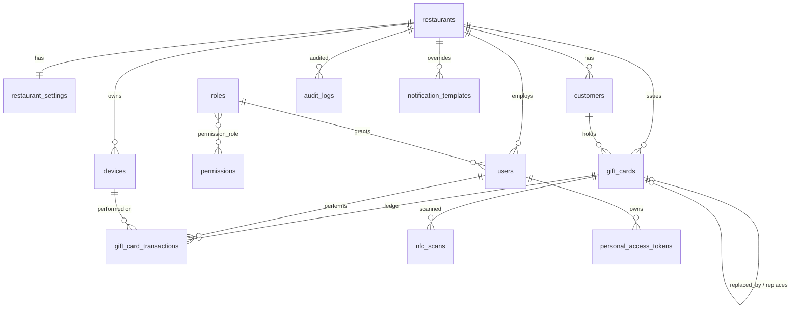

# Database schema

- **MySQL 8.4**, `utf8mb4_unicode_ci`, InnoDB, `READ-COMMITTED`.
- **Every primary key is a UUID** (`CHAR(36)`). Eloquent generates time-ordered UUIDv7 for primary keys
  (index locality, no sequential/guessable integers). The card token written to NFC tags is a separate,
  fully random **UUID v4** (`gift_cards.public_token`).
- **Money** columns are `BIGINT` minor units (cents). Balances are `UNSIGNED` → the database refuses negative balances.
- **Nothing is deleted.** Domain tables use soft deletes; ledger and audit tables are append-only (guarded in the model layer).
  Foreign keys to domain rows use `RESTRICT`.

## Entity relationship

## Tables

### `restaurants`
Tenant. `name`, `slug` (unique), legal data (`legal_name`, `vat_number`), contact and address, `country`,
`currency` (ISO 4217), `timezone`, `locale`, `status` (`active`/`suspended`), `plan`, `suspended_at`,
`suspension_reason`, timestamps, `deleted_at`.

### `restaurant_settings` (1:1)
Per-tenant card policy: `card_number_prefix`, `default_validity_months`, `min_card_value`, `max_card_value`,
`max_card_balance`, `max_single_redemption`, `max_redemptions_per_card_per_hour`, `allow_reload`,
`allow_partial_redemption`, `public_balance_check`, `enforce_nfc_uid_binding`, `lock_nfc_tags_after_write`,
`send_customer_emails`, `brand_color`, `receipt_footer`.

### `roles`, `permissions`, `permission_role`
System roles `platform_admin`, `owner`, `manager`, `waiter` with `rank` (who may manage whom) and `scope`.
Permissions are the strings in `App\Enums\Permission` (e.g. `cards.redeem`). Role → permission mapping is
seeded from `RoleSlug::defaultPermissions()` and cached per role.

### `users`
`restaurant_id` (NULL for platform staff), `role_id`, `name`, `email` (unique), `password` (bcrypt),
`status`, `locale`, `last_login_at/ip`, `password_changed_at`, `failed_login_attempts`, `locked_until`,
`remember_token`, soft deletes.

### `sessions`, `password_reset_tokens`
Laravel session store (`user_id` is a UUID) and reset tokens (hashed).

### `personal_access_tokens` (API tokens)
Sanctum tokens with UUID ids: `tokenable_type/id` (UUID morph), `restaurant_id`, `name`, `token`
(SHA-256 hash, unique), `abilities`, `last_used_at`, `last_used_ip`, `expires_at`, `revoked_at`, `revoked_by`.
Revocation sets `revoked_at`; rows are kept.

### `devices`
Waiter phones/terminals: `restaurant_id`, `registered_by`, `name`, `type`, `fingerprint`
(SHA-256 of restaurant + client device id; unique per restaurant), `platform`,
`status` (`active`/`revoked`), `last_seen_at`, `last_ip`, `last_user_id`, `revoked_at`.

### `customers`
`restaurant_id`, `first_name`, `last_name`, `email`, `phone`, `notes`, `marketing_consent`,
`anonymized_at` (GDPR), soft deletes. Indexed by `(restaurant_id, email)` and `(restaurant_id, last_name)`.

### `gift_cards`
| Column | Notes |
|---|---|
| `id` | UUID v7 PK |
| `restaurant_id` | tenant |
| `customer_id` | optional |
| `public_token` | **UUID v4, unique** — the only value on the NFC tag / QR code |
| `card_number` | 16-digit Luhn-valid random number, unique per restaurant (for manual entry & printing) |
| `status` | `inactive`, `active`, `redeemed`, `blocked`, `expired`, `replaced` |
| `currency` | from restaurant |
| `initial_value`, `balance`, `total_loaded`, `total_redeemed` | cents, unsigned. `total_loaded` is money *sold* onto the card (the sale plus reloads); a replacement card starts at 0 and carries the old balance as `initial_value`. |
| `expires_at`, `activated_at`, `redeemed_at`, `blocked_at`, `blocked_reason`, `expired_at` | lifecycle |
| `replaced_by_id`, `replaces_id` | lost-card chain |
| `issued_by` | user |
| `recipient_name`, `notes` | |
| `nfc_tag_type`, `nfc_uid`, `nfc_written_at`, `nfc_verified_at`, `nfc_locked`, `nfc_read_counter` | chip binding & NTAG 424 replay counter. `nfc_verified_at`: the dashboard read the tag back and the URL matched; a UID is only ever stored with it (NTAG 424: bound on the first verified SUN tap) |
| `nfc_uid_active` | **generated** (virtual): `nfc_uid` while the card is usable (not deleted, `replaced` or `expired`), else NULL |
| `last_used_at`, timestamps, `deleted_at` | |

Indexes: `(restaurant_id, card_number)` unique, `(restaurant_id, status, created_at)`, `(restaurant_id, nfc_uid)`, **`nfc_uid_active` unique** (one chip ↔ at most one usable card, platform-wide, race-proof), `expires_at`, `status`.

### `nfc_write_attempts`
One row per attempt to program a card's tag (dashboard, `NfcProgrammingService`): `restaurant_id`, `gift_card_id`,
`user_id`, `device_id`, `attempt_id` (client UUID, **unique**), `method` (`web_nfc`, `manual`, `provisioned`, `printed`),
`stage` (last step reached: `read`, `check`, `detect`, `write`, `verify`, `lock`, `bind`), `result` (`in_progress`,
`succeeded`, `already_programmed`, `refused`, `failed`, `cancelled`), `error_code`, `error_message`, `uid`, `tag_type`,
`previous_url` (content found on the tag), `read_back_url`, `conflict_card_id`, `locked`, `detect_ms`, `write_ms`,
`verify_ms`, `total_ms` (measured by the dashboard), `user_agent`, `completed_at`,
timestamps. Indexed by `(restaurant_id, created_at)`, `(gift_card_id, created_at)`, `(restaurant_id, result)`.

### `gift_card_transactions` (ledger — append-only)
`restaurant_id`, `gift_card_id`, `type` (`issue`, `redemption`, `reload`, `transfer_out`, `transfer_in`,
`expiration`, `reversal`, `adjustment`), **signed** `amount`, `balance_before`, `balance_after`, `currency`,
`idempotency_key` (**unique per restaurant**), `reference`, `note`, `user_id`, `device_id`,
`related_transaction_id` (reversal → original, transfer in → out), `counterparty_card_id`, `reversed_at`,
`ip_address`, `created_at` (microseconds).

### `nfc_scans` (append-only)
Every lookup attempt: `restaurant_id`, `gift_card_id` (NULL for unknown/foreign cards), `user_id`,
`device_id`, `method`, `result` (`ok`, `not_found`, `foreign_restaurant`, `uid_mismatch`,
`invalid_signature`, `replay`, `throttled`), `nfc_uid`, `read_counter`, `ip_address`, `user_agent`.

### `audit_logs` (append-only)
`restaurant_id`, `user_id`, `device_id`, `action` (e.g. `gift_card.blocked`), `auditable_type/id`,
`old_values`, `new_values`, `metadata` (JSON; secrets redacted), `ip_address`, `user_agent`, `request_id`,
`created_at` (microseconds).

### `notification_templates`, `notification_logs`
Templates per `key` (`card_issued`, `card_reloaded`, `card_expiring`, `balance_low`), `channel`, `locale`;
`restaurant_id` NULL = system default, otherwise a restaurant override. Logs record every send attempt.

### `system_settings`
Platform key/value configuration (`platform.name`, `platform.support_email`, …), JSON values, cached.

### Framework tables
`cache`, `cache_locks`, `job_batches`, `failed_jobs` (UUID primary key). Queues run on Redis, so there is no
integer-keyed `jobs` table.

## Migrations

`backend/database/migrations/2026_01_01_00000{1..6}_*.php`. Reference data is seeded idempotently on every
deploy (`RolesAndPermissionsSeeder`, `NotificationTemplateSeeder`, `SystemSettingsSeeder`).
