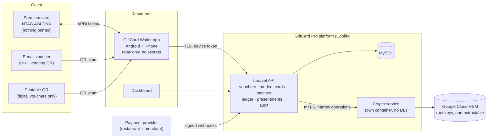
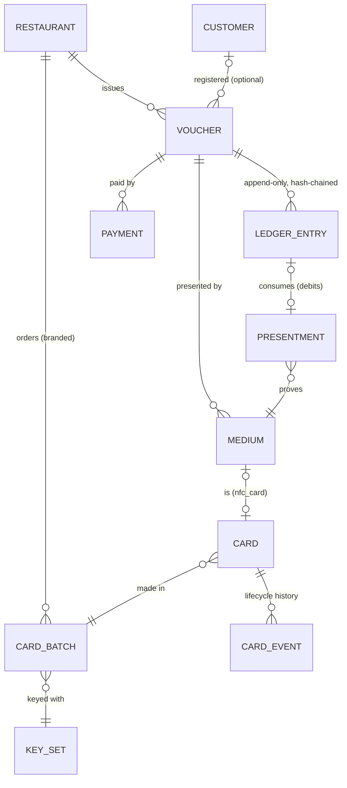
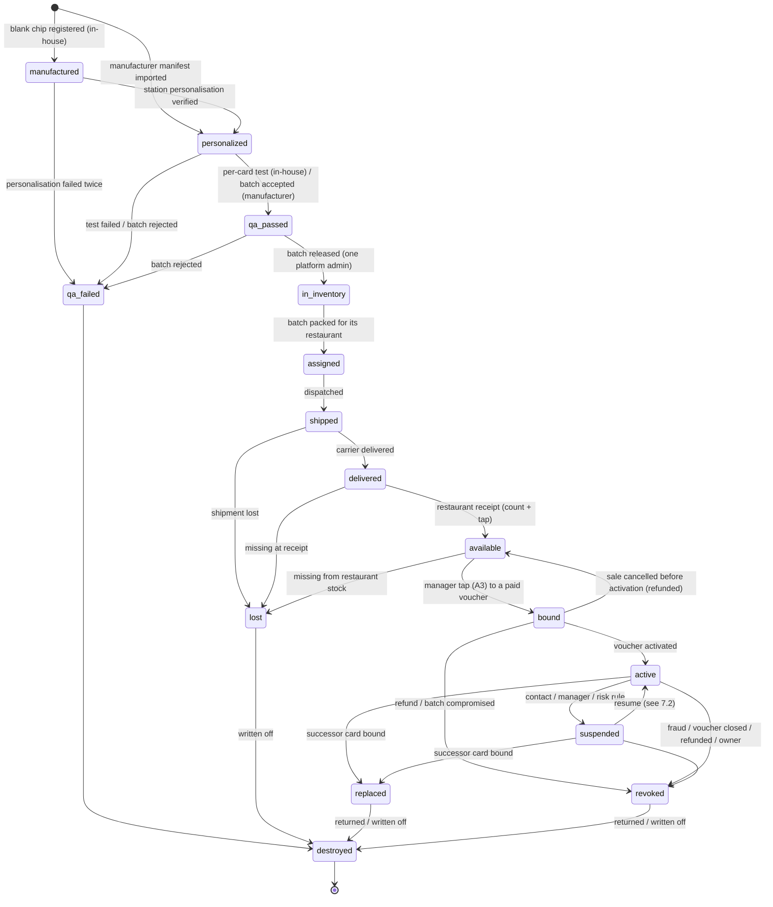
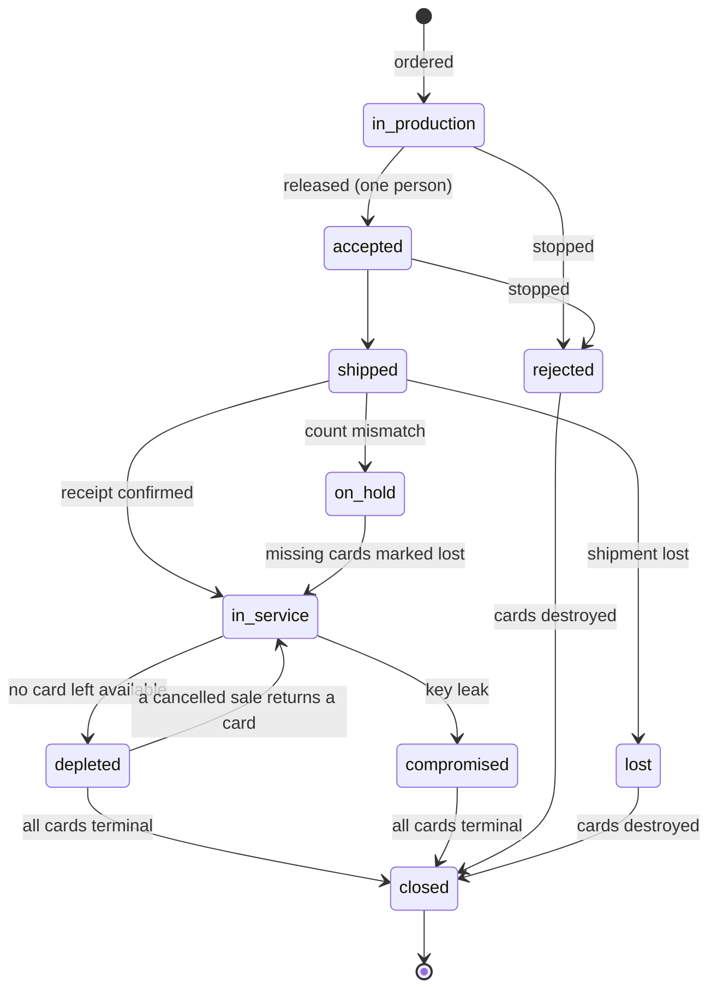
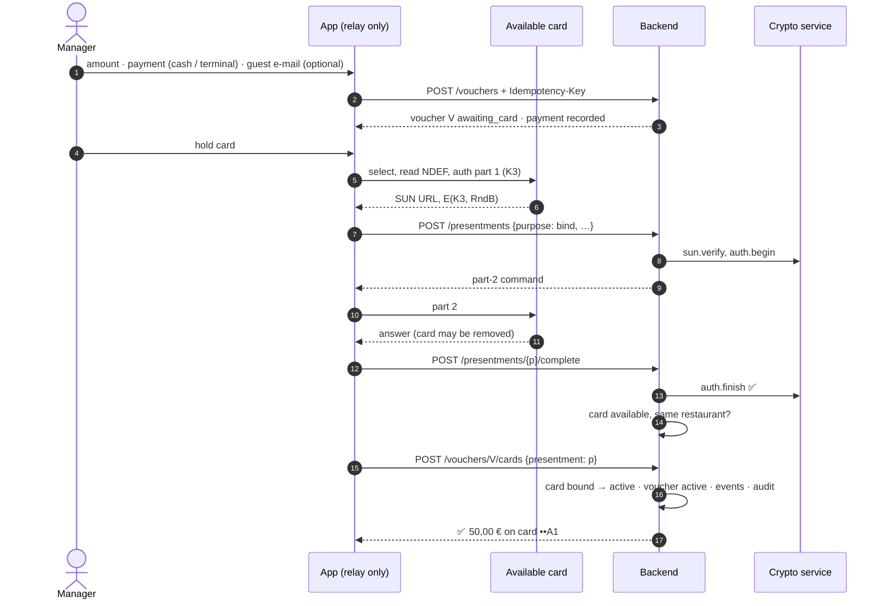
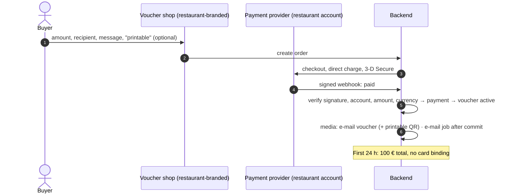
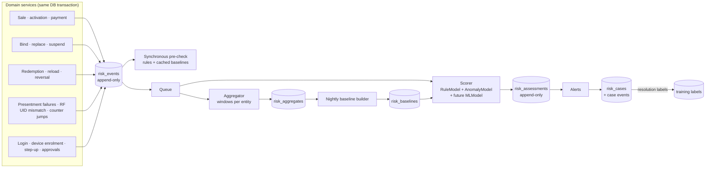

# GiftCard Pro v2: production architecture (frozen)

| | |
|---|---|
| **Status** | **FROZEN**, v2.2, 29 September 2026 (v2.0 + ADR-001 + ADR-002). This is the baseline for implementation. |
| **Change control** | After freezing, a change needs a short **architecture decision record** (ADR) appended to §20: what changes, why, the security impact, and approval by the product owner. The code must not diverge silently from this document. |
| **Supersedes** | The v2 draft (commit `301c551`). For **scope**, it also supersedes `ntag424-platform-architecture.md`, which remains the reference for cryptographic detail (key derivation, APDU sequences, personalisation steps) where §9 and §10 point to it. |
| **Starting point** | GiftCard Pro has **no production data and no customers**. The platform is built in its final form from day one: no migration, no backwards compatibility, no legacy modes, no transition phases (ADR-002). |
| **Evidence marks** | **[Code]** repository path:line (code at commit `0493784`, unchanged since); **[Vendor]** official documentation; **[Law]** statute or ruling (not legal advice); **[Assessment]** engineering judgement |

---

## 1. Final product decisions

**From the v2 decision** (numbers kept, because §3 refers to them):

1. **NTAG 424 DNA** for every new physical card. NTAG213/215/216 only for cards already in circulation.
2. **Premium PVC cards** with restaurant branding, GiftCard Pro branding and the chip. **Nothing else is visible:** no QR, voucher number, card number, barcode, identifier or secret.
3. **Voucher ≠ presentation medium ≠ physical card.** The voucher owns balance, ledger, expiry, customer and transactions.
4. **Several media per voucher,** all on the same voucher and ledger. Using one is reflected in all.
5. **Cards are inventory:** personalised, cryptographically prepared, tested and worth nothing until bound.
6. **Restaurants never personalise cards,** never generate keys and never know card secrets.
7. **Manager app:** payment → voucher → tap a factory card → bind → active. The phone only relays APDUs.
8. **The backend is the source of truth.** The app is never trusted; every critical operation is authorised by the server.
9. **The chip holds the minimum:** no balance, amount, restaurant, customer, expiry or static identifier.
10. **Online sales:** e-mail voucher at once; a physical card can be bound later to the same voucher. No transfer, no duplicate.
11. **A lost card** = revoke one medium, bind another. The voucher and its ledger never change.
12. Review before implementation.

**Final decisions (this revision):**

13. **Anonymous cards are supported and behave like cash.** Registration is optional and exists only for guests who want recovery. It is never forced.
14. **Printable QR vouchers exist only for digital vouchers:** online purchases, or guests who explicitly choose a printable voucher. They are never part of a physical card, and a voucher is never card and QR at the same time (decision 26).
15. **Apple Wallet and Google Wallet are out of the current scope.** The model stays open for them (§18), but nothing is designed around them.
16. **Every physical card always has a lifecycle state** (§7).
17. **Batch management** with production, key, assignment and delivery data, and live counts per state (§8).
18. **Security has priority over convenience:**
    - backend as source of truth;
    - server-side authorisation;
    - zero secrets on phones;
    - cryptographic verification;
    - tamper-evident audit logs;
    - hardware-backed keys;
    - fraud prevention;
    - least privilege;
    - defence in depth.
19. **Realistic implementation:** no enterprise feature without clear security or operational value.
20. **After this review, the architecture is frozen.**

**Implementation decisions (ADR-001, 28 September 2026):**

21. **Phase 0 comes first.** It removes every path that spends from a card voucher without a verified NTAG 424 DNA card.
22. **NTAG21x is discontinued completely** (ADR-002). No NTAG213/215/216 support exists anywhere in the platform.
23. **The dashboard never programs cards.**
24. **Card numbers are internal identifiers** for support, inventory and batch management. They never authorise redemption and are never shown to guests.
25. **Every voucher activation is linked to a payment record** that says how payment was received. GiftCard Pro records the payment; it does not process it.
26. **A voucher is either a physical-card voucher or a digital QR voucher, never both at once.** Binding a card to a digital voucher converts it.
27. **Every physical card has a permanent internal identifier** (cryptographically random, never exposed to users), used for lifecycle, security and audit.
28. **No overrides.** A card voucher is only ever debited with its verified card. An unreadable card is replaced (registered vouchers) or is lost (anonymous vouchers).

**Build decisions (ADR-002, 29 September 2026):**

29. **Final architecture from day one.** No compatibility layers, feature flags for old behaviour, migration code, legacy modes or transition phases. Code that does not belong to the final platform is deleted, not hidden.
30. **Financial history is immutable.** No historical financial event is ever modified or deleted; every correction is a new event.
31. **The fraud and risk engine is a core subsystem** (§13.4): rules, per-restaurant, per-employee and per-device baselines, risk scoring, anomaly detection, alerts, investigation cases and an append-only trail. No machine learning in v2, but designed for it.
32. **Android and iPhone have full feature parity** for everything restaurants and guests use. The only Android-only tool is the internal card-personalisation station, used by GiftCard Pro staff before cards are shipped.
33. **Quality over speed.** There is no launch date to optimise for. Security, correctness and maintainability come first; UI polish and the commercial launch follow the complete foundation.

---

## 2. Architecture at a glance

**In one paragraph.**
- **A voucher** is money held on the server.
- **Guests reach it through media:** a premium NTAG 424 card, an e-mail voucher, or, for digital vouchers only, a printable QR.
- **A physical card** is an inventory item with a lifecycle from manufacturing to destruction. It belongs to a batch that is made for one restaurant.
- **Setup is central:** cards are personalised with per-card keys derived in an HSM, tested, and shipped with no value.
- **At the till:**
  - a manager binds a card to a paid voucher with one tap;
  - a waiter redeems with one tap;
  - in both cases the phone passes a **server-chosen challenge** to the chip and the answer back, so a copy of anything the card ever sent is useless;
  - every debit consumes a single-use proof of presence.
- **Everything is recorded** in an append-only, hash-chained ledger and audit trail.

**Changed since the v2 draft:**
- wallets removed;
- printable QR limited to digital vouchers;
- anonymous cards as cash;
- card lifecycle and batch management added;
- simplifications adopted in §4.3:
  - no double-entry ledger or organisations yet;
  - one HSM provider;
  - station mode inside the existing app;
  - no card reuse;
  - no self-registration by the guest's own phone;
  - one limit model instead of a limit matrix;
  - no transactional outbox;
  - no balance transfers between vouchers.

---

## 3. Review of the current implementation

All findings are from the code at commit `0493784`.

### 3.1 What already matches

| v2 principle | Current implementation | Evidence |
|---|---|---|
| Backend is the source of truth for money | Amounts, balances, limits and status are decided server-side. Redeem, reload and transfer require an idempotency key (unique per restaurant) and lock the card row. Issuing accepts one optionally. | `GiftCardService.php` (`idempotent()`, `lock()` l.762); `routes/api.php:73` (`idempotent:optional`), `:78` (`idempotent`) |
| The voucher owns balance, ledger, expiry, customer | The balance, totals, expiry, customer and transaction ledger all hang off one row, and the ledger is append-style with before/after balances. **Right data, wrong row:** that row is also the card (§3.2). | `…000004_create_gift_card_tables.php:13–76` |
| NTAG 424 SUN verification | AES-CMAC and SUN MAC per AN12196, and a counter compare-and-set that is replay-safe under concurrency. | `Ntag424SunVerifier.php`, `AesCmac.php`, `CardScanService.php:134–139` |
| One chip, one live voucher | A unique index on the active UID (a virtual column) prevents a chip from being on two usable cards. | `…add_nfc_programming.php` (`nfc_uid_active`) |
| Server-authorised manager flow | S20 is gated by server-issued abilities (`cards.create` + `cards.write_nfc`). Waiters never get it. The app only shows it when the profile allows it. | `DeviceTokenService`, `EnforceDeviceToken`, `WaiterAppIssuingTest` (6 tests) |
| Retry-safe creation from the phone | S20 repeats the same idempotency key after an uncertain answer, so a voucher is never sold twice. | `issue_controller.dart:179`, `issue_controller_test.dart` |
| E-mail pipeline | Templated, queued, per-locale customer e-mails (issued, reloaded, low balance, expiring) with no QR and no attachment. **The content does not match v2:** see C13. | `CardNotificationService.php:48–64`, `QueueCardNotifications`, `TemplatedMail` |
| Guest balance page | `GET /public/cards/{token}` plus the dashboard page `/c/[token]`. The restaurant can switch it off. | `PublicCardController.php`, `dashboard/src/app/c/[token]/page.tsx` |
| Chip reading on both platforms | Android and iPhone read NDEF URL + UID. The iPhone `Info.plist` already declares the NTAG 424 AID for ISO 7816 sessions. | `WaiterNfc.kt:283`, `WaiterNfc.swift:192`, `Info.plist:86–88` |
| Tenant isolation, device-bound tokens, audit | In place and tested. | `TenantIsolationTest`, `bind_access_tokens_to_devices` migration, `audit_logs` |

### 3.2 What must change

| # | Today | v2 requirement it breaks | Change |
|---|---|---|---|
| C1 | **Card = voucher.** `gift_cards` holds balance *and* `public_token`, `card_number`, `nfc_uid`, `nfc_tag_type`, counters and lock flags. | 3, 4, 11 | Voucher keeps money, expiry and customer. New tables `media`, `cards` (physical cards with a lifecycle), `card_batches`, `card_events` (§5, §14). |
| C2 | **Vouchers are active on creation** (`activate` defaults to `true`) and there is **no payment record** of any kind. | 5, 6, 10 | Voucher `pending_payment` → payment recorded (cash, terminal, online) → bound (if a card is sold) → `active`. |
| C3 | **Binding trusts the client.** `method: web_nfc` passes UID, read-back UID and URL as *claims*. Any other method (`manual`, `provisioned`, `printed`) binds **without any verification**. A 424 card "marked as provisioned" gets its UID on the first tap. | 7, 8 | Binding requires a server-verified tap of a personalised stock chip (live AES authentication through the phone). No other binding path exists. |
| C4 | **Spending needs no card.** Redeem, reload and transfer take a card id. `qr`, `manual` and `api` scans skip chip checks, and waiters can spend by typing the number. | 8, and the purpose of 424 | Every debit references a single-use, server-issued presentment. Manual lookup and overrides are gone (decision 28). |
| C5 | **Card numbers everywhere:** generated (16-digit Luhn, restaurant prefix), shown, printed, exported, used for search, manual entry and transfers. | 2 | No number on any card. The existing voucher number stays as an **internal identifier** for staff and support only: never shown to guests, never a credential (decision 24). |
| C6 | **Print page with QR and full card number.** `GET /cards/{id}/qr` returns the tag URL as an SVG. | 2 | Removed. The printable QR voucher is a separate, revocable medium with its own secret, only for digital vouchers (§6). |
| C7 | **Replace = new card + balance transfer** (new token, new number, `TransferOut`/`TransferIn`). | 11 | Revoke medium + bind medium. The ledger is untouched. |
| C8 | **One URL for everything:** the tag URL, the QR and the e-mail link are the same bearer token (`/c/{uuid}`), stored in clear. | 4, 9 | Separate credentials per medium, stored as hashes. The e-mail link is view-and-show-QR, not a bearer spend link. The chip carries a SUN URL with no static token. |
| C9 | **424 keys in `.env`**, one global pair, HMAC diversification, no key version. | 6, 8 | Crypto service + HSM, NXP AN10922, key sets (§9). |
| C10 | **Default expiry 36 months.** Unlawful for paid vouchers in Austria (audit blocker 1). | 3 (the voucher owns expiry) | The default is no expiry. Expiry is a legal parameter (§5.2). |
| C11 | **No online sales, no payment provider.** | 10 | New: checkout, payment webhooks, e-mail voucher v2 (§6, §11.3). |
| C12 | **The iPhone app cannot write**, so the manager flow is Android-only (`s05_ready.dart:585`). | 7 | Binding needs only APDU relay, which iOS supports. The manager flow works on both (§12). |
| C13 | **Customer e-mails print the balance and the bearer link.** Every template contains `{{ balance }}`, and `balance_url` is the `/c/{public_token}` spend link. | 4, §13.2 invariant 5 | Templates rewritten: receipts with the purchase or reload amount, no balance and no bearer link (ADR-003). (`NotificationTemplateSeeder.php:18–48`, `CardNotificationService.php:51–52`, `CardUrlBuilder.php:19–24`) |

### 3.3 What becomes simpler

| Area | Today | v2 |
|---|---|---|
| Restaurant onboarding | Needs Chrome on Android for Web NFC; blank tags of the right type; explanation of locking | Receive a box of branded cards. Nothing to configure. |
| Selling a card (manager) | Create → hold still while writing → read back → verify → lock (optional) → handle 20+ error codes (wrong type, too small, locked, swapped, URL mismatch, …) | Payment → amount → one tap → done. A handful of errors: "not a card from your stock", "hold longer", "no connection". |
| Programming station | Dashboard page (686 lines) that walks a stack of blank tags against unprogrammed cards | None in restaurants. Personalisation is central. |
| Lost card | Replace creates a new card number and moves money | Revoke and bind; the guest keeps the same voucher. |
| Tag types | ntag213/215/216/424/`qr_only`, capacity probing | One chip type: NTAG 424 DNA. |
| iPhone | Reader only; managers need Android | Same features on both platforms. |
| Support | "Which number is on the card?", "tag won't write", "tag locked by mistake" | "Tap the card." |
| Testing | Writer matrix per chip type × browser × app × lock state | Relay protocol tests with NXP vectors; one chip type. |

### 3.4 Code that can be removed

Line counts from `wc -l`, including tests. All of it is deleted in Phase 0 (ADR-002).

| Component | Files | Lines |
|---|---|---|
| **Backend: writer and binding workflow** | `NfcProgrammingService.php` (457); `BindNfcTagRequest`, `CheckNfcTagRequest`, `LockNfcTagRequest`, `ReportNfcFailureRequest`; `NfcWriteAttemptResource`; `NfcWriteAttempt` model; enums `NfcWriteMethod`, `NfcWriteStage`, `NfcWriteResult`; `tests/Feature/NfcProgrammingTest.php` (26 tests); the migrations stay (history) | ≈ 1 450 |
| Backend: in `GiftCardService` | `bindNfcTag`, `markNfcLocked`, `assertChipAvailable`, `replace` (l.367–431, 592–695) | ≈ 170 |
| Backend: card numbers and QR | `CardNumberGenerator` (49, **kept**: it generates the internal voucher number), `QrCodeService` (21, **kept**: it renders the printable QR), `qr` and `nfcPayload` actions, `card_number_prefix` setting | ≈ 120 |
| **Dashboard: writer and station** | `lib/nfc-programming.ts` (601) + tests (526); `nfc-writer.tsx`, `nfc-program-steps.tsx`, `nfc-attempts.tsx`, `nfc-error.tsx`, `card-qr.tsx`; `hooks/use-nfc-programmer.ts`; `cards/program/page.tsx` (686); `print/cards/[id]/page.tsx`; and at the repository root `e2e/nfc-programming.mjs` (437) | ≈ 2 900 |
| Dashboard: card numbers | Manual entry in the web terminal, transfer by number, number columns, search | ≈ 150 (edits) |
| **Waiter app: writer** | `core/issue/card_programmer.dart` (330) + tests (211); `core/platform/tag_writer.dart` (115); writer paths in `WaiterNfc.kt` (`onWriterTag`, `inspect`, `writeUrl`, `readFresh`, `lock`: l.300–420); writer events in `nfc_service.dart` | ≈ 800 |
| Waiter app: manual number entry | `s11_manual_entry.dart` (459) + its test (330), `components/card_number_field.dart` (289); removed without replacement (no overrides, decision 28). `core/format/card_number.dart` **stays**: it formats the internal voucher number for staff. | ≈ 1 080 |
| **Total** | | **≈ 6 700 lines**, of which about 2 100 are tests and the end-to-end script |

**Kept and reused:**
- the S20 screen shell, amount pad, e-mail field and the idempotent create logic (`issue_controller.dart`);
- `AesCmac`, `Ntag424SunVerifier` (extended with key sets);
- the e-mail pipeline;
- the guest balance page concept (rebuilt on the tap domain with SUN verification).

### 3.5 Technical debt that disappears

1. **Two binding paths**, one of which (`bindUnverified`) binds without any check (`GiftCardActionController.php:147–160`, `NfcProgrammingService.php:231–250`).
2. **"Verified" that is not verified.** Today's read-back is reported by the client. The server cannot tell a real read-back from a forged request.
3. **Chip-size detection by probe writes** in the dashboard (`nfc-programming.ts:309–352`) and by GET_VERSION in the app. There are two implementations of the same heuristic.
4. **`qr_only` as a tag type** (`NfcTagType`): a medium modelled as a chip.
5. **NFC state on the voucher row**: `nfc_tag_type`, `nfc_uid`, `nfc_uid_active` (virtual column with a unique index), `nfc_written_at`, `nfc_verified_at`, `nfc_locked`, `nfc_read_counter`.
6. **Restaurant settings that only exist because restaurants write tags:** `lock_nfc_tags_after_write`, `enforce_nfc_uid_binding`, `card_number_prefix`.
7. **`replaced_by_id` / `replaces_id` chains** and the transfer-based replacement, with their audit special cases.
8. **The waiter app sends `method: web_nfc` from native code**, a compromise made to reuse the dashboard's verified path.
9. **Keys in `.env`** and the `giftcard:nfc-keys` generator command.
10. **The Chrome-on-Android dependency** for programming, and the missing iPhone writer.
11. **The 36-month default expiry** (a legal liability, not only debt).

### 3.6 Security improvements

| Risk today | v2 |
|---|---|
| A photo of the card (QR or number) is enough to spend | The card shows nothing. Its URL changes on every tap. Spending needs a live answer from the chip to a server challenge. |
| Spending without any card (card id, number, `method: qr/api`) | Every debit needs a server-issued, single-use presentment, consumed in the same database transaction. |
| Bindings based on client claims | Binding needs a genuine, personalised chip from this restaurant's stock, proven by AES authentication that the phone cannot fake. |
| A stolen box of blank tags or pre-written cards | A box of cards is worth nothing. Binding needs a manager of that restaurant with step-up, and a lost box is blocked centrally. |
| One leaked token = tag, QR and e-mail compromised | Separate, hashed credentials per medium; each can be revoked on its own. |
| Keys in `.env` (any server compromise = every 424 card) | Root keys in an HSM, per-card derived keys, a crypto service with no key export. A server compromise cannot clone cards. |
| Anyone can overwrite an unlocked NTAG21x | NTAG 424 NDEF is writable only with the card's own K0. |
| Guest e-mail link = spending credential | The e-mail link opens the voucher page. Spending (digital vouchers only) needs a rotating QR on a device confirmed by an e-mail code. |

---

## 4. Final review

### 4.1 Six perspectives

| Perspective | Verdict | Findings and actions |
|---|---|---|
| **Scalability** | ✅ Sufficient for years of growth without redesign | **Volume.** 1 000 restaurants × 2 000 vouchers/year = 2 M vouchers and roughly 10 M transactions/year: ordinary for MySQL with the planned indexes **[Assessment]**. **HSM.** Google Cloud HSM allows 500 symmetric requests per second per region by default **[Vendor]**. One tap needs about 6–8 HSM operations (derivations and MAC), so the quota covers about 60 taps per second platform-wide, far above restaurant peaks. **Bottleneck today** is the 2 GB single server (audit). Vertical scaling plus a read replica for reports is enough; no sharding or microservices are needed. **Batches** of thousands of cards change state in bulk inside one transaction per batch, with no per-card jobs. |
| **Maintainability** | ✅ After the simplifications in §4.3 | **One monolith** (Laravel) plus one small crypto service. One app for waiters, managers and personalisation stations. One HSM provider. One chip type for new cards. The existing ledger code, proven under concurrency in the audit, is kept rather than rewritten. The APDU relay is written once and shared by the till, binding and the station. |
| **Operational simplicity** | ⚠ Acceptable, with four routines that must exist | 1. **Key ceremony:** once, then yearly or when a custodian leaves. 2. **Batch acceptance** per delivery. 3. **Crypto-service monitoring**: two instances, alerting, and the outage runbook (card transactions pause; §10.3). 4. **The tap domain** registered for 10 years with registrar lock and certificate monitoring: if `t.giftcardpro.at` ever lapses, every card in circulation stops working. Runbooks in §19. Nothing else needs daily attention. |
| **Security** | ✅ Meets decision 18 | See §13, which maps every principle to concrete controls. Remaining accepted risks are listed there: relay attack, a compromised backend while in control, owner-level fraud, anonymous cards as cash. |
| **Restaurant workflow** | ✅ Simpler than today | **Sale:** payment → amount → one tap. **Redeem:** one tap → amount. **Lost or unreadable card** (registered): the guest's recovery code, or a voucher-number search plus the contact's e-mail confirmation → tap a new card. **Stock:** confirm a delivery once. There is no programming, writing, locking or tag-type knowledge, and no Chrome-on-Android requirement. iPhone and Android behave the same. |
| **Future extensibility** | ✅ Additive only | Wallets = new medium types. Chains = an `organization_id` column plus acceptance rules. Double-entry = derived from the append-only ledger. Offline terminals = a new verifier with SAM AV3. All of these are **additive migrations**: new tables or new nullable columns, with no change to how vouchers, cards, batches or media work (§18). |

### 4.2 Remaining decisions challenged

Each decision was re-examined against "simplify only without reducing security".

| # | Decision | Challenge | Verdict |
|---|---|---|---|
| R1 | Live AES challenge at every card redemption | Could the passive SUN URL suffice and save one round trip? | **Keep.** A SUN URL can be skimmed from a pocket and replayed once. Only a server-chosen challenge stops that (earlier design A4). The cost is about 0.2–0.5 s per tap. **No degraded mode:** SUN verification needs the same crypto service, and a per-restaurant switch to weaker checks would let one restaurant lower security. An outage pauses card transactions. |
| R2 | A separate crypto service | Laravel could call the HSM directly. | **Keep, as a sidecar container** on the same host with its own credentials. Direct calls would put HSM credentials in the web app, where any code-injection bug can use them freely. The sidecar gives a narrow API, rate limits and a separate audit trail for about 800 lines of code **[Assessment]**. |
| R3 | HSM tiers T1/T2/T3 | Three tiers is enterprise complexity. | **Simplify: one tier.** Google Cloud HSM (roots non-extractable, per-card keys only briefly in the crypto service's memory). It works from the current hosting and costs a few euros per month **[Vendor]**. The T3 (all-in-HSM) option is removed from the roadmap. |
| R4 | Two-level key derivation (root → batch → card) | Is the batch level needed? | **Keep.** It is cheap and limits a future manufacturer leak to one batch. It also allows manufacturer personalisation later without exposing roots. |
| R5 | SDM meta-read key (K1) per key set, one key set per manufacturer | — | **Keep.** A K1 leak affects privacy, not authenticity. |
| R6 | Double-entry ledger, per-organisation hash chain | Needed for chains, not for single-restaurant vouchers. | **Defer.** Keep today's per-voucher ledger (balance before/after, row locks, idempotency). Make it **append-only** (triggers, no UPDATE/DELETE grant), add a **hash chain** and a **unique presentment id**. Tamper evidence is kept, and 14–20 days are saved. |
| R7 | Organisations, programs, acceptance networks | No chain customer yet. | **Defer.** The restaurant stays the tenant. Adding `organization_id` later is additive (§18). |
| R8 | Presentments (single-use proof of presence) | — | **Keep.** This is what closes every "spend without the card" path. It is one table and one service. |
| R9 | Assurance-level limit matrix (per level: per transaction, per day, lifetime, rolling 30 days) | Complex to explain and to configure. | **Simplify.** Card vouchers no longer carry weak media (R10, R13), so a matrix is not needed. **One limit model** (§6.3): a per-transaction and a per-voucher daily ceiling for all media, plus a few fixed caps for specific risks: the first 24 h of online vouchers, and 72 h after a recovery. |
| R10 | E-mail voucher on card vouchers: view by default, "enable phone payment" at the counter | An extra role and an extra flow. | **Simplify.** On a card voucher, the e-mail is a **recovery contact** (balance, receipts, recovery). It never spends, so there is no "enable" flow. On a digital voucher, the e-mail voucher spends (rotating QR after device confirmation). |
| R11 | Self-registration by tapping one's own card | Skimming makes it abusable; it only ever gave view rights. | **Remove.** Registration happens at the sale or later at the counter: a manager taps the card (A3), enters the e-mail, and the guest confirms by e-mail link. Tapping with one's own phone still shows the balance. |
| R12 | Card reuse and re-keying of returned cards | A rare case that needs a re-keying flow. | **Remove.** Each card serves one voucher for its life. Returned or replaced cards are **destroyed**. |
| R13 | Printable QR with its own lifetime cap | Decision 14 limits it to digital vouchers. | **Simplify.** It is a bearer voucher by the guest's choice, like the anonymous card. The general limits apply, and a registered contact (if any) is notified of each redemption. There is only one active printable QR per voucher. Re-issuing needs the guest's `select` presentment (for example the e-mail QR or an `email_link`) and kills the old one. It is **revoked automatically when a physical card is bound, and can never be issued on a voucher that has a card**, so card vouchers stay card-strength. |
| R14 | Key set for 424 cards personalised with external tools | No such cards exist (ADR-002). | **Removed.** Every card is personalised by the platform. |
| R15 | Device attestation (Play Integrity / App Attest) | Phones hold no secrets, and the server verifies all card cryptography. | **Defer.** A modified app can only do what its user's permissions allow, and those are enforced server-side. Revisit if abuse is observed. **Keep certificate pinning** to the ISRG roots (cheap, low risk). |
| R16 | Four-eyes approval | — | **Keep, narrowly:** sales above €300 (adjustable), and recovery of a voucher sold by the same user within 30 days (§11.6). |
| R17 | Risk engine as a subsystem | — | **Keep and strengthen (ADR-002, reverses the earlier simplification):** rules, baselines per restaurant, employee and device, anomaly detection, scoring, alerts and investigation cases (§13.4). No ML in v2; the model interface allows it later. |
| R18 | Transactional outbox for media updates | Existed for wallet pushes. | **Remove.** Without wallets, e-mails are queued jobs dispatched after commit. |
| R19 | Personalisation station as a separate app, including a PC/SC desktop reader | Two more clients to maintain. | **Simplify:** a **station mode inside the existing app**, available only to platform admins on an enrolled station phone. It reuses the relay code. Manufacturer manifest import is added when the first manufacturer batch is ordered. |
| R20 | Generic GiftCard Pro-branded stock | Stock ownership per chip or shipment. | **Remove.** Every batch is made for one restaurant (decision 17). |
| R21 | Stored per-batch counters | They can drift. | **Computed.** Counts come from `cards` grouped by state, indexed (§8.3). |
| R22 | Maximum voucher value | Anonymous cash-like cards invite misuse. | **Add a ceiling** (default €500 per voucher, adjustable by the platform) **[Assessment; confirm with counsel]**. |
| R23 | Hash-chained audit log with a daily anchor | — | **Keep.** Cheap, and explicitly required. |
| R24 | Application-level encryption of customer PII | — | **Keep** for e-mail and name, with a blind index for e-mail search. Laravel encrypted casts, keyed from the environment's application key, not from the HSM. |
| R25 | Balance transfers between vouchers | Replacement no longer needs them, and a transfer is a debit that is easy to misuse. | **Remove from v2.** Can be re-added later with presentments on both vouchers. |

### 4.3 Effect of the simplifications

| Removed or deferred | Security impact | Days saved **[Assessment]** |
|---|---|---|
| Double-entry ledger (keep single-entry, append-only, hash-chained) | None for single-restaurant vouchers | 14–20 |
| Organisations and programs | None | 3–4 |
| T3 HSM tier and the CloudHSM spike | Small: per-card keys stay briefly in crypto-service memory, roots do not | 3–5 |
| Wallets and the outbox | None (not in scope) | 10–14 |
| Device attestation | Small (no secrets on phones) | 4–6 |
| Assurance matrix → one limit model | None (no weak media on card vouchers) | 2–3 |
| Self-registration by tap, and "enable phone payment" | Positive (removes an abuse path) | 2–3 |
| Card reuse and re-keying | Positive (fewer states) | 2–3 |
| Separate station app and PC/SC | None | 4–6 |
| **Total** | | **≈ 44–64 engineer-days** |

---

## 5. Domain model

### 5.1 Entities

| Entity | Owns | Never owns |
|---|---|---|
| **Voucher** | Balance, ledger, expiry, status, optional customer, issuing restaurant, internal voucher number, payments | Anything about how it is presented |
| **Medium** | "This credential may access that voucher", its status, its secret hash if any | Money, expiry |
| **Card** (physical) | UID, batch, key set, lifecycle state, stock location | Money, customer, expiry |
| **Batch** | Production, key, assignment and delivery data | Money |
| **Presentment** | A single-use, 60-second proof that a medium was presented to this device and user | — |

### 5.2 Voucher rules

- **Voucher number (internal):** the existing `card_number` (random, 16 digits, Luhn) stays.
  - It is shown only to restaurant staff (dashboard, app) and platform support, for support and accounting.
  - It is **never printed on a card, never in guest e-mails, and never a credential**: it can find a voucher for staff, it can never spend it (decision 24).
- **Physical card identifiers:**
  - `cards.id`: UUID version 4 (122 random bits), the permanent internal identifier. It is **never serialised to any client**, and is used for lifecycle, events and audit (decision 27). Laravel's default `HasUuids` produces time-ordered v7 UUIDs, so cards use `HasVersion4Uuids`.
  - `cards.card_number`: the inventory number `<batch code>-<sequence>` (e.g. `B-2026-0007-0123`), used by staff and platform for support, inventory and batch management.
  - `cards.uid`: the chip UID, used only inside verification.
- **Card voucher or digital voucher (decision 26).** `gift_cards.kind` is `card` or `digital`. Binding a card to a digital voucher sets `kind = card`, revokes its QR media and turns the e-mail voucher into a recovery contact, all in one transaction. The reverse (a card voucher becoming QR-redeemable) is not possible.
- **Payment record (decision 25):** activation requires a `payments` row with a method: `cash`, `card_terminal` (+ terminal receipt number), `online_psp` (+ provider payment id), `bank_transfer` (+ reference) or `complimentary`. A complimentary voucher (e.g. marketing) needs an owner's approval and a reason.
- **Status:**
  - `pending_payment` → `awaiting_card` (paid, card still to bind) → `active`;
  - `blocked`, `expired`, `cancelled`, `closed`.
  - "Redeemed" is **not a status**: it is an active voucher with balance 0 (a reload reopens it).
- **Anonymous or registered (decision 13):**
  - **Anonymous:** no customer, no contact. Losing the card loses the balance.
  - **Registered:** a confirmed e-mail contact, used for recovery, balance and receipts. Registration is offered and never required.
- **Expiry:** none by default. In Austria vouchers are valid 30 years unless validly limited, and short expiries on paid vouchers have been struck down **[Law]**. Any expiry is a restaurant setting behind a legal warning.
- **Maximum value:** a platform ceiling (default €500 per voucher) and a restaurant setting below it (R22).

---

## 6. Presentation media and spending rules

### 6.1 The media in scope

| Medium | Held by | What it is | Level | Spends |
|---|---|---|---|---|
| `nfc_card` | Guest | Premium NTAG 424 DNA card, nothing printed | **A3**: live AES challenge from the server | Yes |
| `email_voucher`, digital voucher | Recipient | Link to the voucher page. The rotating QR appears after a one-time e-mail code confirms the device. | **A2**: fresh value from a confirmed device | Yes |
| `email_voucher`, card voucher | Registered guest | Recovery contact: balance, receipts, suspend, and a recovery code valid only for `select` | A0 | **No** |
| `printable_qr` | Holder of the paper or PDF | Static QR for **digital vouchers only** (decision 14); one active per voucher | **A1**: bearer | Yes |
| *future:* `wallet_apple`, `wallet_google` | — | Out of scope (§18) | — | — |

### 6.2 Allowed combinations

| Voucher sold as | Media |
|---|---|
| Card, anonymous (cash sale, no e-mail) | `nfc_card` |
| Card, registered | `nfc_card` + `email_voucher` (recovery contact) |
| Online / digital | `email_voucher` (spends) + optional `printable_qr` |
| Digital that later receives a card (§11.4) | Becomes a card voucher: + `nfc_card`; **the printable QR is revoked and the e-mail voucher becomes a recovery contact** (decision 26). |
| Printable voucher sold in person | `printable_qr` (+ optional `email_voucher`) |

### 6.3 One limit model

All limits are restaurant settings, within platform bounds. They are checked in the same transaction as the debit.

| Limit | Default | Applies to |
|---|---|---|
| Maximum voucher value | €500 | Sale and reload |
| Per transaction | €250 | Every debit, all media |
| Per voucher per day | €500 | Sum of all debits of a voucher |
| Online, first 24 h after payment | €100 in total, **no card binding** | Online vouchers (stolen-card purchases) |
| New card after recovery without the old card | €100 in total during the first 72 h | Registered vouchers (§11.6) |
| Overrides | **None** (decision 28) | An unreadable card is replaced (§11.6) |

### 6.4 Consistency

There is one ledger, and every medium reads it live: card, e-mail voucher page, app and dashboard. **No medium carries the balance:** e-mail receipts show what was paid, a printable QR voucher shows the value it was sold for (ADR-003), and the chip holds nothing; none of these is ever read as a balance. So "using one medium updates all others" is true by construction, and nothing needs synchronising.

---

## 7. Physical card lifecycle

Every card row always has exactly one **stored state**. Transitions happen only through one service (`CardLifecycle`), which checks the guard, writes the new state and appends a `card_events` row in the same transaction. A database check constraint allows only the listed states, and the service allows only the listed transitions.

### 7.1 States

When a batch is compromised, every card from `in_inventory` to `bound` becomes `revoked` (§8.2). Those arrows are left out of the diagram for readability.

| State | Meaning | Can bind | Can spend |
|---|---|---|---|
| `manufactured` | Blank chip registered at an in-house station (transport keys) | — | — |
| `personalized` | Keys, NDEF template and SDM set; verified as an outsider | — | — |
| `qa_passed` / `qa_failed` | Passed or failed quality testing (a rejected batch fails all its cards) | — | — |
| `in_inventory` | Central stock, batch accepted | — | — |
| `assigned` | Packed for its batch's restaurant, awaiting dispatch | — | — |
| `shipped` | On the way | — | — |
| `delivered` | Arrived; not yet checked in by the restaurant | — | — |
| `available` | In the restaurant's stock, ready to sell | **Yes** | — |
| `bound` | Linked to a paid voucher that is waiting for activation (e.g. four-eyes approval above the threshold) | — | — |
| `active` | Bound, and the voucher is active | — | **Yes** (if the voucher allows) |
| `suspended` | Temporarily blocked | — | — |
| `replaced` | Revoked because a successor card was bound (successor id recorded) | — | — |
| `revoked` | Permanently invalid | — | — |
| `lost` | Missing in transit or from stock; never bindable again | — | — |
| `destroyed` | Physically destroyed or written off | — | — |

**Derived display states:**
- **"Redeemed"** = `active` + voucher balance 0;
- **"Expired"** = `active` + voucher expired;
- **"Blocked"** = `active` + voucher blocked.

These are **not stored on the card**, because the voucher owns balance, expiry and status (decision 3). Storing them twice would create two sources of truth. The dashboard and the app always show the combined state, so every card visibly has one.

**Deliberate choices:**
- **No reuse (R12).** `replaced`, `revoked` and `lost` never return to stock.
- **Only checked-in cards can be sold.** Receipt checks the delivered count (§11.8).

### 7.2 Transitions, guards and actors

| Transition | Guard | Authorised |
|---|---|---|
| → `manufactured` | Genuine NXP chip (originality signature), UID unknown | `station_operator` on an enrolled station phone |
| → `personalized` | Every step verified by the server / signed manifest, no duplicate UID | `station_operator` / two `platform_admin` (import) |
| → `qa_passed` / `qa_failed` | SUN verifies, K3 authenticates, NDEF write refused, settings as profiled (per card in-house; sample per batch for manufacturer batches) | Automatic / two `platform_admin` |
| → `in_inventory` → `assigned` → `shipped` → `delivered` | Batch status changes (§8.2) | `platform_admin` |
| `delivered` → `available` | Receipt: counted quantity and one A3 tap (`purpose = receive`) by a manager of **the batch's restaurant**; per-card taps when on hold (§11.8) | Manager |
| `delivered` → `lost` | Cards still missing after the platform's investigation of an `on_hold` batch | `platform_admin` |
| `available` → `bound` | A3 presentment (`purpose = bind`); card's restaurant = voucher's restaurant; voucher paid (`awaiting_card`) or `active` | Manager (`cards.bind`) |
| `bound` → `active` | Voucher activation (payment recorded, approval given where needed) | System, same transaction |
| `bound` → `available` | Sale cancelled before activation; payment refunded; no debit exists | Owner |
| `active` → `suspended` | Reason required | Contact (from the voucher page, confirmed by e-mail link), manager, or risk rule |
| `suspended` → `active` | Suspended by the **contact** → the contact confirms by e-mail link. Suspended by a **manager** → manager A3 tap + step-up. Suspended by a **risk rule** → owner + A3 tap. | As stated |
| → `replaced` | Recovery or replacement rules (§11.6); successor bound in the same transaction | Manager + step-up (+ owner where §11.6 says) |
| → `revoked` | Reason: fraud, voucher closed, refund, compromised batch, dead chip on request | Owner, or system (refund, compromise playbook) |
| `available` → `lost` | Stock count shows the card missing | Owner |
| → `destroyed` | Only from `qa_failed`, `lost`, `replaced` or `revoked` | `platform_admin`, or owner for returned cards |

**Platform roles** (least privilege):
- `platform_admin`: batches, shipments, key-set metadata, approvals; **never** vouchers or money;
- `station_operator`: station mode on enrolled station phones only;
- `key_custodian`: key ceremonies only.

No person holds both `station_operator` and batch-approval rights for the same batch.

Every transition is written to `card_events`: from state, to state, reason, actor, device, request id, and the consumed presentment where there is one. `card_events` is append-only and part of the hash-chained audit trail.

---

## 8. Batch management

### 8.1 What a batch is

**One batch = one restaurant order = one print run = one shipment.** This is a simplification (R20): no partial shipments, no shared stock. A restaurant's reorder is a new batch.

| Field | Content |
|---|---|
| `id`, `batch_code` | Internal id and a human code (`B-2026-0007`). **Never on the card or in its URL.** |
| `restaurant_id` | The assigned restaurant (branded cards) |
| `manufacturer` | Card supplier / personaliser |
| `chip_type` | `ntag424_dna` |
| `card_design_ref` | Artwork version printed on the cards |
| `quantity_ordered`, `quantity_registered` (computed) | Ordered vs cards actually registered for the batch (manifest or station) |
| `key_set_version` | Keys used (one key set per manufacturer, R5) |
| `personalization` | `in_house_station` or `manufacturer` |
| `production_date` | From the supplier |
| `ordered_at`, `personalized_at`, `accepted_at`, `shipped_at`, `delivered_at`, `received_at` | Lifecycle dates |
| `accepted_by` | The platform admin who released the batch |
| `received_by` | Restaurant manager who confirmed |
| `tracking_ref` | Carrier reference |
| `manifest_sha256` | Signed manufacturer manifest (UID, originality signature, initial counter, key version per card) |
| `qa_report` | Sample results, failures |
| `status` | See §8.2 |

### 8.2 Batch status

`compromised` can be set from any status from `accepted` onwards; the diagram shows only the most common path. **Terminal card states** are `lost`, `replaced`, `revoked` and `destroyed`.

The main path has its own steps (one dashboard button each): release (`accepted`), ship (`shipped`), and the restaurant's receipt (`in_service` / `on_hold`). The other statuses are set by hand with a reason.

A batch status change moves all its cards in one transaction and writes their `card_events` in bulk:
- `accepted` → QA-passed cards `in_inventory`; cards not finished at the station `qa_failed`;
- `shipped` → `assigned` → `shipped` (both steps recorded);
- receipt → `delivered`, then `available` on a matching count (they stay `delivered` on hold);
- `rejected` → `qa_failed` (stock cards of a released batch `revoked`);
- `lost` → `lost`;
- `compromised` → every card not yet with a guest (`in_inventory` to `bound`) `revoked`; `active` and `suspended` cards limited to possession proof and replacement (§8.4).

### 8.3 Counts, always current

Counts are **computed**, not stored (R21): an indexed `GROUP BY batch_id, state` over `cards`, exposed as a view.

| Bucket | States |
|---|---|
| In production / QA | `manufactured`, `personalized` |
| QA failed | `qa_failed` |
| In stock (central) | `qa_passed`, `in_inventory`, `assigned` |
| In transit | `shipped`, `delivered` |
| **In stock (restaurant)** | `available` |
| **Activated** | `bound`, `active`, `suspended` (with "redeemed" shown separately) |
| **Replaced** | `replaced` |
| **Revoked** | `revoked` |
| Lost | `lost` |
| **Destroyed** | `destroyed` |

- **Reconciliation invariant:** the sum of all buckets equals the number of cards registered for the batch (`quantity_registered`). Registered compared with `quantity_ordered` shows any production shortfall. A nightly check alerts on any difference.
- **Platform admin:** all batches, per supplier, per restaurant.
- **Owner or manager:** their batches and their `available` count.
- **Low-stock alert** when `available` drops below a threshold (default 20). It offers "Order more cards", which creates a batch in `in_production` for the platform. Commercial terms are handled outside the system.

### 8.4 Batch-level security

- **Release:** one platform admin releases a batch once the station has QA-passed its cards; no card leaves central stock before.
- **Compromise playbook:** batch → `compromised`.
  - Its `active` cards can still be tapped to **prove possession**, but they cannot spend.
  - The manager app offers an immediate replacement card (§11.6), and registered guests are invited.
  - Its `available` cards are revoked.
- **Lost shipment:** its cards go to `lost`, which is final.

---

## 9. Chip content and cryptography

The details (APDU sequences, file settings, derivation input layouts, ceremony script) are in `ntag424-platform-architecture.md` §6 and §8. This section is the binding summary, including the v2 changes.

### 9.1 What the card carries

| Printed | On the chip |
|---|---|
| Restaurant branding, GiftCard Pro branding. Nothing else. | NDEF URL `https://t.giftcardpro.at/{k}?e=<32 hex>&m=<16 hex>`. `{k}` = key-set version, shared by every card of that key set. `e` = UID + tap counter, encrypted with random padding, different on every tap. `m` = MAC with the card's own key. |
| | Five AES-128 keys, never readable; SDM configuration; NDEF writable only with the card's own K0 |

**Not on the card:** balance, amount, restaurant, customer, expiry, voucher or card number, token, batch code, or any value that stays the same between taps.

**Stated limit:** the 7-byte UID is sent in clear in the radio handshake to any NFC reader (ISO 14443). It links to nothing outside our database.

### 9.2 Keys

| Slot | Purpose | Key |
|---|---|---|
| K0 | Change keys and settings (personalisation only) | Per card: AN10922(batch key(root K0)) |
| K1 | Encrypt UID + counter in the URL | **Per key set**, generated in the ceremony; one key set per manufacturer (R5) |
| K2 | SUN MAC | Per card |
| K3 | Live challenge at the till and at binding; no write rights | Per card |
| K4 | Reserved, set to a random per-card value | Per card |

- **Derivation:** NXP AN10922, two levels (root → batch → card), exactly as specified in the earlier design §6.4. That includes the 32-byte padding with CMAC subkey K2, which is **not** a plain CMAC call. It is verified against NXP's test vectors in CI.
- **No card key is stored anywhere:** keys are recomputed on demand.
- **Not enabled** (irreversible or abusable): LRP, Random ID, read-counter limit, failed-authentication lock-out.

### 9.3 Where keys live

- **Google Cloud HSM** (EU region), one provider (R3).
  - Roots are imported once from a dual-control ceremony. Google's raw AES operations are available for imported keys only **[Vendor]**, which the ceremony provides.
  - They are non-extractable in the HSM afterwards.
- **Crypto service:** a separate container with its own credentials and no database. It offers only:
  - `sun.verify`
  - `auth.begin` / `auth.finish` (challenge stays inside)
  - `perso.*` (station identity only, per approved batch)
  - `export.batch_keys` (ceremony only, two approvals)

  Every call is rate-limited and logged to a sink the web app cannot write.
- **Nowhere else:** not in `.env`, the database, backups, logs, phones or browsers.
- **Rotation:** a new key set per manufacturer, and at least yearly or when a custodian leaves. Old key sets stay `verify_only` while cards use them.
- **Key ceremony:**
  - three named custodians, of whom two must be present;
  - XOR components in two safes;
  - key check values (KCV) recorded;
  - a scripted procedure and minutes (earlier design §6.7).

---

## 10. Verification

### 10.1 Presentments

A presentment is the server's record that **this medium, or this guest, was genuinely presented to this device and user, now.**

**Purposes:**

| Purpose | Required state | Used by |
|---|---|---|
| `spend` | Card `active`; voucher `active` | Redemptions |
| `bind` | Card `available` | Sale, add card, replacement (the new card) |
| `select` | Any medium of an existing voucher; an old card in any non-terminal state | Proves the guest or possession: add a card to an existing voucher, replacement (the old card or the contact), registration, printable re-issue |
| `receive` | Card `delivered` | Delivery check-in |
| `resume` | Card `suspended` | Resume by manager (card tap) or owner; a contact resumes with an `email_link` (§7.2) |
| `verify` | Any state; read-only | Card info |

**Methods:**
- `live_auth`: card, A3;
- `rotating_qr`: A2;
- `printable_qr`: A1;
- `email_link`: a one-time link sent to a confirmed contact. It counts as `select` for recovery and contact changes, and as `resume` or `suspend` for the contact's own card actions.

**Validity and enforcement:**
- 60 seconds, bound to device, user and restaurant.
- Single use, enforced by an atomic `verified → consumed` update.
- The consuming row stores the presentment id: ledger entry, card event, medium change, receipt. Ledger entries additionally have a **unique** index on it.

### 10.2 Card: live authentication (A3)

1. **Phone → card:** select the application, select file E104, read the NDEF (SUN URL), then `AuthenticateEV2First` with key 3 (part 1). The card answers with E(K3, RndB).
2. **Phone → server:** RF UID, SUN URL and the 16-byte answer.
3. **Crypto service:** verifies the SUN, derives K3 for this UID, draws a random RndA, and returns the part-2 command.
4. **Phone → card → phone → server:** the card's final answer. The card can now be removed.
5. **Server checks, all of them:**
   - authentication succeeded;
   - RF UID = UID in the SUN = registry UID;
   - SUN counter increased (atomic compare-and-set);
   - card state as required by the purpose (§10.1);
   - batch not compromised (otherwise only `select` and `verify` are allowed);
   - device, user and restaurant allowed.

The phone never sees a key or RndA. A recording of any earlier exchange cannot answer a new challenge.

### 10.3 SUN only: the guest's own phone

- A SUN-verified tap on the guest's phone shows the balance page (A0), if the restaurant allows public balance.
- **SUN alone never spends, binds or receives.**
- **There is no degraded mode.** Verifying a SUN needs the crypto service as much as live authentication does, and a restaurant-level switch to weaker checks would let one restaurant lower security.
- **If the crypto service or HSM is down,** card transactions pause; digital QR vouchers keep working. There is no fallback that spends a card voucher without its verified card (decision 21).
- Availability is handled by running two crypto-service instances and by the HSM provider's service level (§19).
- **The web dashboard never redeems or binds cards,** because Web NFC cannot run the challenge **[Vendor]**.

### 10.4 QR codes

- **Rotating QR** (digital e-mail voucher):
  - an HMAC of the medium seed over a 30-second step, truncated, plus the medium id;
  - the current and previous step are accepted, each step only once;
  - the seed is encrypted with the application key;
  - shown only on devices confirmed by a one-time e-mail code.
- **Recovery code** (registered card vouchers): the same mechanism on the recovery-contact page, valid **only for `select`**, never for spending.
- **Printable QR:** a 256-bit random secret, stored as a SHA-256 hash; one active per voucher.
  - Created with the sale. Re-issuing needs a guest `select` presentment.
  - It is refused on any voucher that has a physical card.

### 10.5 No overrides (decision 28)

A card voucher is debited **only** with a live-authenticated presentment of its own card.
- **Unreadable card, registered voucher:** the guest proves the voucher (recovery code or `email_link`), the manager binds a new stock card (§11.6), and the guest pays with the new card during the same visit.
- **Unreadable card, anonymous voucher:** like a lost banknote, it cannot be identified, so it cannot be spent.

This removes the one path that previously allowed spending without the card.

### 10.6 A debit, end to end

In one database transaction:
1. Lock the presentment: valid, unused, same device/user/restaurant, `purpose = spend`, its medium bound to this voucher, and its method allowed for the voucher's kind (card voucher: `live_auth` only; digital voucher: QR methods only).
2. Lock the voucher: `active`; card `active` where applicable; balance; limits (§6.3).
3. Append the ledger entry with the presentment id (unique) and the hash-chain link.
4. Mark the presentment consumed.
5. Commit.

A retry with the same idempotency key returns the original result.

---

## 11. Flows

### 11.1 Sale with a physical card (manager, Android or iPhone)

- **Anonymous sale:** no e-mail. The success screen shows the internal voucher number for the restaurant's records (staff only), and a line reminds staff: "Anonymous card: like cash."
- **Registered sale:** the guest receives a confirmation link. The e-mail becomes a recovery contact once confirmed.
- **Above the four-eyes threshold** (default €300), a second person approves before activation.

### 11.2 Printable voucher sold in person

1. Amount and payment, then "Printable voucher".
2. The voucher gets a `printable_qr` medium. The app shows or prints it (receipt printer or PDF), optionally also by e-mail.
3. No card is involved.

### 11.3 Online sale

- **Merchant of record: the restaurant** (Stripe Connect direct charges or Mollie Connect) **[Vendor]**.
- **Refund:** block the voucher → PSP refund → reversal after confirmation.
- **Dispute:** block, then notify the owner.

### 11.4 Physical card for an existing (online) voucher

1. The guest shows the e-mail voucher's rotating QR (A2), or the printable QR.
2. The manager scans it: presentment with `purpose = select`.
3. The manager taps an available card: bind, as in 11.1 steps 4–17. **Both presentments are consumed by the bind** (`POST /vouchers/{id}/cards {bind, select}`).
4. The voucher becomes a card voucher: the printable QR is revoked and the e-mail voucher becomes the recovery contact. A registered contact gets an e-mail: "A card was added to your voucher."

Refused within 24 h of an online payment (§6.3).

### 11.5 Redeem

- **Card:** the waiter taps (A3, steps as in 11.1 but `purpose = spend`) → amount → `POST /vouchers/{id}/redemptions {amount, presentment}`.
- **E-mail voucher or printable QR:** the waiter scans → amount → the same call.
- **Every registered voucher** (card or digital): the confirmed contact is e-mailed a receipt of each redemption.

### 11.6 Lost, damaged or stolen card

| Situation | Rule |
|---|---|
| Damaged, chip still answers | The old card is tapped (`select`), which proves possession. Then a new available card is tapped (`bind`): the old card becomes `replaced`. Immediate, manager step-up, for anonymous and registered cards alike. |
| Lost, stolen, chip dead or unreadable, **registered** | The guest proves the voucher: either the recovery code from the confirmed contact page (`select`), or the manager searches by voucher number or contact and the contact confirms via an `email_link`. Then: manager step-up; bind a new card; the old card becomes `replaced`. The new card spends at most €100 in its first 72 h; every contact is notified; risk rule "rebind then debit". If the same user sold the voucher within the last 30 days, the owner (a different person) approves. |
| Lost or stolen, **anonymous** | **Like cash: the balance is lost** (decision 13). There is no recovery path for staff or owners, so social engineering is impossible. |
| Chip dead, **anonymous** | Unidentifiable, so treated like lost. The plastic can be destroyed. Its record stays `active` and harmless, because nobody can present it. |

### 11.7 Registering a card later (at the counter)

1. The guest asks for recovery.
2. A manager taps the card (A3, `purpose = select`, consumed by the registration) and enters the guest's e-mail.
3. The guest confirms via the link, and the contact becomes active.

Changing an existing contact needs confirmation from the old address, or the same card tap plus owner approval. The old address is always notified.

There is no registration from the guest's own phone (R11).

### 11.8 Receiving a delivery

1. The pack arrives. The manager opens "Receive cards", enters the **counted quantity**, and taps any card from the pack (A3, `purpose = receive`).
2. The server checks that the card belongs to a `delivered` batch of this restaurant.
3. **Count equals the batch quantity:** the batch becomes `in_service` and all its cards `available`.
4. **Count differs:** the batch goes `on_hold`, and the manager checks cards in one by one by tapping them. Each tapped card becomes `available`. After the platform's investigation, the untapped cards become `lost`.

A card from any other batch or restaurant is refused. Nothing that has not arrived can ever be sold.

---

## 12. Applications

### 12.1 GiftCard Waiter app (Android and iPhone)

**Platform rule (decision 32):** every screen and capability in this table, except station mode, ships on Android **and** iPhone with identical behaviour. A feature is not done until it passes the hardware matrix on both platforms. Station mode is an internal GiftCard Pro tool and is Android-only.

| Screen | Role | Replaces |
|---|---|---|
| Redeem (tap card or scan QR) | Waiter, manager | Today's scan; manual number entry removed |
| **Sell voucher**: card, printable, or e-mail only | Manager, owner | S20 create → write → verify → lock |
| **Add card to voucher** | Manager, owner | New |
| **Replace card** (lost, damaged or unreadable; no overrides) | Manager, owner | Dashboard "replace" (money transfer) and manual entry (S11) |
| **Register card** (§11.7) | Manager | New |
| **Receive cards** | Manager | New |
| **Card info**: tap → state, batch, voucher | Manager | New |
| **Station mode**: personalise and verify blank chips | `station_operator` on an enrolled station phone only | External NXP tools |

- **The relay** is one native component per platform: Android `IsoDep`, iOS `NFCISO7816Tag` (AID already declared in `Info.plist:86–88` **[Code]**).
  - It opens a session, sends the four fixed commands (select application, select file, read binary, auth part 1), and forwards server commands byte for byte.
  - It keeps nothing.
- **Reused from S20:** the idempotent create controller, the screen shell, the amount pad and the e-mail validation.
- **Deleted:** the writer, GET_VERSION detection, lock and read-back.

### 12.2 Dashboard

- **Vouchers:** by internal voucher number; status, balance, history, media (card ••A1 with its lifecycle state, e-mail contact, printable QR), revoke, block.
- **Cards and batches:** stock per batch (the §8.3 buckets), low-stock alert, "order more cards", card history (`card_events`).
- **Online shop settings:** payment-provider onboarding, amounts, texts, refund policy.
- **Owner reports:** replacements, risk events, cash reconciliation (declared cash vs cash sales), four-eyes approvals.
- **Web terminal:** scans e-mail and printable QRs with the camera. **No card handling** (§10.3) and no manual number entry.

### 12.3 Platform admin

Key sets (metadata and KCVs only), batches (create, approve, import manifest, accept, ship, compromise), station devices, and ledger/audit verification results. It requires FIDO2-protected admin logins.

---

## 13. Security architecture

### 13.1 Principles → controls (decision 18)

| Principle | Controls |
|---|---|
| **Backend as source of truth** | Balance, status, limits, card state and media exist only on the server. Clients send intentions and raw bytes, never results. |
| **Server-side authorisation** | Every request is checked for role, ability, tenant and device. Every debit, bind, receive and resume consumes a presentment. Money endpoints are idempotent and row-locked. |
| **Zero secrets on phones** | The app holds a device-bound login token and a step-up key (for proving the user, not the card). No card keys, no challenges, no card data. APDUs are relayed byte for byte. |
| **Cryptographic verification** | AES live challenge (K3) for every card use at the till; SUN MAC and counter; NXP originality signature at personalisation; HMAC for rotating QRs; hashed static secrets. |
| **Tamper-evident audit** | Ledger, `card_events` and `audit_logs` are append-only (triggers, no UPDATE/DELETE grant) and hash-chained. The chain head is anchored nightly off-site (object-lock bucket and owner e-mail). A nightly verifier recomputes balances and chains. |
| **Hardware-backed keys** | Roots in Google Cloud HSM, imported once in a dual-control ceremony; per-card keys derived on demand; crypto service with no key export. |
| **Fraud prevention** | The limit model (§6.3); payment evidence for every sale; four-eyes above a threshold; no overrides; risk rules (§13.4); online velocity rules and 3-D Secure. |
| **Least privilege** | Waiters: scan and redeem only. Managers: sell, bind, replace. Owners: approvals and settings. Platform staff: batches and stations, never vouchers. Three database users (app DML without UPDATE/DELETE on append-only tables, migrator, read-only reporting). |
| **Defence in depth** | Chip crypto + presentment + limits + risk rules + audit + reconciliation. Each layer alone limits the damage when another fails. |

### 13.2 Invariants (each with an automated test)

1. **No debit** without a consumed presentment, in the same transaction. A card voucher accepts only a live-authenticated card presentment; a digital voucher only a QR presentment.
2. **No card is bound** unless it is `available`, belongs to the voucher's restaurant, and was proven with A3.
3. **No activation** without a payment record (cash, card terminal, online provider, bank transfer, or owner-approved complimentary). **No online voucher** without a verified webhook.
4. **No key material** outside the HSM and the crypto service's memory.
5. **No stored value on any medium:** the balance exists only in the ledger. A printable QR voucher shows the value it was sold for, never read back (ADR-003). **Physical cards are generic:** their artwork carries only restaurant branding, never an amount, voucher number or QR code; a card's value is assigned only at activation.
6. **Counters only go up.** Challenges and presentments are single-use and short-lived.
7. **Card state changes only through `CardLifecycle`,** always with an event.
8. **Changing who can use an existing voucher needs the guest.** This covers binding a card to a voucher that existed before this visit, re-issuing a printable QR, and changing the contact. It needs the guest's `select` presentment: the old card, the voucher's QR, the recovery code or an `email_link` to the confirmed contact. Owners cannot replace the guest in this, and anonymous vouchers have no recovery (§11.6). The known contacts are notified.
   - **Exception:** first-time media created within the sale itself (the card bound at the counter, the printable QR of a printable sale) need no guest presentment, because the guest is the buyer standing there.
9. **Append-only tables** are never updated or deleted by the application user.

### 13.3 Threat model (consolidated)

| Threat | Likelihood | Impact | Mitigation | Remaining risk |
|---|---|---|---|---|
| Photo or copy of the card | — | — | Nothing printed; the URL changes per tap and never spends | None |
| Skimming a card in a pocket | Medium | Low | Spending needs the live challenge; a skimmed URL is useless at the till | None: SUN alone never spends |
| Cloned card | Low | Low | Per-card keys (EAL4 chip); live challenge | Laboratory extraction of one card's keys |
| Relay attack (live) | Low | Low–Medium | RF UID check (phone emulation fails), limits, physical-card policy | Hardware relay with a UID-programmable emulator: accepted |
| Lost anonymous card | Medium | Guest loses balance | Cash semantics, clearly communicated at sale | **Accepted by product decision** |
| Stolen box of cards | Medium | None | Zero value; binding only after the restaurant confirms receipt; lost shipments are final | None |
| Waiter spends without the card | Medium today | Medium | Presentment required; no manual lookup; no overrides | None |
| Manager sells without payment | Medium | Medium–High | Payment record; cash reconciliation; four-eyes > €300; owner report | Owner-level fraud |
| Manager binds a card to someone else's voucher | Low | Medium | Invariant 8; guest notification; 72 h cap after recovery | Collusion with an owner |
| Leaked printable QR | Medium | Low–Medium | Guest's choice (bearer); limits; redemption notices; re-issue; revoked when a card is bound | Up to the balance, like a lost paper voucher |
| Forwarded or stolen e-mail voucher | Medium | Low–Medium | Device confirmation code; limits; revocable devices | A compromised mailbox |
| Online stolen-card purchases, card testing | High | Medium | 3-D Secure; velocity; 24 h cap and no card binding; dispute → block | Friendly fraud |
| Rooted or modified phone | Medium | Low | No secrets; server verifies everything; limits | The user's own permissions |
| Stolen manager phone | Medium | Medium | Device revocation; step-up; four-eyes | Until revoked, with PIN known |
| Network attacker (MITM) | Low | Medium | TLS, HSTS, pinning to ISRG roots; nothing reusable in the traffic | — |
| Compromised web server | Low–Medium | High | Keys not extractable (no cloning); append-only DB grants; off-site chain anchors; crypto-service anomaly alerts | Fake entries while in control, detected afterwards |
| Leaked database or backup | Medium | Medium | No key material; hashed secrets; encrypted PII; backups encrypted in a separate account | Metadata exposure (GDPR notification) |
| Manufacturer key leak | Low | High for one key set | Two-level keys; one key set per manufacturer; compromise playbook (§8.4) | Clonable until replaced; clones cannot spend after `compromised` |
| Tap-domain loss | Low | **Very high** (all cards dead) | 10-year registration, registrar lock, monitoring (§19) | — |
| Insider at platform | Low | High | Separation of duties; dual control; FIDO2; audit to an off-site sink | Two colluding custodians |

### 13.4 Fraud and risk engine (ADR-002)

The risk engine is a core subsystem and a selling point: **every restaurant sees, in real time, when issuing or redemption behaviour looks wrong, and why.** Machine learning is out of scope for v2, but the design is built so a model can be added later.

**1. Events (what is observed).**
- Every service that changes money, cards, media, users or devices writes a `risk_events` row **in the same database transaction** as the change. The row holds:
  - the type;
  - the actor (user, device, restaurant);
  - the subject (voucher, card, medium);
  - the amount;
  - the context (hour, method, presentment result, IP).
- The table is append-only and hash-chained like the ledger, so the risk trail itself is tamper-evident. Nothing is sampled.

**2. Two decision paths.**
- **Synchronous pre-check** (< 20 ms target), for operations that can be stopped:
  - sale, activation, bind, replacement, redemption, reload, reversal;
  - it evaluates the hard rules and the cached baseline scores of the actor;
  - outcome: `allow`, `allow_and_flag`, `require_approval` (step-up or second person) or `block`, each with reasons.
- **Asynchronous scoring** (queue) for everything, including patterns that only show over time (hours, days).

**3. Models behind one interface.**
- `RiskModel::score(Event, FeatureVector) → {score 0–100, reasons[], model_version}`, with these implementations:

  | Model | What it detects |
  |---|---|
  | `RuleModel` | Known fraud patterns, as versioned, parameterised rules. Examples: redemption velocity per voucher; sales without a terminal or online payment reference outside opening hours; rebind followed by a debit within 24 h; RF UID mismatches; SUN counter jumps; complimentary vouchers above a share of sales; reversals shortly after redemptions by the same employee; a guest contact used on many vouchers or belonging to staff |
  | `BaselineAnomalyModel` | Deviations from **per-restaurant, per-employee and per-device baselines**: robust statistics (median and median absolute deviation) per metric and per hour-of-week bucket. Metrics include vouchers sold, complimentary share, average value, redemptions, reversals, replacements, failed presentments and active hours. Also **peer comparison**: an employee against the restaurant's other employees, a device against the restaurant's other devices, a restaurant against similar restaurants. Also **novelty**: first activity on a new device, at a new hour, or with a new pattern |
  | `MLModel` (later) | Trained on the stored feature vectors and case-resolution labels; runs in **shadow mode** first (scores recorded, no decisions) until it proves better than the rules |

- Scores are combined into a **risk score** with severity bands (low, medium, high, critical).
- The per-restaurant policy maps bands to actions within platform bounds. Restaurants can tighten, never loosen below the platform minimum.

**4. Baselines.**
- Aggregates per entity and time window (hour, day, week) are updated incrementally.
- Baselines are rebuilt nightly from the last 8 weeks, with a warm-up period in which new restaurants, employees and devices are compared with platform-wide defaults.
- Baselines are versioned, so every assessment can be explained against the baseline it used.

**5. Assessments, alerts and cases.**
- Every score is stored in `risk_assessments`: event, model version, feature snapshot, score and reasons. Append-only.
- Alerts are sent to the owner (dashboard, e-mail digest; immediate for high and critical) and to the platform for cross-restaurant patterns. They are de-duplicated and rate-limited.
- **Investigation cases** group related alerts (same employee, device or voucher).
  - Status: `open` → `investigating` → `resolved`, with the resolution `fraud`, `legitimate` or `inconclusive`.
  - Every note, assignment and status change is an append-only `risk_case_events` row, and the owner's dashboard shows the complete trail.
- **Resolutions are the training labels** for the later ML model. This is why cases are structured, not free text.

**6. Explainability and fairness.**
- Every alert shows its reasons in plain language: "12 vouchers sold after closing time; this employee's usual is 0–1".
- No decision is based on a model a person cannot inspect.

**7. Law and privacy.**
- Per-employee baselines are **monitoring of employees**. In Austria, systems that monitor employees may need a works-council agreement or the employees' consent (ArbVG §96, §96a). Under GDPR they need a stated purpose (fraud prevention), transparency to staff, a data-protection impact assessment and retention limits (default 13 months for events, longer only for open or fraud cases) **[Law; confirm with counsel]**.
- The product ships the staff notice text and a per-restaurant setting that documents the legal basis.

**8. Data model (additions to §14).**
- Append-only: `risk_events`, `risk_assessments`, `risk_case_events`.
- `risk_aggregates` (entity, metric, window, value).
- `risk_baselines` (entity, metric, bucket, median, MAD, sample size, version).
- `risk_rules` (versioned, parameters, enabled per restaurant within bounds).
- `risk_alerts`, `risk_cases`.

---

---

## 14. Data model (final)

Only new or changed tables are listed. MySQL 8, UUID keys, amounts in cents, UTC timestamps.

| Table | Key columns | Notes |
|---|---|---|
| `gift_cards` (vouchers) | + `kind` (`card`, `digital`); `card_number` kept as the internal voucher number; status + `awaiting_card`/`cancelled`/`closed`, `customer_id` optional, `lock_version` | Money columns stay. The `nfc_*`, `public_token` and `replaced_*` columns are dropped in Phase 0. |
| `gift_card_transactions` (ledger) | + `presentment_id` UNIQUE, `payment_id`, `chain_seq`, `prev_hash`, `entry_hash` | Append-only (triggers, grants). Single-entry per voucher (R6). |
| `payments` | `voucher_id, method (cash, card_terminal, online_psp, bank_transfer, complimentary), approved_by (complimentary), psp, psp_payment_id UNIQUE, amount, status, received_by, device_id, terminal_ref` | Every sale and reload references one |
| `media` | `voucher_id, type (nfc_card, email_voucher, printable_qr), role (spend, recovery), status (active, suspended, revoked), card_id UNIQUE NULL, secret_hash, secret_ciphertext, created_by, revoked_by/at/reason` | For `nfc_card`, the effective status is the card's state (one source of truth) |
| `media_devices` | `medium_id, device_cookie_hash, confirmed_at, revoked_at` | E-mail voucher device confirmations |
| `cards` | `id` UUIDv4 (never serialised), `card_number` (inventory, unique), `uid BINARY(7) UNIQUE, chip_type, batch_id, key_set_id, restaurant_id, state, state_changed_at, sdm_counter, originality_sig, successor_card_id` | CHECK constraint on state; index (batch_id, state). |
| `card_events` | `card_id, from_state, to_state, reason, actor_id, device_id, request_id, ref_type/ref_id, created_at` | Append-only, hash-chained with the audit log |
| `card_batches` | See §8.1 | — |
| `key_sets`, `key_references`, `key_ceremonies` | Version, provider label, KCV, status; ceremony minutes | **Never** key material |
| `presentments` | `purpose, method, level, medium_id, card_id, rf_uid, sdm_counter, device_id, user_id, restaurant_id, status, expires_at, consumed_at` | Single use |
| `authorizations` | `kind (four_eyes_sale, recovery, resume, complimentary), voucher_id, requested_by, approved_by, step_up_ref, guest_presentment_id, reason, max_amount, expires_at, consumed_at` | One table for every approval that needs a second person, a step-up or a guest confirmation |
| `contacts`, `contact_confirmations` | Contact: `voucher_id, customer_id, confirmed_at, revoked_at`. Confirmation: `token_hash, purpose (register, change, recovery, suspend, resume), expires_at, used_at` | E-mail links are single-use and count as guest presentments (`email_link`) |
| `online_orders`, `webhook_events` | Order data; PSP event id UNIQUE | Exactly-once webhooks |
| `customers` | + `email_confirmed_at`, encrypted e-mail and name, `email_blind_index` | — |
| `devices`, `device_keys` | + role (`pos`, `station`), step-up public key | No attestation in v2 (R15) |
| `audit_logs` | + `chain_seq`, `prev_hash`, `entry_hash` | Append-only |
| `risk_events` | Rule, severity, subject, context, status | — |
| `restaurant_settings` | + the limits (§6.3, within platform bounds), four-eyes threshold, low-stock threshold; − `card_number_prefix`, `lock_nfc_tags_after_write`, `enforce_nfc_uid_binding` | — |

---

## 15. API (v1, changes only)

| Endpoint | Purpose |
|---|---|
| `POST /presentments`, `POST /presentments/{id}/complete` | Start (with relay bytes or QR) and finish a presentment. Replaces `POST /scan`. |
| `POST /vouchers` | Create with payment (cash / terminal), optional e-mail, form (card / printable / e-mail) |
| `POST /vouchers/{id}/cards` | Bind a card `{bind_presentment_id, select_presentment_id?, replaces_card_id?}`. A select presentment is required when the voucher already existed before this visit; `replaces_card_id` handles replacement (§11.6). |
| `POST /vouchers/{id}/redemptions`, `/reloads` | Debits need a `presentment_id` whose method fits the voucher's kind; reloads need a payment. **Transfers between vouchers are removed in v2.** |
| `POST /vouchers/{id}/contact`, `POST /contacts/confirm` | Register a recovery contact (§11.7) |
| `POST /vouchers/{id}/printable` | Re-issue the printable QR: digital vouchers only; guest `select` presentment required; refused if the voucher has a card |
| `POST /media/{id}/revoke`, `/suspend`, `/resume` | Medium status; resume rules in §7.2. Guests suspend from their contact page. |
| `POST /cards/receive` | Confirm a delivery `{presentment_id, counted_quantity}`; while the batch is `on_hold`, each further call with a card's presentment checks in that card |
| `POST /presentments` with `purpose = verify`; `GET /batches`, `GET /batches/{id}/counts` | Card info (state, batch, voucher) from a tap; stock |
| `POST /authorizations`, `POST /authorizations/{id}/approve` | Four-eyes sales, complimentary vouchers, recovery approvals, owner resumes |
| `POST /shop/{restaurant}/orders`, `POST /webhooks/{psp}` | Online sales |
| **Public** `GET t.giftcardpro.at/{k}?e&m` | Balance page after SUN verification (throttled) |
| **Public** `GET /v/{token}` | E-mail voucher page |
| **Admin** `/admin/key-sets`, `/admin/batches/*`, `/admin/stations/*`, `/admin/personalization/*` | Platform operations |

**Removed in Phase 0** (ADR-002):
- `POST /scan`;
- `POST /cards/{id}/redeem|reload|transfer|replace`;
- `/cards/{id}/nfc*`, `/cards/{id}/qr`;
- `GET /public/cards/{token}`.

---

## 16. Removal of superseded code (Phase 0)

There is no data to migrate. Development and staging databases are rebuilt from the v2 schema. Phase 0 deletes everything that does not belong to the final platform:
- the NTAG213/215/216 writer and programming workflows (backend, dashboard, app), including the programming station and `nfc_write_attempts`;
- NFC state on the voucher row (`nfc_*` columns), binding at scan time, and `bindUnverified`;
- `public_token` as a bearer credential, the `/c/{token}` page and the QR payload endpoint;
- transfers between vouchers and replace-by-transfer;
- redemption by typed card number (the app screen and the dashboard terminal field);
- the print page's card number;
- `.env` card keys (moved to the crypto service in Phase 1).

---

## 17. Implementation phases and effort

The phases, stories, estimates and quality gates are in `docs/implementation/v2-implementation-plan.md` (ADR-002 version). There is no launch date; each phase is done when its acceptance criteria and the security gates are met.

---

## 18. Out of scope, and how each fits in later

| Deferred | Extension point (additive, no redesign) |
|---|---|
| Apple Wallet, Google Wallet | New `media.type` values; a queued job updates passes after ledger commits; Google rotating barcodes can reuse the rotating-QR verifier |
| Restaurant chains, cross-location acceptance | `organization_id` on restaurants and vouchers; acceptance rules on the voucher; batches per organisation |
| Double-entry ledger, inter-location settlement | Derived from the append-only per-voucher ledger (each entry maps to a balanced pair) |
| Loyalty, memberships | New account tables using the same media, presentments and cards |
| Offline terminals | A terminal with NXP SAM AV3 verifying locally within floor limits; phones never |
| Device attestation | A new `device_keys.attestation` column and per-role enforcement |
| All-in-HSM (T3) | The crypto service's API is provider-independent; a new key set on another HSM |
| Card reuse | A transition `revoked → in_inventory` after re-personalisation at a station; deliberately not built |
| DESFire EV3 (hotel doors, proximity check) | New `cards.chip_type`; same presentment model |

---

## 19. Operational runbooks (to be written in Phase 9)

1. **Key ceremony**: generation, import, KCV check, custodian rotation.
2. **Batch acceptance**: sampling, approval, rejection handling.
3. **Delivery**: shipment, lost pack, restaurant receipt.
4. **Crypto service or HSM unavailable**: two instances, alerting, the HSM provider status; card transactions pause, digital QR vouchers continue; message to restaurants.
5. **Compromised batch or key set** (§8.4).
6. **Lost or stolen manager phone**: device revocation.
7. **Suspected insider fraud**: audit export, chain verification.
8. **Tap domain**: renewal (10 years, auto-renew, registrar lock), certificate monitoring, DNS change control.
9. **Backup and restore**: encrypted, off-site, monthly restore test.

---

## 20. Open non-architecture items and change log

**Open (they do not change the architecture):**
- legal opinion on expiry (and the existing 36-month vouchers), online withdrawal rights, VAT voucher type (single-purpose), the maximum voucher value;
- choice of payment provider (Stripe or Mollie);
- card supplier, artwork and minimum order quantity;
- naming three key custodians;
- registering the tap domain.

**Architecture decision records:**

| ADR | Date | Decision |
|---|---|---|
| ADR-000 | 28 Sep 2026 | v2 architecture frozen as this document |
| ADR-001 | 28 Sep 2026 | *(Partly superseded by ADR-002.)* Implementation decisions 21–28: Phase 0 first; NTAG21x ended; no dashboard programming; card numbers internal only; payment record for every activation (methods incl. complimentary); card or digital voucher, never both; UUIDv4 internal card id; overrides removed. Sections amended: §1, §3.2, §3.4, §4.1, §4.2 (R1, R9), §5.2, §6, §10, §11, §12, §13, §14, §15, §16, §17, §19. The implementation plan is `docs/implementation/v2-implementation-plan.md`. |
| ADR-002 | 29 Sep 2026 | Decisions 29–33: final architecture from day one (no migration, compatibility layers, legacy modes or transition phases; NTAG21x removed entirely; scan tickets replaced by the final presentment model already in Phase 0); immutable financial history; the fraud and risk engine as a core subsystem (§13.4, reverses R17); full Android/iPhone parity (station Android-only); no launch date. Sections amended: §1, §3.4, §4.2 (R14, R17), §6, §11, §12, §13.4, §14, §15, §16, §17. |

---

## 21. Sources

**This repository:** the files listed in §3 (code at commit `0493784`); `docs/architecture/ntag424-platform-architecture.md` (cryptographic detail), `ntag424-due-diligence.md`, `docs/reports/2026-09-28-investor-grade-audit.md`.

**Vendors:**
- NXP: [NTAG 424 DNA data sheet](https://www.nxp.com/docs/en/data-sheet/NT4H2421Gx.pdf), [AN12196](https://www.nxp.com/docs/en/application-note/AN12196.pdf), [AN10922](https://www.nxp.com/docs/en/application-note/AN10922.pdf)
- Google Cloud: [raw symmetric encryption (imported keys)](https://docs.cloud.google.com/kms/docs/raw-encryption), [Cloud KMS quotas](https://docs.cloud.google.com/kms/quotas), [pricing](https://cloud.google.com/kms/pricing)
- Apple: [NFCISO7816Tag](https://developer.apple.com/documentation/corenfc/nfciso7816tag)
- Chrome: [Web NFC](https://developer.chrome.com/docs/capabilities/nfc)
- Android: [IsoDep](https://developer.android.com/reference/android/nfc/tech/IsoDep)
- Stripe: [Merchant of record in Connect](https://docs.stripe.com/connect/merchant-of-record), [Direct charges](https://docs.stripe.com/connect/direct-charges)

**Law** (not legal advice):
- [WKO: Gutscheine – Befristung](https://www.wko.at/vertragsrecht/gutscheine-befristung)
- [Directive (EU) 2016/1065 (voucher VAT)](https://eur-lex.europa.eu/eli/dir/2016/1065/oj)
- [Delegated Regulation (EU) 2018/389 (strong customer authentication)](https://eur-lex.europa.eu/eli/reg_del/2018/389/oj)
