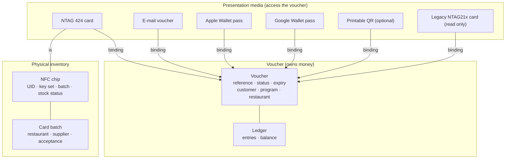
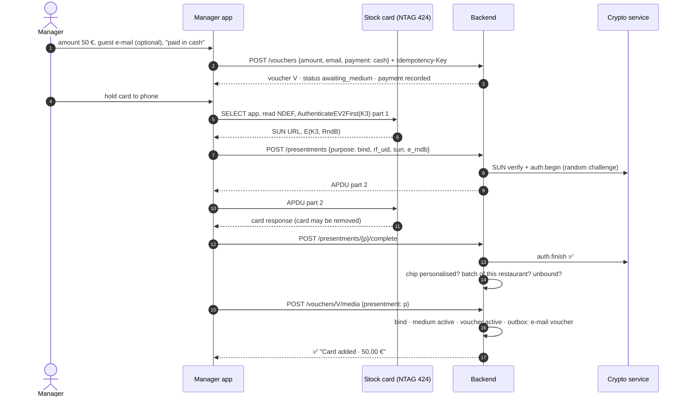
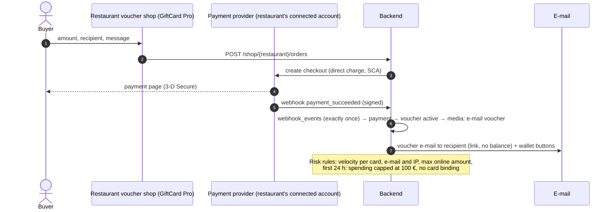
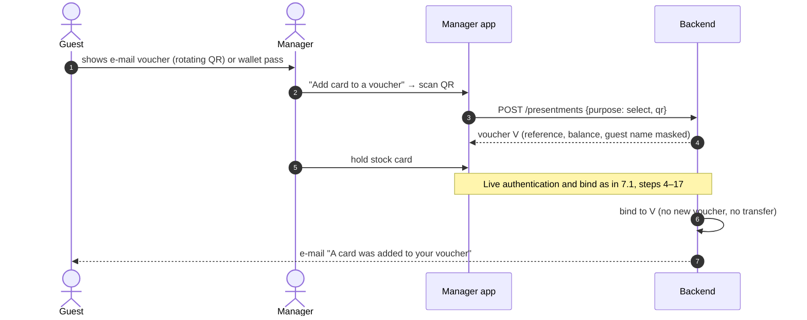

# GiftCard Pro v2: implementation review and production architecture

**Status:** architecture for approval. **No code has been changed.**
**Date:** 28 September 2026.
**Input:** the product decision "GiftCard Pro v2" (12 points, 28 September 2026), reproduced in §1.
**Relation to earlier documents:**

| Document | Status after this one |
|---|---|
| `ntag424-platform-architecture.md` | **Remains the detailed reference** for chip keys, the crypto service, HSM tiers, key ceremonies, personalisation steps, presentments and the threat model. Where it differs from this document, this document wins. The deltas are listed in §2. |
| `ntag424-due-diligence.md` | Unchanged (chip facts, choice against DESFire EV3). |
| `security-and-issuing-architecture.md` | Its device, step-up, audit and risk controls still apply. Its §2.2 URL formats and its card-number rules are replaced. |

Evidence marks as before: **[Code]** = verified in this repository (path:line); **[Vendor]** = official documentation (§17); **[Law]** = statute or ruling, not legal advice; **[Assessment]** = engineering judgement.

---

## 1. The decision, as received

1. **NTAG 424 DNA** for all new physical cards. NTAG213/215/216 only for cards already in circulation.
2. **Premium PVC cards** carrying restaurant branding, GiftCard Pro branding and the chip. **No** QR, voucher number, card number, barcode, visible identifier or printed secret.
3. **Voucher ≠ presentation medium ≠ chip.** The voucher owns balance, ledger, expiry, customer and transactions.
4. **Many media per voucher:** NTAG 424 card, e-mail voucher, Apple Wallet, Google Wallet, optional printable QR. All show the same voucher and the same ledger; using one is immediately reflected in all.
5. **Cards are inventory:** personalised, cryptographically prepared, tested and worth nothing until bound. A stolen box yields no money.
6. **Restaurants** never personalise, never generate keys and never know card secrets. The flow is: payment → voucher → tap an unused card → the backend binds it → active.
7. **Android manager app:** keep the S20 functionality, but as *create voucher → tap factory card → bind → activate*. The phone generates no cryptographic data and only relays APDUs.
8. **The backend is the source of truth.** The app is never trusted; every critical operation is authorised by the server.
9. **The chip holds the minimum.** Never balance, amount, restaurant, customer, expiry or a static identifier.
10. **Online sales:** buy online → voucher → e-mail voucher (plus optional wallet passes) → later, a physical card is bound in the restaurant. No transfer, no migration, no duplicate voucher.
11. **Lost card** = revoke one medium, bind another. The voucher and its ledger never change.
12. **Review first, no code.**

---

## 2. Short answer

**The decision is sound, and it makes the product simpler as well as safer.** Most of the complexity in today's code exists because *restaurants write cards*:
- chip-size detection by probe writes;
- read-back checks the server cannot verify;
- locking;
- programming stations;
- print pages;
- card numbers as a fallback when writing fails.

All of that disappears. What replaces it is smaller and sits where it belongs: central personalisation, and one server-verified tap to bind.

| | Summary |
|---|---|
| **Already matches** | Server-side money with idempotency and row locks; SUN verification with an atomic counter; the permission-gated manager flow; device tokens; tenant isolation; customer records; e-mail pipeline; guest balance page. (§3.1) |
| **Must change** | The data model (card = voucher today); issuing (active on creation, no payment record); binding (client-reported, unverifiable); spending (no card-present proof); card numbers and QR as credentials; replace-by-transfer; keys in `.env`; no online sales, no wallets. (§3.2) |
| **Becomes simpler** | Restaurant onboarding, the manager flow, support, lost cards, the dashboard, the test matrix. iPhone parity comes almost for free, because iPhones never need to write. (§3.3) |
| **Can be removed** | About **6 700 lines** including tests: the whole NTAG21x writer in backend, dashboard and app; the programming station; the print page; card-number generation and manual entry; replace-by-transfer. (§3.4) |
| **Debt that disappears** | Two binding paths (verified/unverified); the `qr_only` pseudo-tag type; `nfc_*` columns on the voucher; the lock and UID-binding settings; the Chrome-on-Android requirement; HMAC key diversification; per-restaurant card-number prefixes. (§3.5) |
| **Security gained** | Nothing to photograph or copy from the card; every debit needs a server-verified presence proof; the phone holds nothing; keys leave `.env`; no client-attested binding; a stolen box is worthless. (§3.6) |

**Five points I challenge or refine** (details in §4):

1. **No visible identifier** means a lost card cannot be identified by the guest. The voucher must be findable another way: e-mail, receipt or sale record. Otherwise, an anonymous card is cash.
2. **A static printable QR is a bearer credential.** It is as strong as a photo of it. It stays optional, with lower limits, and is off by default when a card exists.
3. **"Using one medium updates all others immediately"** is true for the server. Wallet passes are updated by push, which takes seconds. E-mails must never contain a balance.
4. **Online sales raise money-handling questions:**
   - who is merchant of record (answer: the restaurant, via a payment platform's connected accounts, so GiftCard Pro never holds guest money);
   - chargebacks;
   - withdrawal rights.
5. **The URL on the chip must not carry a batch code.** Premium cards are restaurant-branded, so batch = restaurant, and a batch code would be the "static identifier" the decision forbids. The SDM meta-read key therefore becomes per key set instead of per batch. This is a change to the earlier design, and it costs nothing in security (§6.2).

**Effort:**
- **Core physical v2** (Phases 0–8b): 90–125 engineer-days.
- **Online sales and wallets:** 25–34 more.
- **Double-entry ledger and the enterprise security controls:** 28–40 more.

Phase 0 (closing today's bypasses, 6–8 days) should ship first, independently of everything else (§14).

---

## 3. Review of the current implementation

All findings are from the code at commit `0493784`.

### 3.1 What already matches

| v2 principle | Current implementation | Evidence |
|---|---|---|
| Backend is the source of truth for money | Amounts, balances, limits and status are decided server-side. Redeem, reload and transfer require an idempotency key (unique per restaurant) and lock the card row. Issuing accepts one optionally. | `GiftCardService.php` (`idempotent()`, `lock()` l.762); `routes/api.php:73` (`idempotent:optional`), `:78` (`idempotent`) |
| The voucher owns balance, ledger, expiry, customer | The balance, totals, expiry, customer and transaction ledger all hang off one row, and the ledger is append-style with before/after balances. **Right data, wrong row:** that row is also the card (§3.2). | `…000004_create_gift_card_tables.php:13–76` |
| NTAG 424 SUN verification | AES-CMAC and SUN MAC per AN12196, and a counter compare-and-set that is replay-safe under concurrency. | `Ntag424SunVerifier.php`, `AesCmac.php`, `CardScanService.php:134–139` |
| One chip, one live voucher | A unique index on the active UID (a virtual column) prevents a chip from being on two usable cards. | `…add_nfc_programming.php` (`nfc_uid_active`) |
| Server-authorised manager flow | S20 is gated by server-issued abilities (`cards.create` + `cards.write_nfc`). Waiters never get it. The app only shows it when the profile allows it. | `DeviceTokenService`, `EnforceDeviceToken`, `WaiterAppIssuingTest` (6 tests) |
| Retry-safe creation from the phone | S20 repeats the same idempotency key after an uncertain answer, so a voucher is never sold twice. | `issue_controller.dart:179`, `issue_controller_test.dart` |
| E-mail pipeline | Templated, queued, per-locale customer e-mails (issued, reloaded, low balance, expiring) with no QR and no attachment. **The content does not match v2:** see C13. | `CardNotificationService.php:48–64`, `QueueCardNotifications`, `TemplatedMail` |
| Guest balance page | `GET /public/cards/{token}` plus the dashboard page `/c/[token]`. The restaurant can switch it off. | `PublicCardController.php`, `dashboard/src/app/c/[token]/page.tsx` |
| Chip reading on both platforms | Android and iPhone read NDEF URL + UID. The iPhone `Info.plist` already declares the NTAG 424 AID for ISO 7816 sessions. | `WaiterNfc.kt:283`, `WaiterNfc.swift:192`, `Info.plist:86–88` |
| Tenant isolation, device-bound tokens, audit | In place and tested. | `TenantIsolationTest`, `bind_access_tokens_to_devices` migration, `audit_logs` |

### 3.2 What must change

| # | Today | v2 requirement it breaks | Change |
|---|---|---|---|
| C1 | **Card = voucher.** `gift_cards` holds balance *and* `public_token`, `card_number`, `nfc_uid`, `nfc_tag_type`, counters and lock flags. | 3, 4, 11 | Voucher keeps money, expiry and customer. New tables for `media`, `media_bindings`, `nfc_chips`, `card_batches` (schema in `ntag424-platform-architecture.md` §5, with the deltas in §5 below). |
| C2 | **Vouchers are active on creation** (`activate` defaults to `true`) and there is **no payment record** of any kind. | 5, 6, 10 | Voucher `pending_payment` → payment recorded (cash, terminal, online) → bound (if a card is sold) → `active`. |
| C3 | **Binding trusts the client.** `method: web_nfc` passes UID, read-back UID and URL as *claims*. Any other method (`manual`, `provisioned`, `printed`) binds **without any verification**. A 424 card "marked as provisioned" gets its UID on the first tap. | 7, 8 | Binding requires a server-verified tap of a personalised stock chip (live AES authentication through the phone). No other binding path exists. |
| C4 | **Spending needs no card.** Redeem, reload and transfer take a card id. `qr`, `manual` and `api` scans skip chip checks, and waiters can spend by typing the number. | 8, and the purpose of 424 | Every debit references a single-use, server-issued presentment. Manual lookup is gone; a manager override with step-up replaces it. |
| C5 | **Card numbers everywhere:** generated (16-digit Luhn, restaurant prefix), shown, printed, exported, used for search, manual entry and transfers. | 2 | No number on any card. A **voucher reference** (non-secret, not a credential) exists on receipts, e-mails and in the dashboard only. |
| C6 | **Print page with QR and full card number.** `GET /cards/{id}/qr` returns the tag URL as an SVG. | 2 | Removed. The optional printable QR voucher is a separate, revocable medium with its own secret (§5.4). |
| C7 | **Replace = new card + balance transfer** (new token, new number, `TransferOut`/`TransferIn`). | 11 | Revoke medium + bind medium. The ledger is untouched. |
| C8 | **One URL for everything:** the tag URL, the QR and the e-mail link are the same bearer token (`/c/{uuid}`), stored in clear. | 4, 9 | Separate credentials per medium, stored as hashes. The e-mail link is view-and-show-QR, not a bearer spend link. The chip carries a SUN URL with no static token. |
| C9 | **424 keys in `.env`**, one global pair, HMAC diversification, no key version. | 6, 8 | Crypto service + HSM, NXP AN10922, key sets (earlier design §6). |
| C10 | **Default expiry 36 months.** Unlawful for paid vouchers in Austria (audit blocker 1). | 3 (the voucher owns expiry) | The program default is no expiry. Expiry is a legal parameter (§4.6). |
| C11 | **No online sales, no payment provider, no wallet passes.** | 4, 10 | New: checkout, payment webhooks, e-mail voucher v2, Apple and Google Wallet (§8, §9). |
| C12 | **The iPhone app cannot write**, so the manager flow is Android-only (`s05_ready.dart:585`). | 7 | Binding needs only APDU relay, which iOS supports. The manager flow works on both (§10). |
| C13 | **Customer e-mails print the balance and the bearer link.** Every template contains `{{ balance }}`, and `balance_url` is the `/c/{public_token}` spend link. | 4, V-6 | Templates rewritten: no amounts, only the e-mail voucher link (Phase 8, including the expiry-reminder command). (`NotificationTemplateSeeder.php:18–48`, `CardNotificationService.php:51–52`, `CardUrlBuilder.php:19–24`) |

### 3.3 What becomes simpler

| Area | Today | v2 |
|---|---|---|
| Restaurant onboarding | Needs Chrome on Android for Web NFC; blank tags of the right type; explanation of locking | Receive a box of branded cards. Nothing to configure. |
| Selling a card (manager) | Create → hold still while writing → read back → verify → lock (optional) → handle 20+ error codes (wrong type, too small, locked, swapped, URL mismatch, …) | Payment → amount → one tap → done. A handful of errors: "not a card from your stock", "hold longer", "no connection". |
| Programming station | Dashboard page (686 lines) that walks a stack of blank tags against unprogrammed cards | None in restaurants. Personalisation is central. |
| Lost card | Replace creates a new card number and moves money | Revoke and bind; the guest keeps the same voucher. |
| Tag types | ntag213/215/216/424/`qr_only`, capacity probing | One chip type for new cards; legacy types only on read. |
| iPhone | Reader only; managers need Android | Same features on both platforms. |
| Support | "Which number is on the card?", "tag won't write", "tag locked by mistake" | "Tap the card." |
| Testing | Writer matrix per chip type × browser × app × lock state | Relay protocol tests with NXP vectors; one chip type. |

### 3.4 Code that can be removed

Line counts from `wc -l`, including tests. "Remove" means: delete once v2 binding is live and legacy NTAG21x cards no longer need to be *written*. They are still *read* until the end of their sunset.

| Component | Files | Lines |
|---|---|---|
| **Backend: writer and binding workflow** | `NfcProgrammingService.php` (457); `BindNfcTagRequest`, `CheckNfcTagRequest`, `LockNfcTagRequest`, `ReportNfcFailureRequest`; `NfcWriteAttemptResource`; `NfcWriteAttempt` model; enums `NfcWriteMethod`, `NfcWriteStage`, `NfcWriteResult`; `tests/Feature/NfcProgrammingTest.php` (26 tests); the migrations stay (history) | ≈ 1 450 |
| Backend: in `GiftCardService` | `bindNfcTag`, `markNfcLocked`, `assertChipAvailable`, `replace` (l.367–431, 592–695) | ≈ 170 |
| Backend: card numbers and QR | `CardNumberGenerator` (49), `QrCodeService` (21, reused only if the printable QR is kept), `qr` and `nfcPayload` actions, `card_number_prefix` setting | ≈ 120 |
| **Dashboard: writer and station** | `lib/nfc-programming.ts` (601) + tests (526); `nfc-writer.tsx`, `nfc-program-steps.tsx`, `nfc-attempts.tsx`, `nfc-error.tsx`, `card-qr.tsx`; `hooks/use-nfc-programmer.ts`; `cards/program/page.tsx` (686); `print/cards/[id]/page.tsx`; and at the repository root `e2e/nfc-programming.mjs` (437) | ≈ 2 900 |
| Dashboard: card numbers | Manual entry in the web terminal, transfer by number, number columns, search | ≈ 150 (edits) |
| **Waiter app: writer** | `core/issue/card_programmer.dart` (330) + tests (211); `core/platform/tag_writer.dart` (115); writer paths in `WaiterNfc.kt` (`onWriterTag`, `inspect`, `writeUrl`, `readFresh`, `lock`: l.300–420); writer events in `nfc_service.dart` | ≈ 800 |
| Waiter app: manual number entry | `s11_manual_entry.dart` (459) + its test (330), `components/card_number_field.dart` (289); replaced by a smaller manager override screen. `core/format/card_number.dart` **stays**: it formats the reference of existing vouchers. | ≈ 1 080 |
| **Total** | | **≈ 6 700 lines**, of which about 2 100 are tests and the end-to-end script |

**Kept and reused:**
- the S20 screen shell, amount pad, e-mail field and the idempotent create logic (`issue_controller.dart`);
- `AesCmac`, `Ntag424SunVerifier` (extended with key sets);
- the legacy UID path of `CardScanService` (for NTAG21x reads during the sunset);
- the e-mail pipeline;
- the public balance page (moved to the tap domain).

### 3.5 Technical debt that disappears

1. **Two binding paths**, one of which (`bindUnverified`) binds without any check (`GiftCardActionController.php:147–160`, `NfcProgrammingService.php:231–250`).
2. **"Verified" that is not verified.** Today's read-back is reported by the client. The server cannot tell a real read-back from a forged request.
3. **Chip-size detection by probe writes** in the dashboard (`nfc-programming.ts:309–352`) and by GET_VERSION in the app. There are two implementations of the same heuristic.
4. **`qr_only` as a tag type** (`NfcTagType`): a medium modelled as a chip.
5. **NFC state on the voucher row**: `nfc_tag_type`, `nfc_uid`, `nfc_uid_active` (virtual column with a unique index), `nfc_written_at`, `nfc_verified_at`, `nfc_locked`, `nfc_read_counter`.
6. **Restaurant settings that only exist because restaurants write tags:** `lock_nfc_tags_after_write`, `enforce_nfc_uid_binding`, `card_number_prefix`.
7. **`replaced_by_id` / `replaces_id` chains** and the transfer-based replacement, with their audit special cases.
8. **The waiter app sends `method: web_nfc` from native code**, a compromise made to reuse the dashboard's verified path.
9. **Keys in `.env`** and the `giftcard:nfc-keys` generator command.
10. **The Chrome-on-Android dependency** for programming, and the missing iPhone writer.
11. **The 36-month default expiry** (a legal liability, not only debt).

### 3.6 Security improvements

| Risk today | v2 |
|---|---|
| A photo of the card (QR or number) is enough to spend | The card shows nothing. Its URL changes on every tap. Spending needs a live answer from the chip to a server challenge. |
| Spending without any card (card id, number, `method: qr/api`) | Every debit needs a server-issued, single-use presentment, consumed in the same database transaction. |
| Bindings based on client claims | Binding needs a genuine, personalised chip from this restaurant's stock, proven by AES authentication that the phone cannot fake. |
| A stolen box of blank tags or pre-written cards | A box of cards is worth nothing. Binding needs a manager of that restaurant with step-up, and a lost box is blocked centrally. |
| One leaked token = tag, QR and e-mail compromised | Separate, hashed credentials per medium; each can be revoked on its own. |
| Keys in `.env` (any server compromise = every 424 card) | Root keys in an HSM, per-card derived keys, a crypto service with no key export. A server compromise cannot clone cards. |
| Anyone can overwrite an unlocked NTAG21x | NTAG 424 NDEF is writable only with the card's own K0. |
| Guest-e-mail link = spending credential | The e-mail link shows balance and a rotating QR. It is not a bearer link. |

---

## 4. Where I challenge or refine the decision

### 4.1 "The card reveals nothing" → the voucher must be findable another way

A card with no visible identifier is exactly right against copying. But when it is **lost or its chip dies**, nobody can tell which voucher it was. A lost card cannot be tapped.

- **Registered vouchers** (a guest e-mail is known) are recovered through the e-mail voucher or its reference: revoke the card, bind a new one.
- **Unregistered vouchers** are bearer instruments, like cash. The restaurant can search its sale records (date, amount, staff), but that invites social engineering. So recovery of an unregistered voucher is an **owner-only, audited** action, never a waiter or manager one.

What reduces the problem:

1. **At the sale**, the manager app offers "send the voucher to the guest's e-mail" (one field, optional). This is the single most useful step for recoverability.
2. **Self-registration by tap.** A guest who taps the card with their own phone lands on the balance page. There they can add an e-mail address ("Protect this card").
   - This creates an **e-mail medium with the role `view`**: balance, alerts, and freezing the card.
   - It can **never spend or be used to rebind**, because a card read in passing (skimming) would also yield a valid tap.
   - It is only offered while the voucher has no guest e-mail yet.
   - Upgrading it to phone payment happens in the restaurant (§4.2).
3. **The card sleeve or insert** (packaging, not the card) explains: "Tap with your phone to check the balance and protect your card." It carries no QR and no identifier.

### 4.2 Weak media must not undermine the card → limits by assurance level

All media spend the same voucher, as decided. But they are not equally strong:
- a static printable QR can be photocopied;
- an e-mail link can be forwarded;
- an Apple Wallet barcode is static between updates.

Instead of forbidding them, each medium gets **limits by assurance level**, so a leaked weak medium can lose at most a small amount:

| Level | Media | Proves | Default limits (per restaurant, adjustable within bounds) |
|---|---|---|---|
| **A3** live chip | NTAG 424 card via the app (AES challenge from the server) | The genuine card is here now | €250 per transaction, €500 per voucher per day |
| **A2** dynamic | Rotating QR on the e-mail voucher page; Google Wallet rotating barcode **[Vendor]**; NTAG 424 SUN in the web dashboard | A fresh value from the holder's device or card | €100 per transaction, €150 per voucher per day |
| **A1** static | Printable QR voucher; Apple Wallet barcode; legacy NTAG21x cards | Someone saw the value once | €50 per transaction, €100 per voucher per day |
| **A0** view | E-mail link before device confirmation; guest tap on own phone | Nothing | No spending |

- **Printable QR:** off by default for vouchers that have a physical card. It can be enabled per voucher by the guest or the manager, and revoked or re-issued at any time.
- **E-mail voucher: role depends on how the voucher was sold.**

  | Voucher | E-mail medium | How it can spend |
  |---|---|---|
  | **Digital** (online, or sold without a card) | `spend` | The link opens the voucher page (A0). On a new device, a one-time code sent to that address unlocks the rotating QR (A2) for that device. A forwarded link alone does not spend. |
  | **Sold with a card** | `view`: balance, alerts, freeze | It becomes `spend` only in the restaurant, when staff tap the card (A3) with the guest present ("Enable phone payment"). The step is audited. |

  This keeps a card voucher at card strength, even if staff typed the wrong (or their own) e-mail at the sale.
- **Changing a voucher's e-mail address** needs confirmation from the old address, or an A3 tap of the card in the restaurant. The old address is always notified.
- **Apple Wallet:** balance and restaurant only (view) by default. Apple Wallet has no rotating barcode, so a barcode for spending is an A1 opt-in.
- **Wallet passes added from a guest tap** (§7.5) are always view-only, with no barcode on Apple or Google.

**Caps that do not reset forever.** Daily limits alone would let a leaked weak medium drain a voucher over several days. So there are three further caps:
- **per voucher per day, across all media:** €500 (the A3 daily limit). Lower levels count towards it;
- **per A1 medium, lifetime:** €150. After that, the guest or a manager must re-issue it, which gives it a new secret;
- **per A2 medium, rolling 30 days:** €500, unless the device was confirmed again in that period.

### 4.3 "Using one medium updates all others immediately"

There is one ledger, so every medium that **asks** the server sees the new balance at once: the card, the e-mail voucher page, the dashboard, the waiter app.

Two media are **pushed** rather than asked:
- **Apple Wallet:** our pass web service plus an APNs push; the device then fetches the updated pass **[Vendor]**.
- **Google Wallet:** an update of the gift-card object through the Wallet API **[Vendor]**.

Both arrive within seconds, not in the same instant. They are sent from a **transactional outbox**, written in the same database transaction as the ledger entry, so an update is never lost and never sent for a rolled-back entry.

Consequence: **no medium may carry a balance of its own.** E-mails contain a link, never an amount. Printed QRs show no value.

### 4.4 Online sales: who holds the money

- **Merchant of record = the restaurant.** GiftCard Pro should never receive guests' money.
  - Use a payment platform's connected-account model, for example Stripe Connect with **direct charges**, where "the merchant of record is the connected account" **[Vendor]**. The platform fee is taken as an application fee.
  - If the platform collected the money and paid restaurants out, it would be handling funds for others, which in the EU points towards a payment-institution licence **[Law; confirm with counsel]**.
- **Chargebacks:** the restaurant, as merchant, bears them.
  - Strong Customer Authentication (3-D Secure) is mandatory for most EEA card payments and shifts fraud liability to the card issuer for authenticated payments **[Law/Vendor; confirm per provider]**.
  - On top of that: velocity limits per buyer e-mail, card and IP address, and a maximum online amount.
  - **During the first 24 hours after payment:** the voucher's total spending is capped at €100, and **no physical card can be bound**, so a stolen-card purchase cannot be turned into an A3 card and spent at high limits.
- **Withdrawal and refunds:** whether the 14-day withdrawal right (FAGG) applies to vouchers bought online needs a legal answer. Technically, an **unused** voucher can be refunded by a reversal plus a PSP refund. A partly used one needs a policy.
- **VAT:** a single-purpose voucher (one restaurant, known VAT rate) is taxed at sale. A multi-purpose voucher is taxed at redemption (EU 2016/1065 **[Law]**). This is a program property.

### 4.5 No batch code in the chip URL

The earlier design put a 6-character batch code in the URL. The server used it to choose the per-batch SDM meta-read key (K1).
- With **restaurant-branded** cards, a batch belongs to one restaurant, so the batch code would be a static, linkable identifier. That is what point 9 forbids.
- **Refinement:** K1 becomes **per key set** (a key set covers many batches and restaurants). The URL carries only the key-set version, which thousands of cards share.
- **The cost is privacy, not authenticity.** K1 only encrypts the UID and counter; authenticity comes from the per-card MAC key K2.
  - K1 can no longer be derived per batch from `batch_code` (earlier design §6.4). It is now **one key per key set**, generated in the HSM (`key_references.scope = per_key_set`).
  - A manufacturer that personalises cards must receive it. A leak there exposes UIDs and counters of *every* card of that key set, across restaurants: a privacy incident, not a forgery risk.
  - **Mitigation:** one key set per manufacturer. Central in-house personalisation keeps K1 inside the HSM.
  - **Accepted for the pilot:** while a key set contains only one restaurant's batch, its version number in the URL indirectly identifies that restaurant. It stops doing so as soon as the key set spans more restaurants, and the pilot restaurant accepts this.

### 4.6 Expiry

The voucher owns expiry, and the law constrains it:
- in Austria, vouchers are valid 30 years by default;
- for paid vouchers, an expiry of three years or less in standard terms was held invalid by the Supreme Court **[Law]**.

The program default becomes **no expiry**, replacing today's 36 months (`RestaurantSetting.php:44`). Any expiry is a legal decision, not a product toggle.

### 4.7 Branded stock has commercial consequences

- **Premium printed PVC means per-restaurant print runs:** minimum quantities, lead times, and cards that can never move to another restaurant.
- **Positive side:** stock ownership is implicit in the batch. A card can only ever be bound by its own restaurant (or chain), which makes stolen-stock rules trivial.
- **Option for small restaurants:** a GiftCard Pro-branded generic card, from shared platform stock, assigned to a restaurant when shipped. This is a product decision (§16).

### 4.8 Binding a card to an existing (online) voucher must prove the guest

"The manager simply binds one unused stock card to the existing voucher." That needs a guard. Otherwise a manager could attach a card they keep to **any** guest's online voucher and spend it.
- **Rule:** to bind to an existing voucher, the guest first **presents that voucher** with an A2 medium: the rotating QR from a confirmed device on the e-mail voucher page, or a Google Wallet rotating barcode. That is a presentment with `purpose = select`. Apple Wallet passes are view or A1 and cannot select. The app then asks for the stock card.
- **For card vouchers, the e-mail medium is `view`.** Its confirmed device may still produce a `select` code for *recovery* (lost card, §7.6), but only under the recovery rules below.
- **Afterwards,** the guest gets an e-mail: "A physical card was added to your voucher."
- **An owner can bind without the guest** (support cases), with step-up, a reason and an audit event. The owner must be **a different person** from the one who sold the voucher.
- **Recovery rules** (no old card present), carried over from the earlier design §9.3:
  - manager step-up;
  - the new card is capped at **A2 limits for 72 h**;
  - every known guest contact is notified;
  - the risk rule "rebind followed by a debit within 24 h" fires;
  - if the same user sold the voucher within the last 30 days, an owner (a different person) must approve;
  - a risk rule flags guest e-mails that belong to staff users or appear on more than three vouchers.

---

## 5. Production domain model v2

### 5.1 Three layers, as decided



The full schema is in `ntag424-platform-architecture.md` §5. This section lists **only what v2 changes** there.

### 5.2 Schema deltas against the earlier design

| Table | Change in v2 |
|---|---|
| `gift_cards` (voucher) | `card_number` → **`reference`**: 10 characters of Crockford base32 plus a check character, random and non-sequential, unique per organisation (e.g. `GC-7K4M-2Q9P-X`). Shown on receipts, e-mails and in the dashboard. **Never printed on a card, never a credential:** knowing it allows looking up, never spending. Existing numbers stay as the reference of existing vouchers. Status adds `awaiting_medium` (paid, card still to bind). Default expiry: none. |
| `media.type` | `nfc_ntag424`, `nfc_ntag21x_legacy`, `email_voucher`, `wallet_apple`, `wallet_google`, `printable_qr`, `legacy_link` (old `/c/{uuid}` links). The earlier `reference_number` and `qr_rotating` types fold into `email_voucher`. |
| `media` | + `assurance` (fixed per type, §4.2); + `secret_ciphertext` (the rotating-QR seed of an e-mail or Google Wallet medium, envelope-encrypted, because the server must verify it); `secret_hash` stays for the printable QR. |
| `media_devices` (new) | Devices on which a guest unlocked the e-mail voucher's QR with a one-time code: `medium_id`, `device_cookie_hash`, `confirmed_at`, `revoked_at`. |
| `card_batches` | `organization_id`: the restaurant or chain for branded batches, **NULL** for generic GiftCard Pro-branded stock (§4.7); no `batch_code` in URLs. **Ownership is tracked per chip** (`nfc_chips.stock_organization_id / stock_restaurant_id`), set by the batch for branded cards and by the shipment for generic ones. Binding checks the chip's owner, not the batch. |
| `key_references` | New scope value `per_key_set` for K1 (SDM meta-read), generated in the HSM, no longer derived per batch (§4.5). |
| `payments` (new) | `id, organization_id, restaurant_id, voucher_id, method(cash, card_terminal, online), psp, psp_payment_id UNIQUE, amount, currency, status(pending, succeeded, refunded, disputed, failed), received_by, device_id, terminal_receipt_ref, created_at`. Every `sale` or `reload` entry references one (I-1 of the earlier design). |
| `online_orders` (new) | `id, restaurant_id, buyer_email, recipient_email, recipient_name, message, amount, deliver_at, status(open, paid, fulfilled, refunded, failed), psp_checkout_id UNIQUE, voucher_id, risk_score, ip, created_at` |
| `webhook_events` (new) | `psp, event_id UNIQUE, type, received_at, processed_at, payload_sha256`: exactly-once processing |
| `wallet_passes` (new) | `medium_id, platform(apple, google), serial UNIQUE, auth_token_hash, pass_version, last_pushed_at`; `wallet_registrations` for Apple device push tokens |
| `outbox_events` (new) | `id, aggregate(voucher), aggregate_id, type(balance_changed, medium_revoked, …), payload, created_at, dispatched_at, attempts`: written in the ledger transaction |
| `presentments.purpose` | + `select` (identify an existing voucher before binding, §4.8) |

**Removed from the design:** the per-restaurant `card_number_prefix` and every `nfc_*` column on the voucher (after migration, §13).

---

## 6. What is on the chip, and what is printed

### 6.1 Printed

Restaurant branding, GiftCard Pro branding. **Nothing else.** Pack labels (on the box, not the card) may carry batch and quantity for logistics.

### 6.2 On the chip

| Item | Content | Why |
|---|---|---|
| NDEF file (read: free; write: K0 only) | `https://t.giftcardpro.at/1?e=<32 hex>&m=<16 hex>` | `1` = key-set version (shared by all cards of that key set). `e` = UID + tap counter, encrypted with random padding, different on every tap. `m` = MAC with the card's own key. |
| Keys K0–K4 | Per-card AES keys (K1 per key set) | Never readable. Earlier design §6.1. |
| SDM configuration | UID + counter mirrored encrypted, MAC over the URL | Earlier design §6.2–6.3, without the batch code |
| Proprietary file | Empty | — |

- **Not on the chip:** balance, amount, restaurant, customer, expiry, voucher reference, token, and any value that stays the same between taps.
- **One honest limit:** the chip's 7-byte UID is sent in clear during the radio handshake to any NFC reader. This is how ISO 14443 works, unless Random ID is enabled (rejected: irreversible, breaks key derivation). The UID links to nothing outside our database.

### 6.3 Keys and personalisation

Unchanged from `ntag424-platform-architecture.md` §6–§8, with two exceptions: K1 per key set (§4.5), and no batch code in the NDEF template. Without the batch code, the server decrypts the UID with the key set's K1, then finds the chip and its batch in `nfc_chips` to derive the per-card keys. In summary:
- AN10922 two-level derivation from HSM roots;
- crypto service with no key export;
- personalisation only at a central station or the manufacturer, with batch acceptance testing and dual control.

---

## 7. Flows

### 7.1 Sale in the restaurant with a physical card (manager, Android or iPhone)



- **What the phone did:** passed bytes. Every value it sent was created either by the card or by the server.
- **If the tap fails,** the voucher stays `awaiting_medium` (paid). The manager taps another card or retries. Money is never lost or doubled.

### 7.2 Online sale



### 7.3 A physical card for an online voucher (later, in the restaurant)



### 7.4 Redeeming

| Medium | How | Level |
|---|---|---|
| NTAG 424 card | Waiter taps → live authentication (as in 7.1) → amount → redemption with the presentment | A3 |
| E-mail voucher | Guest opens the voucher page (device confirmed) → rotating QR → waiter scans → amount | A2 |
| Google Wallet | Rotating barcode → waiter scans | A2 |
| Apple Wallet (if spending enabled), printable QR, legacy NTAG21x | Scan or tap | A1 |
| Nothing works (card broken, phone dead) | Manager override: step-up, reason, small limit | — |

Every redemption, whatever the medium: `POST /vouchers/{id}/redemptions {amount, presentment_id}`, single-use presentment, consumed in the ledger transaction (earlier design §7.4).

### 7.5 Guest taps own card

1. The phone opens `https://t.giftcardpro.at/1?e=…&m=…`.
2. The server verifies SUN and shows the balance page (A0), if the restaurant allows public balance.
3. The page offers "Add to Apple/Google Wallet" (view pass) and **"Protect this card with your e-mail"** (§4.1).

### 7.6 Lost or broken card

1. Find the voucher:
   - via the e-mail voucher (the guest shows a `select` code from a confirmed device), under the recovery rules of §4.8;
   - via the reference on the receipt or e-mail (manager search, then a guest e-mail confirmation, as in the earlier design §9.3);
   - via the broken card itself, if its chip still answers.
2. Revoke the card medium. The old chip is refused everywhere from that second.
3. Bind a new stock card (7.1, from step 4).

**The voucher, its balance, its reference and its ledger do not change.**

### 7.7 Legacy NTAG21x card at the table

1. It is read as today (UID and static URL), resolved via the legacy medium, and spends at **A1** limits.
2. The app shows a manager "Swap for a premium card": one tap on a stock card binds the new one and revokes the old one. The voucher stays the same.
3. After the sunset date (§13), legacy cards are view-only.

---

## 8. Online sales architecture

| Component | Design |
|---|---|
| **Shop** | A restaurant-branded voucher page under `giftcardpro.at/shop/{restaurant-slug}`, served by the Next.js app. It offers amounts within the program limits, a recipient, a message and a delivery date. Legal texts come from the restaurant (the merchant). |
| **Payment provider** | Connected-account model with the **restaurant as merchant of record** (e.g. Stripe Connect direct charges; Mollie Connect is the alternative with EPS). The platform fee is an application fee. Onboarding happens in the owner settings (the provider's hosted KYC). |
| **Order → voucher** | 1. Order `open`. 2. Checkout. 3. **Signed webhook** → `webhook_events` (unique event id) → in one transaction: payment `succeeded`, voucher created and `active`, `email_voucher` medium, outbox event. 4. A mailer job sends the recipient e-mail at `deliver_at`. The success page never creates vouchers; only the webhook does. |
| **Webhook checks** | Signature verified. The event's connected account must be the order's restaurant account, and the amount and currency must equal the order. Otherwise the event is rejected and raises a risk event. An event from one restaurant's account can never fulfil another's order. |
| **Idempotency** | The PSP event id is unique, and the order is locked. The voucher has a unique `order_id`, so a replayed webhook returns the existing voucher. |
| **Refunds** | First the voucher is **blocked**, so nothing can be spent while the refund is in flight. Then: an unused voucher gets a PSP refund, and after the provider confirms, a reversal entry and revocation of all media. A partly used voucher: policy (default: refund the remaining balance on request, owner approval). |
| **Disputes** | A `charge.dispute.created` webhook → voucher `blocked` (remaining balance frozen) → the owner is notified. If the dispute is lost: reversal of the remaining balance, a risk event. |
| **Fraud** | 3-D Secure required; velocity per card fingerprint, e-mail and IP; maximum online amount per order and per day; first 24 h: spending capped at €100 and no card binding (§4.4); the card-testing pattern (many small failed payments) blocks the shop temporarily. |
| **Accounting** | `sale` entry referencing the online payment; VAT treatment from the program (single or multi-purpose, §4.4); a monthly statement per restaurant. |

---

## 9. Media synchronisation and wallet passes

- **Truth:** only the ledger. Media never hold value.
- **Outbox:** every ledger entry and every medium change writes an `outbox_events` row in the same transaction. A worker dispatches them with retries:

| Event | Apple Wallet | Google Wallet | E-mail voucher | Card | Printable QR |
|---|---|---|---|---|---|
| Balance changed | APNs push → device fetches the updated pass from our pass web service **[Vendor]** | `giftcardobject` update (balance) **[Vendor]** | Nothing to do; the page is live | Nothing (holds no data) | Nothing (shows no value) |
| Medium revoked | Pass voided (push) | Object state `inactive` | Device confirmations revoked; page says "revoked" | Chip refused | QR refused |
| Voucher blocked or expired | Pass updated | Object updated | Page shows the status | Refused | Refused |

- **Pass content:** restaurant branding, balance, status and reference. **No UID, no secret.**
- **Barcodes:**
  - Google Wallet uses a rotating TOTP barcode, whose seed is the medium's encrypted secret.
  - Apple Wallet shows no barcode unless A1 spending is enabled (§4.2).
- **Latency:** seconds [Assessment]. The waiter never relies on a pass's displayed balance; the app always shows the server balance after a scan.

---

## 10. Manager and waiter app v2 (Android and iPhone)

### 10.1 Screens

| Screen | Who | Flow | Replaces |
|---|---|---|---|
| **Sell voucher** (S20 v2) | Manager, owner | Amount → guest e-mail (optional) → payment method (cash / card terminal + receipt no.) → "Hold a card from your stock" (or "Sell without card": e-mail voucher only) → success with reference | S20 (create → write → verify → lock) |
| **Add card to voucher** | Manager, owner | Scan the guest's voucher QR (A2 select) → hold a stock card → success | New (online vouchers, lost cards) |
| **Replace card** | Manager, owner | Find the voucher (guest QR, reference search + guest confirmation, or tap the broken card) → reason → hold a new card | "Replace" in the dashboard |
| **Card info** | Manager | Tap any card → "In stock (this restaurant)", "Bound to voucher ••2Q9P, 42,50 €", or "Not ours" | New |
| **Redeem** | Waiter, manager | Tap card (A3) or scan QR (A2/A1) → amount → done | Unchanged for waiters, now with live authentication |
| **Override** | Manager | Voucher by reference → reason → step-up → limited amount | Manual number entry (S11) |

### 10.2 What the phone does, and nothing more

```text
Dart (UI, state)                         Native (Kotlin IsoDep / Swift NFCISO7816Tag)
  ├─ POST /vouchers …                      relayOpen()        → select tag, SELECT AID
  ├─ read NDEF + RF UID  ───────────────►  readNdef()         → SUN URL, UID
  ├─ auth part 1         ───────────────►  transceive(90 71 00 00 02 03 00 00)
  ├─ POST /presentments  (bytes from card) ──► server
  ├─ transceive(bytes from server) ─────►  transceive(APDU)   → card response
  ├─ POST /presentments/{id}/complete (bytes from card)
  └─ relayClose()
```

- **The app never builds a command with its own data.** Only four fixed commands are hard-coded, none carrying variable data:
  - select application;
  - select file E104;
  - read binary;
  - auth part 1.

  Every other APDU comes from the server, and every response goes back to it. The phone generates no cryptographic data **about cards**. Its own device-login key (Phase 12) is a separate matter.
- **The app keeps nothing between taps:** no keys, no challenge, no card data.
- **Android:** a new `IsoDep` relay channel next to today's reader (`WaiterNfc.kt`). The writer paths are deleted.
- **iPhone:** `NFCTagReaderSession` polling ISO 14443, then `NFCISO7816Tag.sendCommand`. The AID is already declared in `Info.plist:86–88`. **iPhone gets the manager flow for the first time.**

### 10.3 Reuse from S20

| Part | Fate |
|---|---|
| `IssueController` state machine (entry, e-mail validation, idempotent create with retry, 403/422 handling) | **Kept**; states renamed (`programming` → `binding`) and extended with the payment step |
| `s20_new_card.dart` screen shell, amount pad, e-mail field, success screen | **Kept**, texts adapted (no "programming", no "lock") |
| `CardProgrammer` (check → write → read back → verify → bind → lock) | **Replaced** by `CardBinder` (relay session → presentment → bind); about a third of the size |
| `TagWriter` / writer mode | **Deleted**; `ChipRelay` interface instead |
| `canIssueCards` ability gate | **Kept**, but based on `cards.bind` + `cards.create` |
| Copy document §5.6 (37 strings) | About 20 remain; about 12 new |

---

## 11. Dashboard v2

- **Vouchers:** list, detail and history as today, keyed by reference.
  - Media panel per voucher: card ••42A1 (active since …), e-mail voucher, wallets, printable QR, each revocable.
  - "Resend e-mail voucher".
- **No NFC writing and no programming station.**
  - Binding a card needs live authentication (APDUs), which Web NFC cannot do **[Vendor]**, so binding happens only in the app.
  - The dashboard shows stock: cards received, bound, lost, per batch.
- **Web terminal (optional):**
  - reads NTAG 424 SUN via Web NFC on Android Chrome (A2 limits);
  - scans rotating QRs with the camera;
  - no manual number entry.
- **Online shop settings:** payment-provider onboarding, amounts, texts, legal pages, refund policy.
- **Owner:** override reports, risk events, payment reconciliation (cash declared vs cash sales).

---

## 12. Security model v2

### 12.1 Invariants (binding for all code)

The earlier design's invariants I-1 to I-11 apply. v2 adds:

- **V-1 Nothing identifying is printed on a card** and nothing static is in its NDEF. Enforced in the personalisation profile and the batch acceptance test, which rejects a URL other than the key-set template.
- **V-2 Every medium is revocable on its own,** and revoking one never touches the voucher or the ledger.
- **V-3 Changing who can use an existing voucher needs the guest.** This covers binding a card, adding or upgrading any spend-capable medium, and changing the e-mail address. Each needs the guest's presentment of that voucher, or an owner (a different person from the seller) with step-up (§4.2, §4.8). The previous contacts are always notified.
- **V-4 A sale is a payment plus a voucher.** No `sale` entry exists without a `payments` row. Online payments exist only through a verified webhook.
- **V-5 Limits follow the medium's assurance level** (§4.2). A leaked weak medium loses at most its limits.
- **V-6 No balance in any e-mail, printout or offline representation.**

### 12.2 Threats that change with v2

The full threat model (T-1 … T-19) is in the earlier design §13. The v2 changes:

| Threat | Likelihood | Impact | Mitigation | Remaining risk |
|---|---|---|---|---|
| **Photo of the card** | None | None | Nothing is printed; the URL changes per tap and does not spend | — |
| **Lost unregistered card** | Medium | Low–Medium (the guest loses the balance) | E-mail capture at sale; "protect this card" by tap; owner-only recovery from sale records | Anonymous cards behave like cash. This is a product choice. |
| **Leaked printable QR** | Medium | Low | A1 limits; off by default for card vouchers; revocable, re-issuable | Up to the A1 limits until revoked |
| **Forwarded or stolen e-mail voucher** | Medium | Low–Medium | A one-time code per new device before the QR shows; A2 limits; guest can revoke devices | A compromised e-mail account |
| **Card testing and stolen-card purchases online** | High (every shop is attacked) | Medium (the restaurant's chargebacks) | SCA/3-D Secure, velocity rules, maximum amounts, first-24-hour cap and no card binding, dispute → block | Friendly fraud (the buyer disputes their own purchase) |
| **Manager binds a card to someone else's online voucher** | Low | Medium | V-3; guest notification; audit | An owner colluding (visible in audit) |
| **Skimmer registers their own e-mail by tapping someone's card** | Low | Low | A guest-tap registration is `view` only (balance, alerts, freeze); it is only offered while the voucher has no guest e-mail; it can never spend or rebind | Freezing a stranger's card (DoS); the owner unfreezes it with a tap in the restaurant |
| **Staff enter their own e-mail at a card sale** | Low | Low–Medium | E-mail on card vouchers is `view` until enabled with an A3 tap and the guest present; the recovery rules (72 h A2 cap, notification, owner approval for the seller's own sales); risk rule on staff e-mails | Collusion with an owner |
| **Unpaid in-person sales by staff** | Medium | Medium–High | V-4 payment record; cash reconciliation; four-eyes above a threshold; owner digest | The owner defrauding their own business |
| **Stolen box of branded cards** | Medium | **None** (the cards carry no value) | Cards can only be bound by their own restaurant; a lost pack is blocked | — |
| **Cloned card** | Low | Low (one card) | As before: per-card keys, live challenge | A laboratory key extraction from one card |
| **Relay attack at the table** | Low | Low–Medium | As before; A3 limits; physical-card policy | Accepted (NTAG 424 has no proximity check) |

---

## 13. Migration

### 13.1 Data

| Today | v2 |
|---|---|
| `gift_cards` row | The voucher, same id. `card_number` → `reference` (existing values kept; new vouchers get the new format). `default_validity_months` → program expiry (existing expiries are left alone, pending the legal review of blocker 1). |
| `public_token` + NTAG213/215/216 | **One** `legacy_token` medium, **A1**, `secret_hash = SHA-256(token)`, linked to an `nfc_chips` row (legacy type, no batch). See the note below the table. |
| `public_token` without a tag (QR or e-mail only) | The same `legacy_token` medium without a chip, **A1** |
| `public_token` + `ntag424_dna` (external tools, HMAC keys) | `nfc_chips` with key set v0 + an `nfc_ntag424` medium, **A2** (no known K3). The token resolves **only together with a valid SUN** (`picc` + `cmac`); the bare token spends nothing. In the swap campaign like NTAG21x. |
| Guest e-mail on the customer | An `email_voucher` medium for vouchers with a customer e-mail. Guests get a "your voucher is now also here" e-mail. **Optional; owner decision.** |
| `nfc_write_attempts`, `nfc_scans` | Kept read-only (history), no new rows from the writer |
| `replaced_by_id` chains | Kept for history |

**Why one legacy medium per token.** The same token is on the tag, in printed QRs and in e-mails already sent, so it is one credential, not three.
- Revoking it (lost card, swap) kills the tag, the QR and the old e-mail links together, and the guest gets a new e-mail voucher.
- The plain `public_token` column is cleared after migration.

### 13.2 Legacy sunset

| When | Rule |
|---|---|
| Launch of v2 cards (T0) | NTAG21x writing is switched off everywhere (dashboard and app). Legacy cards: A1 limits, and a swap offer on every manager tap. |
| T0 + 9 months | The owner gets a list of legacy vouchers with a balance; guests with an e-mail get a swap invitation. |
| T0 + 12 months | Legacy card and legacy link media become view-only. A swap takes one tap and the voucher is unchanged; nothing is ever forfeited. |

### 13.3 Code removal order

Every step is behind a feature flag, so each can be undone until the final deletion.

1. **Phase 0:**
   - redeem, reload and transfer require a presentment;
   - waiter manual lookup off;
   - `bindUnverified` disabled (the most dangerous path goes first);
   - unique presentment id on today's transactions.
2. **When v2 binding is live:** hide the dashboard writer, the station and the print page, and the app writer.
3. **After one stable release:** delete the writer code (§3.4), the enums, the settings and the tests. The migrations stay.
4. **After the sunset:** delete the legacy scan paths and the `nfc_*` voucher columns.

---

## 14. Implementation phases and effort

For one experienced engineer who knows this code base, including tests **[Assessment]**. "Earlier" = the phase in `ntag424-platform-architecture.md` §17.

| Phase | Content | Days | vs earlier |
|---|---|---|---|
| **0** | Close today's bypasses: presentment tickets on `/scan`, required for debits; no waiter manual lookup; `bindUnverified` off; unique presentment id | 6–8 | same |
| **1** | Crypto service, HSM (T2), AN10922 and AN12196 with NXP vectors, key sets (K1 per key set), `.env` keys removed | 12–16 | same |
| **2** | Schema: vouchers + reference, media, bindings, chips, batches, presentments, payments; backfill + verification | 10–14 | + payments, − batch codes |
| **3** | Resolver, presentment service, SUN v2 (key-set URL), tap domain and guest balance page, "protect this card" | 8–12 | + guest registration |
| **4** | Live authentication: server protocol, Android `IsoDep` and iOS ISO 7816 relay | 12–16 | same |
| **5** | App v2: sell voucher (with payment), add card, replace, card info, override; dashboard media panel and stock view | 10–14 | − writer UX |
| **6** | Central personalisation: station relay engine, manufacturer manifest import, batch acceptance | 16–22 | same (8–10 if a manufacturer personalises from the start) |
| **7** | Removal of the writer, card numbers, print page, replace-by-transfer (§3.4); legacy migration (§13) and sunset tooling | 4–6 | new |
| **8** | E-mail voucher v2: view page, device confirmation, rotating QR, roles (§4.2), template rewrite (C13), printable QR medium | 6–8 | new |
| **8b** | Pilot readiness: penetration-test fixes, runbooks, owner documentation, cash reconciliation report | 6–9 | the earlier Phase 9 (8–12), without the writer migration work |
| | **Core physical v2 (0–8b)** | **90–125** | |
| **9** | Online shop: PSP connected accounts, checkout, webhooks, refunds, disputes, fraud rules | 15–20 | new |
| **10** | Wallet passes: Apple (pass web service, APNs) and Google (API, rotating barcode), outbox | 10–14 | new |
| | **Online and wallets (9–10)** | **25–34** | |
| **11** | Double-entry ledger with hash chain and nightly verifier | 14–20 | same |
| **12** | Device keys and attestation, step-up, four-eyes, risk engine, pinning | 14–20 | same |
| | **Total** | **143–199** | |

**What the pilot needs:** Phases 0–8b, plus from Phase 12 the step-up, four-eyes approval and the unpaid-sales and rebind risk rules (about 6–8 of its days).
- Online sales can follow the pilot.
- The double-entry ledger is needed before chains or multi-restaurant programs, not for a single-restaurant pilot.
- The earlier estimate (112–156 days) had no online sales or wallets. Removing the writer saved some time, and adding those two added more.

**External:**
- penetration test (before the pilot);
- cryptographic review (Phases 1, 4, 6);
- HSM running costs;
- PSP fees (paid by the restaurants);
- Apple Developer account (already present) and Google Wallet issuer account;
- card supplier samples and print runs;
- legal opinion (§4.4, §4.6).

---

## 15. Rollout

Gates as in the earlier design §16, adjusted:

1. **Phase 0 on production** (flags per restaurant). Gate: no debit without a presentment in the logs for two weeks.
2. **Lab:** 200 centrally personalised, *unbranded* test cards; Android and iPhone models; relay latency measured (target p95 < 0.8 s with the card in the field).
3. **Pilot:** one restaurant, its own branded batch (acceptance-tested), in-person sales only, e-mail vouchers on.
4. **Early adopters:** 3–5 restaurants, legacy swap campaign, online shop for one of them.
5. **General availability:** NTAG21x writing off everywhere (T0), wallets on.

---

## 16. Decisions needed

1. **Anonymous cards.** Accept that an unregistered lost card is like lost cash, and push e-mail capture at the sale (recommended)? Or require an e-mail for every card sale?
2. **Printable QR voucher.** Keep it (A1 limits, off by default for card vouchers), as recommended? Or drop it?
3. **Apple Wallet.** View-only (recommended), or A1 spending?
4. **Assurance limits.** Approve the defaults in §4.2, and the bounds within which owners may change them.
5. **Payment provider** for online sales: Stripe Connect (direct charges) or Mollie Connect (EPS popular in Austria). Both keep the restaurant as merchant of record.
6. **Generic GiftCard Pro-branded cards** for small restaurants, next to restaurant-branded runs?
7. **Personalisation route for the pilot:** central station (recommended) or manufacturer.
8. **Binding only in the app** (the dashboard has no APDU access). Recommended; confirm.
9. **Legal opinion** on expiry (current 36-month default), online withdrawal rights and the VAT voucher type.
10. **Phase 0 now,** independent of v2 (recommended).

---

## 17. Sources

**This repository** (verified at commit `0493784`):
- `backend/app/Services/GiftCards/{GiftCardService,CardScanService,NfcProgrammingService,CardUrlBuilder,CardNotificationService}.php`
- `backend/app/Http/Controllers/Api/V1/{GiftCardActionController,GiftCardController,PublicCardController}.php`
- `backend/app/Models/RestaurantSetting.php`, `backend/routes/api.php`
- `dashboard/src/lib/nfc-programming.ts`, `dashboard/src/app/(app)/cards/program/page.tsx`, `dashboard/src/app/print/cards/[id]/page.tsx`
- `waiter-app/lib/core/issue/*`, `waiter-app/android/.../WaiterNfc.kt`, `waiter-app/ios/Runner/WaiterNfc.swift`, `waiter-app/ios/Runner/Info.plist`
- `docs/architecture/ntag424-platform-architecture.md`, `ntag424-due-diligence.md`, `docs/reports/2026-09-28-investor-grade-audit.md`

**Vendors:**
- NXP: [NTAG 424 DNA data sheet](https://www.nxp.com/docs/en/data-sheet/NT4H2421Gx.pdf), [AN12196](https://www.nxp.com/docs/en/application-note/AN12196.pdf), [AN10922](https://www.nxp.com/docs/en/application-note/AN10922.pdf)
- Apple: [Adding a web service to update passes](https://developer.apple.com/documentation/walletpasses/adding-a-web-service-to-update-passes), [Send an updated pass](https://developer.apple.com/documentation/walletpasses/send-an-updated-pass), [NFCISO7816Tag](https://developer.apple.com/documentation/corenfc/nfciso7816tag)
- Google: [Gift card objects, updates](https://developers.google.com/wallet/retail/gift-cards/use-cases/updates), [Rotating barcodes for gift cards](https://developers.google.com/wallet/retail/gift-cards/resources/rotating-barcodes), [Web NFC](https://developer.chrome.com/docs/capabilities/nfc)
- Stripe: [Merchant of record in Connect](https://docs.stripe.com/connect/merchant-of-record), [Direct charges](https://docs.stripe.com/connect/direct-charges)

**Law** (not legal advice):
- [WKO: Gutscheine – Befristung](https://www.wko.at/vertragsrecht/gutscheine-befristung)
- [Directive (EU) 2016/1065 (voucher VAT)](https://eur-lex.europa.eu/eli/dir/2016/1065/oj)
- [Directive (EU) 2015/2366 (PSD2)](https://eur-lex.europa.eu/eli/dir/2015/2366/oj)
- [Delegated Regulation (EU) 2018/389 (strong customer authentication)](https://eur-lex.europa.eu/eli/reg_del/2018/389/oj)
