# GiftCard Pro: physical card platform architecture on NTAG 424 DNA

**Status:** cryptographic reference. The binding architecture is `giftcard-pro-v2-architecture.md` (frozen v2.2). Use this document only for the cryptographic detail that document points to (keys, derivation, APDU sequences, personalisation, threat analysis). Where scope, data model or plan differ, the v2 architecture wins. GiftCard Pro has no production data, so nothing here describes a migration (ADR-002).
**Date:** 28 September 2026.
**Product decision (given):** every new physical GiftCard Pro card is an NXP NTAG 424 DNA.
**Relation to earlier documents:**

| Document | What this document does with it |
|---|---|
| `security-and-issuing-architecture.md` (20 points) | Keeps its voucher/medium split, zero-trust rules, device enrolment, step-up, four-eyes, audit and risk engine. **Replaces** §2.2 (what a 424 medium carries) and §5.10 (NTAG 424). |
| `ntag424-due-diligence.md` | Keeps its verified chip facts and the choice against DESFire EV3. **Revises** one recommendation: §3.2 there said AES authentication is needed only for personalisation. For *spending*, this design uses a live, server-challenged AES authentication (§7). The reason is in §1, assumption A4. |

**Evidence levels** (as in the due diligence):

| Mark | Meaning |
|---|---|
| **[Code]** | Verified in this repository, with file and line. |
| **[NXP] [Apple] [Google] [AWS] [GCP] [Azure]** | Official vendor documentation (§21). |
| **[Law]** | Statute, court ruling or official body (§21). Not legal advice; confirm with counsel. |
| **[Assessment]** | Engineering judgement. Measure or confirm before relying on it. |

---

## 0. Summary

### 0.1 The design in ten sentences

1. A **voucher** is an account: it owns balance, ledger, expiry, customer and issuing restaurant. It never stores anything about a card.
2. A **medium** is a way to present a voucher (NTAG 424 card, QR, wallet pass, card number, future mobile credential). One voucher has many media, and a lost card is replaced by revoking one medium and binding another. **No money moves.**
3. A physical card is first an **inventory item** (`nfc_chips`): it is personalised centrally, belongs to a batch and a key set, and is shipped to a restaurant as stock with no value.
4. **Restaurants never write to a card.** A manager binds a ready card to a voucher with one tap, which the server verifies.
5. **Every key is derived from HSM-held root keys with NXP AN10922.** No card key is stored anywhere. Each batch has its own key set version, and the manufacturer only ever sees batch-level keys.
6. **Spending requires a card-present proof** ("presentment") that the server issued and verified. A redemption without one is refused. This closes today's QR, card-number and API bypasses.
7. At the till, the waiter app proves the card **live**: the server sends a fresh challenge through the phone to the chip (AES mutual authentication, key 3). A copied or skimmed URL is therefore worthless for spending. The same model as EMV's "unpredictable number".
8. The passive **SUN URL** stays for everything that cannot run the challenge: guests tapping with their own phone, the web dashboard (Web NFC), and bulk checks.
9. Each medium has an **assurance level**. A voucher's policy sets the minimum level for spending, so a weak medium cannot silently undermine a strong one. Overrides exist for broken cards, but they are explicit, audited, limited and step-up-authenticated.
10. Money is recorded in an **append-only, double-entry, hash-chained ledger**. Cryptographic operations run in a separate **crypto service** in front of an HSM, so a compromised web application can use keys only through narrow, logged, rate-limited operations and can never read them.

### 0.2 Decisions

| # | Area | Decision |
|---|---|---|
| D1 | Chip | NTAG 424 DNA, AES mode. No LRP, no Random ID, no SDMReadCtrLimit, no failed-auth counter limit. |
| D2 | Voucher vs medium | Voucher = account (table `gift_cards`, kept). Media + bindings in new tables. Many-to-many over time. |
| D3 | Inventory | `nfc_chips`, `card_batches`, stock ownership per organisation/restaurant. |
| D4 | Tenancy | New `organizations` (brand/chain) above `restaurants`; `programs` define what a voucher is and where it is accepted. |
| D5 | Keys on the card | K0 app master, K1 SDM meta-read (per batch), K2 SDM MAC, K3 live authentication, K4 reserved. All except K1 diversified per UID. |
| D6 | Key derivation | AN10922 AES-CMAC, two levels (root → batch → card), frozen with test vectors. The earlier HMAC-SHA256 derivation is removed. |
| D7 | Key storage | Root keys in an HSM, generated in a dual-control key ceremony. Cloud KMS alone is not enough (no AES-CMAC, §6.6). |
| D8 | Crypto boundary | Separate crypto service with a narrow API. The Laravel app never holds key material. |
| D9 | Spending proof | Server-issued, single-use, 60-second presentment, bound to device, user, restaurant and medium. Required by every money-moving endpoint. |
| D10 | Till verification | Live AES challenge-response (A3) in the waiter app on Android **and** iPhone. SUN (A2) where APDUs are impossible. |
| D11 | Provisioning | Central only: an in-house personalisation station (server-driven APDU relay) for pilots, a card manufacturer for volume. Batch acceptance testing before stock is released. |
| D12 | Restaurant workflow | Create voucher → take payment → tap stock card (verify) → activate. No keys, no writing, no locking. |
| D13 | Ledger | Double-entry journal with per-account sequence numbers and a per-organisation hash chain. *(Deferred in v2; see the v2 architecture R6.)* |
| D14 | Other chips | NTAG213/215/216 are not supported (ADR-002). |
| D15 | Offline | Not supported for spending in this version. The model allows it later with SAM-equipped terminals (§19). |

### 0.3 What changes for a restaurant

- **Selling a card:** amount → payment → hold a card from the stock box to the phone → done. No programming, no "keep the card still while writing", no lock step.
- **Redeeming:** unchanged for the waiter: one tap. The tap now takes about 0.3–0.8 s longer because it includes a server round trip (to measure, §7.6).
- **Broken card:** a manager override replaces the tap, with a PIN or fingerprint and a reason. It is limited and reported.
- **Lost card:** the guest's voucher gets a new card; the balance stays where it is.

### 0.4 Effort

Estimates and phases: see `docs/implementation/v2-implementation-plan.md`.

---

## 1. Assumptions challenged

The brief asks to challenge every assumption. Some of these are the brief's, two are mine from earlier documents.

**A1. "Impossible card cloning."**
Not achievable, and nobody serious promises it. NTAG 424 DNA is Common Criteria EAL4 certified **[NXP]**. Extracting a key requires a laboratory attack on the silicon.
- With per-card diversified keys, success yields the keys of **that one card**, whose value is a restaurant voucher.
- That is what "economically impractical" means here, and it is the right target.
- The design goal is therefore: *a successful attack on one card or one phone gains at most one card's balance, and every attack on more than one card needs a key the platform never exposes.*

**A2. "Nothing may bypass NTAG verification."**
Without an escape hatch, a guest with a cracked card and €80 on it cannot pay, and staff will invent workarounds (typing the number on another voucher, "adjustments"). Those are harder to audit than an official override. The design therefore has **no silent bypass, but an explicit override** (§7.5):
- manager role only, with step-up authentication;
- a reason, and a second person above a threshold;
- limits per voucher and per day;
- a risk event every time.

The chip remains the only normal path.

**A3. "Multiple media per voucher" and "no bypass" conflict.**
A voucher is only as strong as its weakest spending medium. If a card voucher also has a static QR in the guest's e-mail, anyone who sees that e-mail can spend without the card. Resolution:
- each medium has an **assurance level** (A0 view-only … A3 live chip, §7.1);
- each voucher has a **minimum assurance to spend**, defaulted by the program;
- for vouchers sold with a card, e-mailed links are view-only by default;
- digital vouchers use a **rotating** QR (like Google Wallet's rotating barcodes **[Google]**), not a static one.

**A4. "SUN is enough for daily use" (my recommendation in the due diligence, §3.2).**
It is not enough for spending, for two reasons.
- **Skimming:** a SUN URL is generated by the card without any input from the reader. Someone who reads a card in a pocket for a fraction of a second gets a valid, unused URL. They can use it before the owner's next tap, for example by emulating the NDEF message with a phone.
- **Pre-play:** this is the attack class that EMV defeats with the terminal's unpredictable number, and that researchers showed is real when the number is predictable **[Bond et al. 2014]**.

The fix is to let the **server** choose a fresh random challenge for every spend:
- `AuthenticateEV2First` with a dedicated key (K3);
- the phone only relays bytes.

The cost is one extra server round trip during the tap (§7.6). SUN stays for viewing, guests' own phones and Web NFC.

**A5. "Master keys in AWS KMS / Azure Key Vault / Google Cloud KMS."**
- **AWS KMS:** symmetric keys are AES-256-GCM only, plus HMAC keys. No AES-CMAC, no raw AES-ECB/CBC **[AWS]**.
- **Azure Key Vault Managed HSM:** offers AES-KW, AES-GCM and AES-CBC, but no CMAC **[Azure]**.
- **Google Cloud KMS:** raw AES-CBC/CTR/GCM only for **imported** keys **[GCP]**.

None of these can run NXP's AN10922 derivation or the SUN session-key derivation as a native operation. The options (§6.6) are:
- **(a)** a PKCS#11 HSM that supports `CKM_AES_ECB`/`CBC`, `CKM_AES_CMAC` and `CKM_SP800_108_COUNTER_KDF`, such as AWS CloudHSM **[AWS]**. AN10922 is composed from ECB/CBC (§6.4), and the SUN session keys are standard CMAC. Whether the whole chain can stay inside the HSM with non-extractable intermediate keys is to be proven in a spike;
- **(b)** a cloud KMS for envelope encryption only, with keys used in a hardened crypto service's memory.

Also: **KMS protects keys against theft, not against use.** A compromised server that holds KMS credentials can still ask KMS to compute. Hence the separate crypto service with a narrow API (D8).

**A6. "Android can perform complete provisioning."**
It can, technically: the phone is a relay and the server does the cryptography. But restaurant phones should never be personalisation stations. Stations are dedicated, enrolled, admin-only devices (Android or a PC with a USB reader), and provisioning keys are usable only from them.

**A7. "Offline verification where feasible."**
A phone cannot verify a card offline without holding keys, and a phone that holds keys is a cloning factory once rooted.
- The only secure offline design is a terminal with a **secure access module** (NXP MIFARE SAM AV3, which supports NTAG DNA **[NXP]**) holding the keys, plus floor limits and deferred settlement, like EMV offline.
- This is kept possible in the model (§19) but not built.
- Today's app has no offline spending; that stays.

**A8. "The card number is a card credential."**
Today, a 16-digit number printed on the card or receipt can be typed in to spend (`CardScanService.php:93` **[Code]**). On a 424 card, the printed number becomes a **reference number** for support and search. It is not a spending credential, except through the override.

**A9. "Hide the UID with encrypted PICC data (privacy)."**
- The UID is sent **in clear** during RF anticollision to any reader, unless Random ID is on (which D1 rejects because it is irreversible and breaks UID binding).
- Encrypting the UID in the URL therefore protects only against leaks of the URL itself (browser history, logs, screenshots). That is still worth doing, so it is kept.
- Its cost: the SDM meta-read key cannot be per card, because the server must decrypt before it knows the UID. It is per batch (D5).
- A leaked batch meta-read key reveals UIDs and counters, not the ability to forge.

**A10. "Keys rotate."**
Keys on a card change only on a reader, after authentication with key 0 **[NXP]**. Rotation is therefore **per batch** (new batches, new key set) plus **re-keying on return** for incidents. Opportunistic re-keying during normal taps is possible with the relay, but it is not planned as routine (§6.5).

**A11. "Vouchers expire."**
In Austria, vouchers without an expiry are valid 30 years. For **paid** vouchers, an expiry of three years or less in standard terms has been held invalid by the Supreme Court (OGH) **[Law]**. Expiry is therefore a per-program legal parameter with a safe default (none), not a product feature to push.

**A12. "Chains and cross-restaurant loyalty are just data."**
They are also regulation. A voucher usable only at the issuer (or within one brand's chain) is a classic limited-network instrument. A voucher accepted by many **unrelated** restaurants starts to look like electronic money, and the limited-network exclusion (PSD2 Art. 3(k) **[Law]**) has conditions. VAT treatment also differs between single- and multi-purpose vouchers (EU Directive 2016/1065 **[Law]**). The model records both properties per program. Legal review is needed before any multi-merchant program.

**A13. "Hotel cards" on the same chip.**
Hotel door locks (VingCard, Salto, dormakaba and others) use their own credentials, usually on MIFARE Classic/DESFire. A lock vendor will not accept an NTAG 424 SUN or our keys. **[Assessment]**
- "Hotel" in this architecture means a *hotel restaurant or spa program* (a stay-linked voucher or membership), which the model supports.
- If door access on the same card is a real requirement, that is the one case where a multi-application DESFire EV3 card is justified.
- The medium type column keeps that door open.

**A14. "The NDEF URL can be changed later."**
The domain in a personalised card is permanent for the card's life (years), unless the card is returned and re-personalised.
- **Decision:** a dedicated, short, never-to-change tap domain (proposal: `t.giftcardpro.at`), with the batch code in the path.
- Chains that insist on their own domain get it per batch (the URL template is a batch property).

---

## 2. Current state, verified in code

What the system does today, and each gap this design closes. Line numbers are from the current `main`.

| # | Finding | Evidence | Consequence | Closed by |
|---|---|---|---|---|
| G1 | QR, link-less, manual and API scans skip all chip checks: only `nfc` and `link` call `verifyChip`. | `CardScanService.php:73` | A photo of the card's QR, or `method: "qr"` with the tag URL, resolves a 424 card without the chip (**S8** of the audit). | Presentments with assurance levels (§7). |
| G2 | Redeem, reload and transfer accept a card id. No proof that a card was presented. | `routes/api.php:79–81`; `GiftCardActionController.php:49` | Any user with `cards.redeem` who knows or lists a card id can spend without any card. Managers can list all cards (`cards.view`). | D9: `presentment_id` required (§7.4, §14). |
| G3 | Manual lookup by card number is a full credential. | `CardScanService.php:93`; waiters have `cards.scan` + `cards.redeem` (`RoleSlug.php:73–76`) | A number read from a receipt or card photo is enough to spend. | A8; number = reference, override only. |
| G4 | The URL token is a static bearer secret, stored in clear. It is the same in the tag, the QR and the guest's e-mail. | `gift_cards.public_token` (`…000004_create_gift_card_tables.php:18`) | A database or e-mail leak yields working credentials. | Hashed medium secrets; view-only tokens (§5.4). |
| G5 | NTAG21x "UID binding" trusts a UID reported by the client. | `ScanCardRequest.php` `nfc_uid`; `CardScanService.php:171` | A modified app or a magic tag passes. NTAG21x is clonable in minutes. | Removed: NTAG21x is not supported (ADR-002). |
| G6 | 424 master keys come from `.env`: one global meta-read key and one global MAC key. No key version. | `config/giftcard.php:43–44` | A server compromise leaks keys for every card ever made. No rotation possible. | D5–D8 (§6). |
| G7 | 424 diversification is HMAC-SHA256, not NXP AN10922. | `Ntag424SunVerifier.php:118` | Manufacturers, SAMs and NXP tools cannot personalise compatible cards. | D6. |
| G8 | The SUN path does not compare the RF-layer UID with the UID inside the PICC data. | `CardScanService.php:116–130` | An Android HCE emulation of a skimmed URL is not detected (HCE uses a random UID). | §7.3 check 4. |
| G9 | First valid SUN tap binds a 424 chip to a card that has no UID yet (trust on first use). | `CardScanService.php:139` | Binding is implicit and not tied to stock or to a manager's action. | Explicit binding with a stock check (§8.6). |
| G10 | "Replace card" creates a new card and moves the balance with transfer transactions. | `GiftCardService.php:373–430` | Replacement changes money records and card numbers. | Media revoke/bind (D2). |
| G11 | The ledger is single-entry per card and mutable. The audit log is a normal table. | `gift_card_transactions`, `audit_logs` migrations | No proof against a database insider; no cross-location settlement. | D13, hash chain (§12.6). |
| G12 | NTAG21x tags are unlocked by default (`lock_nfc_tags_after_write = false`). | `RestaurantSetting.php:53` | Anyone can overwrite a card's URL (vandalism, phishing link). | 424 NDEF write access = K0 only (§6.2). |

**What is already right and stays:**
- the counter compare-and-set that makes SUN replay-proof under concurrency (`CardScanService.php:136–139`);
- the unique active-UID index (`…add_nfc_programming.php`);
- per-restaurant idempotency keys on money operations;
- tenant isolation on lookups;
- the throttled, logged failures.

---

## 3. Invariants (binding for all code; each one gets an automated test)

1. **I-1 No customer debit without presence.** Debits of a voucher fall into two closed classes:
   - **Customer debits** (redemption, transfer out) reference either a **consumed** presentment at or above the voucher's spending level, or a consumed, step-up-authorised override (§7.5). It is consumed in the same database transaction as the journal entry.
   - **Administrative debits** never originate at a till:
     - *expiry/breakage* is posted by the scheduled job under the program's rule and references that rule;
     - *reversal* of a sale or reload references the entry it reverses, and needs the owner role, step-up and, above a threshold, a second approver.

   There is no free-form "adjustment". Credits: a sale or reload references a payment record; a transfer-in is the other half of its transfer-out, in the same entry.
2. **I-2 Keys never leave the crypto boundary.** No root, batch or card key is in source code, `.env`, the database, backups, logs, a phone or a browser. The Laravel app sends *operations* to the crypto service, never key material.
3. **I-3 Restaurants never write to a card.** No restaurant role has an endpoint that returns APDUs that change a card's keys, files or settings.
4. **I-4 A card is a medium, never an account.** No balance, value, expiry or owner is stored on the chip or in `nfc_chips`/`media`.
5. **I-5 One chip, one active binding per account type.** Enforced by a unique index, not only in code.
6. **I-6 Counters only go up.** SUN counters are accepted only if strictly greater, by atomic compare-and-set.
7. **I-7 Every challenge is fresh and single-use.** Live-auth challenges come from a CSPRNG on the server, expire in 30 s and are bound to one presentment.
8. **I-8 The ledger is append-only.** Corrections are reversing entries. Every entry balances to zero and is chained to its predecessor.
9. **I-9 Every privileged action is attributable.** User, device, restaurant, request id and (where required) step-up proof are recorded. Overrides and key operations produce risk events.
10. **I-10 Failure is closed.** If the crypto service or a verification step is unavailable, spending with that medium is refused. The app offers the documented override; it never falls back silently.
11. **I-11 Separation of duties.** The platform staff who personalise cards cannot create vouchers. Restaurant staff cannot personalise cards. Key ceremonies need two custodians.

---

## 4. Domain model

### 4.1 Layers

The model separates seven concerns that today live in one row (`gift_cards`). Each layer can grow without changing the others. That is what makes wallet passes, loyalty, memberships and chains additions rather than redesigns (§19).

| Layer | Question it answers | Main tables |
|---|---|---|
| **Tenancy** | Who owns this, who may see it, where is it accepted? | `organizations`, `restaurants`, `programs`, `program_locations` |
| **Accounts** | What is the customer entitled to? | `gift_cards` (= vouchers), later `loyalty_accounts`, `memberships` |
| **Ledger** | How did the value change, and is it consistent? | `ledger_accounts`, `journal_entries`, `postings` |
| **Credentials** | How does someone prove they may use an account? | `media`, `media_bindings`, `voucher_views` |
| **Physical inventory** | Which chip is this, how was it made, where is it? | `nfc_chips`, `card_batches`, `stock_movements`, `personalization_sessions` |
| **Keys** | Which keys protect which chips, where are they, what state are they in? | `key_sets`, `key_references`, `key_ceremonies` |
| **Presence** | Was a genuine credential presented here, now, to this device? | `presentments`, `override_authorizations` |

Cross-cutting: `devices` + `device_keys`, `audit_logs` (hash-chained), `risk_events`, `security_policies`.

### 4.2 Entity relationships

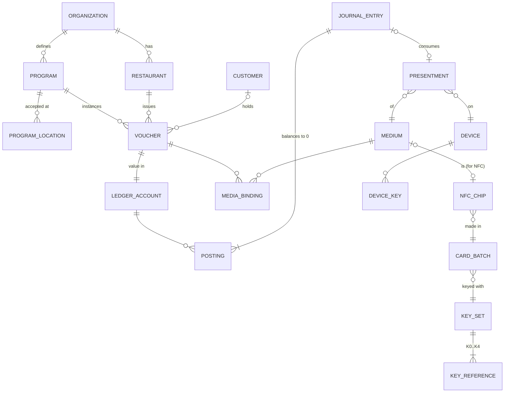

### 4.3 Why each split exists

- **Voucher ↔ medium, many-to-many over time (`media_bindings`).**
  - One voucher has a card, a QR and a wallet pass at the same time.
  - One card can later carry a voucher **and** a loyalty account (two account types, one binding each).
  - A card can be reused after its voucher is closed.
  - The binding history answers "which card was this voucher on, when?" without touching money.
- **Medium ↔ chip (`media.chip_id`).**
  - A chip exists from the factory, before any voucher. It has manufacturing, key and stock history.
  - A *medium* is the credential role that chip plays once it is bound. Keeping them apart lets inventory, personalisation and logistics work without inventing a voucher.
- **Voucher ↔ ledger account.**
  - The voucher is a product object: status, expiry, customer, program.
  - The ledger account is an accounting object: unit, balance, sequence.
  - Loyalty points reuse the same ledger with unit `points` and the same credentials; only a new account table is added.
- **Organisation ↔ restaurant ↔ program.**
  - A single restaurant is an organisation with one restaurant.
  - A chain is one organisation with many restaurants and one program accepted at all of them.
  - A franchise with separate books is several organisations and settlement between them, which is why the ledger is double-entry.

---

## 5. Database redesign

MySQL 8, as today. UUID primary keys, minor units for money, UTC timestamps with microseconds on money tables. The schema is built in its final form (ADR-002).

### 5.1 Tenancy

```text
organizations                       NEW
  id uuid pk
  name varchar(160)
  kind enum(single, chain, franchise_group)
  status enum(active, suspended, closed)
  settlement_mode enum(none, per_restaurant)      -- chains: which restaurant carries the liability
  created_at, updated_at

restaurants                         CHANGED
  + organization_id uuid fk NOT NULL
  (everything else unchanged)

programs                            NEW  (what a voucher "is")
  id uuid pk
  organization_id uuid fk
  kind enum(stored_value, loyalty, membership, stay_package)
  name varchar(120)
  unit char(3) | 'PTS'                            -- EUR, or points for loyalty
  acceptance enum(issuing_restaurant, organization, listed_locations)
  vat_voucher_type enum(single_purpose, multi_purpose)     -- EU 2016/1065
  expiry_policy json                              -- default {"type":"none"}; see A11
  min_spend_assurance tinyint                     -- default 3 (live chip) for card vouchers
  view_link_spend_allowed bool default false      -- A3
  limits json                                     -- min/max value, max balance, daily spend per voucher
  created_at, updated_at
  unique(organization_id, name)

program_locations                   NEW
  program_id, restaurant_id, pk(program_id, restaurant_id)
```


### 5.2 Accounts: the voucher

`gift_cards` stays the voucher table. Renaming the table would touch every query for no security gain. The PHP model gets a `Voucher` name, and the table can be renamed in the final clean-up if wanted.

```text
gift_cards  (= vouchers)            CHANGED
  + organization_id uuid fk NOT NULL
  + program_id uuid fk NOT NULL
  + ledger_account_id uuid fk UNIQUE NOT NULL
  + min_spend_assurance tinyint NULL              -- per-voucher override of the program, audited
  + sale_payment_id uuid fk NULL                  -- payment record of the sale (cash/POS/online)
  + lock_version int unsigned default 0           -- optimistic concurrency for status changes
  status: + pending_payment, pending_approval, awaiting_medium, cancelled, closed   (existing values kept)
  restaurant_id                                   -- meaning: issuing restaurant (unchanged column)
  card_number                                     -- meaning: voucher REFERENCE number (A8), unchanged format
  balance, initial_value, total_*                 -- now a PROJECTION of the ledger account (§5.3)

  not part of the final schema:
  public_token, nfc_tag_type, nfc_uid, nfc_uid_active, nfc_written_at, nfc_verified_at,
  nfc_locked, nfc_read_counter, replaced_by_id, replaces_id
```

### 5.3 Ledger

```text
ledger_accounts                     NEW
  id uuid pk
  organization_id uuid fk
  owner_type enum(voucher, restaurant, organization, platform)
  owner_id uuid
  purpose enum(voucher_liability, sales_clearing, redemption_clearing,
               breakage, interlocation_settlement)
  unit char(3)
  balance bigint                                  -- projection, updated with each posting
  last_seq bigint unsigned default 0
  status enum(open, frozen, closed)
  unique(owner_type, owner_id, purpose)

journal_entries                     NEW  (append-only; UPDATE/DELETE revoked at DB level)
  id uuid pk
  organization_id uuid fk
  restaurant_id uuid fk                           -- where it happened
  type enum(sale, redemption, reload, transfer, reversal, expiry, breakage,
            settlement)                                 -- no free-form adjustment (I-1)
  idempotency_key varchar(100)
  presentment_id uuid fk NULL UNIQUE              -- I-1: one presentment, one debit
  override_id uuid fk NULL UNIQUE
  payment_id uuid fk NULL
  reverses_entry_id uuid fk NULL UNIQUE           -- an entry can be reversed once
  actor_user_id, device_id, request_id, ip_address
  memo varchar(500)
  created_at timestamp(6)
  chain_seq bigint unsigned                       -- per organisation
  prev_hash binary(32), entry_hash binary(32)     -- SHA-256 over canonical entry + postings + prev_hash
  unique(organization_id, idempotency_key)
  unique(organization_id, chain_seq)

postings                            NEW  (append-only)
  id uuid pk
  journal_entry_id uuid fk
  ledger_account_id uuid fk
  amount bigint                                   -- signed; Σ per entry = 0 (checked in code + nightly)
  account_seq bigint unsigned                     -- = ledger_accounts.last_seq + 1 under row lock
  balance_after bigint
  unique(ledger_account_id, account_seq)          -- no lost update, no double posting

gift_card_transactions              the per-voucher ledger (v2 keeps it as the append-only ledger; see the v2 architecture R6)
                                    (same columns the dashboard, exports and history use today)
```

**A redemption of €12.50 at restaurant B for a chain voucher sold at A** is one entry with four postings:
- voucher −1250;
- B redemption clearing +1250;
- and, if the chain settles per restaurant, the interlocation settlement accounts of A −1250 and B +1250.

The entry balances to zero. The two unlabelled postings are what a chain's accountant needs, and what today's single-entry table cannot express.

MySQL has no deferred constraints. "Σ = 0" is enforced by:
- the only code path that writes (a `Ledger::post()` service, unit-tested);
- a trigger that rejects `UPDATE`/`DELETE`;
- a nightly verifier that recomputes balances and the hash chain and raises a risk event on any difference.

### 5.4 Credentials

```text
media                               NEW
  id uuid pk
  organization_id uuid fk
  type enum(nfc_ntag424, qr_rotating,
            reference_number, wallet_apple, wallet_google, mobile_credential)
  status enum(provisioned, active, suspended, revoked, retired)
  assurance_max tinyint                           -- highest level this medium can reach (§7.1)
  chip_id uuid fk NULL UNIQUE                     -- nfc_* only
  secret_hash binary(32) NULL UNIQUE              -- SHA-256 of a 256-bit secret (printable QR, rotating QR seed id, wallet)
  secret_version tinyint NULL                     -- format version of the secret
  label varchar(60)                               -- "Card ••42A1", "Apple Wallet"
  created_by, created_at
  revoked_by, revoked_at, revoke_reason enum(lost, stolen, damaged, replaced, fraud, closed, other), revoke_note
  last_presented_at

media_bindings                      NEW
  id uuid pk
  medium_id uuid fk
  account_type enum(voucher, loyalty, membership)
  account_id uuid
  role enum(spend, view)
  bound_at, bound_by, bound_device_id, bind_presentment_id uuid fk NULL  -- NFC binding needs a presentment
  unbound_at NULL, unbound_by NULL, unbind_reason NULL
  active_key varchar(80) GENERATED AS (IF(unbound_at IS NULL, CONCAT(medium_id, ':', account_type), NULL)) STORED
  unique(active_key)                              -- I-5
  index(account_type, account_id, unbound_at)

voucher_views                       NEW  (view-only guest links; never accepted by spending endpoints)
  id uuid pk, gift_card_id uuid fk, token_hash binary(32) UNIQUE, created_at, revoked_at
```

### 5.5 Physical inventory

```text
card_batches                        NEW
  id uuid pk
  batch_code char(6) UNIQUE                       -- base32, printed in the tap URL path (§6.3)
  organization_id uuid fk NULL                    -- NULL = platform stock
  key_set_id uuid fk
  url_template varchar(120)                       -- usually https://t.giftcardpro.at/{b}; custom per chain
  quantity int
  supplier varchar(120), supplier_order_ref varchar(80)
  personalization_method enum(in_house_station, manufacturer)
  status enum(planned, keys_released, personalizing, delivered, accepted, rejected,
              in_service, retired, compromised)
  manifest_sha256 binary(32) NULL                 -- manufacturer's signed UID manifest
  acceptance_report json NULL                     -- sample test results (§8.4)
  accepted_by, accepted_second_by, accepted_at    -- dual control
  created_at, updated_at

nfc_chips                           NEW
  id uuid pk
  uid binary(7) UNIQUE                            -- globally unique; the physical identity
  chip_type enum(ntag424_dna, ntag213, ntag215, ntag216)
  batch_id uuid fk
  key_set_id uuid fk NULL
  personalization_status enum(blank, in_progress, personalized, failed, quarantined, destroyed)
  originality_sig varbinary(56) NULL              -- NXP ECC signature (secp224r1), verified at intake
  originality_verified_at NULL
  sdm_counter bigint unsigned NULL                -- last accepted SUN counter (I-6)
  sdm_counter_at NULL
  stock_status enum(central, in_transit, in_stock, bound, returned, lost, destroyed)
  stock_organization_id uuid fk NULL
  stock_restaurant_id uuid fk NULL
  personalized_at, personalized_station_id
  created_at, updated_at

stock_movements                     NEW  (append-only)
  id, chip_id NULL, batch_id NULL, from_owner, to_owner, quantity, kind(ship, receive, return,
  write_off, count_correction), actor, device, created_at, note

personalization_sessions            NEW  (journal that makes interrupted personalisation recoverable)
  id uuid pk
  chip_uid binary(7), batch_id, station_device_id, operator_user_id
  step enum(select, originality, auth_default, write_ndef, file_settings,
            change_k1, change_k2, change_k3, change_k4, change_k0, verify_sun, verify_live, done)
  status enum(running, done, failed, abandoned)
  error_code varchar(40) NULL, apdu_count int, started_at, finished_at
```

### 5.6 Keys (metadata only, never key material)

```text
key_sets                            NEW
  id uuid pk
  version smallint UNIQUE                         -- also written as the key version byte on the card
  derivation enum(an10922_v1)
  status enum(pending_ceremony, active, verify_only, retired, compromised)
  provider enum(aws_cloudhsm, azure_managed_hsm, gcp_cloud_hsm, onprem_hsm, envelope_kms)
  created_at, activated_at, retired_at, compromised_at, ceremony_id

key_references                      NEW
  id uuid pk
  key_set_id uuid fk
  slot enum(k0_app_master, k1_sdm_meta_read, k2_sdm_mac, k3_live_auth, k4_reserved)
  scope enum(root_diversified, per_batch)         -- K1 is per batch (A9)
  batch_id uuid fk NULL                           -- for per_batch keys
  hsm_key_label varchar(200)                      -- HSM handle/label or KMS key URI; NOT the key
  kcv char(6)                                     -- key check value (first 3 bytes of AES(K, 0^16)), industry practice
  unique(key_set_id, slot, batch_id)

key_ceremonies                      NEW
  id, kind(generate, export_to_manufacturer, rotate, destroy), performed_at,
  custodian_1, custodian_2, witness, hsm_audit_ref, script_sha256, minutes_document_ref
```

### 5.7 Presence

```text
presentments                        NEW
  id uuid pk
  organization_id, restaurant_id, device_id, user_id
  purpose enum(spend, bind, verify, view)
  method enum(live_auth, sun, rotating_qr, static_qr, wallet_barcode)
  assurance tinyint                               -- achieved level (§7.1)
  medium_id uuid fk NULL, chip_id uuid fk NULL
  rf_uid binary(7) NULL                           -- what the phone's RF layer saw
  sdm_counter bigint unsigned NULL
  challenge_ref varchar(64) NULL                  -- key into the crypto service's challenge cache (never RndA itself)
  status enum(challenge_issued, verified, consumed, expired, rejected)
  reject_reason varchar(40) NULL
  expires_at timestamp(6)                         -- verified + 60 s
  consumed_at NULL, consumed_by_entry_id NULL
  risk_score smallint NULL
  created_at timestamp(6)
  index(restaurant_id, created_at), index(medium_id, created_at)

override_authorizations             NEW
  id uuid pk, gift_card_id, restaurant_id, requested_by, approved_by NULL,
  step_up_proof_id, reason enum(card_damaged, chip_unreadable, phone_nfc_broken, other),
  note varchar(300), max_amount bigint, expires_at, consumed_at, created_at
```

### 5.8 Devices and security (from the 20-point document, restated for completeness)

```text
devices          + role enum(pos, issuing, personalization_station), + attestation_status, + approved_by
device_keys      NEW  device_id, public_key (P-256), attestation_format(play_integrity, app_attest, none),
                      attested_at, revoked_at
audit_logs       + chain_seq, prev_hash, entry_hash; UPDATE/DELETE revoked
risk_events      NEW  (rule, severity, subject, context json, status, handled_by)
security_policies NEW  per organisation/restaurant, versioned json with safe defaults
```

### 5.9 Database-level protections

| Protection | How |
|---|---|
| Append-only tables | `journal_entries`, `postings`, `audit_logs`, `stock_movements`: triggers that `SIGNAL` on UPDATE/DELETE, and the application DB user has no UPDATE/DELETE grant on them. Migrations run with a separate DDL user. |
| Least privilege | Three DB users: `app` (DML), `migrator` (DDL, CI only), `reporting` (read-only replica). |
| PII encryption | Customer e-mail, name and phone are encrypted at the application level (envelope encryption with a KMS data key), with a blind-index HMAC for search. A leaked DB or backup yields no readable PII. |
| Backups | Encrypted with a KMS key held in a **separate** cloud account or project. Restores are tested monthly. Object-lock (WORM) retention for 35 days against ransomware. |
| No secrets | The DB holds hashes (media secrets, view tokens), HSM labels and KCVs only. A full dump cannot create a working card or QR. |

---

## 6. Cryptographic architecture

### 6.1 Keys on the card

NTAG 424 DNA has five AES-128 application keys, each with a one-byte version **[NXP]**. The assignment:

| Slot | Name | Used for | Derivation | Who ever uses it |
|---|---|---|---|---|
| K0 | AppMasterKey | Change keys and file settings. Nothing else. | AN10922 per card, from the K0 root via the batch | Personalisation station / manufacturer, re-keying of returned cards |
| K1 | SDM meta-read | Encrypts the UID + counter in the SUN URL | **Per batch** (A9). The server must decrypt before it knows the UID. | Crypto service (SUN verify) |
| K2 | SDM file-read (MAC) | Session key for the SUN MAC | AN10922 per card | Crypto service (SUN verify) |
| K3 | Live authentication | `AuthenticateEV2First` at the till and at binding (§7.2). Also counter retrieval (`SDMCtrRet`). No write rights. | AN10922 per card | Crypto service (live auth) |
| K4 | Reserved | Nothing today. Personalised to a diversified random value, **never left at transport zeros**. | AN10922 per card | Nobody |

- **Why a separate K3 instead of reusing K0.** The key used hundreds of times a day at tills must not be the key that can rewrite the card. If K3 of a batch leaks, an attacker can pass live authentication as those cards, but cannot change or disable them.
- **Key version byte.** Every key gets `key_sets.version & 0xFF`. Stations and acceptance tests read it back with `GetKeyVersion` to confirm the key set **[NXP]**.
- **Not enabled** (D1):
  - LRP (irreversible, and SUN verification must then use LRP);
  - Random ID (irreversible; breaks UID binding and derivation);
  - `SDMReadCtrLimit` (a stranger can tap a card to death);
  - the failed-authentication counter limit, because anyone with a phone could then lock our K3 by sending wrong answers. AES-128 does not need a lock-out against brute force. **[Assessment; confirm the exact option names against datasheet §9 in the spike]**

### 6.2 Files and access rights

Access rights are written `Read / Write / ReadWrite / Change`. `E` = free access, `F` = never, digits = key number **[NXP]**.

| File | Content | Access rights | CommMode | SDM |
|---|---|---|---|---|
| E1 CC | Capability container | factory default, `E / 0 / 0 / 0` | Plain | — |
| E2 NDEF | SUN URL template | **`E / 0 / 0 / 0`**. Anyone can read; only K0 can write. This closes G12 by design. | Plain (required for passive reads) | On: UID + counter mirror **encrypted** (`SDMMetaRead` = 1), MAC (`SDMFileRead` = 2), `SDMCtrRet` = 3, no `SDMENCFileData`, no read-counter limit |
| E3 Proprietary | 128 bytes, unused | `3 / 0 / 0 / 0` | Full | — |

### 6.3 The SUN URL

```text
https://t.giftcardpro.at/{b}?e={PICC 32 hex}&m={MAC 16 hex}
                         └┬┘   └──── mirrored by the chip on every read ────┘
                    batch code (6 × base32)
```

- **Size.** `https://` is compressed into the NDEF URI prefix, so the payload is about 77 bytes, well within the 256-byte NDEF file **[Assessment]**.
- **No identifier in the URL except the batch.** The card is identified by the UID inside `e` after decryption, never by a token that can be copied (fixes G4 for 424 cards).
- **MAC input.** `SDMMACInputOffset` points at `{b}`. The MAC therefore covers the batch code, `?e=`, the encrypted PICC data and `&m=`, not only the session key's UID and counter. Today's code MACs an empty input (`CardScanService.php:116` calls `verify()` without a MAC input; default `''` at `Ntag424SunVerifier.php:53`), which AN12196 allows but which binds less. **[NXP AN12196 §3]**
- **Domain.** A dedicated tap domain that never changes (A14). A chain's own domain is a batch property (`card_batches.url_template`), and the server accepts all registered templates.
- **Guest behaviour.** On a guest's phone the URL opens the balance page (A0) and never a spending function.

### 6.4 Key derivation (NXP AN10922), frozen

**Two levels.** The manufacturer receives batch keys, never roots. A leak at a manufacturer is limited to one batch.

```text
Root_slot            (HSM, never exported; one per slot K0, K1, K2, K3, K4 and per key set)
  │  AN10922-AES128(Root_slot,  M1 = "GCPB" ‖ batch_code(6 ASCII) ‖ slot(1))          [11 bytes]
  ▼
Batch_slot           (exported only to the personalising manufacturer, under key exchange)
  │  AN10922-AES128(Batch_slot, M2 = UID(7) ‖ D2760000850101(7) ‖ "GCP" ‖ keyset_version(2))  [19 bytes]
  ▼
Card_slot            (K0, K2, K3, K4 on the chip; K1 = Batch_K1 directly)
```

- **AN10922-AES128(K, M)**, as specified in AN10922 §2.2 **[NXP AN10922]**:
  1. `D = 0x01 ‖ M`;
  2. because D is shorter than 32 bytes, pad it to **32 bytes** with `0x80 00 … 00`;
  3. XOR the last 16-byte block with the CMAC subkey **K2** (derived from `L = AES(K, 0¹²⁸)` as in SP 800-38B);
  4. AES-CBC-encrypt the two blocks with a zero IV;
  5. the last ciphertext block is the diversified key.
- **This is not a standard `AES-CMAC(K, 0x01 ‖ M)` call.** A library or HSM CMAC would pad to 16 bytes, which gives a different result. So an HSM's `CKM_AES_CMAC` cannot produce it directly: it is composed from AES-ECB (for L) and AES-CBC. The AN10922 test vectors catch any mistake here.
- **Test vectors.** The implementation must reproduce the AN10922 example vectors before any other test, and AN12196's SUN vectors for the verification path. Both become CI tests.
- **Specification for manufacturers.** M1 and M2 go into a one-page "GiftCard Pro diversification profile", with our own test vectors, so any AN10922-capable personaliser (SAM AV3 included) produces identical keys.
- **No per-card key storage.** Keys are recomputed on demand. The database never holds them, so a leaked database or backup contains nothing to clone with. Interrupted personalisation is also recoverable, because both the old and the new key of any chip can be recomputed (§8.7).
- **No earlier cards exist.** Every card is personalised with AN10922 keys by the platform (ADR-002). The `.env` keys used during development are removed in Phase 1.

### 6.5 Key versions and rotation

| Event | Action |
|---|---|
| Normal operation | One active key set. New batches use it. Each batch has its own batch keys anyway. |
| Scheduled rotation | New key set every **12 months or 50 000 cards**, whichever comes first, and whenever a custodian leaves **[Assessment]**. The old key set becomes `verify_only` and stays until no active medium uses it. |
| Manufacturer suspected leak | That **batch** → `compromised`. Its taps are capped at A1 and cannot spend (§7.2, check 1); they prove possession for a swap. A risk event fires on every tap, and a swap campaign starts: at the next visit a manager binds a new card (one tap) and revokes the old one. Guests with an e-mail are invited proactively. |
| K3 or K2 root suspected leak | The whole key set → `compromised`, the same measures for all its batches, plus an emergency new key set. |
| K1 (meta-read, per batch) leak | Privacy incident only (UIDs and counters readable from URLs). Authenticity is intact. Documented and reported, no card swap. |
| Returned card re-keying | A station authenticates with the old K0, changes all keys to the new set, re-applies the file settings and updates `nfc_chips.key_set_id`. Re-enabling SDM through `ChangeFileSettings` resets the counter to 0 **[NXP]**; changing keys alone does not. The station therefore resets `sdm_counter` in the same session. |

### 6.6 Where keys live: tiers and the crypto service

**The crypto service** is a small separate service (its own container, host identity and deploy pipeline) with **no database access**. The Laravel app calls it over mTLS.

**Operations it offers, the only ones:**

```text
sun.verify(key_set, e, m, mac_input)                  → {uid, counter} | invalid
auth.begin(uid, key_set, e_rndb)                      → {challenge_ref, apdu}        (RndA stays inside)
auth.finish(challenge_ref, card_response)             → ok | invalid                 (single use, 30 s)
perso.*   (separate identity: personalisation stations only, per approved batch job)
export.batch_keys(batch, recipient_key)               (ceremony only; two approvals)
```

- **Deliberately missing:** any "derive and return a key", any bulk operation, any access to roots.
- **Controls:**
  - each operation is rate-limited per caller and per chip;
  - every call is logged to a sink the web app cannot write to;
  - a verify-rate anomaly (for example 10 000 `auth.begin` calls per hour against normal traffic) pages the on-call.
- **What this buys:** a compromised Laravel server can still *use* verification (it could approve fake presentments in its own database; see T-11), but it cannot *take* keys away. Cloning cards therefore stays impossible even after a full web-server compromise.

**Tiers of key protection** (all behind the same crypto-service API, so moving up a tier is a configuration and ceremony, not a redesign):

| Tier | Where roots live | Where card keys exist | Providers | Use |
|---|---|---|---|---|
| **T1 Envelope** | Encrypted under a cloud KMS key; decrypted into crypto-service memory at start (locked memory, no swap, no core dumps) | Crypto-service memory | AWS KMS, Azure Key Vault, Google Cloud KMS | Development and staging only |
| **T2 HSM roots** | HSM, non-extractable | Derived via HSM CMAC, then briefly in crypto-service memory and wiped after each operation | **Google Cloud HSM**: raw AES-CBC with caller IV on *imported* keys, which composes AES-CMAC **[GCP]**. Azure Managed HSM offers AES-CBC, IV handling to confirm **[Azure]**. | **Minimum for production** |
| **T3 All in HSM** | HSM | Only as non-extractable HSM session objects; nothing in memory | AWS CloudHSM lists `CKM_AES_CMAC`, `CKM_AES_ECB`/`CBC` and `CKM_SP800_108_COUNTER_KDF` **[AWS]**. AN12196's SUN session-key derivation is an SP 800-108 counter-mode CMAC construction. AN10922's 32-byte padding with subkey K2 is **not** a plain CMAC (§6.4), so keeping its output non-extractable needs either a KDF configuration that reproduces it or vendor firmware. To be proven in a spike. | Target for enterprise customers |

**Honest limits of the tiers:**
- **ChangeKey cryptograms.** For a key other than the one used to authenticate, personalisation computes `(new ⊕ old) ‖ version ‖ CRC32(new)`, using the datasheet's CRC32 variant (JAMCRC, no final inversion). For the authenticating key (K0) it sends `new ‖ version`. Both are then encrypted under the session key **[NXP]**. Standard PKCS#11 cannot do this with non-extractable keys. Personalisation is therefore at T2 level even in a T3 deployment. The alternatives are an HSM with custom firmware (vendor SDKs) or NXP's SAM AV3 in the station or at the manufacturer. This is acceptable because personalisation happens in a controlled room, not at tills.
- **AWS KMS is not on the list** as a root store for card keys: no CMAC, no raw AES **[AWS]**. AWS Payment Cryptography offers CMAC **[AWS]**, but its key derivations are payment-specific (DUKPT, EMV), not AN10922.
- **Hosting.** AWS CloudHSM is reachable only from inside an AWS VPC, so a T3 crypto service must run there. Google Cloud HSM and Azure Managed HSM are reached through their public APIs, so T2 works with the current Coolify hosting.
- **Cost** differs by an order of magnitude:
  - Google Cloud HSM is billed per key version (about $1/month) plus $0.03–0.15 per 10 000 operations **[GCP]**;
  - CloudHSM is billed per HSM-hour, and high availability needs two HSMs **[AWS; confirm current price]**.

**Recommendation.**
- **Pilot and first production: T2 on Google Cloud HSM**, EU region, roots imported from a ceremony (§6.7).
- **Enterprise tier:** T3 on AWS CloudHSM or an on-premises HSM, after the spike.
- **T1:** never in production.

### 6.7 Key ceremony (banking practice: dual control, split knowledge)

1. **Generation.** On an air-gapped, freshly installed laptop (or inside the HSM at T3), two custodians generate each root as two XOR components. No single person ever sees a full root.
2. **KCV.** Each root and each component gets a key check value (3 bytes of `AES(K, 0¹²⁸)`). KCVs are recorded in `key_references.kcv` and in signed minutes.
3. **Import.** The components are imported into the HSM using the provider's key-import wrapping. Import is verified by comparing the KCV computed in the HSM.
4. **Storage.** Paper or smart-card components go into tamper-evident bags, in two different safes held by different people.
5. **Destruction.** The laptop disk is destroyed or securely wiped. This is recorded in `key_ceremonies`.
6. **Exporting batch keys to a manufacturer:**
   - batch keys (never roots) are wrapped with the manufacturer's HSM public key (RSA-OAEP ≥ 3072 or ECDH-derived);
   - or sent as two components to two named manufacturer custodians;
   - the manufacturer confirms the KCVs;
   - the contract requires a key destruction certificate after the batch.
7. **Every ceremony has a script** (hash stored) and a witness.

---

## 7. Presence: proving a genuine credential was here, now

### 7.1 Assurance levels

| Level | Name | What it proves | Methods |
|---|---|---|---|
| **A3** | Live chip | A genuine, correctly personalised chip answered a **server-chosen** random challenge in the last seconds, on this device | NTAG 424 live authentication (K3) via the waiter app on **Android and iPhone**. Future: mobile credential with a device key. |
| **A2** | Dynamic | A genuine chip (or the holder's session) produced a **fresh, never-used** value, but the reader did not choose it | NTAG 424 SUN with RF-UID match (Web NFC dashboard, fallbacks); rotating QR (guest page, Google Wallet rotating barcode **[Google]**) |
| **A1** | Static | Someone knows or copied a value | Static printable QR, Apple Wallet barcode (static) |
| **A0** | View | Nothing; may only view | Guest view links (`voucher_views`), a SUN tap on a guest's phone |

**Default policy** (per program; stricter per voucher possible, looser only with owner rights and an audit entry):

| Voucher sold as | Spend on waiter app | Spend on web dashboard | Guest links |
|---|---|---|---|
| NTAG 424 card | **A3**, up to €250 per transaction and €500 per voucher per day (policy) | A2, up to €50 per transaction and **€100 per voucher per day** | A0 |
| Digital (e-mail/wallet) | A2 (rotating QR) | A2 | A0 plus the rotating QR |

### 7.2 Live authentication (A3): the protocol

The phone is a relay. It never sees a key or RndA, and the card can be removed after one server round trip.

| # | Where | Bytes | Notes |
|---|---|---|---|
| 1 | Phone → card | `00 A4 04 00 07 D2 76 00 00 85 01 01 00` | ISOSelectFile by DF name (the NDEF application) **[NXP]** |
| 2 | Phone → card | ISOSelectFile EF E104 `00 A4 00 0C 02 E1 04 00`, then ISOReadBinary `00 B0 00 00 00` (or native `ReadData` `90 AD` on file 02) | Gets the SUN URL. Selecting the application alone does not select the NDEF file. Optional for A3, but it is used for the counter and risk checks. |
| 3 | Phone → card | `90 71 00 00 02 03 00 00` | AuthenticateEV2First, key 3, no capabilities → card answers `E(K3, RndB)` (16 bytes) + `91 AF` |
| 4 | Phone → server | `POST /v1/presentments` with the RF UID, the SUN URL and the 16 bytes | **The only round trip while the card must stay in the field** |
| 5 | Server | `auth.begin`: derive K3(UID), decrypt RndB, draw RndA (CSPRNG), build `E(K3, RndA ‖ RndB⋘1)` | RndA stays in the crypto service under `challenge_ref`, valid 30 s |
| 6 | Server → phone | `90 AF 00 00 20 ‖ 32 bytes ‖ 00` | The APDU to forward |
| 7 | Phone → card | that APDU → card answers `E(K3, TI ‖ RndA⋘1 ‖ PDcap2 ‖ PCDcap2)` (32 bytes) + `91 00` | **The card may now leave the field** |
| 8 | Phone → server | `POST /v1/presentments/{id}/complete` with the 32 bytes | |
| 9 | Server | `auth.finish`: decrypt, compare RndA⋘1 in constant time, single use | Presentment → `verified`, A3, expires in 60 s |

**What the server checks** (all must pass, in this order, each with a distinct reject reason):

1. The chip is in `nfc_chips` and `personalized`, its batch is `in_service` and its key set is `active` or `verify_only`. **Exception:** a chip whose batch or key set is `compromised` is still verified, but the presentment is capped at **A1** and marked `compromised_batch`. It can be used only to prove possession for a swap (§9.3), never to spend.
2. Live authentication succeeds (steps 5–9), using the UID **from the registry** for derivation. A phone that lies about the UID simply fails authentication.
3. RF UID = registry UID. This catches Android HCE emulation, which presents a random UID.
4. If a SUN URL was read in the same tap:
   - it verifies;
   - its UID equals the RF UID;
   - its counter is greater than `nfc_chips.sdm_counter`, updated by compare-and-set (I-6).
5. The chip's medium is `active` and bound (`role = spend`) to a voucher whose program is accepted at this restaurant, and the voucher is `active`.
6. The device is enrolled for this restaurant and not revoked. The user has `cards.scan`.
7. Risk rules (§12.7) do not block.

Why this defeats skimming and pre-play: a recorded or skimmed exchange contains `E(K3, …)` values for a challenge the server will never issue again. Without K3 no one can answer a new RndA.

What it does not defeat: a **live relay**, meaning an attacker's reader next to the victim's card, connected in real time to an emulator held against the waiter's phone. NTAG 424 has no proximity check (DESFire EV3 has one) **[NXP]**. See T-6 for the mitigations and the residual risk.

### 7.3 SUN (A2): the checks

1. The batch code exists and its key set is usable.
2. Decrypt PICC data with the batch's K1. The tag byte must show UID and counter mirroring, with a 7-byte UID.
3. Recompute the MAC with K2(UID) over the configured MAC input and compare in constant time.
4. When the reader provides an RF UID (the waiter app and Android Web NFC do; a guest's iPhone does not): RF UID = PICC UID (G8).
5. Counter compare-and-set on `nfc_chips.sdm_counter`.
6. Medium, binding, voucher and program checks as in §7.2 (5–7).

**Counter gaps are normal:** every read by anyone, including the guest's own phone, increments the counter. Only non-increasing values are rejected.

### 7.4 From presentment to money

```text
POST /v1/vouchers/{voucher}/redemptions   Idempotency-Key: …
{ "amount": 1250, "presentment_id": "…", "reference": "Table 12" }
```

In one database transaction:

1. `SELECT … FOR UPDATE` the presentment. It must be:
   - `verified`, not expired;
   - `purpose = spend`;
   - the same device, user and restaurant as the request;
   - of assurance ≥ the voucher's spending minimum;
   - for a medium bound to **this** voucher.
2. `SELECT … FOR UPDATE` the voucher's ledger account. Check status, expiry, balance and limits.
3. Post the journal entry (`presentment_id` has a unique index; this is I-1).
4. Mark the presentment `consumed` with the entry id.
5. Commit.

Behaviour at the edges:
- **Same idempotency key again:** the original result is returned. This is safe after a lost response.
- **Same presentment with another key:** `409 PRESENTMENT_CONSUMED`.
- **Two payments at one table:** tap again. One presentment pays once. This is deliberate: it keeps "one tap = one debit" true, and the tap is fast.

### 7.5 Overrides (no silent bypass; see assumption A2)

When the chip cannot be read (card cracked, phone's NFC broken), a **manager** may authorise one debit.
- **Required:** step-up authentication (device-bound biometric or server-verified PIN), a reason code, and the voucher found by reference number or QR.
- **Limits:**
  - maximum amount per override (default €50);
  - a count per voucher per 30 days (default 2);
  - a count per restaurant per day (default 5);
  - above the amount limit, a **second person** approves (four-eyes, from the 20-point document).
- **Effects:**
  - a `risk_event` every time and an owner digest;
  - the voucher is flagged "card needs replacement";
  - the app offers binding a new card right away.
- **Never** available to waiters, API tokens or the web dashboard without step-up.

### 7.6 Performance budget

| Step | Estimate **[Assessment; measure in Phase 4]** |
|---|---|
| Select + read NDEF + Auth part 1 (card) | 40–80 ms |
| Server round trip (mobile network) + 2–3 HSM calls | 100–350 ms |
| Auth part 2 (card) | 15–30 ms |
| Card in the field, total | **≈ 0.2–0.5 s**; p95 target < 0.8 s |
| Completion call (card already removed) | 80–250 ms, hidden behind the success animation |

If the card leaves the field too early, the app says "hold the card a little longer" and starts a new presentment. The server never reuses a half-finished challenge.

---

## 8. Provisioning

### 8.1 Roles and separation of duties (I-11)

| Role | Who | Can | Cannot |
|---|---|---|---|
| Key custodian (2+) | Named platform staff | Take part in ceremonies | Personalise, create vouchers |
| Personalisation operator | Platform staff or manufacturer staff | Run approved batch jobs on an enrolled station | Create batches, approve their own batch, create vouchers |
| Batch approver (2) | Platform admins | Create batches, release keys to a job or manufacturer, accept or reject a batch | Operate a station for that batch |
| Stock manager | Platform, or chain head office | Ship stock to restaurants | Personalise, bind |
| Restaurant manager/owner | Restaurant | Receive stock, bind cards to vouchers, revoke media | Anything cryptographic |

### 8.2 Personalisation station (in-house, pilot and small batches)

- **Hardware:** a dedicated Android phone with NFC, or a PC with a USB PC/SC reader (for example ACR1252U or an NXP-based reader) running the station app.
  - The device is enrolled with role `personalization_station`, a hardware-backed key and attestation. Two admins approve it.
  - It lives in an office, not a restaurant.
- **Software:** the station app is a relay plus a UI. It holds no keys.
  - The server's `perso.*` operations build every APDU, including secure messaging (CMAC and encryption under the session keys), and verify every response.
- **Job model:** a batch approver creates a *personalisation job* (batch, quantity, key set) and a second approver releases it. Only then does the crypto service accept `perso.*` calls for that batch, and only from the stations named in the job.
- **Throughput:** about 2–4 s per card including verification (**[Assessment]**), so a few hundred cards per hour with one operator.

**Steps per card** (each step recorded in `personalization_sessions`):

1. **Select and read.** Select the application; RF UID; `GetVersion`. The chip must be an NTAG 424 DNA, not another chip type.
2. **Originality.** `Read_Sig` → verify the ECC signature with NXP's published public key (secp224r1, AN12196 §7.2) **[NXP]**. Counterfeit or non-NXP chips are rejected here and quarantined.
3. **Transport authentication.** Authenticate with K0 = transport zeros. If that fails, the chip is not blank: try the key-set candidates (§8.7), otherwise quarantine.
4. **Write the NDEF template** with the batch URL and placeholder zeros at the `e` and `m` offsets.
5. **`ChangeFileSettings` on E2**: SDM on, offsets, SDM keys, access rights `E/0/0/0` (§6.2). The *command* is sent in CommMode Full; the file itself stays Plain.
6. **`ChangeFileSettings` on E3**: `3/0/0/0`, file CommMode Full.
7. **`ChangeKey` K1, K2, K3, K4** (`new ⊕ old ‖ version ‖ CRC32`), then **K0 last** (`new ‖ version`, because it is the authenticated key), then re-authenticate with the new K0 to prove it.
8. **Verify as an outsider:**
   - a fresh passive read gives a SUN URL, which must verify;
   - `AuthenticateEV2First` with K3 must succeed;
   - an unauthenticated write to the NDEF file must be **refused**;
   - `GetFileSettings` must match the profile.
9. **Record:** `nfc_chips` row (`personalized`, batch, key set, originality signature, counter baseline).

### 8.3 Manufacturer personalisation (volume)

1. **Contract and security review of the supplier:**
   - an HSM or SAM-based personalisation line;
   - key destruction certificates;
   - Common Criteria or GSMA SAS-UP style site security is a plus **[Assessment]**.
2. **Batch creation** (two approvers). Batch keys are exported to the supplier in a ceremony (§6.7). The supplier receives the diversification profile and our test vectors.
3. **The supplier personalises** with the same steps as §8.2, and delivers:
   - the cards;
   - a **manifest** (per card: UID, originality signature, initial counter, key version), signed with the supplier's key. Its SHA-256 goes into `card_batches.manifest_sha256`.
4. **Import:** manifest → `nfc_chips` (`personalized`, stock `central`). Duplicate UIDs, invalid originality signatures and unknown key versions fail the whole import.
5. **Acceptance test (§8.4)** before any card leaves central stock.

### 8.4 Batch acceptance test (both routes)

- **Sample:** the larger of 32 cards or 2 % of the batch, picked at random by the server **[Assessment; adjust with supplier AQL]**.
- **Per sample card:**
  - originality OK;
  - SUN verifies;
  - live authentication OK;
  - unauthenticated NDEF write refused;
  - file settings and key versions as profiled;
  - UID present in the manifest.
- **One failure rejects the batch:** it goes to quarantine and is investigated.
- **Two approvers** sign the result (`accepted_by`, `accepted_second_by`).

### 8.5 Stock and logistics

- **Cards travel without value.** A personalised, unbound card is worth nothing: it cannot be spent, and binding needs a manager account at the receiving restaurant.
- **Shipping:** stock movement `central → in_transit`, with the chip list, or a batch range for sealed packs.
- **Receiving:** the restaurant confirms receipt by tapping any one card of the pack (or scanning the pack label), then `in_stock` at that restaurant.
- **Lost or stolen pack:** mark the pack `lost`. Its chips can then never be bound. A thief holds blank plastic.
- **Chain stock:** stock can sit at the organisation (head office) and be moved between its restaurants.

### 8.6 Binding a card to a voucher (the only thing a restaurant does with a card)

A bind requires:
- **a presentment with `purpose = bind` and A3** on an issuing-enrolled device;
- the chip is `personalized`, in stock **at this restaurant** (or at its organisation, if policy allows), and not bound for this account type;
- the manager has `cards.bind` (new permission, replacing `cards.write_nfc`), plus step-up if policy says so;
- the voucher is in `pending_payment` or `active`, of a program accepted here.

This replaces trust on first use (G9): a card is never bound implicitly by a first tap.

### 8.7 Recovery and failure handling

- **Deterministic keys make every state recoverable.** For any chip, the server can compute both the transport keys and the target keys. On a re-tap after an interruption, the station tries K0 candidates in order (target, then transport), reads `GetKeyVersion` for each slot and resumes at the recorded step.
- **Anti-tearing:** writes up to 128 bytes are atomic **[NXP]**. Each ChangeKey or ChangeFileSettings either happened or did not; the journal plus re-authentication tells which.
- **A chip that fails twice** goes to `quarantined` and is not retried automatically.
- **Returned or reused cards:**
  - a card whose voucher is `closed` (balance 0, or expired and settled) can be **re-bound** to a new voucher after the old binding ends;
  - the physical card needs no re-personalisation;
  - the binding history keeps both.

---

## 9. Workflows

### 9.1 Manager: sell a card (create → attach → verify → activate)

| Step | Screen | Server |
|---|---|---|
| 1. Create | Amount, optional guest e-mail | `POST /v1/vouchers` → voucher `pending_payment` (or `pending_approval` above the four-eyes threshold). The idempotency key makes a retry safe (as in S20 today). |
| 2. Payment | "Paid in cash / by card terminal / already paid online" (+ optional POS receipt number) | `POST /v1/vouchers/{id}/payment` → `payments` row, journal entry `sale` (cash clearing → voucher liability) |
| 3. Attach + verify | "Hold a card from the box to the phone" | Presentment (bind, A3) → `POST /v1/vouchers/{id}/media` binds the chip → medium `provisioned`; it becomes `active` together with the voucher |
| 4. Activate | Automatic when 2 and 3 are done | Voucher `active`. Success: card label "••42A1", reference number, balance, receipt. |

- **Order.** Steps 2 and 3 may happen in either order. The voucher becomes spendable only when both are done.
- **Abandoned sales.**
  - An **unpaid** voucher left in `pending_payment` for 24 h becomes `cancelled`; a bound card returns to stock (binding ended).
  - A **paid** voucher without its card is in `awaiting_medium`. It is never cancelled automatically, because money was taken. The manager is reminded, and cancelling it needs a `reversal` of the sale by the owner with step-up (I-1).
- **What the manager never sees:** keys, APDUs, write or verify progress, lock options. The only NFC interaction is one tap.

### 9.2 Waiter: redeem

1. Tap the card → live authentication (§7.2) → the voucher screen: balance, status, restaurant.
2. Enter the amount → `POST /v1/vouchers/{id}/redemptions` with the presentment.
3. Success.


### 9.3 Replace a lost, stolen or damaged card

1. Find the voucher: the guest's receipt reference number, e-mail, or the old card if it is damaged.
2. Revoke the old medium (reason `lost`, `stolen` or `damaged`). From now on the old chip is refused everywhere.
3. Take a stock card and tap it: bind (§8.6).

- **Nothing happens in the ledger.** The balance, the transaction history and the reference number stay on the voucher (fixes G10).

**Protection against "swap theft".** A dishonest manager could revoke a guest's card, bind a stock card they keep, and spend with a genuine A3 presentment. Rebinding is therefore guarded:

| Situation | Rule |
|---|---|
| Old card present and readable (damaged, compromised batch) | Its presentment (any level) proves possession. The replacement is immediate. |
| Old card absent, voucher has a guest e-mail | The guest confirms via a one-time link sent to that e-mail. Until then the new card is `provisioned` but cannot spend. |
| Old card absent, no e-mail | An owner (not the same person) approves with step-up. The new card spends only up to €50 in its first 72 h. |
| Always | The guest is notified (if an e-mail exists). A risk rule fires for "rebind followed by a debit within 24 h". |

### 9.4 Guest

- **Taps own card with a phone** (iPhone background reading or Android):
  - the SUN URL opens the balance page (A0);
  - the server verifies SUN and shows balance and history, if the program allows public balance checks;
  - it offers "add to Apple Wallet / Google Wallet" as a **view** pass.
- **Digital voucher:** an e-mail with a view link. The spendable form is the rotating QR on the guest page, or a Google Wallet pass with a rotating barcode.
- **"Freeze my card"** (later): from the verified balance page, the guest can suspend the card medium.

### 9.5 Platform capability matrix

| Capability | Waiter app Android | Waiter app iPhone | Dashboard (Chrome Android, Web NFC) | Dashboard (desktop) | Guest phone |
|---|---|---|---|---|---|
| Read SUN URL | ✅ | ✅ (NDEF / ISO7816 session) | ✅ | ❌ | ✅ (background) |
| RF UID | ✅ (`Tag.getId`) | ✅ (`identifier`) | ✅ (`serialNumber`) | ❌ | — |
| Live authentication A3 (APDUs) | ✅ `IsoDep` (to build; today only `NfcA` is used) | ✅ `NFCISO7816Tag`; the AID is already declared in `Info.plist:86` **[Code]** | ❌ Web NFC has no APDU access **[Google]** | ❌ (later: a desktop reader bridge) | — |
| Bind a card | ✅ | ✅ | ❌ (needs A3) | ❌ | — |
| Redeem | ✅ A3 | ✅ A3 | ✅ A2 up to the limit | Rotating QR or override only | — |
| Personalise | Station app only | ❌ (possible, not supported) | ❌ | Station app with a PC/SC reader | — |

iPhone live authentication uses `NFCTagReaderSession` with ISO 7816 polling. `AuthenticateEV2First` over Core NFC is confirmed by NXP support **[NXP community]**. The `Info.plist` key `com.apple.developer.nfc.readersession.iso7816.select-identifiers` must list `D2760000850101`, together with the NFC tag-reading entitlement (`com.apple.developer.nfc.readersession.formats` = `TAG`) **[Apple]**. The app already has both.

---

## 10. Sequence diagrams

### 10.1 In-house personalisation (station relay)

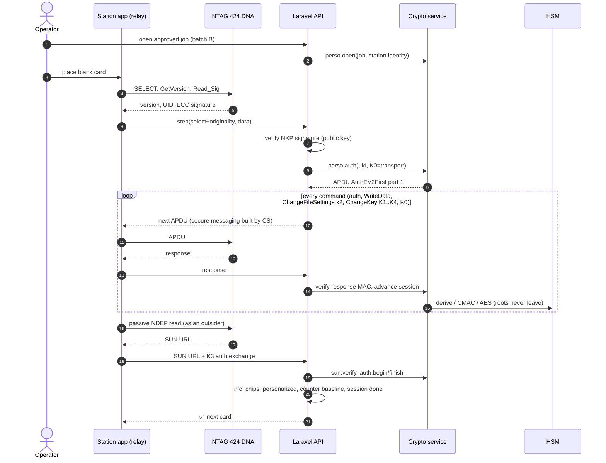

### 10.2 Manufacturer batch

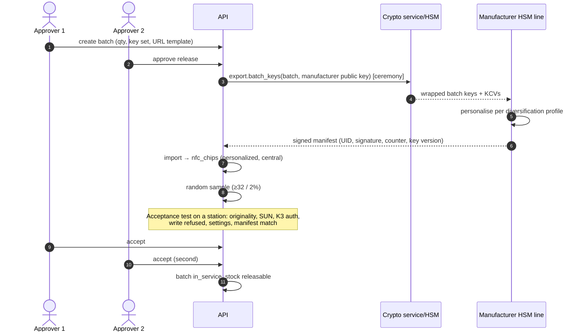

### 10.3 Sell and bind (manager)

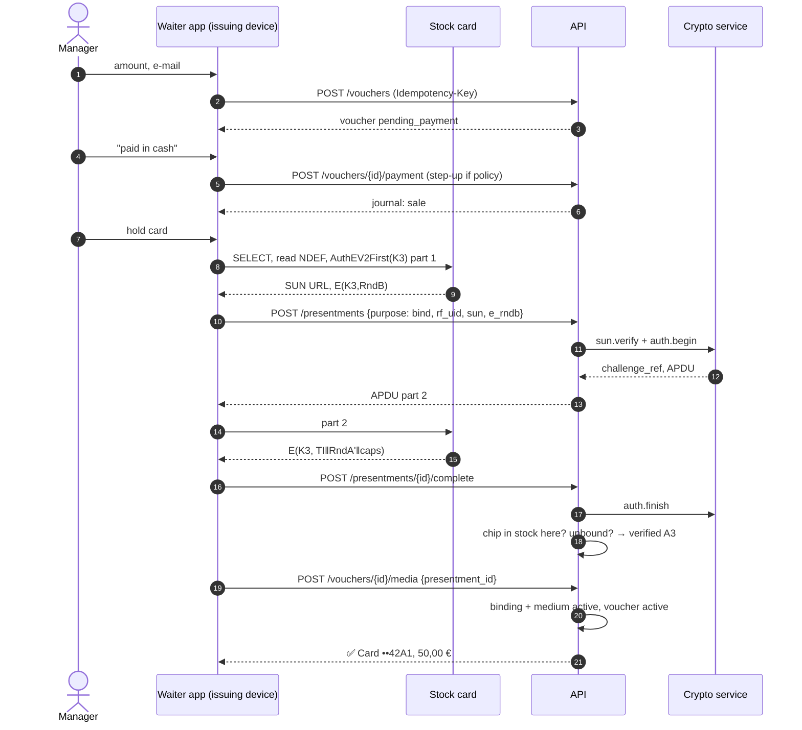

### 10.4 Redeem with live authentication (waiter)

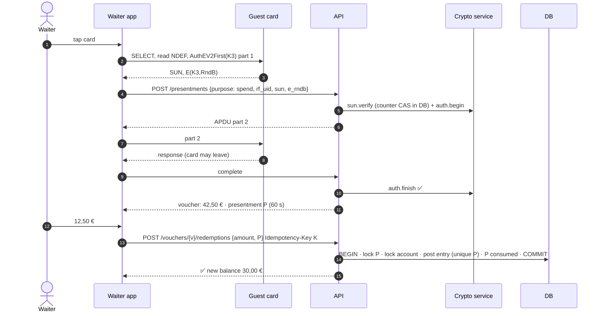

### 10.5 Guest taps own card with an iPhone

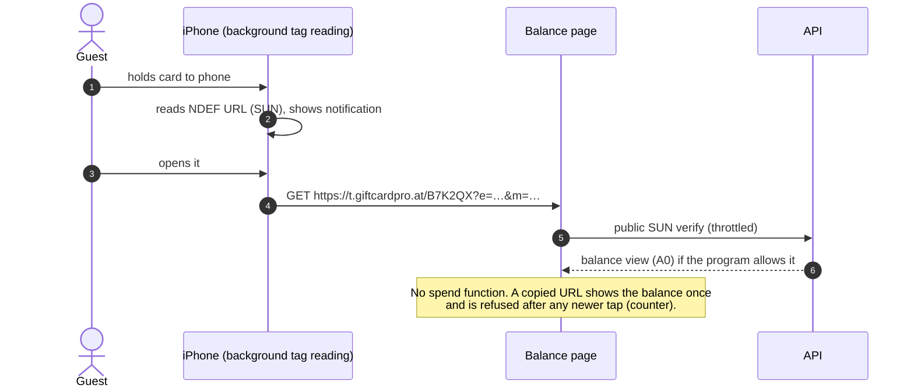

### 10.6 Lost card

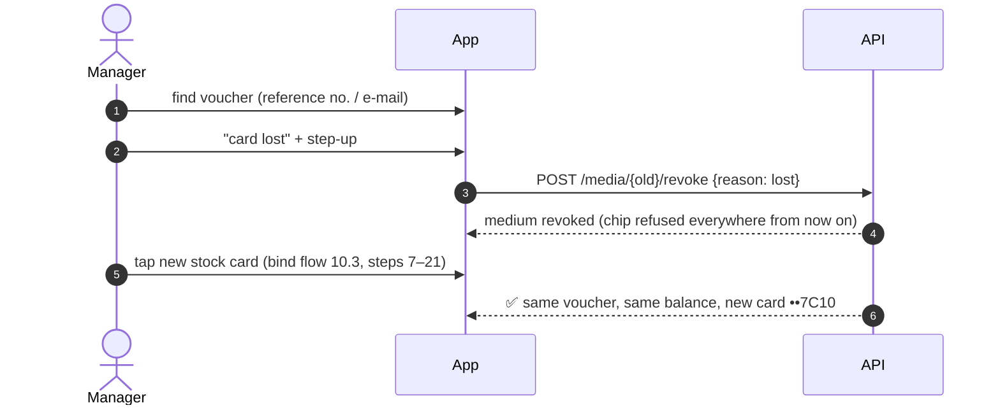

### 10.7 Override for an unreadable card

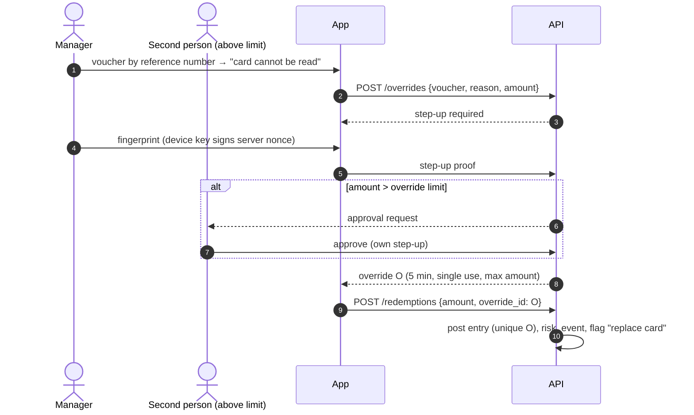

---

## 11. Lifecycle diagrams

### 11.1 Physical chip

A chip has two independent states, stored in two columns: how it was made (`personalization_status`) and where it is (`stock_status`).

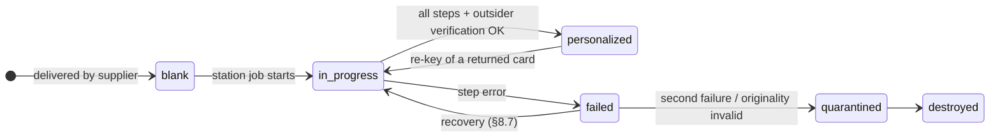

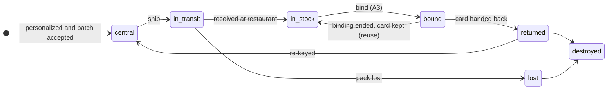

### 11.2 Medium (credential role)

```mermaid
stateDiagram-v2
    [*] --> provisioned: medium created (NFC: at bind; QR/wallet: at issue)
    provisioned --> active: bound + voucher active
    active --> suspended: guest "freeze" / risk rule
    suspended --> active: owner/manager unfreeze (step-up)
    active --> revoked: lost / stolen / damaged / fraud
    suspended --> revoked
    active --> retired: voucher closed, binding ended normally
    revoked --> [*]
    retired --> [*]
```

### 11.3 Voucher

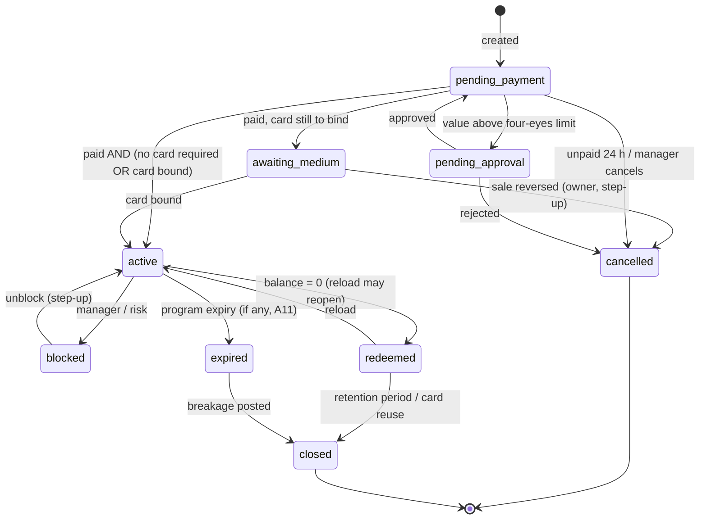

### 11.4 Presentment

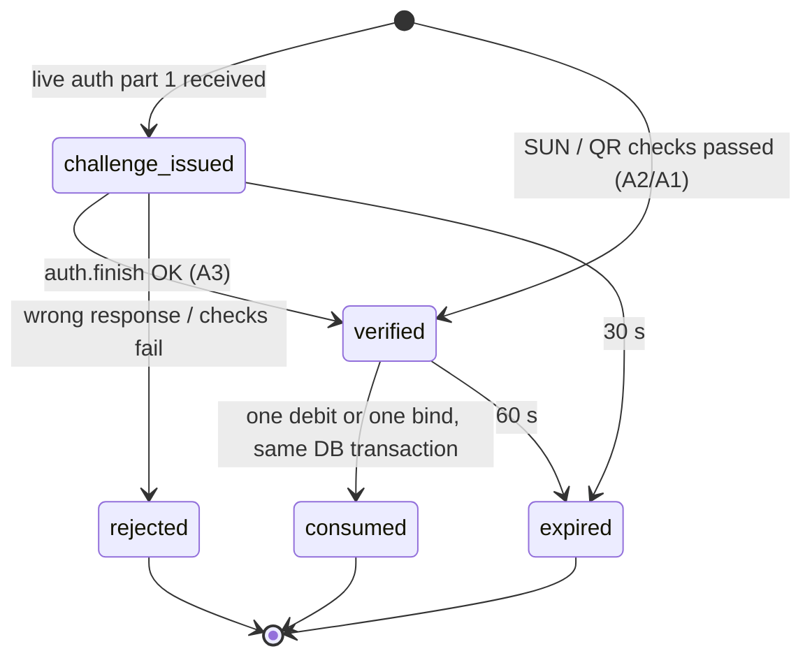

### 11.5 Key set and batch

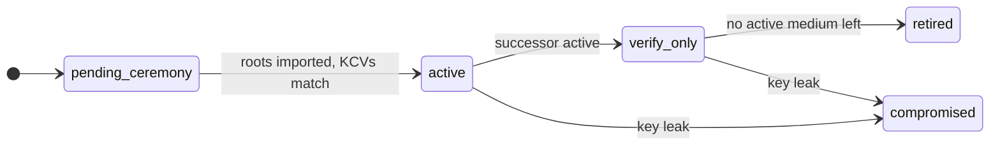

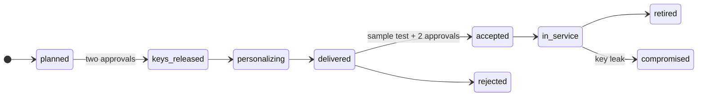

---

## 12. Security architecture

### 12.1 Trust boundaries

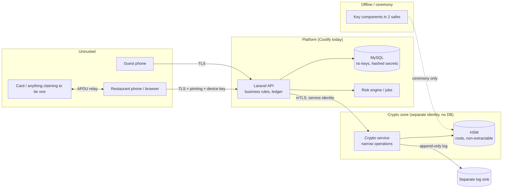

Every arrow into the platform is untrusted input. The crypto zone trusts only authenticated service calls, and even then only for its fixed operations.

### 12.2 Controls by layer

| Layer | Controls |
|---|---|
| Card | Genuine NXP chip (originality check at intake); per-card keys; NDEF write only with K0; SUN counter; K3 separate from K0 |
| Phone | No keys. Relay only. Device enrolment with a hardware-backed key and Play Integrity / App Attest for **issuing** devices. Step-up for sensitive actions. `FLAG_SECURE` on issuing screens. Certificate pinning with a backup pin (from the 20-point document). |
| Transport | TLS 1.2+ with HSTS. Pinning in the app. Request signing with the device key for issuing endpoints (DPoP-style), so a stolen bearer token alone cannot issue or bind. |
| API | Presentment required for debits (I-1). Idempotency keys re-checked under the row lock. Role, ability and tenant checks on every request. Rate limits per user, device, IP and chip. |
| Crypto | Crypto service with a narrow API; HSM roots; AN10922; per-batch export only; dual-control ceremonies; KCVs |
| Data | No key material; hashed medium secrets; encrypted PII; least-privilege DB users; append-only triggers |
| Ledger | Double entry; per-account sequence numbers; hash chain; nightly verifier; reversals only |
| Audit | Hash-chained `audit_logs`; daily anchor of the chain head (for example e-mail to the owner and an object-lock bucket); retention by law, not forever (GDPR) |
| Operations | Separate accounts or projects for HSM, backups and app. Admin access with hardware keys (FIDO2). Break-glass accounts sealed and audited. |

### 12.3 Closing the named gaps

| Gap asked about | How it is closed | Residual |
|---|---|---|
| **QR bypass** (G1) | A static QR is A1. Card vouchers need A3 (A2 on the web). A photo of a card's QR (424 cards have no spending QR) cannot reach the spending minimum. | None |
| **API bypass** (G2) | Every debit endpoint requires `presentment_id` or `override_id`, validated and consumed in the ledger transaction. The unique index enforces it even if code is wrong. There is no "card id only" debit path left, including for platform admins. | A compromised backend (T-11) |
| **NFC verification bypass** (G1, G5, G8, G9) | Verification happens only on the server. The client reports bytes, never results. The RF UID is cross-checked. Binding is explicit. NTAG21x is not supported. | Live relay (T-6) |
| **Replay** | SUN counter compare-and-set; live-auth challenges are single-use and expire in 30 s; presentments are single-use; idempotency keys | None known |
| **Duplicated requests** | Idempotency key per organisation (unique index) plus the presentment's unique index. A duplicate returns the original result, and a second debit is impossible. | None known |
| **Cloned media** | 424: keys are not readable (EAL4) and differ per card; a clone fails A3 and A2. QR and wallet: rotating or A1-limited. | Laboratory key extraction from one card (T-1) |
| **Race conditions** | Row locks on the presentment and the ledger account; per-account sequence unique index; counter compare-and-set; unique active-binding index | None known |
| **Offline abuse** | No offline spending. The app refuses to queue debits when offline (as today). | Not applicable until offline mode is designed (§19) |
| **Insider fraud** | See T-8, T-9, T-10: presentment for debits, payment records for sales, four-eyes, overrides limited and reported, separation of duties for keys and personalisation, hash-chained ledger and audit | Collusion and owner-level fraud (T-9) |

### 12.4 Step-up authentication

As in the 20-point document:
- a **device-bound key that requires user authentication** (Android Keystore `setUserAuthenticationRequired`, iOS Secure Enclave with `.biometryCurrentSet`) signs a server nonce;
- or a server-verified PIN (Argon2id) on shared phones.

Required for: bind (policy), sales (policy; always on shared devices), override, revoke, unblock, reversals, and owner settings that lower assurance.

### 12.5 Payment evidence for sales (the main insider risk)

The dominant fraud in gift cards is **issuing value without payment**, not cloning.
- Every `sale` entry needs a payment record: cash, card terminal with receipt number, or an online payment id.
- A daily report reconciles cash sales with the till closing. The ledger's sales clearing account must equal cash declared plus card payments.
- Four-eyes approval above a threshold.
- Risk rules watch sales without an online payment reference, sales outside opening hours, and one employee selling to one e-mail repeatedly.

### 12.6 Ledger and audit integrity

- **Hash chain:** `entry_hash = SHA-256(canonical_json(entry, postings) ‖ prev_hash)`, per organisation, with `chain_seq` gap-free.
- **Anchoring:** every night the chain head is written to an object-lock bucket in a separate account and e-mailed to the owner. After that, an insider who edits history in the database is detectable by anyone who holds an older head.
- **Nightly verifier:**
  - recompute each account's balance from its postings;
  - check that every entry sums to zero;
  - check that the chain is intact;
  - check that every customer debit has exactly one consumed presentment or override, and that every administrative debit references its rule or its reversed entry and approvals.

  Any difference is a critical risk event.

### 12.7 Risk engine rules (initial set)

| Rule | Signal | Default action |
|---|---|---|
| Velocity | > 3 debits per voucher per hour, or > €300 per voucher per day | Block the next debit and alert the manager |
| Counter jump | SUN counter increases by more than 50 since the last seen value | Risk event (the card was read many times: skimming or heavy guest use) |
| RF UID mismatch | RF UID ≠ chip UID | Reject, alert, and suspend the medium after two occurrences |
| Geography | A voucher presented at two restaurants more than 50 km apart within 30 min | Alert (possible relay) |
| Override pattern | > 2 overrides per voucher per 30 days, or one employee's overrides > 3 per week | Alert the owner, then block the overrides |
| Compromised batch | Any tap of a chip in a `compromised` batch | A1, no spending; prompt a swap |
| Unpaid sales | A sale without a payment reference outside opening hours | Alert the owner |

---

## 13. Threat model

**Assets:**
- voucher value (liability);
- root and batch keys;
- the integrity of the ledger and the audit log;
- customer personal data;
- restaurant staff accounts and devices;
- card stock.

**Scale.** Likelihood is for a platform with hundreds of restaurants within 12 months after this design is implemented. Impact is for the worst realistic outcome. Both are **[Assessment]**.

| ID | Attack | Likelihood | Impact | Mitigation | Remaining risk |
|---|---|---|---|---|---|
| **T-1** | **Cloned card** (copy an NTAG 424) | Low. The URL copies trivially, but a working clone needs the key. Key extraction is a laboratory attack on an EAL4 chip. | Low per card (one voucher's balance), because keys are per card | Per-card AN10922 keys; A3 at tills (a copied URL fails); A2 counter; originality check at intake stops counterfeit chips in our stock | A lab attack yields one card's keys: accepted. A leaked batch or root key is covered in T-12. |
| **T-2** | **Skimming** a card in a pocket (fresh SUN) | Medium (cheap reader, a few cm) | Low | A3 for spending (a SUN URL alone is not enough on the waiter app); A2 web limit; counter-jump rule | Every read increments the counter, so one skim pass can capture several fresh URLs. With a 7-byte-UID emulator (Chameleon or Proxmark class, which passes the RF-UID check), an attacker could spend them at a web terminal until the owner's next tap, bounded by the A2 daily cap (€100 per voucher). Disable web A2 per restaurant if needed. |
| **T-3** | **Rooted Android** (restaurant phone, or an attacker's own) | Medium | Low–Medium | No keys on phones; the phone relays bytes it cannot create; attestation required for issuing devices; RF UID cross-check; the server decides everything | A rooted *enrolled* waiter phone can still do what that waiter can do (redeem **with** a presented card). It cannot mint, clone or bypass presentments. |
| **T-4** | **Stolen manager phone** | Medium | Medium | Device-bound tokens plus revocation from the dashboard; step-up (biometric/PIN) for bind, override and revoke, and for sales per policy (always on shared devices, §12.4); payment evidence and four-eyes for sales; stock binding only for this restaurant's chips | A thief who also knows the PIN can sell unpaid vouchers until revoked. The daily reconciliation and risk rules detect it. |
| **T-5** | **MITM** (network interception) | Low (TLS plus pinning) | Medium | TLS, pinning with a backup pin, HSTS; live-auth traffic contains no key and no reusable answer; presentments bound to device and user; issuing requests signed with the device key | A user who installs a CA on an unpinned debug build: not a production concern. |
| **T-6** | **Relay attack** (attacker reader at the victim's card ↔ emulator at the till, live) | Low (needs two devices, a victim nearby and a colluding presenter; HCE relays are caught by the RF UID check, so it needs hardware emulating a 7-byte UID) | Low–Medium (one voucher's balance) | RF UID check; velocity and geography rules; the waiter sees the physical card (policy: the card, not a phone, is held to the device); per-transaction limits | **Real and accepted.** NTAG 424 has no proximity check. DESFire EV3 has one (the due diligence, §7). Revisit if relay fraud is ever observed. |
| **T-7** | **API abuse** (scripted calls, stolen tokens, enumeration) | High (always attempted) | Low after this design | No debit without a presentment; throttles; device-bound tokens; the reference number is not a credential; `voucher_views` are view-only; generic errors; WAF rate limits | Resource exhaustion (DoS), handled at the infrastructure level |
| **T-8** | **Malicious waiter** (redeem without the guest; keep cash and "redeem" an old card; redeem someone else's voucher by number) | Medium | Medium | Waiters cannot spend without the card present (A3); no manual lookup for waiters; each redemption records user and device; velocity rules; guest e-mail receipts per redemption (optional) | A waiter who physically holds the guest's card, for example at the table, can overcharge. That is the same risk as with any card payment: guest receipts and reconciliation. |
| **T-9** | **Insider fraud by manager/owner** (unpaid sales, fake overrides, "adjustments") | Medium | Medium–High (the restaurant's own liability) | Payment evidence per sale; four-eyes above limits; overrides limited and reported; adjustments only as reversals with a reason; hash-chained ledger and audit; owner digest; the platform cannot hide entries | An **owner** defrauding their own business, or collusion of two approvers: detectable in reports, not preventable by software. |
| **T-10** | **Malicious platform staff** | Low | High | Separation of duties (keys, personalisation, vouchers); dual control for key export and batch release; no root ever exportable; admin actions audited to a sink admins cannot write; FIDO2 for admin logins | Two colluding custodians. Mitigated by background checks, ceremony witnesses and rotating custodians. |
| **T-11** | **Compromised backend** (remote code execution on the Laravel host) | Low–Medium | High | The crypto service is separate (the attacker cannot take keys, so no card cloning). The ledger is append-only for the app DB user, and history cannot be rewritten without detection (chain anchored off-site). Anomaly detection on crypto-service usage. | The attacker can create fake presentments or entries **in the database** while in control. The nightly verifier and the external anchor detect it after the fact. Response: freeze, restore from the anchor, re-issue. Genuine risk; minimised, not removed. |
| **T-12** | **Leaked batch or root keys** (manufacturer, ceremony error) | Low | High (a batch or a key set can be cloned) | Two-level derivation (a manufacturer holds batch keys only); ceremonies; KCVs; destruction certificates; key-set and batch compromise playbooks (§6.5) Between the leak and its detection, cards of that batch or key set can be cloned. After the batch or key set is marked `compromised`, neither originals nor clones can spend until swapped (a guest with a clone *and* the voucher's e-mail could still claim the swap: accepted). |
| **T-13** | **Leaked database** | Medium (the most common breach type) | Medium (personal data) | No key material; hashed medium secrets and view tokens; encrypted PII with blind indexes; UIDs are not secrets (they are broadcast over RF anyway) | Metadata (amounts, dates, restaurants) is exposed: GDPR notification duties apply. Nothing in it can be spent. |
| **T-14** | **Leaked backups** | Low–Medium | Medium | Backups encrypted with a KMS key in a separate account or project; object-lock; access logged; tested restores | The same as T-13 if the KMS key also leaks. |
| **T-15** | **Stolen card stock** (pack in transit or from a restaurant) | Medium | Low | Unbound cards have no value; binding only by that restaurant's managers with step-up; a lost pack becomes `lost` and is never bindable | A thief holding the restaurant's manager credentials: see T-4. |
| **T-16** | **Card vandalism / DoS** (overwrite, lock, tap to death) | Low | Low | NDEF write needs K0; no read-counter limit; no failed-auth lock-out; revocation and replacement without money movement | Physical destruction: replace the card (§9.3). |
| **T-17** | **Counterfeit or non-NXP chips** in the supply chain | Low | Medium | Originality ECC signature check at personalisation and at batch acceptance; manifest reconciliation | None known |
| **T-18** | **Phishing guests** (fake balance page URL on a sticker over the card, or a rewritten NTAG21x) | Low | Low | 424 NDEF is not writable; the tap domain is fixed and printed on the card; the guest page never asks for payment data | A sticker with a QR over the card is a physical trick: staff and guest awareness. |
| **T-19** | **Swap theft** (a manager revokes a guest's card and binds one they keep) | Low–Medium | Medium (one voucher's balance) | Rebind guards in §9.3: possession proof, or guest e-mail confirmation, or owner approval with a 72 h limit; guest notification; risk rule "rebind then debit" | An owner colluding with the manager on a voucher without e-mail, limited by the 72 h cap and visible in the audit |

---

## 14. API changes

All under `/v1`. Money endpoints keep the `Idempotency-Key` header rule. Error codes follow the existing error envelope.

### 14.1 New

| Method and path | Who | Body → result | Notes |
|---|---|---|---|
| `POST /presentments` | scan permission; bind needs `cards.bind` | `{purpose: spend\|bind\|verify, rf_uid?, sun_url?, e_rndb?, qr?, reference_number?}` → `{id, status, apdu?}` | `apdu` present = live auth continues. Replaces `POST /scan`. |
| `POST /presentments/{id}/complete` | same device and user | `{card_response}` → `{id, assurance, expires_at, voucher: {…}}` | |
| `POST /vouchers` | `cards.create` | as today's `POST /cards`, + `program_id?` → voucher `pending_payment` | `POST /cards` stays as an alias |
| `POST /vouchers/{id}/payment` | `cards.create` | `{method: cash\|terminal\|online, reference?}` | Creates the `sale` entry |
| `POST /vouchers/{id}/media` | `cards.bind` (+ step-up per policy) | `{presentment_id}` for NFC, `{type: qr_rotating\|wallet_google\|wallet_apple}` for others | Binds; activates the voucher if paid |
| `GET /vouchers/{id}/media` | `cards.view` | → media with bindings history | |
| `POST /media/{id}/revoke` | `cards.revoke` (+ step-up) | `{reason, note?}` | Replaces "replace card" |
| `POST /media/{id}/suspend`, `/resume` | manager, or the guest via a verified view session | | |
| `POST /vouchers/{id}/redemptions` | `cards.redeem` | `{amount, presentment_id \| override_id, reference?}` | Replaces `POST /cards/{id}/redeem` |
| `POST /vouchers/{id}/transfers` | `cards.transfer` | `{target_voucher_id, amount, presentment_id \| override_id}` | Debit of the source (I-1) and credit of the target in one entry |
| `POST /vouchers/{id}/reloads` | `cards.reload` | `{amount, payment: {...}}` | Credit: needs payment evidence, not a presentment |
| `POST /overrides` | manager + step-up | `{voucher_id, reason, amount}` → `{id, expires_at}` or `pending_second_approval` | |
| `POST /overrides/{id}/approve` | second person + step-up | | |
| `GET /stock`, `POST /stock/receive` | managers | chip counts, receive a pack | |
| `POST /step-up/challenge`, `/step-up/verify` | any user | nonce → signed proof | From the 20-point document |
| **Public** `GET /t/{batch}?e&m` | anyone (throttled per IP and per chip) | SUN verify → balance view (A0) | New tap domain. Never spends. |
| **Public** `GET /v/{view_token}` | anyone with the link | balance view | View-only e-mail links |

### 14.2 Platform admin (new, `platform.*` permissions, FIDO2 sessions)

| Endpoint | Purpose |
|---|---|
| `POST /admin/key-sets`, `GET /admin/key-sets` | Register a key set after a ceremony (metadata and KCVs only) |
| `POST /admin/batches`, `POST /admin/batches/{id}/approve` | Plan a batch; two approvals release its keys |
| `POST /admin/batches/{id}/manifest` | Import a signed manufacturer manifest |
| `POST /admin/batches/{id}/acceptance` (+ `/approve`) | Record the sample test; two approvals |
| `POST /admin/batches/{id}/compromise` | Playbook trigger (§6.5) |
| `POST /admin/personalization/jobs` (+ approve) | In-house station jobs |
| `POST /admin/personalization/sessions`, `POST …/{id}/step` | The station relay protocol (APDU in/out) |
| `POST /admin/stock/shipments` | Ship chips or packs to organisations or restaurants |
| `GET /admin/ledger/verification` | Latest nightly verifier result and chain heads |

### 14.3 Removed endpoints

The v2 architecture §15 lists the endpoints removed in Phase 0. There is no deprecation period (ADR-002).

### 14.4 New error codes

`PRESENTMENT_REQUIRED`, `PRESENTMENT_EXPIRED`, `PRESENTMENT_CONSUMED`, `PRESENTMENT_WRONG_DEVICE`, `ASSURANCE_TOO_LOW`, `USE_LIVE_AUTH`, `CHIP_UNKNOWN`, `CHIP_NOT_IN_STOCK_HERE`, `CHIP_BATCH_COMPROMISED`, `LIVE_AUTH_FAILED`, `RF_UID_MISMATCH`, `MEDIUM_REVOKED`, `OVERRIDE_LIMIT_REACHED`, `STEP_UP_REQUIRED`, `PAYMENT_REQUIRED`.

---

## 15–17. Plan

Superseded by `docs/implementation/v2-implementation-plan.md` (ADR-002).

---

## 18. Risks (project, technical, legal, operational)

| Risk | Likelihood | Impact | Mitigation |
|---|---|---|---|
| HSM cannot run the derivation chain internally (T3) | Medium | Medium (stay at T2) | Spike first; T2 is an acceptable production baseline |
| Live-auth latency too high on poor restaurant Wi-Fi or mobile networks | Medium | Medium (waiter UX) | Measure in the lab stage; one round trip only; kill switch to A2 with limits; prefer a restaurant Wi-Fi check at setup |
| iOS Core NFC behaviour differences (session timeouts, ISO 7816 polling quirks) | Medium | Medium | Test matrix of iPhone models in the lab; the existing iOS NFC code is a head start |
| Personalisation errors lock cards (wrong access rights, K0 lost) | Medium in the lab, low later | Low (sacrificial cards) → High if in a batch | Sacrificial-card test suite; acceptance tests; deterministic keys and the recovery journal |
| Manufacturer security weaker than claimed | Low–Medium | High | Two-level keys (batch blast radius); audit clause; destruction certificates; acceptance sampling |
| Scope creep (this is a large programme) | High | Medium | Phases ship independently; Phase 0 alone removes the worst gaps |
| Restaurant pushback on stricter rules (no manual lookup for waiters, overrides limited) | Medium | Medium | Clear owner communication; limits configurable within safe bounds; fast swap flow |
| Legal: voucher expiry and multi-merchant programs (A11, A12) | Medium | High | Legal defaults (no expiry); legal opinion before chain or multi-merchant programs |
| Key custodian unavailability (ceremony blocked) | Low | Medium | Three custodians, 2-of-3 components |
| Card supply (lead times, minimum orders) | Medium | Medium | Order samples now; keep in-house personalisation for small runs |
| Crypto-service outage | Low | High (no spending with A3/A2) | Two instances; HSM high availability; the override path; status monitoring |

---

## 19. Long-term: how the model absorbs future needs

| Future need | What is added | What does **not** change |
|---|---|---|
| **Apple Wallet pass** | `media.type = wallet_apple`, pass serial and auth token; balance updates via Apple push. Barcode = A1, so view-only for card vouchers. NFC passes need Apple's NFC certificate and VAS-capable readers **[Apple]**. | Vouchers, ledger, bindings |
| **Google Wallet** | `wallet_google` with a **rotating barcode** (A2) **[Google]** | Same |
| **NFC mobile credentials** (our app on the guest's phone) | `mobile_credential` with a device key; the live-auth protocol generalises to "the server challenges the credential's key". iOS allows HCE-based contactless apps in the EEA with an Apple entitlement **[Apple]**. | Presentments, assurance levels, ledger |
| **Loyalty** | `programs.kind = loyalty`; `loyalty_accounts` table; ledger accounts with unit `PTS`; the same card bound with `account_type = loyalty` | Media, chips, keys, presentments, ledger tables |
| **Membership** | `memberships` (validity, tier); binding `role = spend` or `view` | Same |
| **Hotel / stay packages** | `programs.kind = stay_package`; locations = hotel restaurants and spa. Door access needs a DESFire medium type if ever required (A13). | Same |
| **Multi-card per customer** | Already there: a customer holds many vouchers; a voucher has many media | — |
| **Enterprise chains** | Organisations with many restaurants; programs accepted at listed locations; settlement accounts; chain-level stock; T3 keys | — |
| **Offline verification** | Terminals with a SAM AV3 (keys inside) verifying SUN and live auth locally, with signed floor limits and a revocation list, and deferred posting as `offline_redemption` entries. Phones never. **[NXP] SAM AV3; [Assessment] design** | Everything else |
| **Other chips** (DESFire EV3 if a customer demands it) | `chip_type = desfire_ev3`; its SUN is NTAG-DNA compatible **[NXP]**; live auth via its own AES keys | Everything else |

---

## 20. Decisions needed

1. **Approve the four behavioural changes:**
   - live authentication at the till (A4);
   - no manual lookup by number for waiters (A8);
   - override limits (A2);
   - view-only e-mail links for card vouchers (A3).
2. **Key tier for production:** T2 on Google Cloud HSM (recommended), or go directly to T3 on AWS CloudHSM, which requires moving the crypto service into AWS.
3. **Tap domain:** approve `t.giftcardpro.at` (permanent) or choose another.
4. **Personalisation route for the pilot:** in-house station (recommended), or a manufacturer from the start.
5. **Phase 0 now:** decided (ADR-002): Phase 0 builds the final presentment model and removes every insecure path.
6. **Legal opinion** on expiry defaults and on chain or multi-location programs.
7. **Custodians:** name three people for the key ceremony.

---

## 21. Sources

**NXP (official)**
- [NT4H2421Gx, NTAG 424 DNA data sheet](https://www.nxp.com/docs/en/data-sheet/NT4H2421Gx.pdf): keys, files, access rights, SDM, originality, anti-tearing, EAL4
- [AN12196, NTAG 424 DNA features and hints (AES)](https://www.nxp.com/docs/en/application-note/AN12196.pdf): SUN, session keys, personalisation, `AuthenticateEV2First`, originality check
- [AN10922, Symmetric key diversifications](https://www.nxp.com/docs/en/application-note/AN10922.pdf)
- [MIFARE SAM AV3](https://www.nxp.com/products/MIFSAMAV3)
- [MIFARE DESFire EV3 short data sheet](https://www.nxp.com/docs/en/data-sheet/MF3D_H_X3_SDS.pdf): proximity check, SUN compatibility
- [NXP community: AuthenticateEV2First on iOS with Swift](https://community.nxp.com/t5/Secure-Authentication/NFC-NTAG-424-DNA-AuthenticateEV2First-on-iOS-15-with-Swift/m-p/1455808)

**Cloud key management**
- [AWS KMS key specs](https://docs.aws.amazon.com/kms/latest/developerguide/symm-asymm-choose-key-spec.html): SYMMETRIC_DEFAULT = AES-256-GCM; HMAC keys only
- [AWS CloudHSM PKCS #11 mechanisms (Client SDK 5)](https://docs.aws.amazon.com/cloudhsm/latest/userguide/pkcs11-mechanisms.html): `CKM_AES_CMAC`, `CKM_AES_ECB`/`CBC`, `CKM_SP800_108_COUNTER_KDF`
- [AWS Payment Cryptography MacAttributes](https://docs.aws.amazon.com/payment-cryptography/latest/DataAPIReference/API_MacAttributes.html): CMAC, DUKPT, EMV MAC
- [Google Cloud KMS raw symmetric encryption](https://docs.cloud.google.com/kms/docs/raw-encryption): AES-CBC/CTR/GCM, caller IV, imported keys only
- [Google Cloud KMS pricing](https://cloud.google.com/kms/pricing)
- [Azure Managed HSM key types and algorithms](https://learn.microsoft.com/en-us/azure/key-vault/managed-hsm/about-keys-details): AES-KW, AES-GCM, AES-CBC

**Platforms**
- [Apple: ISO 7816 select identifiers entitlement](https://developer.apple.com/documentation/bundleresources/entitlements/com.apple.developer.nfc.readersession.iso7816.select-identifiers)
- [Apple: NFCISO7816Tag](https://developer.apple.com/documentation/corenfc/nfciso7816tag)
- [Apple Wallet: loyalty passes and NFC](https://developer.apple.com/wallet/loyalty-passes/)
- [Apple: HCE-based contactless transactions (EEA)](https://developer.apple.com/support/hce-transactions-in-apps/)
- [Google Wallet gift cards: rotating barcodes](https://developers.google.com/wallet/retail/gift-cards/resources/rotating-barcodes)
- [Chrome: Web NFC](https://developer.chrome.com/docs/capabilities/nfc)
- [Android: IsoDep](https://developer.android.com/reference/android/nfc/tech/IsoDep)

**Law and industry practice** (not legal advice)
- [WKO: Gutscheine – Befristung](https://www.wko.at/vertragsrecht/gutscheine-befristung): 30-year default; OGH on expiry of paid vouchers
- [Directive (EU) 2016/1065, treatment of vouchers (VAT)](https://eur-lex.europa.eu/eli/dir/2016/1065/oj)
- [Directive (EU) 2015/2366 (PSD2), Art. 3(k) limited-network exclusion](https://eur-lex.europa.eu/eli/dir/2015/2366/oj)
- [Bond, Choudary, Murdoch, Skorobogatov, Anderson: "Chip and Skim: cloning EMV cards with the pre-play attack" (IEEE S&P 2014)](https://www.cl.cam.ac.uk/~rja14/Papers/unattack.pdf)
- NIST SP 800-38B (CMAC) and SP 800-108 (KDF in counter mode): [SP 800-38B](https://csrc.nist.gov/pubs/sp/800/38/b/upd1/final), [SP 800-108r1](https://csrc.nist.gov/pubs/sp/800/108/r1/upd1/final)

**This repository**
- `docs/architecture/security-and-issuing-architecture.md`, `docs/architecture/ntag424-due-diligence.md`, `docs/reports/2026-09-28-investor-grade-audit.md`
