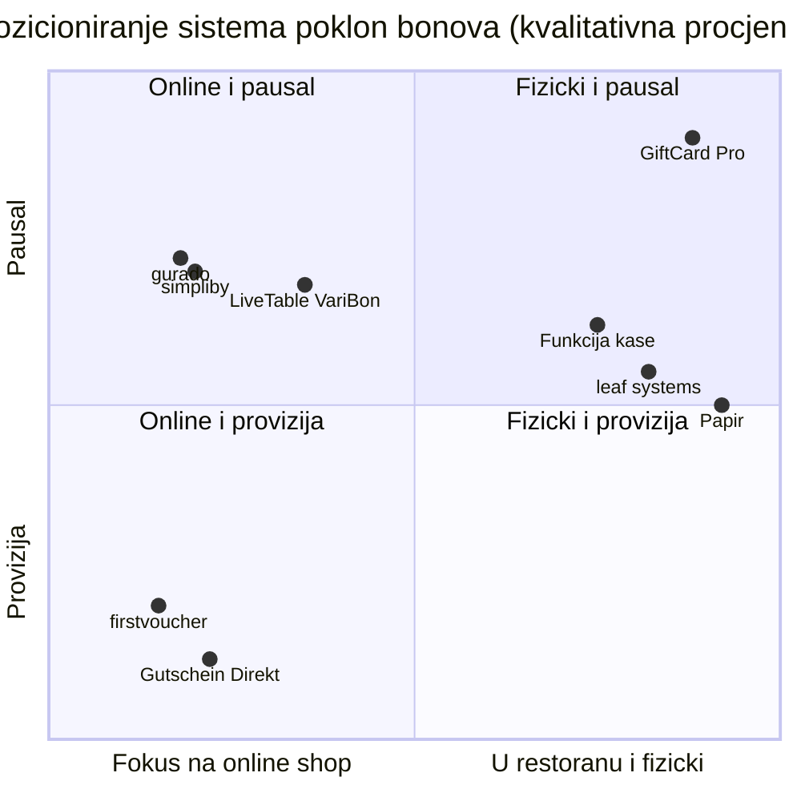

# Analiza konkurencije: sistemi poklon bonova za ugostiteljstvo

*Svrha: pregled konkurenata i alternativa, iskreno poređenje s GiftCard Pro, pozicioniranje i kratka pomagala za argumentaciju (battlecards) za prodajne razgovore u Austriji.*

> **Osnova podataka:** cijene potiču iz poređenja sistema poklon bonova portala [medienkraft.at](https://www.medienkraft.at) i prije svake upotrebe u ponudama ili na web stranici treba provjeriti jesu li aktuelne. Gdje nema pouzdane informacije, stoji **„nema podataka"**. Procjene su označene kao takve. O konkurentima govorimo činjenično i nikad omalovažavajuće.

---

## 1. Sažetak

- Najveći dio tržišta čine **online shopovi za poklon bonove**: poklon bon se prodaje kao PDF na web stranici restorana, često uz proviziju ili naknadu po transakciji.
- Pored toga postoje **austrijski specijalisti** (incert, apro), **sistemi vezani za kasu** (leaf systems, funkcije poklon bonova u fiskalnim kasama), **ugostiteljske platforme** s modulom za poklon bonove (gastronaut, LiveTable VariBon) i najčešći „konkurent": **papirni poklon bon plus Excel tabela**.
- **GiftCard Pro zauzima jasnu nišu:** fizička premium kartica s NFC čipom, iskorištavanje za stolom za nekoliko sekundi, nepromjenjiv dnevnik transakcija, nezavisno od kase, **0 % provizije**.
- **Gdje trenutno gubimo:** objekti koji žele prodavati prije svega online (nema online shopa do Q1 2027.), objekti koji zahtijevaju potpuno njemačko sučelje za osoblje (do Q4 2026. engleski) i objekti koji očekuju direktno povezivanje s kasom (samo API).

---

## 2. Kategorije konkurenata

| Kategorija | Ponuđači | Osnovna ideja |
|---|---|---|
| **A. Online shopovi za poklon bonove** | gurado, simpliby, firstvoucher, e-guma, gutschein.software, Gutschein Direkt, Jolioo | prodaja poklon bonova preko web stranice, uglavnom kao PDF ili e-mail; iskorištavanje putem koda |
| **B. Austrijski specijalisti** | incert (Beč), apro gutschein-modul (AT) | rješenja za poklon bonove s fokusom na austrijsko tržište |
| **C. Sistemi vezani za kasu** | leaf systems; funkcije poklon bonova u fiskalnim kasama | poklon bon kao funkcija kase; kod leaf systems beskontaktne NFC poklon kartice vezane za vlastiti sistem kase |
| **D. Ugostiteljske platforme** | gastronaut, LiveTable VariBon | poklon bonovi kao modul šire platforme (npr. rezervacije) |
| **E. Status quo** | papirni poklon bon + Excel tabela ili blagajnička knjiga | nema sistema; blok, pečat, ostatak iznosa zapisan rukom |

---

## 3. Profili

| Ponuđač | Porijeklo | Model | Cijene (prema izvoru) | Prednosti | Slabosti / ograničenja | Fizička NFC kartica | Provizija / naknada |
|---|---|---|---|---|---|---|---|
| **gurado** | DE | online shop za poklon bonove | besplatno / 29 € / 49 € / 89 € mjesečno | stepenasti paketi, besplatan ulaz | nema podataka o iskorištavanju za stolom | nema podataka | nema podataka |
| **simpliby** | nema podataka | online shop za poklon bonove | 29 € / 49 € / 89 € mjesečno | jasne mjesečne cijene | nema podataka | nema podataka | nema podataka |
| **firstvoucher** | nema podataka | online shop za poklon bonove | postavljanje 0 € / 499 € / 1.199 € | varijante postavljanja | provizija na prodaju | nema podataka | **4,9 % / 3,9 %** |
| **e-guma** | nema podataka | online shop za poklon bonove | nema podataka | nema podataka | nema podataka | nema podataka | nema podataka |
| **gutschein.software** | nema podataka | online shop za poklon bonove | nema podataka | nema podataka | nema podataka | nema podataka | nema podataka |
| **Gutschein Direkt** | nema podataka | online shop za poklon bonove | 0 € mjesečno | bez fiksnih troškova | zasnovano na naknadama | nema podataka | **da (na osnovu naknada)** |
| **Jolioo** | nema podataka | online shop za poklon bonove | nema podataka | nema podataka | nema podataka | nema podataka | nema podataka |
| **incert** | AT (Beč) | rješenje za poklon bonove, paketi Express / Professional / Individual | na upit | austrijski ponuđač, poznate reference (Figlmüller, Plachutta) | cijene nisu javne | nema podataka | nema podataka |
| **apro gutschein-modul** | AT | modul za poklon bonove | nema podataka | austrijski ponuđač | nema podataka | nema podataka | nema podataka |
| **leaf systems** | nema podataka | sistem kase s poklon karticama | nema podataka | beskontaktne NFC poklon kartice | vezano za vlastiti sistem kase | **da** | nema podataka |
| **Fiskalne kase (funkcija poklon bona)** | razni | funkcija kase | uključeno u cijenu kase ili dodatni modul (nema podataka) | već postoji, nije potreban dodatni softver | iskorištavanje uglavnom na kasi (pretpostavka); obim funkcija zavisi od proizvođača | nema podataka | nema podataka |
| **gastronaut** | nema podataka | ugostiteljska platforma s poklon bonovima | nema podataka | platforma iz jednog izvora | poklon bon kao jedan od mnogih modula | nema podataka | nema podataka |
| **LiveTable VariBon** | nema podataka | platforma s modulom za poklon bonove | 25 € / 45 € mjesečno; „Card Pro" na upit | niska ulazna cijena | nema podataka | nema podataka („Card Pro" provjeriti) | nema podataka |
| **Papir + Excel** | — | vlastito rješenje | troškovi štampe | bez troškova softvera, poznato | može se falsifikovati, sklono greškama, nema pregleda otvorenih iznosa, ostatak iznosa rukom | ne | ne |
| **GiftCard Pro** | AT (Beč) | SaaS, nezavisno od kase | 29 € / 59 € / od 129 € mjesečno (neto) | iskorištavanje za stolom za nekoliko sekundi, NFC + QR, dnevnik, zaštita od kloniranja, 0 % provizije | nema online shopa (Q1 2027.), sučelje za osoblje na engleskom (Q4 2026.), nema direktnog povezivanja s kasom | **da** | **0 %** |

**Prikupiti prije lansiranja:** porijeklo i modele provizija ponuđača s „nema podataka", podršku za fizičke kartice, iskorištavanje bez kase. Metoda: javne stranice s cijenama, testni računi, razgovori s pilot-objektima o dosad korištenim sistemima.

---

## 4. Poređenje funkcija

Legenda: ✓ postoji · ✗ ne postoji · ○ djelimično · ? nema podataka (provjeriti). Kod konkurenata se ocjenjuju samo osobine koje proizlaze iz osnove podataka; sve ostalo je „?".

| Osobina | GiftCard Pro | Online shopovi (A) | AT specijalisti (B) | leaf systems (C) | Funkcija kase (C) | Platforme (D) | Papir (E) |
|---|---|---|---|---|---|---|---|
| Online prodaja preko web stranice | ✗ (Q1 2027.) | ✓ | ? | ? | ? | ? | ✗ |
| Fizička NFC kartica | ✓ | ? | ? | ✓ | ? | ? | ✗ |
| QR kartica za samostalnu štampu | ✓ | ? | ? | ? | ? | ? | ✗ |
| Iskorištavanje za stolom putem telefona | ✓ | ? | ? | ? | ✗ (na kasi, pretpostavka) | ? | ✗ |
| Nezavisno od sistema kase | ✓ | ✓ (pretpostavka) | ? | ✗ | ✗ | ? | ✓ |
| Bez provizije | ✓ | ○ (zavisi od ponuđača) | ? | ? | ? | ? | ✓ |
| Djelimično iskorištavanje s ostatkom stanja | ✓ | ? | ? | ? | ? | ? | ○ (rukom) |
| Nepromjenjiv dnevnik transakcija | ✓ | ? | ? | ? | ? | ? | ✗ |
| Zaštita od kloniranja (UID čipa, NTAG 424 DNA) | ✓ | — | ? | ? | — | ? | ✗ |
| Blokiranje i zamjena izgubljenih kartica | ✓ | ? | ? | ? | ? | ? | ✗ |
| Otvorena obaveza kao pokazatelj | ✓ | ? | ? | ? | ? | ? | ✗ |
| Provjera stanja za goste | ✓ | ? | ? | ? | ? | ? | ✗ |
| Izvoz za poreznog savjetnika (CSV) | ✓ | ? | ? | ? | ? | ? | ○ (Excel) |
| Njemačko sučelje za osoblje | ✗ (Q4 2026.) | ? | ✓ (pretpostavka) | ? | ✓ (pretpostavka) | ? | ✓ |
| Direktno povezivanje s kasom | ✗ (samo API) | ? | ? | ✓ (vlastita kasa) | ✓ | ? | ✗ |
| Apple/Google Wallet | ✗ (plan) | ? | ? | ? | ? | ? | ✗ |
| Više lokacija centralno | ✗ (2027.) | ? | ? | ? | ? | ? | ✗ |

---

## 5. Mapa pozicioniranja

Ose: **horizontalno** fokus na online shop (lijevo) ↔ u restoranu / fizički (desno); **vertikalno** provizija (dolje) ↔ paušal (gore). Raspored prema kategoriji i poznatim modelima cijena; kvalitativna procjena.

| | **Fokus na online shop** | **U restoranu / fizički** |
|---|---|---|
| **Paušal** | gurado, simpliby, LiveTable VariBon (mjesečne cijene prema izvoru) | **GiftCard Pro** (mjesečna cijena, 0 % provizije); funkcija kase (dio troškova kase, pretpostavka) |
| **Provizija / naknada** | firstvoucher (4,9 % / 3,9 %), Gutschein Direkt (na osnovu naknada) | — |
| **Bez modela / nejasno** | e-guma, gutschein.software, Jolioo, incert, apro, gastronaut (nema podataka) | leaf systems (model cijena nema podataka); papir (samo troškovi štampe) |

**Tumačenje:** polje „u restoranu, fizički, paušal, nezavisno od kase" je slabo popunjeno. leaf systems i funkcije kasa su fizički, ali vezani za određenu kasu. Upravo tu je mjesto GiftCard Pro.

---

## 6. Gdje pobjeđujemo

| Situacija | Zašto pobjeđujemo |
|---|---|
| Objekat prodaje poklon bonove prije svega **u restoranu** (stalni gosti, Božić za šankom) | premium kartica za predaju, prodaja i iskorištavanje direktno na licu mjesta |
| **Visoke vrijednosti poklon bonova** (50–150 €) | provizija bi osjetno koštala; kod nas 0 % |
| **Mnogo novog ili promjenjivog osoblja** | iskorištavanje bez obuke, veliko dugme **„Redeem"**, jasne boje upozorenja |
| **Loša iskustva s papirnim poklon bonovima** (kopije, izgubljeni spiskovi) | dnevnik, blokiranje, zaštita od kloniranja, zamjenska kartica s prenosom stanja |
| **Vlasnica ili vlasnik želi jasnoću o otvorenim iznosima** | KPI „Outstanding balance" na prvi pogled |
| Objekat **ne želi mijenjati kasu** | nezavisno od kase, radi pored svake fiskalne kase |
| **Porezni savjetnik traži uredne podatke** | CSV izvoz s decimalnim zarezom, direktno u Excel |
| Objekat s **timom ili vlasnikom koji govori BHS** u Beču | savjetovanje i materijali na njemačkom, BHS i engleskom |

## 7. Gdje gubimo (iskreno)

| Situacija | Zašto gubimo | Šta radimo |
|---|---|---|
| Objekat želi poklon bonove prodavati **prije svega online** | nema online shopa, nema obrade plaćanja do Q1 2027. | iskreno reći; ponuditi pilot za online shop, zabilježiti kontakt za Q1 2027. |
| Tim zahtijeva **njemačko sučelje** | sučelje za osoblje trenutno na engleskom | kratko uputstvo na njemačkom s engleskim nazivima dugmadi; navesti rok Q4 2026. |
| Objekat očekuje **automatsko knjiženje u kasi** | nema integracije s kasom, samo API (paket Pro) | razjasniti postupak knjiženja s poreznim savjetnikom; pridobiti prodavce kasa kao partnere |
| **Lanac** s centralnom nabavkom | nema objedinjene kontrolne table za lokacije (2027.) | paket „Gruppe" s pojedinačnim računima; otvoreno pokazati plan razvoja |
| Kupac traži **reference** | još nema korisnika | pilot-program, 30 dana testa, demonstracija na vlastitom telefonu |
| Objekat s **kasom leaf systems** | poklon kartice već integrisane u kasu | obratiti se samo ako su iskorištavanje za stolom ili sigurnost tema |
| **Vrlo cjenovno osjetljiv mikroobjekat** s malo poklon bonova | papir ne košta ništa | QR kartice za samostalnu štampu, paket Start, računica uštede vremena |

---

## 8. Moguće reakcije konkurenata

| Reakcija | Vjerovatnoća (procjena) | Naš odgovor |
|---|---|---|
| Online shopovi dodaju **fizičke kartice** ili aplikacije za iskorištavanje | srednja | zadržati prednost u brzini (≈ 0,5 s sistemskog vremena), sigurnosti (NTAG 424 DNA) i kvalitetu kartica; pričati priče iz pilota |
| Ponuđači **smanjuju provizije** ili uvode paušale | srednja | 0 % ostaje trajno; dodatni argumenti mimo cijene (usluga za stolom, pregled obaveza) |
| **Proizvođači kasa** proširuju funkcije poklon bonova | srednja | prodavci kasa kao partneri umjesto protivnika; ponuditi API povezivanje |
| Austrijski ponuđači ističu **reference i prisutnost na tržištu** | visoka | brzo izgraditi reference iz pilota; lična podrška u Beču |
| **Cjenovne akcije** prije Božića | srednja | pilot-uslovi i 30 dana testa umjesto rata popustima |

---

## 9. Battlecards

### 9.1 Protiv online shopova s provizijom (npr. firstvoucher)

- **Šta rade dobro:** prodaja 24 sata preko web stranice, online plaćanje.
- **Naš argument:** „Uz proviziju od 4,9 % poklon bon od 100 € košta 4,90 € — kod 300 poklon bonova godišnje to je 1.470 €. GiftCard Pro Start košta 348 € godišnje, bez provizije." (Primjer računa; stvarne naknade provjeriti kod ponuđača.)
- **Naša prednost:** fizička premium kartica, iskorištavanje za stolom za nekoliko sekundi, otvorena obaveza pod kontrolom.
- **Prigovor:** „Želimo prodavati i online." → „Online shop je planiran za Q1 2027. Do tada prodajete u restoranu, gdje većina poklon bonova ionako ide preko šanka — to rado provjerimo zajedno s Vašim brojkama."

### 9.2 Protiv online shopova s mjesečnom cijenom (gurado, simpliby)

- **Šta rade dobro:** uporedive mjesečne cijene (29 € / 49 € / 89 €), online prodaja, djelimično besplatan paket.
- **Naš argument:** ista cjenovna klasa, ali napravljeno za trenutak u restoranu: prisloniti karticu, unijeti iznos, gotovo.
- **Pitanje za objekat:** „Gdje se Vaši poklon bonovi iskorištavaju — i koliko to danas traje?"
- **Iskreno:** ko prodaje gotovo samo online, tamo je trenutno u boljim rukama.

### 9.3 Protiv incert (austrijski specijalist)

- **Šta rade dobro:** bečki ponuđač s poznatim referencama (Figlmüller, Plachutta), više nivoa paketa.
- **Naš argument:** transparentne cijene od 29 € umjesto „na upit", postavljanje za jedno poslijepodne, NFC kartica sa zaštitom od kloniranja, 0 % provizije.
- **Pitanje za objekat:** „Trebate li veliki projekat — ili sistem koji radi sljedeće sedmice?"
- **Oprez:** bez tvrdnji o funkcijama incerta koje nismo provjerili.

### 9.4 Protiv papira + Excela (status quo)

- **Šta je dobro:** poznato, bez tekućih troškova.
- **Naš argument:** „Znate li danas koliko novca je u otvorenim poklon bonovima?" GiftCard Pro to pokazuje na prvi pogled. Svako iskorištavanje je dokumentovano, kopije ne rade, izgubljene kartice se blokiraju i zamjenjuju.
- **Dokaz za 2 minute:** dati da prislone demo karticu, unesu iznos, pokazati ostatak stanja.
- **Prigovor:** „Preskupo za ono malo poklon bonova." → QR kartice sami štampate (besplatno), paket Start 29 €, mjesečni otkaz.

---

## 10. Praćenje i ažuriranje

- Cijene i funkcije konkurenata provjeravati **kvartalno** i ažurirati ovaj dokument (odgovorna: [Ime], osnivačica).
- U svakom prodajnom razgovoru zabilježiti: dosadašnji sistem, razlog za promjenu ili izostanak promjene.
- Izgubljene poslove dokumentovati s razlogom; obrasci ulaze u plan razvoja.

---

Verzija 1.0 · Stanje: septembar 2026.
