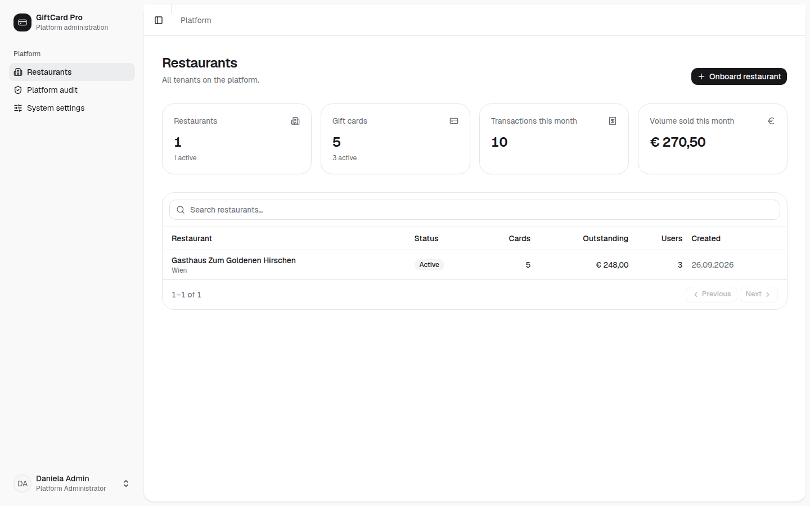

# Priručnik za administraciju platforme

*Za operativni tim GiftCard Pro: prijem restorana, pozivanje vlasnika, podrška unutar restorana, blokiranje i reaktivacija, zapisnik platforme, sistemske postavke, nadzor, kraj ugovora i sigurnosne obaveze.*

Korisnički interfejs je na engleskom. Dugmad su ovdje napisana tačno onako kako ih vidite, a kod prvog pojavljivanja s prijevodom.

---

## 1. Uloga i načela

Uloga **Platform Administrator** (administrator platforme) ima pristup svim restoranima. To je najmoćnija uloga u sistemu. Iz toga slijede tri načela:

1. **Pristup samo s povodom.** Restoran otvarate samo kada to zatraži vlasnik / vlasnica ili kada to zahtijeva slučaj podrške odnosno sigurnosni slučaj. Pravno smo **izvršitelj obrade** (čl. 28 GDPR) za podatke gostiju; restoran je voditelj obrade.
2. **Sve se bilježi.** Svaka radnja pojavljuje se u zapisniku aktivnosti restorana i u **„Platform audit“** (zapisnik platforme).
3. **Novac se ne pomjera.** Iskorištavanja, dopune, storna i prijenose obavlja sam restoran. Izuzeci samo uz pisani nalog vlasnika / vlasnice.

Administratorski računi otvaraju se isključivo tehnički (`php artisan platform:create-admin`); u interfejsu niko ne može dodijeliti ovu ulogu.

---

## 2. Pregled

Nakon prijave vidite **„Restaurants“** (restorani):

- Pokazatelji: **„Restaurants“** (broj, od toga aktivnih), **„Gift cards“** (kartice, od toga aktivnih), **„Transactions this month“** (knjiženja ovog mjeseca), **„Volume sold this month“** (prodani volumen ovog mjeseca).
- Lista svih restorana sa **„Status“** (Active / Suspended), **„Cards“**, **„Outstanding“** (otvoreni iznos), **„Users“** (osobe), **„Created“** (kreirano).
- **„Search restaurants…“** (pretraga restorana).

---

## 3. Prijem restorana

**Preduslovi:** potpisan ugovor (samo poduzetnici, B2B), potpisan ugovor o obradi podataka po nalogu, određen paket, potvrđena e-mail adresa vlasnika / vlasnice.

1. **„Onboard restaurant“** (primi restoran).
2. Restoran: **„Restaurant name“**, **„E-mail“**, **„Phone“**, **„Street“**, **„Postal code“**, **„City“**.
3. **„Owner account“** (račun vlasnika / vlasnice): **„Name“**, **„E-mail“**.
4. **„Create restaurant“** (kreiraj restoran).

Sistem kreira potpuno odvojen račun restorana i šalje pozivnicu. Link važi **72 sata**; osoba sama bira lozinku. Lozinke se nikad ne šalju e-mailom – ni od nas.

**Nakon toga:** dogovorite termin za uvođenje, pošaljite Vodič za uvođenje i Kontrolnu listu za postavljanje. Izričito naglasite da **„Default validity (months)“** treba promijeniti s fabričkih 36 na **0**, osim ako pravni savjetnik restorana ne odobri nešto drugo.

---

## 4. Ponovno slanje pozivnice

Pozivnica je istekla ili nije stigla:

1. Otvorite restoran u listi → **„Open restaurant“** (otvori restoran).
2. **„Team“** → kod vlasnika / vlasnice **⋯ → „Resend invitation“** (ponovo pošalji pozivnicu).
3. Prethodno provjerite: je li e-mail adresa tačna? Ako nije: **⋯ → „Edit“**, ispravite adresu, zatim ponovo pošaljite.
4. Spomenite folder za neželjenu poštu (spam).

Na isti način – na pisani zahtjev vlasnika / vlasnice – postavljate **drugu osobu s pravima vlasnika**: **„Team“** → **„Invite“** → uloga **Restaurant Owner**. Vlasnici sami mogu pozivati samo menadžere i konobare.

---

## 5. Rad unutar restorana („Open restaurant“)

Sa **„Open restaurant“** vidite i koristite restoran onako kako ga vidi vlasnik / vlasnica.

- Na vrhu se pojavljuje žuta napomena: **„Viewing [Restaurant] as platform administrator. All actions are audited.“** (Gledate ovaj restoran kao administrator platforme. Sve radnje se bilježe.)
- Svaka radnja se s Vašim imenom čuva u **„Audit log“** restorana. Vlasnik / vlasnica dakle vidi šta ste uradili.
- Sa **„Exit“** (izađi) vraćate se na pregled platforme. Uvijek napustite restoran čim je zadatak završen.

**Tipični povodi:** ponovno slanje pozivnice, zajednička provjera postavki telefonom, zajednička analiza sigurnosnih upozorenja, reprodukcija greške.

**Nije dozvoljeno bez pisanog naloga:** knjiženja na karticama, storna, promjene pravila za kartice, pregled ili izvoz podataka o kupcima izvan onoga što je nužno za otklanjanje greške.

---

## 6. Blokiranje i reaktivacija

Otvorite restoran → **„Suspend“** (suspenduj) → potvrdite.

- **Sve osobe tog restorana odmah se odjavljuju** i više se ne mogu prijaviti. Kartice zadržavaju svoje stanje i ponovo rade nakon reaktivacije.
- **„Reactivate“** (reaktiviraj) ukida suspenziju.

**Povodi:** kašnjenje s plaćanjem nakon opomene prema ugovoru, osnovana sumnja na sigurnosni problem (npr. preuzet račun), želja vlasnika / vlasnice, kraj ugovora.

**Važno:** suspenzija pogađa i goste restorana – njihove kartice se u tom periodu ne mogu iskoristiti. Zbog kašnjenja s plaćanjem zato suspendujte samo uz prethodnu najavu (rok prema ugovoru) i dokumentujte razlog.

---

## 7. Zapisnik platforme

**„Platform audit“** prikazuje sigurnosno relevantne događaje svih restorana: prijave, zaključane račune, sigurnosna upozorenja (**„Cloned card rejected“**, **„Copied NFC tap rejected“**, **„Invalid NFC signature rejected“**, **„Card of another restaurant scanned“**, **„Account locked after failed sign-ins“**), radnje administratora, suspenzije i reaktivacije. Zapisi se ne mogu mijenjati niti brisati.

**Dnevno provjeravajte:** crveno označene zapise. Nagomilavanje kod jednog restorana (npr. mnogo zaključanih računa, ponovljena upozorenja o kopiranju) → obavijestite vlasnika / vlasnicu istog dana.

---

## 8. Sistemske postavke

**„System settings“** (sistemske postavke):

| Postavka | Djelovanje | Napomena |
|---|---|---|
| **„Maintenance notice“** (obavještenje o održavanju) | tekst koji se kao banner prikazuje svim prijavljenim osobama | postavite najmanje 3 radna dana prije planiranog održavanja (vidi vodič za podršku), s datumom, vremenom (bečko vrijeme) i očekivanim trajanjem; nakon toga ispraznite |
| **„Support e-mail“** (e-mail podrške) | adresa koja se u aplikaciji prikazuje kao kontakt | support@giftcardpro.at |
| **„Default plan“** (standardni paket) | paket za novoprimljene restorane | prema aktuelnoj ponudi |

Nakon promjena pritisnite **„Save“**.

---

## 9. Nadzor i podrška

### Dnevno

- Dostupnost: nadzor `https://app.giftcardpro.at/up` (baza podataka i keš) – provjerite alarme.
- Provjerite **„Platform audit“** na crvene zapise.
- Je li noćna sigurnosna kopija uspjela? (Kopije 14 dana lokalno plus eksterna kopija.)
- Jesu li noćni zadaci izvršeni: istek dospjelih kartica u 00:15, čišćenje u 03:30, e-mail podsjetnici u 10:00 (bečko vrijeme).
- Sanduče podrške: odgovor u roku od jednog radnog dana (Start) odnosno u roku od 4 radna sata (Pro).

### Sedmično

- Novi restorani: je li pozivnica prihvaćena? Ako nije nakon 3 dana: javite se.
- Restorani bez aktivnosti dvije sedmice: ponudite podršku.
- Nasumično provjerite dostavu e-mailova (pozivnice, obavještenja gostima).

### Mjesečno

- Provjerite listu administratorskih računa (vidi odjeljak 11).
- Testirajte vraćanje iz sigurnosne kopije.
- Zabilježite dostupnost prethodnog mjeseca (cilj: 99,5 %).

### Slučajevi podrške – osnovna pravila

- Provjerite identitet: zahtjeve u vezi s računima obrađujte samo s evidentirane e-mail adrese vlasnika / vlasnice.
- Nikad ne tražite lozinke. Za zaboravljene lozinke: **„Forgot password?“** (zaboravljena lozinka) na stranici za prijavu ili link preko **„Send password reset“**.
- Porezna i pravna pitanja: uputite na poreznog savjetnika odnosno pravnog savjetnika restorana.
- Upite gostiju proslijedite restoranu – restoran je voditelj obrade njihovih podataka.

---

## 10. Kraj ugovora: izvoz i brisanje podataka

1. **Prije kraja ugovora** pismeno podsjetite vlasnika / vlasnicu da izveze podatke:
   - **„Transactions“** → cijeli period → **„Export CSV“** (dnevnik knjiženja – za sedmogodišnju obavezu čuvanja prema § 132 BAO odgovoran je sam restoran),
   - **„Gift cards“** → **„Export CSV“** (sve kartice sa stanjem).
   Ostali podaci (npr. lista kupaca, zapisnik aktivnosti) na zahtjev kao izvoz od strane tehničkog tima.
2. Upozorite na **otvoreni iznos**: gosti i dalje imaju zahtjeve prema restoranu. Kako će ih restoran ubuduće uslužiti, odlučuje sam.
3. Na kraju ugovora **suspendujte** restoran (**„Suspend“**).
4. **30 dana nakon kraja ugovora** podaci se brišu, osim ako tome ne stoji na putu zakonska obaveza čuvanja pružaoca usluge. Brisanje provodi tehnički tim kao dokumentovan postupak; u administratorskom interfejsu za to ne postoji dugme.
5. Pismeno potvrdite brisanje.

---

## 11. Sigurnosne obaveze

- **Najviše dva administratorska računa.** Svaki račun pripada tačno jednoj osobi. Bez dijeljenih ili zajedničkih računa.
- **Jake, jedinstvene lozinke** (sistem: najmanje 12 znakova, velika i mala slova, broj; preporuka: 16+ znakova iz menadžera lozinki).
- **Bez prijave na tuđim ili javnim uređajima.** Radni uređaji s ažurnim softverom, šifriranim diskom i zaključavanjem ekrana.
- **Odlazak iz firme:** administratorski račun isti dan dati deaktivirati tehničkom timu i provjeriti listu računa.
- **Sumnja na zloupotrebu** administratorskog računa: odmah promijenite lozinku (odjavljuje ostale sesije), obavijestite security@giftcardpro.at, osigurajte Platform audit.
- **Incident zaštite podataka** (povreda zaštite ličnih podataka): odmah obavijestite pogođene restorane kako bi ispunili svoju obavezu prijave nadzornom organu za zaštitu podataka (72 sata). Dokumentujte incident.
- **Povjerljivost:** podaci restorana i njihovih gostiju ne prosljeđuju se trećim licima, ne koriste se u vlastite svrhe i ne čuvaju se izvan platforme.

---

Verzija 1.0 · Stanje: septembar 2026.
