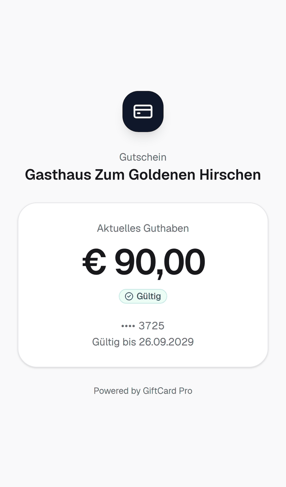

# Vaša poklon kartica: kako funkcioniše

*Informacija za goste. Restorani mogu koristiti ovaj tekst na svojoj web stranici, kao obavještenje ili kao prilog uz karticu. Podatke u uglastim zagradama zamijenite vlastitim.*

---

Drago nam je da u rukama držite poklon karticu restorana **[Naziv restorana]** – bilo da ste je sami kupili ili dobili na poklon. Ovdje ćete naći sve što trebate znati.

## Šta je ova kartica?

Vaša poklon kartica je vrijednosni poklon bon restorana [Naziv restorana] u formatu bankovne kartice. Ima mali **NFC čip** (kao kod beskontaktnih bankovnih kartica), a na zadnjoj strani **QR kod** i **16-cifreni broj kartice**.

Na samoj kartici **nije sačuvan novac niti lični podaci** – samo nasumičan, zaštićen link. Vaše stanje sigurno vodimo mi. Zato kartica radi bez baterije i bez aplikacije.

## Koliko je još na kartici?

Svoje stanje možete u svakom trenutku sami provjeriti, vlastitim telefonom:

- **iPhone:** prislonite karticu na gornju ivicu iPhonea i dodirnite obavještenje koje se pojavi.
- **Android:** uključite NFC (obično u brzim postavkama) i prislonite karticu na zadnju stranu telefona.
- **Svaki telefon s kamerom:** skenirajte QR kod na zadnjoj strani.

Otvara se stranica restorana [Naziv restorana] s Vašim **trenutnim stanjem**, **statusom** kartice i – ako postoji – **rokom važenja**. Ne morate se nigdje prijavljivati niti išta instalirati.

## Kako da iskoristim karticu?

Sasvim jednostavno: pokažite karticu pri plaćanju. Naš tim je kratko prisloni na telefon, ukuca iznos – i gotovo. To traje samo nekoliko sekundi.

- Možete iskoristiti **i samo dio** iznosa. Ostatak ostaje na kartici za Vašu sljedeću posjetu. [Ako je restoran isključio djelimično iskorištavanje: prilagodite ovu tačku.]
- Ako je račun veći od stanja, ostatak jednostavno platite kao i obično.
- Nakon iskorištavanja reći ćemo Vam preostalo stanje.
- [Opciono: karticu možete kod nas ponovo dopuniti – lijep poklon za sljedeći put.]
- [Isplata u gotovini: prema uslovima korištenja poklon bona restorana [Naziv restorana].]

## Kartica izgubljena ili oštećena?

Molimo Vas da nam se javite što prije:

**[Naziv restorana]** · [Telefon] · [E-mail] · [Adresa]

Ako je moguće, navedite **broj kartice** (nalazi se na zadnjoj strani) ili **ime** pod kojim je kartica kupljena. Tada možemo odmah blokirati karticu i Vaše stanje prenijeti na **novu karticu**. Stara kartica nakon toga više ne radi – ni ako je neko drugi pronađe.

> **Naš savjet:** Fotografišite zadnju stranu Vaše kartice s brojem kartice. Bez broja kartice i bez imena karticu nažalost ne možemo jednoznačno pronaći.

## Koliko dugo kartica važi?

[Varijanta A – bez roka:] Vaša poklon kartica važi **bez vremenskog ograničenja**. Možete je iskoristiti kad god želite.

[Varijanta B – s rokom, samo nakon pravne provjere:] Rok važenja nalazi se na zadnjoj strani kartice i na stranici sa stanjem. [Pravilo nakon isteka prema uslovima korištenja.] Ako ste pri kupovini naveli e-mail adresu, podsjetit ćemo Vas 30 dana prije isteka.

Potpune uslove korištenja poklon bona naći ćete na [link / obavještenje u restoranu].

## Ukratko o zaštiti podataka

- Poklon karticu možete kupiti **bez navođenja ličnih podataka**.
- Ako pri kupovini navedete ime, e-mail ili broj telefona, koristimo ih samo da Vam pošaljemo potvrde i obavještenja o Vašoj kartici i da karticu pronađemo u slučaju gubitka.
- Voditelj obrade Vaših podataka je **[puni naziv firme restorana, adresa]**. Za to koristimo sistem poklon bonova GiftCard Pro kao izvršitelja obrade; podaci se čuvaju u data centrima u Njemačkoj (EU).
- Stranica sa stanjem ne koristi reklamne ni analitičke kolačiće.
- U svakom trenutku možete zatražiti informaciju o svojim podacima ili njihovo brisanje: [E-mail]. Vaše stanje pritom ostaje sačuvano.
- Detaljne informacije: [link na izjavu o zaštiti podataka].

## Česta pitanja

**Treba li mi aplikacija?**
Ne. Vaš telefon otvara stranicu sa stanjem direktno u pregledniku.

**Moj telefon ne reaguje na karticu.**
Ne može svaki telefon čitati NFC, a kod Androida NFC mora biti uključen. Jednostavno skenirajte QR kod kamerom.

**Mogu li karticu pokloniti dalje?**
Da. Kartica važi za osobu koja je pokaže – kao novčanica. Zato je, molimo Vas, pažljivo čuvajte.

**Mogu li karticu koristiti u drugom restoranu?**
Kartica važi samo u restoranu [Naziv restorana] [po potrebi: i na sljedećim lokacijama: …].

**Mogu li platiti s više kartica?**
Da, iskoristit ćemo jednu karticu za drugom.

**Može li neko kopirati moju karticu?**
Na kartici nije sačuvan novac, a svako iskorištavanje provjeravamo i bilježimo. Izgubljenu karticu ipak odmah prijavite – tada ćemo je blokirati.

**Stranica sa stanjem pokazuje „blokirana“.**
Molimo Vas da nam se javite – to se obično brzo razjasni.

**Mogu li karticu kupiti online?**
Poklon kartice dobijate direktno kod nas u restoranu. [Po potrebi: moguće naručiti i telefonom na …]

---

Radujemo se Vašoj posjeti.

**[Naziv restorana]** · [Adresa] · [Telefon] · [E-mail] · [Web stranica]

---

Verzija 1.0 · Stanje: septembar 2026.
