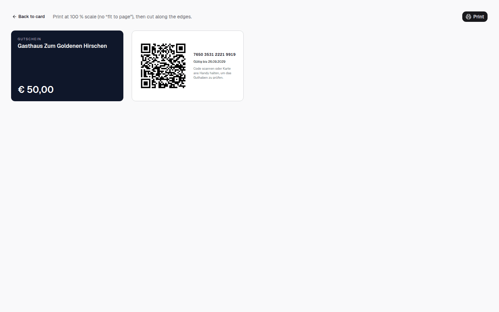
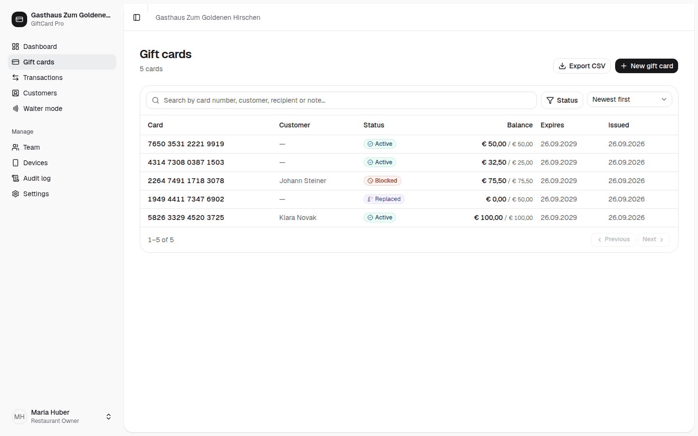
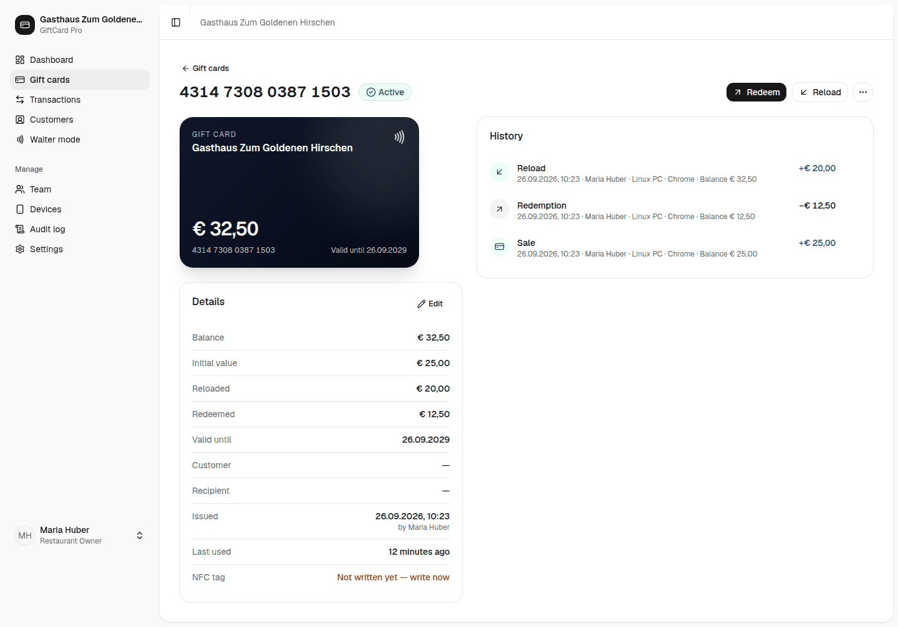

# Priručnik za menadžere

*Svakodnevni rad s GiftCard Pro: prodaja i priprema kartica, iskorištavanje i dopuna, ispravljanje grešaka, gubitak i blokiranje, istekle kartice, podaci o kupcima i primopredaja između smjena.*

Korisnički interfejs trenutno je na engleskom. Dugmad su ovdje napisana tačno onako kako ih vidite, a kod prvog pojavljivanja s prijevodom, npr. **„Redeem“** (iskoristi).

---

## 1. Vaša prava kao menadžera

S ulogom **Manager** smijete: prodavati kartice, upisivati NFC čipove, iskorištavati, dopunjavati, prenositi stanje, zamjenjivati kartice, blokirati ih, deblokirati i proglašavati isteklim, stornirati i izvoziti knjiženja, upravljati kupcima te pregledati zapisnik aktivnosti i uređaje.

Samo vlasnik / vlasnica smije: mijenjati postavke, pozivati ili deaktivirati članove tima, blokirati uređaje (**„Revoke“**) i upravljati API tokenima.

---

## 2. Prodaja kartice

1. **„Gift cards“** (poklon kartice) → **„New gift card“** (nova poklon kartica). Ili direktno u **„Dashboard“** gore desno.
2. **„Value“** (vrijednost): dodirnite 25, 50, 75, 100 ili 150 € – ili upišite vlastiti iznos pod **„Amount“** (iznos).
3. **„Valid until“** (važi do): prikazuje standardni rok važenja Vašeg restorana. Mijenjajte samo ako to odredi vlasnik / vlasnica.
4. **„Customer“** (kupac):
   - **„Anonymous“** (anonimno) – bez podataka, najbrža varijanta;
   - **„Existing“** (postojeći kupac) – potražite i izaberite;
   - **„New customer“** (novi kupac) – ime, prezime, e-mail, telefon. S e-mailom gost dobija potvrdu o kupovini.
   Savjet: zamolite za e-mail adresu. Kod gubitka ćete karticu tada pronaći po imenu.
5. **„Recipient name“** (ime primaoca): štampa se na kartici, npr. „Za baku Anu“.
6. **„Card type“** (tip kartice): prema isporuci kartica – u pravilu **NTAG215**; **QR only** za papirne kartice.
7. **„Activate immediately“** (odmah aktiviraj): ostavite uključeno.
8. **„Internal notes“** (interne bilješke): vidljive samo Vašem timu, npr. „Proslava firme Müller, račun br. 123“.
9. **„Create card“** (kreiraj karticu).
10. **Otkucajte u fiskalnoj kasi** – tipka „Prodaja poklon bona“ prema uputama Vašeg poreznog savjetnika. GiftCard Pro nije fiskalna kasa i ne izdaje račun.

---

## 3. Upisivanje NFC čipa ili štampanje kartice

Nakon **„Create card“** pojavljuje se **„Card created“** (kartica kreirana) s korakom **„Program the card“** (programiraj karticu).

### Android telefon s Chromeom (preporučeno)

1. Pritisnite **„Write NFC tag“** (upiši NFC čip).
2. Praznu karticu prislonite ravno na gornji dio zadnje strane telefona, otprilike jednu sekundu.
3. Telefon provjerava da li je čip slobodan, prepoznaje tip čipa (NTAG213/215/216), upisuje link, ponovo ga čita radi kontrole i tek tada sprema serijski broj čipa za zaštitu od kopiranja. Po želji se čip nakon toga zaključava (**„Lock tag after writing“**).
4. Ako čip već pripada drugoj kartici, ništa se ne upisuje i prikazuje se broj te kartice.

**Mnogo kartica odjednom:** **Gift cards → „Program NFC tags“** redom prikazuje svaku karticu bez čipa; za svaku karticu prislonite jedan prazan čip na telefon i označite ga prikazanim brojem kartice.

### iPhone ili računar

1. Kopirajte prikazani link.
2. NFC aplikacijom (npr. *NFC Tools*) upišite na karticu **URL zapis** s tim linkom, po želji zaključajte.
3. Odaberite tip čipa i kliknite **„Mark as written“** (označi kao upisano). Kartica se vodi kao „neprovjerena“; bez provjere se serijski broj ne sprema i zaštita od kopiranja za tu karticu ne djeluje.

### Štampanje QR kartice

**„Print“** (štampaj) otvara predložak u veličini bankovne kartice (85,6 × 54 mm): prednja strana s restoranom, vrijednošću, primaocem; zadnja strana s QR kodom, brojem kartice, rokom važenja i uputom za skeniranje. Kasnije dostupno preko kartice → **⋯ → „Print card / QR“**.

Zatim: **„Open card“** (otvori karticu) ili **„Create another“** (kreiraj još jednu).

**Testirajte karticu prije predaje:** kratko je prislonite na službeni telefon – kartica se mora otvoriti s tačnim iznosom.

---

## 4. Pronalaženje kartice

**„Gift cards“** → polje za pretragu: broj kartice (i samo posljednje cifre), ime kupca, ime primaoca ili bilješka.

- **Filter statusa:** Active, Inactive, Redeemed, Blocked, Expired, Replaced.
- **Sortiranje:** „Newest first“ (najnovije prvo), „Highest balance“ (najveće stanje), „Expiring soonest“ (prve ističu), „Recently used“ (nedavno korištene) i dr.
- Ili jednostavno prislonite karticu na službeni telefon.

---

## 5. Iskorištavanje i dopuna na pultu

Otvorite karticu, zatim:

- **„Redeem“** (iskoristi): iznos, opciono **„Reference“** (referenca, npr. sto 12 ili broj računa) i **„Note“** (bilješka) → potvrdite.
- **„Reload“** (dopuni): unesite iznos → potvrdite. Moguće samo ako je dopuna dozvoljena. **U fiskalnoj kasi otkucajte kao prodaju poklon bona.**
- **„History“** (historija): svako knjiženje s vremenom, osobom, uređajem i stanjem nakon toga.

Za stolom konobari brže iskorištavaju preko **„Waiter mode“** (konobarski način rada) – vidi Kratko uputstvo za konobare.

---

## 6. Ostale radnje u meniju ⋯

| Radnja | Za šta |
|---|---|
| **„Activate“** (aktiviraj) | aktivirati karticu kreiranu bez **„Activate immediately“** |
| **„Edit details“** (uredi detalje) | promijeniti kupca, primaoca, bilješke, rok važenja |
| **„Write NFC tag“** | (ponovo) upisati čip |
| **„Print card / QR“** | ponovo otvoriti predložak za štampu |
| **„Transfer balance“** (prenesi stanje) | prebaciti stanje na drugu karticu (**„Target card number“** – broj ciljne kartice) |
| **„Replace lost card“** (zamijeni izgubljenu karticu) | vidi odjeljak 7 |
| **„Block card“** / **„Unblock“** (blokiraj / deblokiraj) | vidi odjeljak 8 |
| **„Expire now“** (odmah proglasi isteklom) | zatvoriti karticu i isknjižiti preostali iznos – samo nakon dogovora s vlasnikom / vlasnicom (vidi odjeljak 10) |

---

## 7. Zamjena izgubljene ili oštećene kartice

1. Pronađite karticu: po broju kartice (gost ima fotografiju?), imenu kupca ili imenu primaoca. Bez broja kartice i bez podataka o kupcu kartica se u pravilu ne može jednoznačno odrediti – tada zamjena nije moguća.
2. Otvorite karticu → **⋯ → „Replace lost card“**.
3. Izaberite razlog: **„Lost“** (izgubljena), **„Damaged“** (oštećena) ili **„Stolen“** (ukradena).
4. Stanje odmah prelazi na **novu karticu s novim brojem**. Stara kartica od tog trenutka ne radi i na kasi pokazuje „replaced“ (zamijenjena).
5. Upišite ili odštampajte novu karticu (odjeljak 3) i predajte je gostu.

Zamjena **nije novi prihod** – u fiskalnoj kasi se za to ništa ne kuca (u slučaju sumnje uskladite s poreznim savjetnikom).

---

## 8. Blokiranje i deblokiranje

**Blokirajte** kada: gost prijavi gubitak, a još nije jasno hoće li se kartica zamijeniti; prijavljena je krađa; korištenje je sumnjivo; u zapisniku aktivnosti pojavi se sigurnosno upozorenje.

Otvorite karticu → **⋯ → „Block card“** → navedite razlog (npr. „Reported lost“, „Reported stolen“, „Suspicious use“). Blokirana kartica se na svakoj kasi odbija crvenom porukom. Stanje ostaje nepromijenjeno.

**Deblokiranje:** **⋯ → „Unblock“**, kada se slučaj razjasni (npr. kartica je pronađena).

---

## 9. Ispravljanje grešaka (storno)

Iskorišten ili dopunjen pogrešan iznos?

1. U **„Transactions“** (transakcije) ili u historiji kartice pronađite pogrešno knjiženje.
2. ↺ **„Reverse“** (storniraj) → upišite razlog → potvrdite.
3. Ispravka se čuva kao **protuknjiženje**. Prvobitno knjiženje ostaje vidljivo. Ništa se ne briše.
4. Zatim ponovo knjižite tačan iznos.
5. Na odgovarajući način ispravite fiskalnu kasu.

Nije moguće kod kartica sa statusom **Replaced** ili **Expired**. U tim slučajevima: obavijestite vlasnika / vlasnicu.

---

## 10. Istekle kartice

Ako kartica ima postavljen rok važenja, GiftCard Pro je u noći nakon isteka (u 00:15) prebacuje na **Expired** (istekla) i isknjižava preostali iznos. Na kasi se pojavljuje „This card has expired.“

> **Pravna napomena:** U Austriji je ograničenje plaćenih poklon bonova na tri godine ili manje u općim uslovima poslovanja prema sudskoj praksi OGH u pravilu ništavo; tada važi rok od 30 godina. Gost s isteklom karticom može dakle i dalje imati zahtjev.
>
> *Ovo nije pravni savjet – provjerite s Vašim advokatom.*

**Postupak:**

1. Gosta ljubazno primite – ne odbijajte ga. Otvorite karticu u **„Gift cards“**.
2. U **„History“** pogledajte isknjiženi iznos (knjiženje „Expiration“).
3. Prema uputama vlasnika / vlasnice: izdajte **„New gift card“** na taj iznos, u **„Internal notes“** zabilježite: „Zamjena za isteklu karticu [broj]“. Nova kartica se u dnevniku knjiženja pojavljuje kao prodaja – obavijestite vlasnika / vlasnicu kako bi je porezni savjetnik pravilno rasporedio. U fiskalnoj kasi knjižite tek prema uputama poreznog savjetnika.

**Bolje je spriječiti:** jednom sedmično sortirajte listu kartica sa **„Expiring soonest“**. Kartice koje uskoro ističu produžite preko **⋯ → „Edit details“** → **„Valid until“** – to je moguće samo dok kartica još nije istekla.

---

## 11. Kupci

**„Customers“** (kupci): lista svih evidentiranih gostiju. Otvorite kupca → sve kartice tog gosta sa stanjem i rokom važenja; uređivanje kontakt podataka.

- Evidentirajte samo podatke koje gost dobrovoljno navede.
- Ako gost želi brisanje svojih podataka, proslijedite to vlasniku / vlasnici (funkcija **„Anonymize customer“**).
- Ne dajte podatke o kupcima telefonom bez jednoznačne identifikacije osobe.

---

## 12. Dnevne i sedmične kontrole

### Dnevno (5 minuta, na kraju smjene)

- **„Dashboard“** → **„Redeemed this month“** (danas iskorišteno) uporedite s načinom plaćanja „poklon bon“ u fiskalnoj kasi.
- Preletite **„Recent activity“**: neuobičajeni iznosi, storna?
- Nove prodane kartice evidentirane u oba sistema?

### Sedmično (15 minuta)

- **„Audit log“** (zapisnik aktivnosti): provjerite crveno označena **„Security alert“** (sigurnosna upozorenja).
- **„Gift cards“** → status **Blocked**: razjasnite otvorene slučajeve.
- **„Gift cards“** → **„Expiring soonest“**: kartice koje uskoro ističu.
- **„Transactions“**: storna ove sedmice s razlogom – jesu li uvjerljiva?
- **„Devices“**: jesu li svi uređaji poznati? Nepoznat uređaj → vlasnik / vlasnica (**„Revoke“**).
- Kartice i materijal za štampu: ima li dovoljno praznih kartica?

---

## 13. Primopredaja između smjena

Kratka bilješka za sljedeću smjenu (knjiga primopredaje ili poruka):

- [ ] Otvoreni slučajevi: blokirane kartice, izgubljene kartice, gosti koji se trebaju javiti
- [ ] Storna u ovoj smjeni i razlog
- [ ] Problemi s telefonima, NFC-om ili WLAN-om
- [ ] Novi zaposleni koji još nemaju pristup (nikad ne dajte vlastiti pristup)
- [ ] Broj praznih kartica

**Izgubljen telefon?** Odmah nazovite vlasnika / vlasnicu: **„Devices“** → **„Revoke“** trenutno blokira uređaj.

---

## 14. Česta pitanja

**Gost želi ostatak isplaćen u gotovini.** O tome odlučuje vlasnik / vlasnica prema uslovima korištenja poklon bona. U GiftCard Pro se isplata knjiži kao iskorištavanje.

**Iznos je veći od stanja.** Iskoristite cijelo stanje (**„Full balance“**), ostatak naplatite gotovinom ili karticom.

**„No connection to the server“.** Ništa nije knjiženo. Provjerite WLAN, pritisnite ponovo. GiftCard Pro nikad ne knjiži dvaput.

**Kartica drugog restorana.** Odbija se: „This is not one of our gift cards.“

---

Verzija 1.0 · Stanje: septembar 2026.
