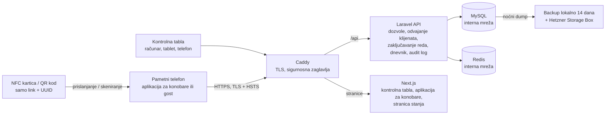

# GiftCard Pro – Bijela knjiga o sigurnosti

*Kako GiftCard Pro štiti stanje na poklon karticama, podatke gostiju i poslovanje Vašeg restorana – za vlasnike i vlasnice, njihovu IT podršku, porezne savjetnike i partnere.*

---

## 1. Sažetak

Poklon kartica je novac. Zato sigurnost u GiftCard Pro nije dodatna funkcija, nego prvi zahtjev kod svake odluke o dizajnu. Ovaj dokument opisuje zaštitne mjere koje su u proizvodu stvarno implementirane – ni više ni manje.

Najvažnije ukratko:

| Oblast | Implementacija |
|---|---|
| Kartica | Na čipu i u QR kodu nalazi se samo link sa slučajnim identifikatorom (UUID v4, 122 bita slučajnosti). Bez stanja, bez ličnih podataka. |
| Zaštita od kopiranja | NTAG21x: vezivanje za serijski broj čipa (UID). NTAG 424 DNA: kriptografski potpis (AES-CMAC) i brojač dodira pri svakom prislanjanju. |
| Knjiženja | Svaka promjena stanja je atomarna (zaključavanje reda u bazi podataka), idempotentna (nema dvostrukog knjiženja kod dvostrukog dodira ili greške mreže) i upisuje se u nepromjenjivi dnevnik. Testirano s 20 istovremenih iskorištavanja na jednoj kartici. |
| Odvajanje klijenata | Svaki restoran vidi isključivo svoje podatke; odvajanje se provodi na više nivoa. |
| Prijava | Lozinke s najmanje 12 znakova, zaključavanje računa nakon 10 neuspjelih pokušaja, sesije vezane za uređaj, izgubljeni uređaji se mogu odmah blokirati. |
| Prijenos i web | Samo HTTPS (TLS, HSTS), Content Security Policy, sigurnosna zaglavlja, CSRF zaštita, bez CORS-a. |
| Zaštita podataka | Hosting kod Hetzner Online GmbH u data centrima u Njemačkoj (EU). Minimizacija podataka, anonimizacija prema GDPR-u, bez kolačića za praćenje u aplikaciji. |
| Sljedivost | Zapisnik aktivnosti (audit log) za svaku radnju relevantnu za sigurnost i novac; ništa se ne briše. |
| Razvoj | 113 automatizovanih backend testova, statička analiza (Larastan nivo 8), provjera zavisnosti u CI-ju, test prihvatljivosti u pregledniku i skeniranje pristupačnosti (WCAG 2.1 AA). |

**Transparentnost:** GiftCard Pro trenutno **nije** certificiran prema ISO 27001, SOC 2 ili PCI DSS, a do sada **nije** proveden penetracijski test od strane vanjskog pružaoca usluga. Testovi opterećenja i napada spomenuti u ovom dokumentu provedeni su interno. PCI DSS nije relevantan za GiftCard Pro jer se ne obrađuju podaci platnih kartica – poklon kartice nisu platne kartice, a GiftCard Pro ne obrađuje plaćanja.

---

## 2. Sigurnosni principi

1. **Kartica ne nosi vrijednost ni lične podatke.** Sadrži samo link oblika `https://app.giftcardpro.at/c/<slučajni UUID>`.
2. **Server je jedini izvor istine.** Stanje, historija i podaci o kupcima nalaze se isključivo na serveru. Svaka promjena je zaključana, atomarna, idempotentna i proknjižena u dnevniku.
3. **Podrazumijevano odbijanje.** Svako sučelje zahtijeva određenu dozvolu. Povezivanje s restoranom odvija se automatski i provjerava se više puta.
4. **Ništa se ne briše.** Umjesto brisanja postoje blokiranje, deaktivacija, storno knjiženja i anonimizacija. Dnevnik i zapisnik aktivnosti se mogu samo proširivati.
5. **Više linija odbrane.** Provjere u korisničkom sučelju služe samo za udobnost; server ponovo i potpuno provjerava svaki zahtjev.
6. **Štedljivost s podacima.** Podaci o gostima su neobavezni. Kartica se može prodati potpuno anonimno.

---

## 3. Arhitektura i tok podataka

GiftCard Pro je cloud aplikacija (Software as a Service). Sve komponente rade u serverskom okruženju kod Hetznera u Njemačkoj:

- **Caddy** kao jedini servis dostupan izvana (portovi 80 i 443): završava TLS, postavlja sigurnosna zaglavlja, prosljeđuje zahtjeve.
- **Laravel 12 / PHP 8.4** kao programsko sučelje (API) s kompletnom poslovnom logikom.
- **Next.js 15** za kontrolnu tablu (dashboard), aplikaciju za konobare i javnu stranicu za provjeru stanja.
- **MySQL 8.4** za sve trajne podatke (kartice, dnevnik, zapisnik aktivnosti).
- **Redis** za sesije, keš, redove čekanja i zaključavanja.

Baza podataka i Redis dostupni su samo u internoj mreži, ne s interneta. Kontrolna tabla i API rade na **istoj adresi** (origin). Zbog toga nije potrebno odobrenje za strane web stranice (CORS), a prijava se može odvijati preko kolačića sesije koji skripte ne mogu pročitati.

**Tok iskorištavanja kartice:**

1. Konobar prisloni karticu na telefon (Android: Web NFC; iPhone: sistemsko obavještenje; alternativno QR kod ili broj kartice).
2. Aplikacija šalje pročitani link serveru – kod Androida dodatno serijski broj čipa, kod NTAG 424 DNA kriptografski potpis.
3. Server provjerava pripadnost restoranu, status kartice, zaštitu od kopiranja i ograničenja protiv zloupotrebe te vraća karticu.
4. Konobar unosi iznos i potvrđuje. Aplikacija šalje knjiženje s jedinstvenim **ključem idempotentnosti**.
5. Server zaključava red kartice u bazi podataka, provjerava stanje i pravila, upisuje knjiženje u dnevnik, ažurira stanje, upisuje zapis u audit log i tek onda potvrđuje.

---

## 4. Odvajanje klijenata

Svi restorani dijele jednu bazu podataka; svaki red koji pripada restoranu nosi njegov identifikator. Odvajanje se provodi na više nivoa:

1. Nakon prijave restoran korisnika se vezuje za zahtjev.
2. Svaki upit bazi podataka automatski se ograničava na taj restoran.
3. Ako kod pokuša upisati ili premjestiti zapis u strani restoran, aplikacija prekida rad s greškom.
4. Identifikatori stranih zapisa u adresama ponašaju se kao nepostojeći zapisi (odgovor „nije pronađeno" – ne otkriva se da postoje).
5. Sučelja restorana odbijaju rad ako restoran nije povezan – nedostajuće povezivanje nikada ne može proširiti upit na sve restorane.
6. Provjere unosa i poslovna logika dodatno provjeravaju pripadnost.

Ako konobar skenira karticu drugog restorana, skeniranje se odbija i bilježi, bez navođenja drugog restorana. Ova pravila su trajno osigurana automatizovanim testovima (`TenantIsolationTest`).

---

## 5. Sigurnost kartica

### 5.1 Link umjesto stanja

Na čipu se nalazi isključivo NDEF link sa slučajnim UUID v4 (122 bita slučajnosti). Ta vrijednost se praktično ne može pogoditi. 16-cifreni broj kartice također se generiše slučajno (ne redom) i sadrži Luhn kontrolnu cifru protiv grešaka u kucanju. Očitavanje kartice ne otkriva ni stanje ni ime.

Ako se kartica prijavi kao izgubljena, **„Replace lost card"** kreira novu karticu s novim identifikatorom; stanje prelazi na nju, a stara kartica od tog trenutka više ne radi.

### 5.2 Zaštita od pogađanja

Neuspjeli i sumnjivi upiti za kartice (nije pronađena, strana kartica, pogrešan serijski broj čipa, nevažeći potpis, ponovljeni potpis) ograničeni su na 10 u 5 minuta po korisniku i po IP adresi. Svaki pokušaj se bilježi; sumnjivi rezultati se dodatno upisuju kao upozorenje u zapisnik aplikacije. Javna stranica za provjeru stanja ograničena je na 20 upita u minuti po IP adresi i može se isključiti za svaki restoran.

### 5.3 NTAG213/215/216: vezivanje za serijski broj čipa

Svaki NTAG21x čip ima tvornički upisan serijski broj (UID). Pri upisu preko Androida i Chromea GiftCard Pro prvo provjerava da li čip ili link na njemu već pripada drugoj kartici, zatim upisuje link, ponovo čita čip i sprema serijski broj tek kada pročitani link tačno odgovara. Kartice upisane drugom NFC aplikacijom vode se kao „neprovjerene“ i njihov serijski broj se ne sprema. Ako kasnije skeniranje isporuči drugi serijski broj, odbija se (zaštita od kopiranja, može se isključiti u postavkama) i u zapisniku aktivnosti označava kao sigurnosno upozorenje. Jedan čip ne može biti vezan za dvije aktivne kartice – to osigurava sama baza podataka (jedinstveni indeks, na cijeloj platformi). Svaki pokušaj programiranja se bilježi, i odbijeni i neuspjeli. Opcionalno se čip nakon upisa trajno zaključava za pisanje („Lock tags after writing").

**Ograničenja:** Postoje specijalni čipovi čiji se serijski broj može mijenjati. iPhone, QR kod i ručni unos ne prenose serijski broj. Zato za visoke vrijednosti kartica preporučujemo NTAG 424 DNA.

### 5.4 NTAG 424 DNA: kriptografski dokaz autentičnosti

NTAG 424 DNA čipovi (Secure Unique NFC, SUN) pri **svakom** prislanjanju generišu novi, šifrovani dodatak linku: serijski broj i brojač dodira, zaštićene AES-CMAC potpisom. Server

- dešifruje te podatke i provjerava potpis,
- zahtijeva da brojač bude **strogo veći** nego kod posljednjeg prihvaćenog prislanjanja (provjereno atomarno).

Presretnut ili kopiran link je time bezvrijedan nakon jedne upotrebe, a kopija bez ključa ne može proizvesti važeći potpis. Za svaki čip se izvodi poseban ključ: čak i kad bi se ključ jednog čipa očitao, bio bi pogođen samo taj jedan čip. Implementacija je provjerena prema zvaničnim testnim vektorima proizvođača NXP (AN12196). Provjera radi na Androidu i iPhoneu.

---

## 6. Integritet knjiženja

| Mjera | Učinak |
|---|---|
| **Zaključavanje reda** (`SELECT … FOR UPDATE`) unutar transakcije baze podataka | Istovremena iskorištavanja iste kartice obrađuju se jedno za drugim. Stanje se uvijek čita iz zaključanog reda, nikada iz zahtjeva. |
| **Ključ idempotentnosti** (obavezan kod iskorištavanja, dopune, prijenosa) | Dvostruki dodir ili ponavljanje zbog mreže vraća izvorno knjiženje umjesto da knjiži drugi put. Ako se isti ključ koristi za drugo knjiženje, server odbija. |
| **Nepromjenjivi dnevnik** | Knjiženja se nikada ne mijenjaju ni brišu. Uvijek važi: stanje = zbir svih knjiženja kartice. |
| **Storno kao protuknjiženje** | Pogrešno iskorištavanje ili dopuna ispravlja se protuknjiženjem; izvorno knjiženje ostaje vidljivo. |
| **Nema negativnog stanja** | Kolona u bazi podataka ne dozvoljava negativne vrijednosti. Iznosi se čuvaju kao cijeli centi, nikada kao broj s pomičnim zarezom. |
| **Fiksni redoslijed zaključavanja kod prijenosa** | Suprotni prijenosi (A→B i B→A) ne blokiraju jedan drugog. |
| **Ograničenja protiv zloupotrebe** | Maksimalan broj iskorištavanja po kartici na sat (standardno 10), maksimalan pojedinačni iznos, maksimalno stanje kartice, djelimično iskorištavanje i dopuna se mogu isključiti. |

**Interni test:** U interno provedenom testu opterećenja nad stvarnom bazom podataka sa zaključavanjem redova provjereni su 20 istovremenih iskorištavanja jedne kartice, 10 zahtjeva s istim ključem idempotentnosti (tačno jedno knjiženje) i suprotni prijenosi (bez zastoja, zbirovi očuvani). Trajni automatizovani testovi također pokrivaju ove slučajeve.

---

## 7. Prijava i sesije

- **Lozinke:** najmanje 12 znakova, velika i mala slova te cifra. U produkcijskom okruženju dodatno se odbijaju lozinke iz poznatih curenja podataka (provjera putem k-anonimnog postupka servisa „Have I Been Pwned"; server napušta samo prvih pet znakova hash vrijednosti, nikada lozinka). Sprema se samo bcrypt hash. Detalji: [Politika lozinki](password-policy.md).
- **Zaštita od isprobavanja:** 5 pokušaja prijave u minuti po e-mail adresi i IP adresi, 30 u minuti po IP adresi; nakon 10 uzastopnih neuspjelih pokušaja račun se zaključava na 15 minuta. Poruke o greškama ne otkrivaju postoji li e-mail adresa; i „Forgot password?" uvijek odgovara isto.
- **Pozivnice umjesto lozinki:** Novi članovi tima dobijaju e-mailom jednokratni link (važi 72 sata) i sami biraju lozinku. Linkovi za resetovanje lozinke važe 60 minuta. Lozinke se nikada ne šalju e-mailom.
- **Vezivanje za uređaj:** Svaki uređaj koji se prijavi automatski se registruje. Sesija je vezana za uređaj na kojem je započeta – kopirani kolačić sesije na drugom uređaju je beskoristan. Blokirani uređaj se odmah odbija.
- **Trajanje sesije:** Sesije ističu nakon 8 sati neaktivnosti, osim ako je svjesno odabrano „Keep me signed in on this device".
- **Promjena lozinke** odjavljuje sve druge sesije. **Deaktivacija** korisnika opoziva sve njegove API tokene i završava njegove sesije.

---

## 8. Dozvole

GiftCard Pro poznaje četiri uloge: administracija platforme (operater), vlasnik/vlasnica (Owner), menadžer (Manager) i konobar/konobarica (Waiter). Svako sučelje zahtijeva konkretnu dozvolu. Konobari standardno smiju samo skenirati i iskoristiti kartice. Menadžeri vode dnevno poslovanje, ali ne upravljaju ni timom ni postavkama ni API tokenima. Dodatna zaštitna pravila:

- Niko ne može promijeniti svoju vlastitu ulogu niti deaktivirati sam sebe.
- Restoran uvijek zadržava najmanje jednog aktivnog vlasnika ili vlasnicu.
- Uloga „administracija platforme" ne može se dodijeliti ni u jednom restoranu.
- API tokeni nikada ne mogu imati više dozvola od osobe koja ih je kreirala.

Kompletnu matricu dozvola pronaći ćete u [Vodiču za kontrolu pristupa](access-control-guide.md).

**Pristup od strane pružaoca usluge:** Zaposleni u GiftCard Pro vide podatke restorana samo preko funkcije platforme „Open restaurant". Pri tome baner jasno pokazuje radni način, a svaka radnja se bilježi u zapisniku aktivnosti s identitetom osobe koja djeluje.

---

## 9. Sigurnost prijenosa i weba

| Mjera | Detalji |
|---|---|
| HTTPS | Isključivo šifrovane veze; certifikati automatski preko Caddyja (Let's Encrypt), podržan HTTP/3. |
| HSTS | `max-age` dvije godine, uklj. poddomene, preload – preglednici se nikada ne povezuju nešifrovano. |
| Content Security Policy | Web sučelje: sadržaji u principu samo s vlastite adrese; API: `default-src 'none'`. Ugrađivanje u strane stranice zabranjeno (`frame-ancestors 'none'`, `X-Frame-Options: DENY`). |
| Ostala zaglavlja | `X-Content-Type-Options: nosniff`, `Referrer-Policy: strict-origin-when-cross-origin`, `Permissions-Policy` (kamera i NFC samo za vlastitu aplikaciju, mikrofon i lokacija blokirani), `Cross-Origin-Opener-Policy`. |
| Kolačići | Kolačić sesije `httpOnly` (skripte ga ne mogu pročitati), šifrovan, `Secure`, `SameSite=Lax`. |
| CSRF | Dvostruka provjera tokena preko kolačića `XSRF-TOKEN`. |
| CORS | Deaktiviran: nijedna strana web stranica ne smije pozivati API u ime prijavljene osobe. |
| Keširanje | API odgovori s `Cache-Control: no-store, private`. |
| Unosi | Pristup bazi podataka isključivo s vezanim parametrima (zaštita od SQL injekcije); React maskira izlaz (zaštita od XSS-a); e-mail predlošci maskiraju svaki placeholder; CSV izvozi neutrališu formule. |
| IP adrese | Proslijeđene adrese prihvataju se samo iz privatnih mrežnih opsega – napadači ne mogu lažirati svoju IP adresu kako bi zaobišli ograničenja. |

---

## 10. Zaštita podataka

- **Uloge prema GDPR-u:** Za podatke o gostima i kupcima restoran je voditelj obrade; GiftCard Pro je izvršitelj obrade (čl. 28 GDPR-a) na osnovu ugovora o obradi podataka po nalogu.
- **Hosting u EU:** Hetzner Online GmbH, data centri u Njemačkoj. Podizvršitelji obrade navedeni su u ugovoru o obradi podataka po nalogu (Hetzner za hosting i backupe, `[E-Mail-Versanddienstleister mit EU-Hosting]` za transakcijske e-mailove).
- **Minimizacija podataka:** Podaci o kupcima (ime, e-mail, telefon, bilješke, marketinška saglasnost) su neobavezni. Kartice se mogu prodati anonimno.
- **Bez ličnih podataka u zapisniku aktivnosti:** Promjene imena, e-maila, telefona, bilješki ili imena primalaca bilježe se samo kao „[personal data]".
- **Anonimizacija:** Na zahtjev gosta anonimizacija uklanja sve lične podatke (uklj. imena primalaca na njegovim karticama i e-mail adrese u zapisniku slanja), a finansijski podaci potrebni za knjigovodstvo ostaju sačuvani.
- **Bez kolačića za praćenje:** Aplikacija koristi samo tehnički neophodne kolačiće (sesija, CSRF zaštita) i u memoriji preglednika slučajni identifikator uređaja. Bez analitike, bez reklama, bez kolačića trećih strana.
- **Kraj ugovora:** Izvoz podataka moguć je u svakom trenutku; brisanje 30 dana nakon kraja ugovora, osim ako postoji zakonska obaveza čuvanja.

---

## 11. Bilježenje i revizijski trag

- **Zapisnik aktivnosti (audit log):** Svaka radnja relevantna za sigurnost i novac bilježi se s osobom, uređajem, IP adresom, vremenom (mikrosekunde) i identifikatorom zahtjeva (Request-ID). Zapisi se ne mogu mijenjati ni brisati. Lozinke i tokeni se zatamnjuju.
- **Sigurnosna upozorenja** – kopirana kartica, ponovljeni NFC dodir, strana kartica, zaključan račun – u zapisniku aktivnosti su istaknuta crvenom bojom i dodatno se upisuju kao upozorenje u zapisnik aplikacije.
- **Historija kartice:** svako knjiženje i svaki događaj s vremenom, osobom, uređajem i stanjem nakon toga.
- **Zapisnik skeniranja:** Svako skeniranje kartice se bilježi, i neuspješno.
- **API tokeni:** Sprema se vrijeme i IP adresa posljednje upotrebe.

---

## 12. Sigurnosne kopije i dostupnost

- **Noćna sigurnosna kopija baze podataka** (konzistentan dump bez prekida rada), čuva se 14 dana lokalno i dodatno se prenosi na Hetzner Storage Box izvan servera.
- **Dnevni snapshotovi** cijelog servera preko Hetznera.
- **Nema konačnog brisanja** u aplikaciji; strani ključevi sprječavaju slučajno brisanje zavisnih podataka.
- **Health check** `/up` provjerava bazu podataka i keš, ne samo web server, i služi za nadzor dostupnosti.
- **Ciljne vrijednosti:** dostupnost 99,5 % mjesečno (cilj, u paketu Start bez garancije), gubitak podataka najviše 24 sata (RPO), oporavak nakon potpunog gubitka servera u roku od 4 sata (RTO, cilj). Detalji: [Plan oporavka od katastrofe](disaster-recovery-plan.md).
- **Ažuriranja** su osmišljena tako da prethodna verzija nastavlja raditi tokom uvođenja nove. Svaka verzija je označena svojim commitom i može se vratiti.

GiftCard Pro za iskorištavanje kartica zahtijeva internetsku vezu. Offline knjiženja namjerno ne postoje, jer samo server može pouzdano spriječiti dvostruka knjiženja.

---

## 13. Siguran razvoj i rad

- **Automatizovani testovi:** 113 backend testova (513 provjera) pokreće se pri svakoj promjeni, i na SQLite i na MySQL. Posebni skupovi testova pokrivaju odvajanje klijenata, dozvole, skeniranje kartica, prijavu, idempotentnost i istovremenost.
- **Statička analiza:** Larastan na nivou 8, TypeScript provjera, ESLint.
- **Zavisnosti:** `composer audit` i `npm audit` u CI pipelineu.
- **Test prihvatljivosti u pregledniku:** Automatizovani prolaz simulira prvi dan restorana u stvarnim preglednicima (uklj. zamjensku karticu i odbijanje stare kartice) i prekida se kod svake greške.
- **Pristupačnost:** axe skeniranje (WCAG 2.1 AA) bez nalaza na svim glavnim ekranima, u svijetlom i tamnom načinu.
- **Interna sigurnosna provjera:** Prije pilot rada cijeli kod je interno provjeren na sigurnosne slabosti; nalazi su dokumentovani u zapisniku promjena i otklonjeni.
- **Isporuka:** Container image-i se grade u GitHub Actions; produkcijska isporuka zahtijeva odobrenje. Pristup serveru samo putem SSH ključa, bez root prijave, firewall samo za potrebne portove, automatska sigurnosna ažuriranja operativnog sistema.
- **Tajne** (ključ aplikacije, NFC ključevi) čuvaju se u menadžeru lozinki, ne u kodu.

---

## 14. Postupanje sa sigurnosnim incidentima

GiftCard Pro ima dokumentovan proces za sigurnosne incidente s nivoima ozbiljnosti, odgovornostima i kontrolnim listama ([Vodič za odgovor na incidente](incident-response-guide.md)). Ključne tačke:

- Otkrivanje preko upozorenja u zapisniku aktivnosti, zapisnika aplikacije, nadzora dostupnosti i prijava restorana.
- Hitne mjere: blokiranje uređaja, deaktivacija korisnika, opoziv tokena, blokiranje kartica.
- **Povrede zaštite podataka:** GiftCard Pro bez nepotrebnog odgađanja obavještava pogođeni restoran kao voditelja obrade (čl. 33 st. 2 GDPR-a), kako bi on mogao ispuniti svoju obavezu prijave tijelu za zaštitu podataka u roku od 72 sata (čl. 33 st. 1 GDPR-a).
- Nakon svakog incidenta: izvještaj i mjere poboljšanja.

---

## 15. Podijeljena odgovornost

Sigurnost nastaje zajedno. Sljedeća tabela pokazuje ko je za šta nadležan.

| Oblast | GiftCard Pro (pružalac usluge) | Restoran (korisnik) |
|---|---|---|
| Server, mreža, operativni sistem | rad, ojačavanje, ažuriranja | – |
| Aplikacija | sigurnosne funkcije, otklanjanje grešaka, ažuriranja | aktivirati i koristiti sigurnosne funkcije (zaštita od kopiranja, ograničenja protiv zloupotrebe) |
| Sigurnosne kopije | noćni backupi, kopija izvan lokacije, oporavak | po potrebi vlastiti CSV izvozi |
| Korisnički računi | pravila za lozinke, zaključavanja, vezivanje za uređaj | jedan račun po osobi, jake lozinke, odlaske deaktivirati istog dana |
| Uloge | provođenje dozvola | dodjeljivati uloge po principu najmanjih prava, redovno provjeravati |
| Krajnji uređaji | – | zaključavanje ekrana, ažuriranja operativnog sistema, izgubljene uređaje odmah blokirati |
| Kartice | kriptografska provjera, UID vezivanje | tip kartice prilagoditi vrijednosti, zaključati čipove, blokirati sumnjive kartice |
| Zapisnik aktivnosti | potpuno bilježenje | redovno pregledati sigurnosna upozorenja |
| API tokeni | hashiranje, istek, opoziv | sigurno čuvati tokene, minimalna prava, opozvati one koji više nisu potrebni |
| Zaštita podataka | obrada po nalogu prema ugovoru, tehničke mjere | voditelj obrade za podatke o gostima, obaveze informisanja, prijava tijelu za zaštitu podataka |
| Kasa i porezi | – | knjiženje u fiskalnoj kasi, poreski tretman (GiftCard Pro nije fiskalna kasa) |

Praktične preporuke za restorane: [Najbolje sigurnosne prakse](security-best-practices.md).

---

## 16. Kontakt

- **Sigurnosni propusti i incidenti:** security@giftcardpro.at – odgovaramo u roku od 2 radna dana, kod aktivnih incidenata što je brže moguće.
- **Zaštita podataka:** datenschutz@giftcardpro.at
- **Podrška:** support@giftcardpro.at
- **Pružalac usluge:** [Firmenname] [Rechtsform], [Anschrift], 1xxx Wien, [Firmenbuchnummer], [UID-Nummer]

Molimo da pronađene slabosti prijavite povjerljivo i da nam date primjereno vrijeme za otklanjanje prije objavljivanja detalja. Molimo ne testirajte s podacima drugih restorana i ne ometajte rad.

---

Verzija 1.0 · Stanje: septembar 2026.
