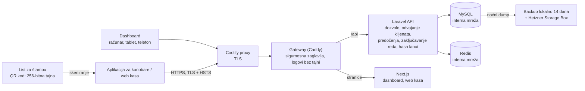

# GiftCard Pro – Bijela knjiga o sigurnosti

*Kako GiftCard Pro štiti stanje na vaučerima, podatke gostiju i poslovanje Vašeg restorana – za vlasnike i vlasnice, njihovu IT podršku, porezne savjetnike i partnere. Tehnička referenca s uputama na kod: [docs/SECURITY.md](../../SECURITY.md).*

---

## 1. Sažetak

Vaučer je novac, a podaci svakog restorana moraju biti nevidljivi svakom drugom restoranu. Zato sigurnost u GiftCard Pro nije dodatna funkcija, nego prvi zahtjev kod svake odluke o dizajnu. Ovaj dokument opisuje zaštitne mjere koje su u proizvodu stvarno implementirane – ni više ni manje.

Najvažnije ukratko:

| Oblast | Implementacija |
|---|---|
| Vaučer | QR kod za štampu nosi nasumičnu 256-bitnu tajnu, ne link, ne stanje, ne lične podatke. Server pohranjuje samo njen SHA-256 hash. |
| Iskorištavanje | Svako terećenje troši **predočenje**: dokaz da je vaučer sada ovdje – jednokratno, važi 60 sekundi, vezano za restoran, vaučer, osobu i uređaj. Broj vaučera nikada nije dokaz ovlaštenja. |
| Knjiženja | Svaka promjena stanja je atomarna (zaključavanje reda u bazi podataka), idempotentna (nema dvostrukog knjiženja kod dvostrukog dodira ili greške mreže) i upisuje se u ledger. Svaka prodaja i dopuna bilježi plaćanje. |
| Nepromjenjiva historija | Ledger, plaćanja i zapisnik aktivnosti su append-only (okidači u bazi) i po restoranu povezani hash lancima; noćna provjera ponovo izračunava svaki lanac i svako stanje. |
| Odvajanje klijenata | Svaki restoran vidi isključivo svoje podatke; odvajanje se provodi na više nivoa. |
| Prijava | Lozinke s najmanje 12 znakova, zaključavanje računa nakon 10 neuspjelih pokušaja bez odgovora koji bi ga otkrio, sesije i tokeni aplikacije vezani za uređaj, izgubljeni uređaji se mogu odmah blokirati. |
| Prijenos i web | Samo HTTPS (TLS, HSTS), Content Security Policy, sigurnosna zaglavlja, CSRF zaštita, bez CORS-a, logovi bez tajni. |
| Zaštita podataka | Hosting kod Hetzner Online GmbH u data centrima u Njemačkoj (EU). Minimizacija podataka, anonimizacija prema GDPR-u, bez kolačića za praćenje u aplikaciji. |
| Razvoj | Testovi zloupotrebe za svako pravilo zabrane, statička analiza (Larastan), testovi na SQLite i MySQL-u, provjera integriteta u CI-ju, provjera zavisnosti, test prihvatljivosti u pregledniku i skeniranje pristupačnosti (WCAG 2.1 AA). |

**Transparentnost:** GiftCard Pro **nije** certificiran prema ISO 27001, SOC 2 ili PCI DSS, a do sada **nije** proveden penetracijski test od strane vanjskog pružaoca usluga. Testovi opterećenja i napada spomenuti u ovom dokumentu provedeni su interno. PCI DSS nije relevantan za GiftCard Pro jer se ne obrađuju podaci platnih kartica – vaučeri nisu platne kartice, a GiftCard Pro ne obrađuje plaćanja; samo bilježi način plaćanja.

---

## 2. Sigurnosni principi

1. **Iskorištavanje zahtijeva dokaz prisutnosti.** Svako terećenje troši predočenje: jednokratno, 60 sekundi, vezano za osobu, uređaj, restoran i vaučer. Broj vaučera nikada nije dokaz ovlaštenja.
2. **Server je jedini izvor istine** za stanja; svaka promjena je atomarna, zaključana, idempotentna i proknjižena u ledgeru.
3. **Finansijska historija je nepromjenjiva.** Ledger, plaćanja i zapisnik aktivnosti se mogu samo proširivati (okidači u bazi) i povezani su hash lancima; noćna provjera kontroliše svaki lanac i svako stanje.
4. **Podrazumijevano odbijanje.** Svako sučelje zahtijeva dozvolu; povezivanje s restoranom odvija se automatski i provjerava se više puta; tokeni su dodatno ograničeni svojim abilities i – kod aplikacije za konobare – metodom i putanjom.
5. **Više linija odbrane.** Provjere u korisničkom sučelju služe samo za udobnost; server ponovo i potpuno provjerava svaki zahtjev.
6. **Štedljivost s podacima.** Podaci o gostima su neobavezni. Vaučer se može prodati potpuno anonimno.

---

## 3. Arhitektura i tok podataka

GiftCard Pro je aplikacija u oblaku (Software as a Service). Svi dijelovi rade kao jedan Coolify resurs na serveru kod Hetznera u Njemačkoj:

- **Coolify proxy** završava TLS za domenu; iza njega je **gateway** (Caddy) jedini servis s domenom. Postavlja sigurnosna zaglavlja, prosljeđuje `/api`, `/sanctum` i `/up` Laravelu, a sve ostalo Next.js-u, i piše access logove bez tajni.
- **Laravel 12 / PHP 8.4** kao programsko sučelje (API) s cjelokupnom poslovnom logikom.
- **Next.js 15** za dashboard i web kasu.
- **GiftCard Waiter** (Android i iPhone) kao nativna aplikacija za konobare s tokenom vezanim za uređaj.
- **MySQL 8.4** za sve trajne podatke (vaučeri, plaćanja, ledger, zapisnik aktivnosti).
- **Redis** za sesije, keš, redove čekanja i zaključavanja.

Nijedan servis ne objavljuje port na serveru; baza podataka i Redis dostupni su samo u internoj mreži. Dashboard i API rade na **istoj adresi** (origin). Zbog toga nije potrebno odobrenje za strane web stranice (CORS), a prijava u pregledniku odvija se preko kolačića sesije koji skripte ne mogu pročitati.

**Tok iskorištavanja:**

1. Konobar skenira QR kod vaučera kamerom (aplikacija za konobare ili web kasa).
2. Aplikacija šalje skenirani tekst na `POST /presentments`. Server provjerava blokadu za neuspjele pokušaje, traži hash među vaučerima **ovog** restorana, provjerava pravilo iskorištavanja za vrstu vaučera i kreira predočenje (važi 60 s, vezano za restoran, vaučer, svrhu, osobu i uređaj). Aplikacija odbrojava preostalo vrijeme.
3. Konobar unosi iznos i potvrđuje. Aplikacija šalje `POST /vouchers/{id}/redemptions` s predočenjem i jedinstvenim **ključem idempotentnosti**; pokušaj prethodno šifrovano pohranjuje na uređaju.
4. Server zaključava predočenje i vaučer u bazi, ponovo provjerava ključ, troši predočenje, provjerava status, stanje i granice, dodaje stavku ledgera i zapisnika aktivnosti u hash lance, ažurira stanje i tek tada potvrđuje.
5. Ako odgovor izostane, aplikacija pita `GET /vouchers/{id}/redemptions/{key}` – nikada ne knjiži drugi put i nikada ne prikazuje „ništa nije knjiženo“ dok je ishod nepoznat.

---

## 4. Odvajanje klijenata

Svi restorani dijele jednu bazu podataka; svaki red koji pripada restoranu nosi njegov identifikator. Odvajanje se provodi na više nivoa:

1. Nakon prijave restoran korisnika vezuje se za zahtjev.
2. Svaki upit bazi automatski se ograničava na taj restoran.
3. Ako kod pokuša upisati zapis u tuđi restoran, aplikacija prekida rad s greškom.
4. Identifikatori tuđih zapisa u adresama ponašaju se kao nepostojeći zapisi (odgovor „nije pronađeno“ – ne otkriva se da postoje).
5. Sučelja restorana odbijaju rad ako restoran nije vezan – nedostajuća veza tako nikada ne može proširiti upit na sve restorane. Administracija platforme nema restoran i zato nikada ne djeluje unutar restorana.
6. Provjere unosa i poslovna logika dodatno provjeravaju pripadnost.
7. QR kod se traži samo među vaučerima vlastitog restorana: kod drugog restorana je „nije prepoznato“ – isto kao nepoznat.

Ova pravila su trajno osigurana automatizovanim testovima (`TenantIsolationTest`).

---

## 5. Sigurnost vaučera

### 5.1 Tajna umjesto linka

QR kod za štampu sadrži `GCPV1.` i 43 base64url znaka – nasumičnu 256-bitnu tajnu. Server pohranjuje samo njen SHA-256 hash; tajna se vraća tačno jednom, u odgovoru na prodaju, i nikada se ne bilježi u log. Pošto nije link, ne završava ni u logovima web servera ni u historiji preglednika. List za štampu prikazuje QR kod i restoran, nikada broj vaučera niti vrijednost.

16-cifreni broj vaučera je nasumičan (ne redoslijedni), ima Luhn kontrolnu cifru i služi samo osoblju i podršci. Nikada se ne štampa i nikada se ne prihvata kao dokaz ovlaštenja.

Ako se vaučer prijavi kao izgubljen, restoran ga blokira; od tog trenutka ne može se iskoristiti.

### 5.2 Zaštita od pogađanja i isprobavanja

Neuspjela predočenja (skenirani tekst ništa ne dokazuje) ograničena su na 10 u 5 minuta po restoranu, osobi i uređaju – nikada po IP adresi, kako se gosti iza istog WLAN-a ne bi međusobno blokirali. Svaki neuspjeli pokušaj bilježi se u zapisniku aktivnosti (`presentment.failed`, `presentment.rejected`). Ne postoji javna stranica stanja niti javna provjera vaučera.

### 5.3 Predočenje

Svako iskorištavanje troši provjereno, neisteklo predočenje tog vaučera, koje je napravila ista osoba na istom uređaju, u istoj transakciji baze (redoslijed zaključavanja predočenje → vaučer). Predočenja su jednokratna (`verified → consumed`), važe 60 sekundi, a stavka ledgera upućuje na najviše jedno (jedinstveni indeks). Pravila iskorištavanja po vrsti: digitalni vaučeri samo QR metodom, vaučeri kartice samo živom autentifikacijom.

### 5.4 Fizičke kartice: NTAG 424 DNA sa živom autentifikacijom

Fizičke kartice predviđene su isključivo kao **NTAG 424 DNA**. Kartica se iskorištava samo nakon **žive autentifikacije**: aplikacija za konobare preko NFC-a prosljeđuje naredbe čipa **kripto servisu**, koji drži ključeve kartica u hardverskom sigurnosnom modulu i dokazuje da je pravi čip prisutan u tom trenutku. Rezultat je predočenje s metodom `live_auth` (nivo A3). Dok taj servis ne radi, server na `live_auth` odgovara s `422 PRESENTMENT_METHOD_UNAVAILABLE`; aplikacija za konobare nema NFC kod ni NFC dozvolu. Ključevi kartica nikada nisu dio konfiguracije. Detalji: [docs/NFC.md](../../NFC.md).

---

## 6. Integritet knjiženja

| Mjera | Efekat |
|---|---|
| **Zaključavanje reda** (`SELECT … FOR UPDATE`) unutar transakcije baze | Istovremena iskorištavanja istog vaučera obrađuju se jedno za drugim. Stanje se uvijek čita iz zaključanog reda, nikada iz zahtjeva. Kod deadlocka se ponavlja. |
| **Ključ idempotentnosti** (obavezan kod prodaje, iskorištavanja i dopune) | Dvostruki dodir ili ponavljanje zbog mreže vraća prvobitno knjiženje umjesto da knjiži drugi put; ključ se ponovo provjerava nakon zaključavanja reda. Isti ključ za drugo knjiženje se odbija. |
| **Upit kod nepoznatog ishoda** | Kasa čiji se odgovor izgubio pita `GET /vouchers/{id}/redemptions/{key}` umjesto da ponovo tereti. |
| **Plaćanja** | Svaka prodaja i dopuna bilježi plaćanje: gotovina, kartični terminal s brojem potvrde, bankovni transfer s referencom ili besplatno s obrazloženjem (samo s `vouchers.sell_complimentary`, standardno Owner). |
| **Nepromjenjiva historija** | Okidači u bazi odbijaju `UPDATE` i `DELETE` nad ledgerom, plaćanjima i zapisnikom aktivnosti; aplikacija ih odbija već ranije (`IMMUTABLE_RECORD`). Svaki red je dio SHA-256 hash lanca po restoranu. Uvijek važi: stanje = zbir svih knjiženja vaučera. |
| **Noćna provjera integriteta** | `giftcard:verify-chains` ponovo izračunava svaki lanac i svako stanje i uzbunjuje e-mailom kod svakog odstupanja; CI izvršava istu provjeru nad MySQL-om. |
| **Storno kao protuknjiženje** | Pogrešno iskorištavanje ili dopuna ispravlja se novom, suprotnom stavkom; najviše jednom po stavci, prvobitno knjiženje ostaje nepromijenjeno vidljivo. |
| **Nema negativnih stanja** | Kolona u bazi ne dozvoljava negativne vrijednosti. Iznosi se pohranjuju kao cijeli centi, nikada kao broj s pomičnim zarezom. |
| **Ograničenja protiv zloupotrebe** | Maksimalan iznos po iskorištavanju, po vaučeru i danu, iskorištavanja po vaučeru i satu (standard 10), maksimalno stanje – provjereno pod zaključavanjem reda; gornje granice platforme za svaku postavku. |
| **Bez gubitka novca gostiju** | Nema standardnog isteka; važenje iznosi najmanje 36 mjeseci; istek zadržava stanje, a vlasnik ili vlasnica može ponovo aktivirati vaučer. |

Automatizovani testovi (`IdempotencyAndConcurrencyTest`, i nad MySQL-om, te testovi zloupotrebe u `tests/Feature/Abuse/`) pokrivaju istovremena iskorištavanja, ponovljene ključeve, tuđa i istekla predočenja, manipulaciju historije i plaćanja bez dozvole.

---

## 7. Prijava i sesije

- **Lozinke:** najmanje 12 znakova, velika i mala slova te cifra. U produkcijskom okruženju dodatno se odbijaju lozinke iz poznatih curenja podataka (provjera preko k-anonimnog postupka „Have I Been Pwned“; server napušta samo prvih pet znakova hash vrijednosti, nikada lozinka). Pohranjuje se samo bcrypt hash. Detalji: [Politika lozinki](password-policy.md).
- **Zaštita od isprobavanja:** 5 pokušaja prijave u minuti po e-mail adresi i IP adresi, 30 u minuti po IP adresi; nakon 10 uzastopnih neuspjelih pokušaja račun se zaključava na 15 minuta. Zaključan račun, pogrešna lozinka i nepoznata adresa dobijaju isti odgovor u istom vremenu; i „Forgot password?“ uvijek odgovara isto.
- **Pozivnice umjesto lozinki:** novi članovi tima e-mailom dobijaju jednokratni link (važi 72 sata) i sami biraju lozinku. Linkovi za resetovanje važe 60 minuta. Pozivnice i resetovanja nalaze se u odvojenim spremištima tokena; token je u fragmentu URL-a i nikada ne stiže do servera. Lozinke se nikada ne šalju e-mailom.
- **Vezivanje za uređaj:** svaki uređaj koji se prijavi automatski se registruje. Sesija u pregledniku vezana je za uređaj na kojem je započeta – kopirani kolačić sesije na drugom uređaju je beskoristan. Blokirani uređaj se odmah odbija.
- **„Keep me signed in“:** standardno isključeno; tako obnovljena sesija prihvata se samo na aktivnom, već korištenom uređaju osobe. Blokiranje uređaja je završava. Administracija platforme se uvijek prijavljuje izričito.
- **Aplikacija za konobare:** token važi samo s identifikatorom uređaja tog telefona, dopire samo do sedam zahtjeva koje aplikacija koristi (metoda i putanja), prestaje odmah pri blokiranju uređaja i ističe nakon 30 dana bez korištenja.
- **Trajanje sesije:** sesije ističu nakon 8 sati neaktivnosti.
- **Promjena ili resetovanje lozinke** opoziva sve tokene osobe (aplikacija za konobare i integracije), završava „Keep me signed in“ i sve druge sesije u pregledniku. **Deaktivacija** korisnika opoziva sve njegove tokene i završava njegove sesije.

---

## 8. Dozvole

GiftCard Pro poznaje četiri uloge: administracija platforme (operater), vlasnik/vlasnica (Owner), menadžer (Manager) i konobar (Waiter). Svako sučelje zahtijeva konkretnu dozvolu. Konobari standardno smiju samo iskorištavati – sa skeniranim vaučerom. Menadžeri vode svakodnevno poslovanje, ali ne upravljaju ni timom ni postavkama ni API tokenima; istek, ponovna aktivacija i besplatni vaučeri rezervisani su za Ownere. Dodatna zaštitna pravila:

- Niko ne može promijeniti vlastitu ulogu niti deaktivirati sam sebe.
- Restoran uvijek zadržava najmanje jednog aktivnog vlasnika ili vlasnicu.
- Uloga „administracija platforme“ ne može se dodijeliti ni u jednom restoranu.
- API tokeni nikada ne mogu smjeti više od osobe koja ih je kreirala.

Potpunu matricu dozvola pronaći ćete u [Vodiču za kontrolu pristupa](access-control-guide.md).

**Pristup pružaoca usluge:** administracija platforme upravlja restoranima (kreiranje, onemogućavanje, arhiviranje, pozivnice), ali nikada ne djeluje unutar restorana i nikada ne dira vaučere, knjiženja ni podatke kupaca; sučelja restorana je odbijaju. Ne može kreirati niti koristiti API tokene. Svaka radnja platforme nalazi se u zapisniku aktivnosti cijele platforme.

---

## 9. Sigurnost prijenosa i weba

| Mjera | Detalji |
|---|---|
| HTTPS | Isključivo šifrovane veze; certifikati automatski preko Coolify proxyja (Let's Encrypt). |
| HSTS | `max-age` dvije godine, uključujući poddomene – postavljaju ga gateway i API; preglednici se nikada ne povezuju nešifrovano. |
| Content Security Policy | Web sučelje: sadržaji u pravilu samo s vlastite adrese; API: `default-src 'none'`. Ugrađivanje u tuđe stranice zabranjeno (`frame-ancestors 'none'`, `X-Frame-Options: DENY`). |
| Ostala zaglavlja | `X-Content-Type-Options: nosniff`, `Referrer-Policy: strict-origin-when-cross-origin`, `Permissions-Policy` (kamera samo za vlastitu web aplikaciju, mikrofon, lokacija i NFC blokirani), `Cross-Origin-Opener-Policy`. |
| Kolačići | kolačić sesije `httpOnly` (skripte ga ne mogu pročitati), šifrovan, `Secure`, `SameSite=Lax`. |
| CSRF | dvostruko poređenje tokena preko kolačića `XSRF-TOKEN`; tokeni nikada ne koriste kolačiće. |
| CORS | Deaktiviran: nijedna strana web stranica ne smije pozivati API u ime prijavljene osobe. |
| Keširanje | API odgovori s `Cache-Control: no-store, private` (osim javne konfiguracije aplikacije). |
| Unosi | Pristupi bazi isključivo s vezanim parametrima (zaštita od SQL injectiona); kolone za sortiranje ograničene na listu; React maskira izlaz (zaštita od XSS-a); predlošci e-mailova maskiraju svaki placeholder; CSV izvozi neutrališu formule. |
| IP adrese | Proslijeđene adrese prihvataju se samo iz privatnih mrežnih raspona – napadači ne mogu lažirati svoju IP adresu da bi zaobišli blokade. |
| Spori zahtjevi | E-mailovi se uvijek šalju iz reda čekanja (timeout 10 s); PHP prekida svaki zahtjev nakon 30 s. |
| Logovi | Gateway ne bilježi tokene, e-mail parametre, kolačiće, zaglavlja `Authorization`, `X-Device-Id` ni `Idempotency-Key`; svaki log kontejnera rotira na 10 MB × 5. |

---

## 10. Zaštita podataka

- **Uloge prema GDPR-u:** za podatke gostiju i kupaca restoran je voditelj obrade; GiftCard Pro je izvršitelj obrade (čl. 28 GDPR) na osnovu ugovora o obradi podataka po nalogu.
- **Hosting u EU:** Hetzner Online GmbH, data centri u Njemačkoj. Podizvršitelji obrade navedeni su u ugovoru (Hetzner za hosting i sigurnosne kopije, `[E-Mail-Versanddienstleister mit EU-Hosting]` za transakcijske e-mailove).
- **Minimizacija podataka:** podaci o kupcima (ime, e-mail, telefon, bilješke, marketinška saglasnost) su neobavezni. Vaučeri se mogu prodati anonimno. E-mailovi gostima nikada ne sadrže stanje, iznos, broj vaučera ni link.
- **Bez ličnih podataka u zapisniku aktivnosti:** promjene imena, e-maila, telefona, bilješki ili imena primalaca bilježe se samo kao činjenica; lozinke, tokeni i hashovi tajni se zacrnjuju.
- **Anonimizacija:** na zahtjev gosta anonimizacija uklanja sve lične podatke (uključujući imena primalaca na njegovim vaučerima i e-mail adrese u zapisniku slanja), a finansijski podaci potrebni za knjigovodstvo ostaju sačuvani.
- **Bez kolačića za praćenje:** aplikacija koristi samo tehnički neophodne kolačiće (sesija, CSRF zaštita, opcionalno „Keep me signed in“) i u memoriji preglednika slučajni identifikator uređaja. Bez analitike, bez reklama, bez kolačića trećih strana.
- **Kraj ugovora:** izvoz podataka moguć u svakom trenutku; brisanje 30 dana nakon kraja ugovora, osim ako postoji zakonska obaveza čuvanja.

---

## 11. Bilježenje i revizijski trag

- **Zapisnik aktivnosti:** svaka radnja relevantna za sigurnost i novac bilježi se s osobom, uređajem, IP adresom, vremenom (mikrosekunde) i identifikatorom zahtjeva (Request-ID), uključujući svako neuspjelo predočenje i svaku neuspjelu prijavu. Zapisi se ne mogu mijenjati ni brisati i povezani su hash lancem.
- **Sigurnosni događaji:** neuspjela predočenja, zaključani računi, besplatni vaučeri, storna; zaključavanja računa i neuspjela provjera integriteta dodatno se upisuju u zapisnik aplikacije, a provjera integriteta uzbunjuje e-mailom.
- **Historija vaučera:** svako knjiženje i svaki događaj s vremenom, osobom, uređajem, načinom plaćanja i stanjem nakon toga.
- **API tokeni:** bilježe se vrijeme i IP adresa posljednje upotrebe.

---

## 12. Sigurnosne kopije i dostupnost

- **Noćna sigurnosna kopija baze** (konzistentan dump s append-only okidačima, bez prekida rada), čuva se 14 dana lokalno i dodatno se prenosi na Hetzner Storage Box izvan servera. Nakon svakog vraćanja provjerava se integritet svih lanaca.
- **Dnevni snapshoti** cijelog servera preko Hetznera.
- **Nema konačnih brisanja** u aplikaciji; restorani, korisnici, uređaji i podaci kupaca samo se označavaju kao obrisani; strani ključevi iz finansijskih tabela sprečavaju brisanje zavisnih podataka.
- **Health-check** `/up` provjerava bazu i keš, ne samo web server, i služi za nadzor dostupnosti.
- **Ciljne vrijednosti:** dostupnost 99,5 % mjesečno (cilj, u paketu Start bez garancije), gubitak podataka najviše 24 sata (RPO), oporavak nakon potpunog ispada servera u roku od 4 sata (RTO, cilj). Detalji: [Plan oporavka od katastrofe](disaster-recovery-plan.md).
- **Ažuriranja:** svaki deployment gradi se iz jednog commita i može se u Coolifyju vratiti na raniji deployment.

GiftCard Pro za iskorištavanja treba internetsku vezu. Offline knjiženja namjerno ne postoje, jer samo server može provjeriti predočenja i sigurno spriječiti dvostruka knjiženja.

---

## 13. Siguran razvoj i rad

- **Automatizovani testovi:** backend testovi pokreću se pri svakoj promjeni, i na SQLite i na MySQL-u. Posebne grupe testova pokrivaju odvajanje klijenata, dozvole, predočenja, plaćanja, prijavu, idempotentnost i istovremenost. Svako pravilo koje nešto zabranjuje ima test zloupotrebe koji pokušava zabranjeni put – i svaku uklonjenu putanju.
- **Integritet u CI-ju:** CI kreira demo podatke na MySQL-u i zatim provjerava sve hash lance i stanja.
- **Statička analiza:** Larastan, provjera TypeScripta, ESLint, `flutter analyze`.
- **Zavisnosti:** `composer audit` i `npm audit` u CI pipelineu.
- **Test prihvatljivosti u pregledniku:** automatizovani prolaz simulira prvi dan restorana u stvarnim preglednicima (prodaja s plaćanjem, QR skeniranje, iskorištavanje, dopuna, blokada) i prekida se kod svake greške.
- **Pristupačnost:** axe skeniranje (WCAG 2.1 AA) na glavnim ekranima.
- **Interna sigurnosna provjera:** cijeli kod je interno provjeren na sigurnosne slabosti; nalazi (među ostalim sesije „Keep me signed in“ vezane za uređaj, bez tokena platforme, opoziv pri promjeni lozinke, jedinstven odgovor kod zaključanih računa, odvojeni tokeni pozivnice i resetovanja, slanje e-maila iz reda čekanja, logovi bez tajni) dokumentovani su u dnevniku promjena i otklonjeni.
- **Isporuka:** Coolify gradi svaki image iz izvornog koda na serveru; ne postoji registar kontejnera. Produkcijska konfiguracija nalazi se samo u varijablama okruženja Coolify resursa; repozitorij ne sadrži `.env`. Pristup serveru samo SSH ključem, firewall samo za potrebne portove, automatska sigurnosna ažuriranja operativnog sistema.
- **Tajne:** ključ aplikacije u menadžeru lozinki i u Coolifyju; ključevi za potpisivanje aplikacije nikada u repozitoriju. Ključevi kartica za NTAG 424 DNA pripadaju hardverskom sigurnosnom modulu iza kripto servisa, nikada konfiguraciji.

---

## 14. Postupanje sa sigurnosnim incidentima

GiftCard Pro ima dokumentovan proces za sigurnosne incidente s nivoima ozbiljnosti, odgovornostima i kontrolnim listama ([Vodič za odgovor na incidente](incident-response-guide.md)). Ključne tačke:

- Prepoznavanje preko zapisnika aktivnosti, zapisnika aplikacije, noćne provjere integriteta, nadzora dostupnosti i prijava restorana.
- Hitne mjere: blokirati uređaje, deaktivirati korisnike, opozvati tokene, blokirati vaučere.
- **Povrede zaštite podataka:** GiftCard Pro bez odgađanja obavještava pogođeni restoran kao voditelja obrade (čl. 33 st. 2 GDPR), kako bi on mogao ispuniti svoju obavezu prijave tijelu za zaštitu podataka u roku od 72 sata (čl. 33 st. 1 GDPR).
- Nakon svakog incidenta: izvještaj i mjere poboljšanja.

---

## 15. Podijeljena odgovornost

Sigurnost nastaje zajedno. Sljedeća tabela pokazuje ko je za šta nadležan.

| Oblast | GiftCard Pro (pružalac usluge) | Restoran (korisnik) |
|---|---|---|
| Server, mreža, operativni sistem | rad, ojačavanje, ažuriranja | – |
| Aplikacija | sigurnosne funkcije, otklanjanje grešaka, ažuriranja | odgovarajuće postaviti ograničenja protiv zloupotrebe |
| Sigurnosne kopije | noćni backupi, kopija izvan lokacije, oporavak, provjera integriteta | po potrebi vlastiti CSV izvozi |
| Korisnički računi | pravila za lozinke, zaključavanja, vezivanje za uređaj | jedan račun po osobi, jake lozinke, odlaske deaktivirati istog dana |
| Uloge | provođenje dozvola | dodjeljivati uloge po principu najmanjih prava, redovno provjeravati |
| Krajnji uređaji | – | zaključavanje ekrana, ažuriranja operativnog sistema, izgubljene uređaje odmah blokirati |
| Vaučeri | tajna u QR kodu, predočenje kod svakog iskorištavanja, nepromjenjiva historija | listove za štampu čuvati kao gotovinu, iskorištavati samo skeniranjem, blokirati sumnjive vaučere, tačno evidentirati plaćanja |
| Zapisnik aktivnosti | potpuno, nepromjenjivo bilježenje | redovno pregledati sigurnosne događaje |
| API tokeni | hashiranje, istek, opoziv | sigurno čuvati tokene, minimalna prava, opozvati one koji više nisu potrebni |
| Zaštita podataka | obrada po nalogu prema ugovoru, tehničke mjere | voditelj obrade za podatke o gostima, obaveze informisanja, prijava tijelu za zaštitu podataka |
| Kasa i porezi | – | knjiženje u fiskalnoj kasi, poreski tretman (GiftCard Pro nije fiskalna kasa) |

Praktične preporuke za restorane: [Najbolje sigurnosne prakse](security-best-practices.md).

---

## 16. Pravna napomena (Austrija / EU)

Vaučeri („Gutscheine“) u Austriji u pravilu podliježu roku zastare od 30 godina; kraći rokovi važenja mogu se smatrati grubo nepovoljnim za potrošače, osim ako su objektivno opravdani. Vaučeri nemaju istek, osim ako restoran postavi važenje od najmanje 36 mjeseci, a istekli vaučer zadržava stanje. Restorani bi svoje uslove trebali uskladiti sa svojim pravnim savjetnikom.

---

## 17. Kontakt

- **Sigurnosni propusti i incidenti:** security@giftcardpro.at – odgovaramo u roku od 2 radna dana, kod aktivnih incidenata što je brže moguće.
- **Zaštita podataka:** datenschutz@giftcardpro.at
- **Podrška:** support@giftcardpro.at
- **Pružalac usluge:** [Firmenname] [Rechtsform], [Anschrift], 1xxx Wien, [Firmenbuchnummer], [UID-Nummer]

Molimo da pronađene slabosti prijavite povjerljivo i da nam date primjereno vrijeme za otklanjanje prije objavljivanja detalja. Molimo ne testirajte s podacima drugih restorana i ne ometajte rad.

---

Verzija 2.0 · Stanje: septembar 2026.
