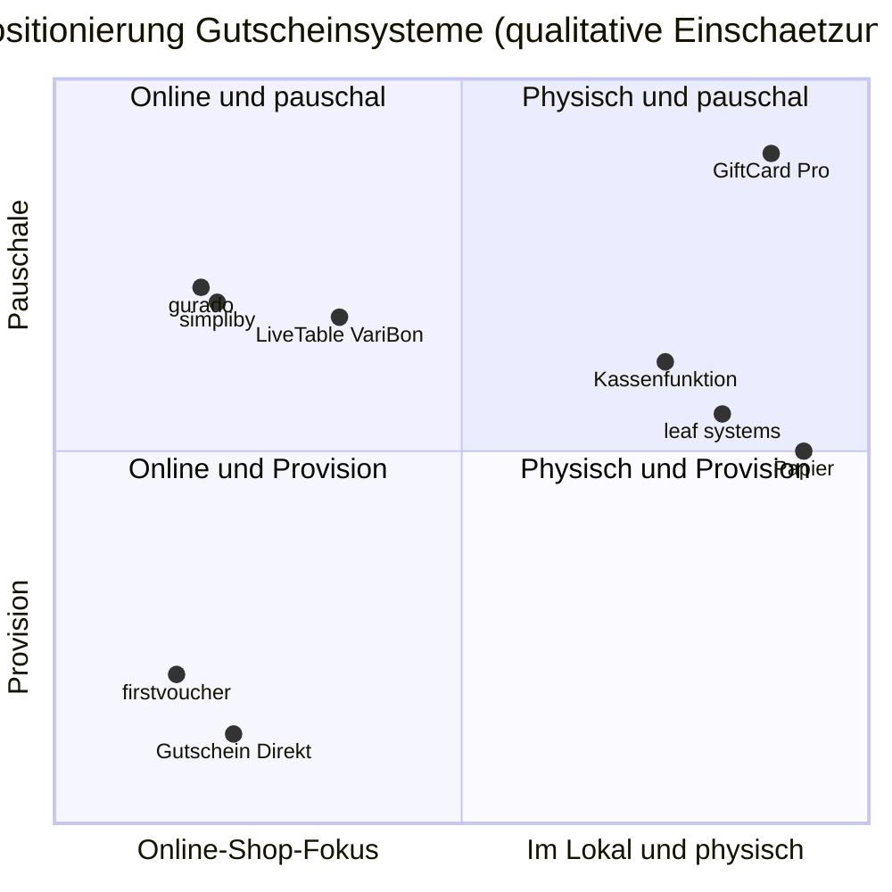

# Wettbewerbsanalyse: Gutscheinsysteme für die Gastronomie

*Zweck: Überblick über Mitbewerber und Alternativen, ehrlicher Vergleich mit GiftCard Pro, Positionierung und kurze Argumentationshilfen (Battlecards) für Verkaufsgespräche in Österreich.*

> **Datenbasis:** Preisangaben stammen aus dem Gutscheinsysteme-Vergleich von [medienkraft.at](https://www.medienkraft.at) und sind vor jeder Verwendung in Angeboten oder auf der Website auf Aktualität zu prüfen. Wo keine gesicherte Information vorliegt, steht **„keine Angabe"**. Einschätzungen sind als solche gekennzeichnet. Wir äußern uns über Mitbewerber sachlich und nie herabsetzend.

---

## 1. Zusammenfassung

- Der Großteil des Marktes besteht aus **Online-Gutscheinshops**: Der Gutschein wird als PDF auf der Website des Lokals verkauft, häufig gegen Provision oder Transaktionsgebühr.
- Daneben gibt es **österreichische Spezialisten** (incert, apro), **kassengebundene Systeme** (leaf systems, Gutscheinfunktionen von Registrierkassen), **Gastronomie-Plattformen** mit Gutscheinmodul (gastronaut, LiveTable VariBon) und den häufigsten „Mitbewerber": **Papiergutschein plus Excel-Liste**.
- **GiftCard Pro besetzt eine klare Nische:** physische Premium-Karte mit NFC-Chip, Einlösung am Tisch in Sekunden, unveränderliches Transaktionsjournal, kassenunabhängig, **0 % Provision**.
- **Wo wir derzeit verlieren:** Betriebe, die vor allem online verkaufen wollen (kein Online-Shop bis Q1 2027), Betriebe, die eine vollständig deutsche Oberfläche für das Personal verlangen (bis Q4 2026 Englisch), und Betriebe, die eine direkte Kassenanbindung erwarten (nur API).

---

## 2. Kategorien von Mitbewerbern

| Kategorie | Anbieter | Kernidee |
|---|---|---|
| **A. Online-Gutscheinshops** | gurado, simpliby, firstvoucher, e-guma, gutschein.software, Gutschein Direkt, Jolioo | Verkauf von Gutscheinen über die Website, meist als PDF oder E-Mail; Einlösung per Code |
| **B. Österreichische Spezialisten** | incert (Wien), apro gutschein-modul (AT) | Gutscheinlösungen mit Fokus auf den österreichischen Markt |
| **C. Kassengebundene Systeme** | leaf systems; Gutscheinfunktionen in Registrierkassen | Gutschein als Funktion der Kassa; bei leaf systems kontaktlose NFC-Gutscheinkarten, gebunden an das eigene Kassensystem |
| **D. Gastronomie-Plattformen** | gastronaut, LiveTable VariBon | Gutscheine als Modul einer breiteren Plattform (z. B. Reservierung) |
| **E. Status quo** | Papiergutschein + Excel-Liste oder Kassenbuch | kein System; Block, Stempel, handschriftliche Restwerte |

---

## 3. Profile

| Anbieter | Herkunft | Modell | Preise (laut Quelle) | Stärken | Schwächen / Grenzen | Physische NFC-Karte | Provision / Gebühr |
|---|---|---|---|---|---|---|---|
| **gurado** | DE | Online-Gutscheinshop | kostenlos / € 29 / € 49 / € 89 pro Monat | gestaffelte Tarife, Einstieg kostenlos | keine Angabe zur Einlösung am Tisch | keine Angabe | keine Angabe |
| **simpliby** | keine Angabe | Online-Gutscheinshop | € 29 / € 49 / € 89 pro Monat | klare Monatspreise | keine Angabe | keine Angabe | keine Angabe |
| **firstvoucher** | keine Angabe | Online-Gutscheinshop | Einrichtung € 0 / € 499 / € 1.199 | Einrichtungsvarianten | Provision auf Verkäufe | keine Angabe | **4,9 % / 3,9 %** |
| **e-guma** | keine Angabe | Online-Gutscheinshop | keine Angabe | keine Angabe | keine Angabe | keine Angabe | keine Angabe |
| **gutschein.software** | keine Angabe | Online-Gutscheinshop | keine Angabe | keine Angabe | keine Angabe | keine Angabe | keine Angabe |
| **Gutschein Direkt** | keine Angabe | Online-Gutscheinshop | € 0 pro Monat | keine Fixkosten | gebührenbasiert | keine Angabe | **ja (gebührenbasiert)** |
| **Jolioo** | keine Angabe | Online-Gutscheinshop | keine Angabe | keine Angabe | keine Angabe | keine Angabe | keine Angabe |
| **incert** | AT (Wien) | Gutscheinlösung, Tarife Express / Professional / Individual | auf Anfrage | österreichischer Anbieter, bekannte Referenzen (Figlmüller, Plachutta) | Preise nicht öffentlich | keine Angabe | keine Angabe |
| **apro gutschein-modul** | AT | Gutscheinmodul | keine Angabe | österreichischer Anbieter | keine Angabe | keine Angabe | keine Angabe |
| **leaf systems** | keine Angabe | Kassensystem mit Gutscheinkarten | keine Angabe | kontaktlose NFC-Gutscheinkarten | an das eigene Kassensystem gebunden | **ja** | keine Angabe |
| **Registrierkassen (Gutscheinfunktion)** | diverse | Funktion der Kassa | im Kassenpreis enthalten oder Zusatzmodul (keine Angabe) | bereits vorhanden, keine weitere Software | Einlösung in der Regel an der Kassa (Annahme); Funktionsumfang je Hersteller unterschiedlich | keine Angabe | keine Angabe |
| **gastronaut** | keine Angabe | Gastronomie-Plattform mit Gutscheinen | keine Angabe | Plattform aus einer Hand | Gutschein als eines von vielen Modulen | keine Angabe | keine Angabe |
| **LiveTable VariBon** | keine Angabe | Plattform mit Gutscheinmodul | € 25 / € 45 pro Monat; „Card Pro" auf Anfrage | niedriger Einstiegspreis | keine Angabe | keine Angabe („Card Pro" zu prüfen) | keine Angabe |
| **Papier + Excel** | — | Eigenlösung | Druckkosten | keine Softwarekosten, vertraut | fälschbar, fehleranfällig, kein Überblick über offene Beträge, Restwerte handschriftlich | nein | nein |
| **GiftCard Pro** | AT (Wien) | SaaS, kassenunabhängig | € 29 / € 59 / ab € 129 pro Monat (netto) | Einlösung am Tisch in Sekunden, NFC + QR, Journal, Klonschutz, 0 % Provision | kein Online-Shop (Q1 2027), Personal-Oberfläche Englisch (Q4 2026), keine direkte Kassenanbindung | **ja** | **0 %** |

**Zu erheben vor der Markteinführung:** Herkunft und Provisionsmodelle der Anbieter mit „keine Angabe", Unterstützung physischer Karten, Einlösung ohne Kassa. Methode: öffentliche Preisseiten, Testkonten, Gespräche mit Pilotbetrieben über bisher genutzte Systeme.

---

## 4. Funktionsvergleich

Legende: ✓ vorhanden · ✗ nicht vorhanden · ○ teilweise · ? keine Angabe (zu prüfen). Für Mitbewerber werden nur Merkmale bewertet, die aus der Datenbasis hervorgehen; alles andere ist „?".

| Merkmal | GiftCard Pro | Online-Gutscheinshops (A) | AT-Spezialisten (B) | leaf systems (C) | Kassenfunktion (C) | Plattformen (D) | Papier (E) |
|---|---|---|---|---|---|---|---|
| Online-Verkauf über Website | ✗ (Q1 2027) | ✓ | ? | ? | ? | ? | ✗ |
| Physische NFC-Karte | ✓ | ? | ? | ✓ | ? | ? | ✗ |
| QR-Karte zum Selbstdrucken | ✓ | ? | ? | ? | ? | ? | ✗ |
| Einlösung am Tisch per Smartphone | ✓ | ? | ? | ? | ✗ (an der Kassa, Annahme) | ? | ✗ |
| Unabhängig vom Kassensystem | ✓ | ✓ (Annahme) | ? | ✗ | ✗ | ? | ✓ |
| Provisionsfrei | ✓ | ○ (je Anbieter) | ? | ? | ? | ? | ✓ |
| Teileinlösung mit Restguthaben | ✓ | ? | ? | ? | ? | ? | ○ (handschriftlich) |
| Unveränderliches Transaktionsjournal | ✓ | ? | ? | ? | ? | ? | ✗ |
| Klonschutz (Chip-UID, NTAG 424 DNA) | ✓ | — | ? | ? | — | ? | ✗ |
| Sperren und Ersetzen verlorener Karten | ✓ | ? | ? | ? | ? | ? | ✗ |
| Offene Verbindlichkeit als Kennzahl | ✓ | ? | ? | ? | ? | ? | ✗ |
| Guthabenabfrage für Gäste | ✓ | ? | ? | ? | ? | ? | ✗ |
| Export für die Steuerberatung (CSV) | ✓ | ? | ? | ? | ? | ? | ○ (Excel) |
| Deutsche Oberfläche für das Personal | ✗ (Q4 2026) | ? | ✓ (Annahme) | ? | ✓ (Annahme) | ? | ✓ |
| Direkte Kassenanbindung | ✗ (nur API) | ? | ? | ✓ (eigene Kassa) | ✓ | ? | ✗ |
| Apple/Google Wallet | ✗ (Roadmap) | ? | ? | ? | ? | ? | ✗ |
| Mehrere Standorte zentral | ✗ (2027) | ? | ? | ? | ? | ? | ✗ |

---

## 5. Positionierungskarte

Achsen: **horizontal** Online-Shop-Fokus (links) ↔ im Lokal / physisch (rechts); **vertikal** Provision (unten) ↔ Pauschale (oben). Platzierung nach Kategorie und nach den bekannten Preismodellen; qualitative Einschätzung.

| | **Online-Shop-Fokus** | **Im Lokal / physisch** |
|---|---|---|
| **Pauschale** | gurado, simpliby, LiveTable VariBon (Monatspreise laut Quelle) | **GiftCard Pro** (Monatspreis, 0 % Provision); Kassenfunktion (Teil der Kassenkosten, Annahme) |
| **Provision / Gebühr** | firstvoucher (4,9 % / 3,9 %), Gutschein Direkt (gebührenbasiert) | — |
| **Ohne Modell / unklar** | e-guma, gutschein.software, Jolioo, incert, apro, gastronaut (keine Angabe) | leaf systems (Preismodell keine Angabe); Papier (nur Druckkosten) |

**Lesart:** Das Feld „im Lokal, physisch, Pauschale, kassenunabhängig" ist wenig besetzt. leaf systems und Kassenfunktionen sind physisch, aber an eine bestimmte Kassa gebunden. Genau dort liegt der Platz von GiftCard Pro.

---

## 6. Wo wir gewinnen

| Situation | Warum wir gewinnen |
|---|---|
| Betrieb verkauft Gutscheine vor allem **im Lokal** (Stammgäste, Weihnachten an der Schank) | Premium-Karte zum Überreichen, Verkauf und Einlösung direkt vor Ort |
| **Hohe Gutscheinwerte** (€ 50–150) | Provision würde spürbar kosten; bei uns 0 % |
| **Viele neue oder wechselnde Servicekräfte** | Einlösung ohne Schulung, großer „Redeem"-Button, klare Warnfarben |
| **Schlechte Erfahrungen mit Papiergutscheinen** (Kopien, verlorene Listen) | Journal, Sperren, Klonschutz, Ersatzkarte mit Guthabenübertrag |
| **Inhaberin oder Inhaber will Klarheit über offene Beträge** | KPI „Outstanding balance" auf einen Blick |
| Betrieb möchte **die Kassa nicht wechseln** | kassenunabhängig, funktioniert neben jeder Registrierkasse |
| **Steuerberatung verlangt saubere Daten** | CSV-Export mit Dezimalkomma, direkt in Excel |
| Betrieb mit **BHS-sprachigem Team oder Inhaber** in Wien | Beratung und Unterlagen auf Deutsch, BHS und Englisch |

## 7. Wo wir verlieren (ehrlich)

| Situation | Warum wir verlieren | Was wir tun |
|---|---|---|
| Betrieb will Gutscheine **vor allem online** verkaufen | kein Online-Shop, keine Zahlungsabwicklung bis Q1 2027 | ehrlich sagen; Pilot für Online-Shop anbieten, Kontakt für Q1 2027 vormerken |
| Team verlangt **deutsche Oberfläche** | Personal-Oberfläche derzeit Englisch | deutsche Kurzanleitung mit englischen Button-Namen; Termin Q4 2026 nennen |
| Betrieb erwartet **automatische Buchung in der Kassa** | keine Kassenintegration, nur API (Tarif Pro) | Buchungsablauf mit Steuerberatung klären; Kassenhändler als Partner gewinnen |
| **Kette** mit zentralem Einkauf | kein konsolidiertes Dashboard über Standorte (2027) | Tarif „Gruppe" mit einzelnen Konten; Roadmap offenlegen |
| Käuferin oder Käufer verlangt **Referenzen** | noch keine Kundinnen und Kunden | Pilotprogramm, 30 Tage Test, Demo am eigenen Handy |
| Betrieb mit **leaf-systems-Kassa** | Gutscheinkarten bereits in der Kassa integriert | nur ansprechen, wenn Einlösung am Tisch oder Sicherheit ein Thema ist |
| **Sehr preissensibler Kleinstbetrieb** mit wenigen Gutscheinen | Papier kostet nichts | QR-Karten zum Selbstdrucken, Tarif Start, Rechenbeispiel Zeitersparnis |

---

## 8. Mögliche Reaktionen der Mitbewerber

| Reaktion | Wahrscheinlichkeit (Einschätzung) | Unsere Antwort |
|---|---|---|
| Online-Shops ergänzen **physische Karten** oder Einlöse-Apps | mittel | Vorsprung bei Geschwindigkeit (≈ 0,5 s Systemzeit), Sicherheit (NTAG 424 DNA) und Kartenqualität halten; Geschichten aus dem Pilot erzählen |
| Anbieter **senken Provisionen** oder führen Pauschalen ein | mittel | 0 % bleibt dauerhaft; zusätzlich Argumente jenseits des Preises (Service am Tisch, Haftungsüberblick) |
| **Kassenhersteller** bauen Gutscheinfunktionen aus | mittel | Kassenhändler als Partner statt Gegner; API-Anbindung anbieten |
| Österreichische Anbieter betonen **Referenzen und Marktpräsenz** | hoch | Pilotreferenzen schnell aufbauen; persönliche Betreuung in Wien |
| **Preisaktionen** vor Weihnachten | mittel | Pilotkonditionen und 30-Tage-Test statt Rabattschlacht |

---

## 9. Battlecards

### 9.1 Gegen Online-Gutscheinshops mit Provision (z. B. firstvoucher)

- **Was sie gut können:** Verkauf rund um die Uhr über die Website, Zahlung online.
- **Unser Argument:** „Bei einer Provision von 4,9 % kostet ein Gutschein über € 100 € 4,90 — bei 300 Gutscheinen im Jahr sind das € 1.470. GiftCard Pro Start kostet € 348 im Jahr, ohne Provision." (Rechenbeispiel; tatsächliche Gebühren beim Anbieter prüfen.)
- **Unser Vorteil:** physische Premium-Karte, Einlösung am Tisch in Sekunden, offene Verbindlichkeit im Blick.
- **Einwand:** „Wir wollen auch online verkaufen." → „Der Online-Shop ist für Q1 2027 geplant. Bis dahin verkaufen Sie im Lokal, wo die meisten Gutscheine ohnehin über die Schank gehen — das prüfen wir gern gemeinsam mit Ihren Zahlen."

### 9.2 Gegen Online-Gutscheinshops mit Monatspreis (gurado, simpliby)

- **Was sie gut können:** vergleichbare Monatspreise (€ 29 / € 49 / € 89), Online-Verkauf, teils Gratistarif.
- **Unser Argument:** Gleiche Preisklasse, aber gebaut für den Moment im Lokal: Karte antippen, Betrag eingeben, fertig.
- **Frage an den Betrieb:** „Wo werden Ihre Gutscheine eingelöst — und wie lange dauert das heute?"
- **Ehrlich:** Wer fast nur online verkauft, ist dort derzeit besser aufgehoben.

### 9.3 Gegen incert (österreichischer Spezialist)

- **Was sie gut können:** Wiener Anbieter mit bekannten Referenzen (Figlmüller, Plachutta), mehrere Tarifstufen.
- **Unser Argument:** transparente Preise ab € 29 statt „auf Anfrage", Einrichtung in einem Nachmittag, NFC-Karte mit Klonschutz, 0 % Provision.
- **Frage an den Betrieb:** „Brauchen Sie ein großes Projekt — oder ein System, das nächste Woche läuft?"
- **Vorsicht:** keine Aussagen über Funktionen von incert, die wir nicht geprüft haben.

### 9.4 Gegen Papier + Excel (Status quo)

- **Was gut daran ist:** vertraut, keine laufenden Kosten.
- **Unser Argument:** „Wissen Sie heute, wie viel Geld in offenen Gutscheinen steckt?" GiftCard Pro zeigt es auf einen Blick. Jede Einlösung ist dokumentiert, Kopien funktionieren nicht, verlorene Karten werden gesperrt und ersetzt.
- **Beweis in 2 Minuten:** Demo-Karte antippen lassen, Betrag eingeben, Restguthaben zeigen.
- **Einwand:** „Zu teuer für die paar Gutscheine." → QR-Karten selbst drucken (kostenlos), Tarif Start € 29, monatlich kündbar.

---

## 10. Beobachtung und Pflege

- Preise und Funktionen der Mitbewerber **quartalsweise** prüfen und diese Datei aktualisieren (verantwortlich: [Name], Gründerin).
- In jedem Verkaufsgespräch notieren: bisheriges System, Grund für Wechsel oder Nicht-Wechsel.
- Verlorene Abschlüsse mit Grund dokumentieren; Muster fließen in die Roadmap.

---

Version 1.0 · Stand: September 2026
