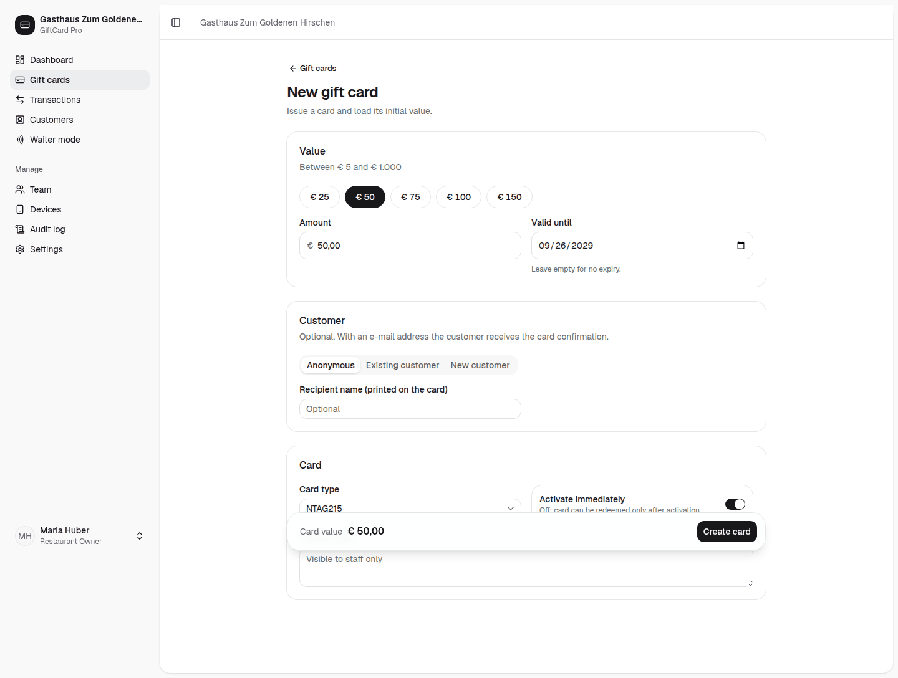
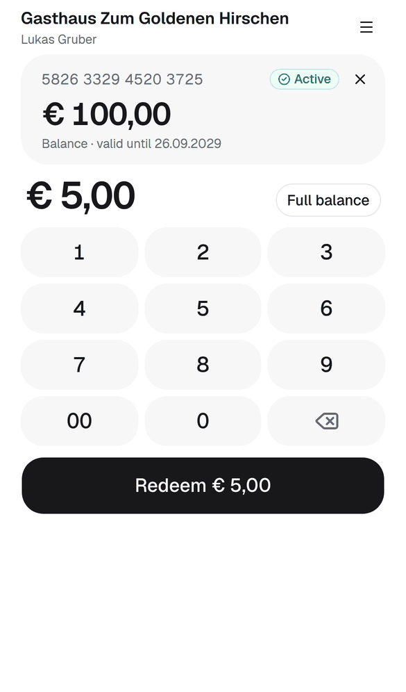
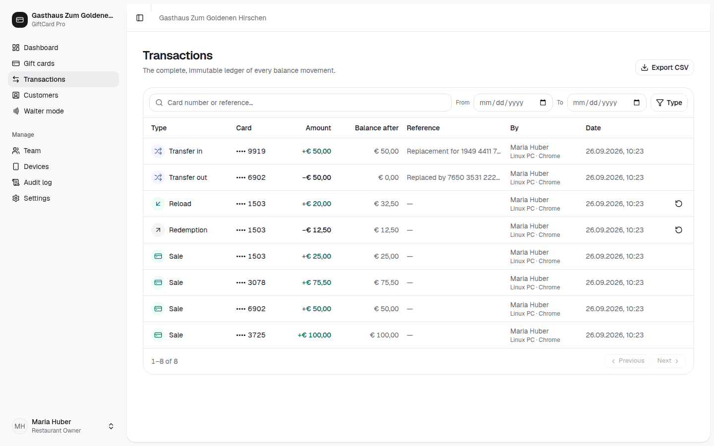

# Funktionsübersicht GiftCard Pro

*Vollständiger Katalog aller Funktionen, nach Bereichen gruppiert, mit Verfügbarkeit je Tarif und Status. Für Vertrieb, Angebote, Support und Kundinnen und Kunden, die genau wissen wollen, was enthalten ist.*

---

## Legende

| Zeichen | Bedeutung |
|---|---|
| ✓ | im Tarif enthalten |
| — | nicht im Tarif enthalten |
| offen | Tarifzuordnung wird mit der Veröffentlichung festgelegt |
| **verfügbar** | heute im Produkt nutzbar |
| **geplant Qx JJJJ** | auf der Roadmap, Zielquartal (keine Zusage, siehe [Roadmap](product-roadmap.md)) |
| **in Prüfung** | Machbarkeit oder Partner werden geklärt |

Tarife: **Start** € 29 / Monat · **Pro** € 59 / Monat · **Gruppe** ab € 129 / Monat (bis 3 Standorte, + € 39 je weiterem). Alle Preise netto, zzgl. 20 % USt. Die 30-tägige Testphase enthält alle Pro-Funktionen.

Die Oberfläche für Personal ist derzeit Englisch. Englische Bezeichnungen stehen **fett**, z. B. **„Redeem"** (Einlösen).

---

## 1. Karten

| Funktion | Beschreibung | Start | Pro | Gruppe | Status |
|---|---|:-:|:-:|:-:|---|
| Karte anlegen (**New gift card**) | Wert per Schnellwahl (€ 25 / 50 / 75 / 100 / 150) oder frei innerhalb der Grenzen; **Create card** | ✓ | ✓ | ✓ | verfügbar |
| Gültigkeit (**Valid until**) | Standard aus den Einstellungen, eigenes Datum oder „kein Ablauf"; gültig bis 23:59 Uhr Ortszeit | ✓ | ✓ | ✓ | verfügbar |
| Kundin/Kunde zuordnen | **Anonymous**, **Existing** oder **New customer** (Name, E-Mail, Telefon) | ✓ | ✓ | ✓ | verfügbar |
| Name der beschenkten Person (**Recipient name**) | Wird auf die Karte gedruckt | ✓ | ✓ | ✓ | verfügbar |
| Interne Notizen (**Internal notes**) | Nur für das Team sichtbar, durchsuchbar | ✓ | ✓ | ✓ | verfügbar |
| Sofort aktivieren (**Activate immediately**) | Oder Karte zuerst inaktiv anlegen und beim Verkauf aktivieren | ✓ | ✓ | ✓ | verfügbar |
| Kartennummer | 16 Stellen, zufällig, mit Prüfziffer (Luhn), lesbar formatiert („5285 1058 7098 6488"); optionales Präfix | ✓ | ✓ | ✓ | verfügbar |
| Kartentypen NTAG213, NTAG215 (empfohlen), NTAG216 | Standard-NFC-Chips | ✓ | ✓ | ✓ | verfügbar |
| Reine QR-Karten | Ohne Chip, kostenlos selbst drucken | ✓ | ✓ | ✓ | verfügbar |
| Kartentyp NTAG 424 DNA | Kryptografisch gegen Kopien geschützt (SUN/AES-CMAC, Zähler) | — | ✓ | ✓ | verfügbar |
| NFC-Chip beschreiben (**Write NFC tag**) | Ein Tippen mit Android und Chrome; alternativ Adresse kopieren, mit NFC-Schreib-App schreiben, **Mark as written** | ✓ | ✓ | ✓ | verfügbar |
| Chip-Seriennummer binden | Speichert die Seriennummer (UID) für die Kopiererkennung | ✓ | ✓ | ✓ | verfügbar |
| Chip dauerhaft sperren (**Lock tag after writing**) | Chip wird schreibgeschützt, der Link kann nicht überschrieben werden | ✓ | ✓ | ✓ | verfügbar |
| Druckvorlage (**Print card / QR**) | Scheckkartenformat ISO ID-1 (85,6 × 54 mm); Vorderseite Lokal, Wert, beschenkte Person; Rückseite QR-Code, Nummer, Gültigkeit, Hinweis; in der Sprache des Lokals | ✓ | ✓ | ✓ | verfügbar |
| Status | Active, Inactive, Redeemed, Blocked, Expired, Replaced | ✓ | ✓ | ✓ | verfügbar |
| Einlösen (**Redeem**) | Voll oder teilweise; Teileinlösung abschaltbar | ✓ | ✓ | ✓ | verfügbar |
| Aufladen (**Reload**) | Guthaben erhöhen; abschaltbar | ✓ | ✓ | ✓ | verfügbar |
| Guthaben übertragen (**Transfer balance**) | Ganz oder teilweise auf eine andere Karte | ✓ | ✓ | ✓ | verfügbar |
| Ersatzkarte (**Replace lost card**) | Grund mit einem Tipp (Lost / Damaged / Stolen); Guthaben geht auf neue Karte, alte ist sofort ungültig | ✓ | ✓ | ✓ | verfügbar |
| Sperren / Entsperren (**Block card** / **Unblock**) | Mit Grund (Reported stolen, Reported lost, Suspicious use) | ✓ | ✓ | ✓ | verfügbar |
| Sofort ablaufen lassen (**Expire now**) | Bucht das Restguthaben als Ablauf aus | ✓ | ✓ | ✓ | verfügbar |
| Aktivieren (**Activate**) | Inaktive Karte freischalten | ✓ | ✓ | ✓ | verfügbar |
| Details bearbeiten (**Edit details**) | Kunde, beschenkte Person, Notizen, Gültigkeit | ✓ | ✓ | ✓ | verfügbar |
| Storno (**Reverse**) | Einlösung oder Aufladung als Gegenbuchung stornieren; Grund mit einem Tipp; nichts wird gelöscht | ✓ | ✓ | ✓ | verfügbar |
| Kartenverlauf | Jede Buchung und jedes Ereignis mit Zeit, Person, Gerät und Guthaben danach | ✓ | ✓ | ✓ | verfügbar |
| Kartenliste | Suche (Nummer, Kunde, beschenkte Person, Notiz), Statusfilter, Sortierung | ✓ | ✓ | ✓ | verfügbar |
| Kartenbestellservice | Bedruckte Karten strukturiert bestellen | ✓ | ✓ | ✓ | geplant Q4 2026 |
| Apple Wallet / Google Wallet | Gutscheinkarte zusätzlich im Handy des Gastes | offen | offen | offen | geplant Q2 2027 |
| Online-Gutscheinverkauf | Verkauf auf der Website des Lokals mit Zahlung, PDF und optional Karte per Post; 0 % Provision von uns | offen | offen | offen | geplant Q1 2027 |

Die Tarifzuordnung für geplante Funktionen wird mit der Veröffentlichung festgelegt.

---

## 2. Einlösung / Kellner-App

| Funktion | Beschreibung | Start | Pro | Gruppe | Status |
|---|---|:-:|:-:|:-:|---|
| Web-App ohne App Store | Läuft im Browser jedes Smartphones, auf dem Startbildschirm installierbar | ✓ | ✓ | ✓ | verfügbar |
| NFC lesen mit Android (**Scan card**) | Einmal drücken, danach wird jede Karte beim Antippen gelesen (Chrome, Web NFC) | ✓ | ✓ | ✓ | verfügbar |
| NFC lesen mit iPhone | Karte an die Oberkante halten, Mitteilung antippen (iPhone XS oder neuer) | ✓ | ✓ | ✓ | verfügbar |
| QR-Code scannen (**Scan QR code**) | Mit der Kamera jedes Handys | ✓ | ✓ | ✓ | verfügbar |
| Kartennummer eintippen (**Card number**, **Find card**) | Notlösung ohne Chip und Kamera | ✓ | ✓ | ✓ | verfügbar |
| Kassenähnliche Tastatur | `2 4 9 0` → € 24,90 | ✓ | ✓ | ✓ | verfügbar |
| Ganzes Guthaben (**Full balance**) | Ein Tipp für den gesamten Betrag; Hinweis, wenn der Betrag das Guthaben übersteigt | ✓ | ✓ | ✓ | verfügbar |
| Einlöseknopf (**Redeem € X**) | Großer Knopf mit Betrag | ✓ | ✓ | ✓ | verfügbar |
| Erfolgsbildschirm | Restguthaben für den Gast, **Next card**, automatische Rückkehr nach 8 Sekunden | ✓ | ✓ | ✓ | verfügbar |
| Nächste Karte direkt antippen | NFC liest weiter, auch auf dem Erfolgsbildschirm | ✓ | ✓ | ✓ | verfügbar |
| Vibration als Bestätigung | Auf Android | ✓ | ✓ | ✓ | verfügbar |
| Klare Warnungen | Gesperrt/ersetzt rot („Ask the guest for the new card"), inaktiv/leer gelb, abgelaufen, nicht gefunden | ✓ | ✓ | ✓ | verfügbar |
| Gerätespezifische Hinweise | iPhone, Android mit oder ohne NFC erhalten passende Anleitung | ✓ | ✓ | ✓ | verfügbar |
| Kleine Bildschirme | Kein Scrollen nötig, auch auf dem iPhone SE | ✓ | ✓ | ✓ | verfügbar |
| Sperren aus der Kellner-App | Wenn die Rolle es erlaubt | ✓ | ✓ | ✓ | verfügbar |
| Nie doppelt gebucht | Doppeltipps und Netzwerk-Wiederholungen werden erkannt | ✓ | ✓ | ✓ | verfügbar |
| Kellner-App auf Deutsch | Oberfläche auf Deutsch | ✓ | ✓ | ✓ | geplant Q4 2026 |

---

## 3. Dashboard und Berichte

| Funktion | Beschreibung | Start | Pro | Gruppe | Status |
|---|---|:-:|:-:|:-:|---|
| Kennzahl **Outstanding balance** | Offene Verbindlichkeit („Open liability on N cards") | ✓ | ✓ | ✓ | verfügbar |
| Kennzahl **Revenue this month** | Kartenverkäufe plus Aufladungen, im Vergleich zum Vormonat | ✓ | ✓ | ✓ | verfügbar |
| Kennzahl **Redeemed this month** | Eingelöster Betrag im Monat und heute | ✓ | ✓ | ✓ | verfügbar |
| Kennzahl **Cards sold** | Verkaufte Karten gesamt, im Monat, in Verwendung | ✓ | ✓ | ✓ | verfügbar |
| Diagramm verkauft vs. eingelöst | Pro Tag, Zeitraum 7 / 30 / 90 Tage | ✓ | ✓ | ✓ | verfügbar |
| Diagramm Monatsumsatz | Letzte 12 Monate | ✓ | ✓ | ✓ | verfügbar |
| Karten nach Status | Verteilung aller Karten | ✓ | ✓ | ✓ | verfügbar |
| Letzte Aktivität | Neueste Buchungen, **View all** öffnet das Journal | ✓ | ✓ | ✓ | verfügbar |
| Willkommensbereich (**Welcome**) | Erste Schritte: Kartenregeln → Team einladen → erste Karte → Kellner-Modus | ✓ | ✓ | ✓ | verfügbar |
| Buchungsjournal (**Transactions**) | Unveränderlich; Filter nach Datum, Art, Suche; Storno | ✓ | ✓ | ✓ | verfügbar |
| CSV-Export Karten und Buchungen (**Export CSV**) | Strichpunkt, Dezimalkomma, lesbare Status- und Buchungsarten — öffnet direkt in Excel | ✓ | ✓ | ✓ | verfügbar |
| Hell- und Dunkelmodus | Auf Computer, Tablet und Handy | ✓ | ✓ | ✓ | verfügbar |
| Mehrstandort-Dashboard | Alle Standorte einer Gruppe in einer Übersicht | — | — | ✓ | geplant Q2 2027 |

---

## 4. Kundinnen und Kunden

| Funktion | Beschreibung | Start | Pro | Gruppe | Status |
|---|---|:-:|:-:|:-:|---|
| Kundenliste | Alle Kundinnen und Kunden des Lokals | ✓ | ✓ | ✓ | verfügbar |
| Kundendetail | Kontaktdaten und alle zugehörigen Karten | ✓ | ✓ | ✓ | verfügbar |
| Bearbeiten | Name, E-Mail, Telefon | ✓ | ✓ | ✓ | verfügbar |
| Anonymisieren (DSGVO) | Entfernt personenbezogene Daten, Finanzdaten bleiben erhalten | ✓ | ✓ | ✓ | verfügbar |

---

## 5. Team und Geräte

| Funktion | Beschreibung | Start | Pro | Gruppe | Status |
|---|---|:-:|:-:|:-:|---|
| Rollen | Owner, Manager, Waiter mit eigenen Berechtigungen | ✓ | ✓ | ✓ | verfügbar |
| Unbegrenzte Teammitglieder | Keine Kosten pro Person | ✓ | ✓ | ✓ | verfügbar |
| Einladen (**Invite**) | Per E-Mail, Link 72 Stunden gültig, Person wählt eigenes Passwort | ✓ | ✓ | ✓ | verfügbar |
| Einladung erneut senden, Passwort zurücksetzen | Link 60 Minuten gültig; nie Passwörter per E-Mail | ✓ | ✓ | ✓ | verfügbar |
| Deaktivieren / Reaktivieren | Beendet sofort alle Sitzungen und API-Schlüssel der Person | ✓ | ✓ | ✓ | verfügbar |
| Status | Invited → Active, Locked, Deactivated | ✓ | ✓ | ✓ | verfügbar |
| Geräteverwaltung (**Devices**) | Jedes Gerät wird bei der Anmeldung automatisch registriert und benannt (z. B. „iPhone · Safari") | ✓ | ✓ | ✓ | verfügbar |
| Gerät umbenennen | Z. B. „Bar iPhone" | ✓ | ✓ | ✓ | verfügbar |
| Gerät widerrufen / wiederherstellen (**Revoke** / **Restore**) | Widerrufenes Gerät ist sofort gesperrt; Bestätigung vor dem Widerruf | ✓ | ✓ | ✓ | verfügbar |
| Unbegrenzte Geräte | Keine Kosten pro Gerät | ✓ | ✓ | ✓ | verfügbar |

---

## 6. Einstellungen

| Funktion | Beschreibung | Start | Pro | Gruppe | Status |
|---|---|:-:|:-:|:-:|---|
| Kartenwert min./max. | Standard € 5 / € 1.000 | ✓ | ✓ | ✓ | verfügbar |
| Maximales Kartenguthaben | Standard € 2.000 | ✓ | ✓ | ✓ | verfügbar |
| Maximale Einzeleinlösung | Obergrenze pro Einlösung | ✓ | ✓ | ✓ | verfügbar |
| Standard-Gültigkeit | In Monaten, 0 = kein Ablauf. Werkseinstellung 36 Monate — **wir empfehlen 0** (siehe FAQ, Recht) | ✓ | ✓ | ✓ | verfügbar |
| Werkseinstellung „unbegrenzt" | Neue Restaurants starten ohne Ablauf | ✓ | ✓ | ✓ | geplant Q4 2026 |
| Betrugsgrenze | Max. Einlösungen pro Karte und Stunde, Standard 10 | ✓ | ✓ | ✓ | verfügbar |
| Aufladen erlauben | Ein/aus | ✓ | ✓ | ✓ | verfügbar |
| Teileinlösung erlauben | Ein/aus | ✓ | ✓ | ✓ | verfügbar |
| Öffentliche Guthabenseite | Ein/aus | ✓ | ✓ | ✓ | verfügbar |
| Kopierschutz (Chip-Bindung) | Ein/aus | ✓ | ✓ | ✓ | verfügbar |
| Chips nach dem Schreiben sperren | Ein/aus | ✓ | ✓ | ✓ | verfügbar |
| Gäste-E-Mails | Ein/aus | ✓ | ✓ | ✓ | verfügbar |
| Kartennummer-Präfix, Markenfarbe, E-Mail-Fußzeile | Erscheinungsbild | ✓ | ✓ | ✓ | verfügbar |
| Restaurantprofil | Name, Firmenname, UID-Nummer, E-Mail, Telefon, Website, Adresse | ✓ | ✓ | ✓ | verfügbar |
| Sprache und Zahlenformat | de-AT, de-DE, de-CH, en-GB, en-US | ✓ | ✓ | ✓ | verfügbar |
| Zeitzone | Gültigkeit und Tageswerte nach Ortszeit | ✓ | ✓ | ✓ | verfügbar |
| Währung | Euro | ✓ | ✓ | ✓ | verfügbar |
| Währungen CHF, BAM, RSD | Für Schweiz, Bosnien und Herzegowina, Serbien | ✓ | ✓ | ✓ | geplant 2028 |

---

## 7. E-Mails an Gäste

| Funktion | Beschreibung | Start | Pro | Gruppe | Status |
|---|---|:-:|:-:|:-:|---|
| Karte gekauft | Bestätigung an die Kundin oder den Kunden | ✓ | ✓ | ✓ | verfügbar |
| Karte aufgeladen | Bestätigung mit neuem Guthaben | ✓ | ✓ | ✓ | verfügbar |
| Karte läuft bald ab | 30 Tage vor Ablauf | ✓ | ✓ | ✓ | verfügbar |
| Niedriges Guthaben | Unter € 5 | ✓ | ✓ | ✓ | verfügbar |
| Vorlagen bearbeiten | Deutsch und Englisch, Betreff und Text, Vorschau mit echtem Restaurantnamen | ✓ | ✓ | ✓ | verfügbar |
| Vorlagen auf BHS | Mit dem Markteintritt | ✓ | ✓ | ✓ | geplant 2028 |

E-Mails werden nur versendet, wenn eine E-Mail-Adresse hinterlegt und die Funktion eingeschaltet ist.

---

## 8. Gäste: Guthabenseite

| Funktion | Beschreibung | Start | Pro | Gruppe | Status |
|---|---|:-:|:-:|:-:|---|
| Guthaben selbst prüfen | Karte mit eigenem Handy antippen oder QR-Code scannen | ✓ | ✓ | ✓ | verfügbar |
| Angezeigte Daten | Guthaben, Status, Gültigkeit, maskierte Kartennummer — keine Personendaten | ✓ | ✓ | ✓ | verfügbar |
| Sprache | Sprache des Lokals (Deutsch oder Englisch) | ✓ | ✓ | ✓ | verfügbar |
| Abschaltbar | In den Einstellungen | ✓ | ✓ | ✓ | verfügbar |

---

## 9. Sicherheit

| Funktion | Beschreibung | Start | Pro | Gruppe | Status |
|---|---|:-:|:-:|:-:|---|
| Kein Geld auf der Karte | Nur zufällige 122-Bit-Kennung im Link | ✓ | ✓ | ✓ | verfügbar |
| Atomare, idempotente Buchungen | Datenbank-Sperre, nie doppelt gebucht; getestet mit 20 gleichzeitigen Einlösungen | ✓ | ✓ | ✓ | verfügbar |
| Unveränderliches Journal | Summe des Journals = Guthaben | ✓ | ✓ | ✓ | verfügbar |
| Kopiererkennung NTAG21x | Bindung an die Chip-Seriennummer (bei Android-Scans) | ✓ | ✓ | ✓ | verfügbar |
| Kopierschutz NTAG 424 DNA | Kryptografische Signatur und Zähler; Kopien und Wiederholungen werden abgelehnt | — | ✓ | ✓ | verfügbar |
| Schutz vor Durchprobieren | Anfragelimits, Kontosperre nach 10 Fehlversuchen (15 Minuten), gedrosselte Kartensuche | ✓ | ✓ | ✓ | verfügbar |
| Gerätegebundene Sitzungen | Kopierte Sitzungen funktionieren auf anderen Geräten nicht; Passwortänderung meldet andere Sitzungen ab | ✓ | ✓ | ✓ | verfügbar |
| Passwortregeln | Mind. 12 Zeichen, Groß- und Kleinbuchstaben, Ziffer; bcrypt | ✓ | ✓ | ✓ | verfügbar |
| Prüfprotokoll (**Audit log**) | Jede sicherheits- und geldrelevante Aktion mit Person, Zeit, IP; Warnungen (kopierte Karte, kopiertes Antippen, fremde Karte, gesperrtes Konto) rot hervorgehoben | ✓ | ✓ | ✓ | verfügbar |
| Mandantentrennung | Jedes Restaurant sieht nur seine Daten | ✓ | ✓ | ✓ | verfügbar |
| Verschlüsselte Übertragung | Nur HTTPS (TLS, HSTS), CSP, CSRF-Schutz | ✓ | ✓ | ✓ | verfügbar |
| Backups | Nächtlich, 14 Tage lokal plus Kopie außer Haus; tägliche Server-Snapshots | ✓ | ✓ | ✓ | verfügbar |

---

## 10. Datenschutz

| Funktion | Beschreibung | Start | Pro | Gruppe | Status |
|---|---|:-:|:-:|:-:|---|
| Hosting in der EU | Hetzner Online GmbH, Rechenzentren in Deutschland | ✓ | ✓ | ✓ | verfügbar |
| Auftragsverarbeitungsvertrag | Lokal ist Verantwortlicher, Anbieter ist Auftragsverarbeiter (Art. 28 DSGVO) | ✓ | ✓ | ✓ | verfügbar |
| Nur notwendige Cookies | Keine Analyse-, Werbe- oder Drittanbieter-Cookies in der App | ✓ | ✓ | ✓ | verfügbar |
| Kunde optional | Karten können anonym verkauft werden | ✓ | ✓ | ✓ | verfügbar |
| Anonymisierung | Personendaten entfernen, Finanzdaten bleiben (Aufbewahrungspflicht) | ✓ | ✓ | ✓ | verfügbar |
| Keine Personendaten im Prüfprotokoll | Änderungen werden als „[personal data]" protokolliert | ✓ | ✓ | ✓ | verfügbar |
| Datenexport | Jederzeit; Löschung 30 Tage nach Vertragsende (außer gesetzliche Aufbewahrung) | ✓ | ✓ | ✓ | verfügbar |

---

## 11. Plattform-Administration (Betreiber)

Diese Funktionen nutzt der Betreiber von GiftCard Pro, nicht das Lokal. Sie sind hier der Vollständigkeit halber aufgeführt.

| Funktion | Beschreibung | Status |
|---|---|---|
| Restaurant anlegen | Legt Mandant und Einladung für die Inhaberin oder den Inhaber an | verfügbar |
| Restaurant sperren / reaktivieren | Mit Grund | verfügbar |
| **Open restaurant** | Im Restaurant arbeiten (z. B. für Support), mit sichtbarem Hinweisbanner, vollständig protokolliert | verfügbar |
| Plattform-Prüfprotokoll | Alle Aktionen der Plattform | verfügbar |
| Systemeinstellungen | Standardtarif, Wartungshinweis, Support-E-Mail | verfügbar |
| Automatische Abrechnung | Stripe, SEPA-Lastschrift | geplant Q4 2026 |

---

## 12. Integrationen und API

| Funktion | Beschreibung | Start | Pro | Gruppe | Status |
|---|---|:-:|:-:|:-:|---|
| REST-API | Karten, Buchungen, Einlösen, Aufladen, Übertragen, Kunden, Kennzahlen, Exporte | — | ✓ | ✓ | verfügbar |
| API-Schlüssel (**Settings → API**) | Eingeschränkte Berechtigungen, max. 365 Tage gültig, jederzeit widerrufbar, letzte Nutzung protokolliert | — | ✓ | ✓ | verfügbar |
| Idempotente Buchungen per API | Wiederholte Anfragen buchen nie doppelt | — | ✓ | ✓ | verfügbar |
| Kassenanbindung ready2order, orderbird, SumUp POS | Fertige Anbindungen | — | ✓ | ✓ | in Prüfung (Q1 2027) |
| CSV-Export | Für Steuerberatung und Buchhaltung | ✓ | ✓ | ✓ | verfügbar |

---

## 13. Onboarding und Support

| Leistung | Start | Pro | Gruppe | Status |
|---|:-:|:-:|:-:|---|
| Video-Onboarding | ✓ | ✓ | ✓ | verfügbar |
| Persönliches Onboarding (remote oder vor Ort in Wien) | — | ✓ | ✓ | verfügbar |
| Einrichtung und Teamschulung vor Ort (einmalig € 149, für Pilotbetriebe gratis) | optional | optional | ✓ | verfügbar |
| E-Mail-Support, Antwort innerhalb 1 Werktag | ✓ | ✓ | ✓ | verfügbar |
| Telefon-Support, Priorität (4 Arbeitsstunden) | — | ✓ | ✓ | verfügbar |
| Hilfe beim Kartendesign | — | ✓ | ✓ | verfügbar |
| Zentrale Ansprechperson, individueller Vertrag/SLA | — | — | ✓ | verfügbar |

---

Version 1.0 · Stand: September 2026
