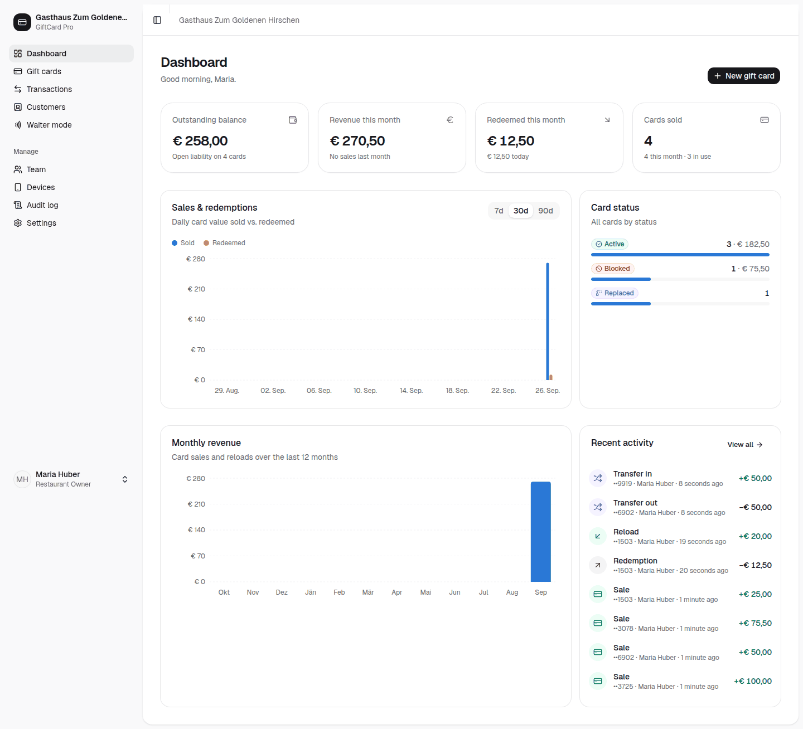

# Handbuch für Inhaberinnen und Inhaber

*Alles, was Sie als Inhaber/in in GiftCard Pro steuern: Kennzahlen, Berichte für die Steuerberatung, Regeln, Team, Sicherheit, Datenschutz sowie Monats- und Jahresabschluss.*

Die Oberfläche ist derzeit auf Englisch. Schaltflächen und Menüpunkte stehen hier genau so, wie Sie sie sehen, beim ersten Vorkommen mit deutscher Bedeutung, z. B. **„Export CSV“** (als CSV exportieren). Eine deutsche Oberfläche ist für Q4 2026 geplant.

---

## 1. Ihre Rolle

Als **Restaurant Owner** (Inhaber/in) dürfen Sie alles, was Ihr Restaurant betrifft. Nur Sie verwalten:

- **„Settings“** (Einstellungen): Kartenregeln, Restaurantprofil, E-Mails, API
- **„Team“**: Personen einladen, Rollen, deaktivieren
- **„Devices“** (Geräte): Handys sperren und wieder freigeben
- **„Customers“** (Kunden): DSGVO-Anonymisierung

Alles andere – Karten verkaufen, einlösen, ersetzen, sperren, Buchungen stornieren – kann auch Ihre Betriebsleitung. Die Schritte dafür stehen im Handbuch für die Betriebsleitung.

---

## 2. Das Dashboard

### Die vier Kennzahlen

| Kennzahl | Bedeutung | Wofür Sie sie brauchen |
|---|---|---|
| **„Outstanding balance“** (offenes Guthaben) | Summe aller Guthaben, die Gäste noch bei Ihnen einlösen können. Darunter: **„Open liability on N cards“** (offene Verbindlichkeit auf N Karten). | **Ihre wichtigste Zahl.** Das ist Geld, das Sie bereits kassiert haben, aber noch in Form von Speisen und Getränken schulden. |
| **„Revenue this month“** (Umsatz dieses Monats) | verkaufte Karten plus Aufladungen im laufenden Monat, im Vergleich zum Vormonat | Wie gut verkaufen sich Gutscheine? Saisonvergleich (Advent, Valentinstag, Muttertag). |
| **„Redeemed this month“** (eingelöst in diesem Monat) | Betrag, den Gäste in diesem Monat mit Gutscheinen bezahlt haben, darunter der heutige Betrag | Abgleich mit der Registrierkasse (Zahlungsart „Gutschein“). |
| **„Cards sold“** (verkaufte Karten) | alle je verkauften Karten, davon diesen Monat und derzeit in Verwendung | Reichweite: Wie viele Gutscheine sind im Umlauf? |

#### Warum das offene Guthaben so wichtig ist

Jeder verkaufte Gutschein ist ein Versprechen. Solange er nicht eingelöst ist, haben Sie das Geld, aber noch nicht die Leistung erbracht. Wer bilanziert, weist diesen Betrag in der Regel als **Verbindlichkeit** aus; wer eine Einnahmen-Ausgaben-Rechnung führt, sollte ihn trotzdem kennen – etwa bei einem Verkauf oder einer Übergabe des Betriebs. Ein hohes offenes Guthaben nach der Weihnachtszeit ist normal: Diese Gäste kommen im Frühjahr zu Ihnen.

*Keine Steuerberatung – die bilanzielle Behandlung klären Sie bitte mit Ihrer Steuerberatung.*

### Diagramme

- **„Sales & redemptions“** (Verkäufe und Einlösungen): Tag für Tag verkauft gegen eingelöst, 7, 30 oder 90 Tage.
- **„Monthly revenue“** (Monatsumsatz): Kartenverkäufe und Aufladungen der letzten 12 Monate.
- **„Card status“** (Kartenstatus): Karten nach Status – Active (aktiv), Inactive (noch nicht aktiviert), Redeemed (vollständig eingelöst), Blocked (gesperrt), Expired (abgelaufen), Replaced (ersetzt).
- **„Recent activity“** (letzte Buchungen): die neuesten Buchungen; **„View all“** (alle anzeigen) öffnet das Buchungsjournal.

Das Dashboard funktioniert am PC, Tablet und Handy, hell oder dunkel.

---

## 3. Berichte und Exporte für die Steuerberatung

| Export | Wo | Inhalt |
|---|---|---|
| **Buchungsjournal** | **„Transactions“** (Buchungen) → Filter nach Datum → **„Export CSV“** | jede Buchung: Verkauf (Sale), Einlösung (Redemption), Aufladung (Reload), Übertrag (Transfer in/out), Storno, Ablauf (Expiration) – mit Datum, Uhrzeit, Karte, Betrag, Person |
| **Kartenliste** | **„Gift cards“** (Gutscheinkarten) → Filter → **„Export CSV“** | jede Karte mit Status, Ausgangswert, aktuellem Guthaben, Gültigkeit |

Die Dateien verwenden Strichpunkt als Trennzeichen und das österreichische Dezimalkomma. Sie öffnen sich per Doppelklick direkt in Excel.

**Das Buchungsjournal ist unveränderlich.** Nichts wird gelöscht. Fehler werden als Gegenbuchung korrigiert, die ursprüngliche Buchung bleibt sichtbar. Die Summe aller Buchungen einer Karte ergibt immer ihr Guthaben. Damit unterstützt GiftCard Pro Ihre Aufbewahrungspflicht von sieben Jahren (§ 132 BAO) – für die Aufbewahrung Ihrer Bücher bleiben Sie selbst verantwortlich; exportieren Sie das Journal deshalb regelmäßig.

**GiftCard Pro ersetzt nicht die Registrierkasse.** Verkauf und Einlösung müssen zusätzlich in der Registrierkasse gebucht werden. Die Exporte dienen dem Abgleich.

---

## 4. Kartenregeln

**„Settings“** → **„Gift cards“**. Die Regeln gelten für jede Buchung, auch über die API.

| Einstellung | Werkseinstellung | Hinweis |
|---|---|---|
| **„Minimum card value“** / **„Maximum card value“** | € 5 / € 1.000 | |
| **„Maximum card balance“** | € 2.000 | begrenzt auch Aufladungen |
| **„Maximum single redemption“** | kein Limit | sinnvoll, wenn hohe Einzelbeträge ungewöhnlich sind |
| **„Default validity (months)“** | 36 | **Empfehlung: 0 (unbefristet)** – siehe unten |
| **„Max. redemptions per card per hour“** | 10 | Betrugsschutz; 0 schaltet ihn aus (nicht empfohlen) |
| **„Allow reloading“** | ein | |
| **„Partial redemption“** | ein | aus = nur das volle Guthaben kann eingelöst werden |
| **„Public balance check“** | ein | Guthabenseite für Gäste |
| **„Clone protection“** | ein | Karte funktioniert nur mit dem Chip, auf den sie geschrieben wurde |
| **„Lock tags after writing“** | – | empfohlen: ein |
| **„Customer e-mails“** | ein | |
| **„Card number prefix“**, **„Brand color“**, **„E-mail footer“** | – | |

### Gültigkeit von Gutscheinen

**Stellen Sie „Default validity (months)“ auf 0 (unbefristet), sofern Ihre Rechtsanwältin oder Ihr Rechtsanwalt kein anderes Modell freigibt.** Die Werkseinstellung von 36 Monaten wird auf der Plattform künftig geändert; bis dahin müssen Sie sie selbst anpassen.

> Bezahlte Gutscheine verjähren ohne Befristung nach 30 Jahren (§ 1478 ABGB). Eine Befristung auf drei Jahre oder weniger in AGB ist nach der Rechtsprechung des OGH in der Regel gröblich benachteiligend (§ 879 Abs 3 ABGB) und unwirksam. Zulässig war z. B. ein Jahr Gültigkeit mit anschließend drei Jahren Umtausch- oder Erstattungsmöglichkeit. Gratis- und Aktionsgutscheine dürfen befristet werden. Quellen: WKO „Gutscheine – Befristung“, konsument.at, AK.
>
> Befristete Karten werden nach Ablauf um 00:15 Uhr automatisch auf „Expired“ gesetzt und das Restguthaben ausgebucht. Der Gast kann trotzdem einen Anspruch haben.
>
> *Keine Rechtsberatung – bitte mit Ihrer Rechtsanwältin / Ihrem Rechtsanwalt prüfen.*

Eine Änderung gilt nur für **neue** Karten. Bestehende Karten mit Ablaufdatum können Sie einzeln über **⋯ → „Edit details“** (Details bearbeiten) → **„Valid until“** (gültig bis) verlängern oder unbefristet stellen – solange sie noch nicht abgelaufen sind. Tipp: Sortieren Sie die Kartenliste regelmäßig mit **„Expiring soonest“** (zuerst ablaufend).

---

## 5. Team und Rollen

**„Team“** → **„Invite“** (Einladen) → **„Name“**, **„E-mail“**, **„Role“** → **„Send invitation“**.

| Rolle | Rechte |
|---|---|
| **Restaurant Owner** | alles im eigenen Restaurant |
| **Manager** | Karten verkaufen, einlösen, aufladen, übertragen, ersetzen, sperren/entsperren, ablaufen lassen, NFC beschreiben; Buchungen ansehen, stornieren, exportieren; Kunden verwalten; Audit-Log und Geräte ansehen |
| **Waiter** | Karten scannen und einlösen |

- Der Einladungslink gilt **72 Stunden**. Abgelaufen? **⋯ → „Resend invitation“** (Einladung erneut senden).
- Passwort vergessen? **⋯ → „Send password reset“** (Link zum Zurücksetzen, 60 Minuten gültig). Passwörter werden nie per E-Mail verschickt.
- Jemand verlässt den Betrieb? **⋯ → „Deactivate“** (deaktivieren) – sofort, ohne Ausnahme. Frühere Buchungen dieser Person bleiben mit ihrem Namen erhalten. **„Reactivate“** holt sie zurück.
- Rolle ändern: **⋯ → „Edit“** (bearbeiten).
- Eine weitere Person mit Inhaberrechten richtet der Support für Sie ein (support@giftcardpro.at).

**Logins werden nie geteilt.** Jede Buchung trägt den Namen der Person, die sie gemacht hat. Ein geteiltes Login macht diese Nachvollziehbarkeit wertlos.

---

## 6. Geräte

**„Devices“** zeigt jedes Handy, Tablet und jeden PC, mit dem sich jemand aus Ihrem Team angemeldet oder Karten gescannt hat.

- **Umbenennen** (Stift-Symbol): z. B. „Bar iPhone“, „Terrasse Android“.
- **„Revoke“** (sperren): Handy verloren oder gestohlen? Das Gerät kann ab sofort keine Karten mehr scannen oder einlösen, bestehende Anmeldungen sind ungültig.
- **„Restore“** (wiederherstellen): Gerät wieder freigeben, wenn es gefunden wurde.

Prüfen Sie die Liste einmal im Monat. Ein unbekanntes Gerät ist ein Grund, **„Revoke“** zu drücken und die Passwörter der betroffenen Person zurückzusetzen.

---

## 7. Audit-Log und Sicherheitswarnungen

**„Audit log“** (Prüfprotokoll) zeigt jede sicherheits- und geldrelevante Aktion: wer, wann, von welchem Gerät bzw. welcher IP-Adresse, vorher und nachher. Einträge können nie geändert oder gelöscht werden. Filtern Sie nach Bereich: **„Sign-ins“** (Anmeldungen), **„Gift cards“**, **„Transactions“**, **„Team“**, **„Devices“**, **„Customers“**, **„Settings“**, **„API tokens“**.

Rot markierte Einträge sind **„Security alert“** (Sicherheitswarnungen):

| Warnung | Was passiert ist | Was Sie tun |
|---|---|---|
| **„Cloned card rejected“** (kopierte Karte abgelehnt) | Eine Karte wurde mit einem anderen Chip gescannt als dem, auf den sie geschrieben wurde. | Karte sperren, Gast und Servicekraft befragen, ggf. Karte ersetzen. |
| **„Copied NFC tap rejected“** / **„Invalid NFC signature rejected“** (nur NTAG 424 DNA) | Ein bereits verwendeter oder gefälschter Chip-Code wurde vorgelegt. | wie oben |
| **„Card of another restaurant scanned“** (Karte eines anderen Restaurants) | Eine fremde Karte wurde gescannt. | Meist harmlos (Gast hat Karten verwechselt). Häuft es sich: Support informieren. |
| **„Account locked after failed sign-ins“** (Konto gesperrt) | Nach 10 falschen Anmeldeversuchen ist ein Konto 15 Minuten gesperrt. | Person fragen. War sie es nicht: Passwort zurücksetzen, Geräte prüfen. |

Mit **„Show details“** (Details anzeigen) sehen Sie den Vorher-Nachher-Stand jeder Änderung.

---

## 8. Kundendaten und DSGVO

**„Customers“** listet alle Gäste, die Sie beim Kartenverkauf erfasst haben – freiwillig, mit Name, E-Mail oder Telefonnummer. Kartenverkäufe ohne Kundendaten (**„Anonymous“**) sind jederzeit möglich.

- Für diese Daten sind **Sie Verantwortlicher** im Sinne der DSGVO; GiftCard Pro verarbeitet sie als Auftragsverarbeiter (Art 28 DSGVO) nach Ihrem Auftrag.
- Erfassen Sie nur, was Sie brauchen: E-Mail für Bestätigungen, Name für die Zuordnung bei Verlust.
- **Löschwunsch eines Gastes:** Kunde öffnen → **„Anonymize customer“** (Kunden anonymisieren) → bestätigen. Name, E-Mail, Telefonnummer und Notizen werden **unwiderruflich** entfernt. Karten und Guthaben bleiben gültig, die Buchungen bleiben für die Aufbewahrungspflicht erhalten.
- **Auskunftswunsch:** Kunde öffnen – dort sehen Sie alle gespeicherten Angaben und Karten dieses Gastes.
- Aufsichtsbehörde in Österreich: Österreichische Datenschutzbehörde (dsb.gv.at).

*Keine Rechtsberatung – Ihre Datenschutzinformation für Gäste prüfen Sie bitte mit Ihrer Rechtsberatung.*

---

## 9. E-Mails an Gäste

**„Settings“** → **„E-mails“**: vier Vorlagen auf Deutsch und Englisch – **„Card purchased“** (Karte gekauft), **„Card reloaded“** (Karte aufgeladen), **„Card expires soon“** (Karte läuft bald ab, 30 Tage vorher, 10:00 Uhr), **„Low balance“** (niedriges Guthaben, unter € 5).

E-Mails gehen nur an Gäste mit E-Mail-Adresse und nur, wenn **„Customer e-mails“** eingeschaltet ist. Die Fußzeile (**„E-mail footer“**) sollte Firmenwortlaut, Anschrift, Firmenbuchnummer und UID enthalten.

---

## 10. Guthabenseite für Gäste

Gäste halten ihre Karte an das eigene Handy oder scannen den QR-Code und sehen: Guthaben, Status, Gültigkeit und die maskierte Kartennummer – in der Sprache Ihres Restaurants (Deutsch oder Englisch). Auf der Karte selbst ist kein Geld gespeichert, nur ein zufälliger Link.

Ausschalten: **„Settings“** → **„Gift cards“** → **„Public balance check“**. Wir empfehlen, sie eingeschaltet zu lassen – sie erspart Ihrem Team Nachfragen.

---

## 11. API-Tokens (Tarif Pro)

**„Settings“** → **„API“** → **„New API token“** (neuer API-Token). Damit verbinden Sie z. B. eine Registrierkasse oder ein Buchhaltungsprogramm.

- **„Name“:** wofür der Token ist (z. B. „Kassa Bar“).
- **„Abilities“** (Berechtigungen): nur das Nötigste wählen, z. B. scannen und einlösen.
- **„Expires“** (läuft ab): höchstens 365 Tage.
- Der Token wird **nur einmal angezeigt** (**„Copy your token now“**). Bewahren Sie ihn wie ein Passwort auf und geben Sie ihn nur an Ihren Kassenhändler bzw. Techniker.
- Nicht mehr gebraucht oder möglicherweise bekannt geworden? Sofort widerrufen.

Technische Details: API-Dokumentation (auf Anfrage beim Support).

---

## 12. Monatsroutine (15 Minuten, erste Woche des Monats)

1. **Dashboard:** offenes Guthaben, Umsatz und Einlösungen des Vormonats notieren.
2. **Abgleich mit der Registrierkasse:** verkaufte Gutscheine und Zahlungen mit Gutschein des Vormonats – stimmen die Summen?
3. **„Transactions“** → Datum = Vormonat → **„Export CSV“** → an die Steuerberatung.
4. **„Audit log“:** nach **„Security alert“** filtern bzw. rot markierte Einträge durchsehen.
5. **„Devices“:** unbekannte oder nicht mehr genutzte Geräte sperren.
6. **„Team“:** ausgeschiedene Personen deaktiviert?
7. **„Gift cards“:** Karten mit Status **Blocked** – gibt es noch offene Fälle? Mit **„Expiring soonest“** sortiert: befristete Karten, die bald ablaufen?

---

## 13. Jahresroutine (Stichtag 31. Dezember bzw. Ende des Wirtschaftsjahres)

1. Am Stichtag nach Betriebsschluss **„Dashboard“** öffnen und **„Outstanding balance“** mit Datum und Uhrzeit festhalten (Screenshot).
2. **„Gift cards“** → **„Export CSV“** (alle Karten mit aktuellem Guthaben) – das ist die Einzelaufstellung zum offenen Betrag.
3. **„Transactions“** → gesamtes Jahr → **„Export CSV“** – vollständiges Buchungsjournal.
4. Beide Dateien und den Screenshot an die Steuerberatung, zusammen mit den Jahreswerten der Registrierkasse.
5. Dateien sieben Jahre aufbewahren (§ 132 BAO).
6. Kartenregeln überprüfen: Werte, Gültigkeit, Limits.
7. Team und Geräte bereinigen.

> **Hinweis:** Der Wert „Outstanding balance“ ist der aktuelle Stand im Moment des Abrufs. Für die Bilanz entscheidet Ihre Steuerberatung, wie offene Gutscheine ausgewiesen werden (z. B. als Verbindlichkeit, ggf. unter Berücksichtigung erwarteter Nichteinlösung). GiftCard Pro liefert die Zahlen, nicht die steuerliche Beurteilung.
>
> *Keine Steuerberatung – bitte mit Ihrer Steuerberatung abstimmen.*

---

## 14. Hilfe

support@giftcardpro.at · Tarif Start: Antwort innerhalb eines Werktags · Tarif Pro: Antwort innerhalb von 4 Arbeitsstunden, zusätzlich telefonisch unter [Telefon].

Sicherheitsvorfälle (z. B. Verdacht auf fremden Zugriff): security@giftcardpro.at

---

Version 1.0 · Stand: September 2026
