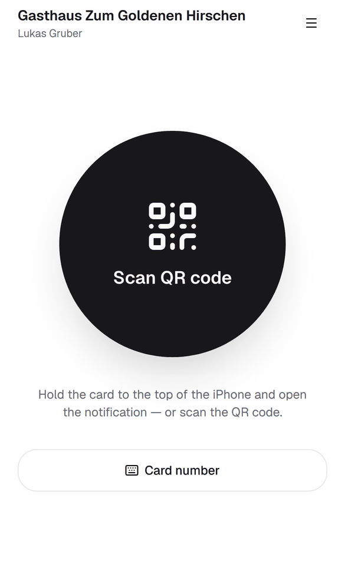
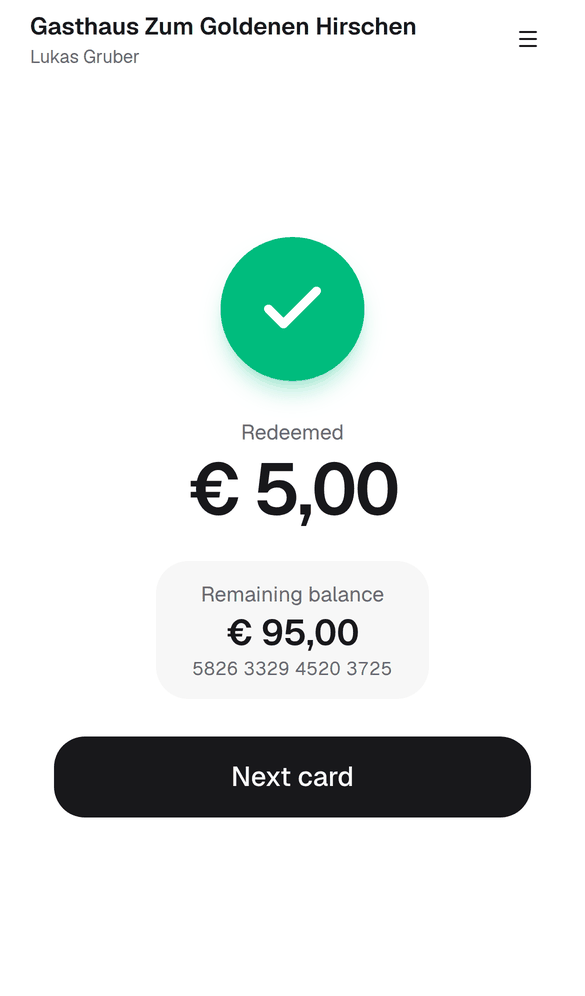

# Kurzanleitung für Servicekräfte: Gutscheinkarte einlösen

*Eine Seite zum Ausdrucken. Bitte an die Kassa legen. Die App ist auf Englisch – die Schaltflächen stehen hier genau so, wie Sie sie sehen.*

---

## 1. Anmelden – einmal pro Handy

1. **GiftCard Pro** am Home-Bildschirm öffnen (oder app.giftcardpro.at).
2. **„E-mail“** und **„Password“** (Passwort) eingeben – **Ihre eigenen**.
3. Auf dem Dienst-Handy: **„Keep me signed in on this device“** (angemeldet bleiben) anhaken.
4. Die App öffnet den Kellner-Modus.

## 2. Karte lesen

| Ihr Handy | So geht's |
|---|---|
| **Android** | Einmal **„Scan card“** (Karte scannen) drücken. Danach jede Karte einfach flach an die **Rückseite** halten. |
| **iPhone** | Karte an die **Oberkante** des iPhones halten → Mitteilung antippen → Karte öffnet sich. |
| **QR-Code** | **„Scan QR code“** (QR-Code scannen) → Kamera auf die Rückseite der Karte richten. |
| **Nichts klappt** | **„Card number“** (Kartennummer) → 16 Ziffern von der Rückseite eintippen → **„Find card“** (Karte suchen). |

## 3. Betrag eintippen und einlösen

1. Betrag wie an der Kassa tippen: **2 4 9 0** → **€ 24,90**. Vertippt? ⌫ löscht die letzte Ziffer.
2. Der Gast zahlt alles mit der Karte? **„Full balance“** (ganzes Guthaben).
3. Großen Knopf **„Redeem € 24,90“** (€ 24,90 einlösen) drücken.
4. Grüner Haken = gebucht. Dem Gast das **„Remaining balance“** (Restguthaben) sagen.
5. Nächste Karte einfach antippen oder **„Next card“** (nächste Karte). Nach 8 Sekunden kehrt die App von selbst zurück.
6. **Registrierkasse nicht vergessen:** Zahlungsart „Gutschein“ bonieren.

## 4. Meldungen

| Sie sehen | Was Sie tun |
|---|---|
| Rechnung höher als das Guthaben | **„Full balance“** einlösen, Rest bar oder mit Karte kassieren. |
| **„This card is blocked“** (rot, gesperrt) | Karte **nicht** annehmen. Betriebsleitung holen. |
| **„This card was replaced … Ask the guest for the new card.“** (ersetzt) | Gast nach der neuen Karte fragen. |
| **„This card has expired.“** (abgelaufen) | Nicht abweisen. Betriebsleitung holen – sie klärt es. |
| **„This card has no balance left.“** (kein Guthaben) | Karte ist aufgebraucht. Normal kassieren. |
| **„This card is not activated yet.“** (nicht aktiviert) | Betriebsleitung holen. |
| **„No card with this number.“** (Nummer unbekannt) | Ziffern prüfen und neu eingeben. |
| **„This is not one of our gift cards.“** (fremde Karte) | Karte eines anderen Lokals – kann hier nicht eingelöst werden. |
| **„No connection to the server.“** (keine Verbindung) | Nichts wurde gebucht. WLAN prüfen, Knopf noch einmal drücken. **Die App bucht nie doppelt.** |
| **„This restaurant only allows redeeming the full balance.“** | Nur das ganze Guthaben kann eingelöst werden. |
| Android: Hinweis „switch on NFC“ | NFC in den Einstellungen einschalten – bis dahin QR-Code scannen. |

## 5. Was Sie dem Gast sagen

- „Auf Ihrer Karte sind noch **€ 75,10**. Die Karte bleibt gültig – bitte gut aufheben.“
- „Ihr Guthaben sehen Sie jederzeit selbst: Karte einfach an Ihr Handy halten oder den QR-Code scannen.“
- „Tipp: Fotografieren Sie die Rückseite mit der Kartennummer. Dann können wir sie bei Verlust ersetzen.“

## 6. Drei Regeln

1. **Nie das eigene Login weitergeben** – und nie mit dem Login einer Kollegin oder eines Kollegen arbeiten. Jede Buchung trägt Ihren Namen.
2. **Karte sofort zurückgeben:** Die Karte gehört dem Gast – nach dem Antippen gleich wieder aushändigen, auch wenn das Guthaben aufgebraucht ist.
3. **Im Zweifel die Betriebsleitung holen** – Fehlbuchungen kann sie jederzeit korrigieren.

## 7. Handy verloren?

**Sofort** Betriebsleitung oder Inhaber/in informieren. Das Handy wird unter **„Devices“** gesperrt und kann dann keine Karten mehr einlösen.

---

**Betriebsleitung erreichbar unter:** ____________________________

---

Version 1.0 · Stand: September 2026
