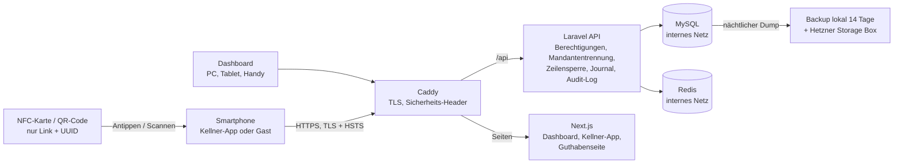

# GiftCard Pro – Sicherheits-Whitepaper

*Wie GiftCard Pro Gutscheinguthaben, Gästedaten und den Betrieb Ihres Lokals schützt – für Inhaberinnen und Inhaber, ihre IT-Betreuung, Steuerberatung und Partner.*

---

## 1. Zusammenfassung

Eine Gutscheinkarte ist Geld. Deshalb ist Sicherheit bei GiftCard Pro keine Zusatzfunktion, sondern die erste Vorgabe für jede Designentscheidung. Dieses Dokument beschreibt die Schutzmaßnahmen, die im Produkt tatsächlich umgesetzt sind – nicht mehr und nicht weniger.

Die wichtigsten Punkte in Kürze:

| Bereich | Umsetzung |
|---|---|
| Karte | Auf dem Chip und im QR-Code steht nur ein Link mit einer zufälligen Kennung (UUID v4, 122 Bit Zufall). Kein Guthaben, keine Personendaten. |
| Kopierschutz | NTAG21x: Bindung an die Seriennummer des Chips (UID). NTAG 424 DNA: kryptografische Signatur (AES-CMAC) und Tap-Zähler bei jedem Antippen. |
| Buchungen | Jede Guthabenänderung ist atomar (Datenbank-Zeilensperre), idempotent (kein doppeltes Buchen bei Doppel-Tap oder Netzwerkfehler) und landet in einem unveränderlichen Journal. Getestet mit 20 gleichzeitigen Einlösungen auf einer Karte. |
| Mandantentrennung | Jedes Lokal sieht ausschließlich seine eigenen Daten; die Trennung wird auf mehreren Ebenen erzwungen. |
| Anmeldung | Passwörter mit mindestens 12 Zeichen, Kontosperre nach 10 Fehlversuchen, Sitzungen an das Gerät gebunden, verlorene Geräte sofort sperrbar. |
| Transport & Web | Nur HTTPS (TLS, HSTS), Content Security Policy, Sicherheits-Header, CSRF-Schutz, kein CORS. |
| Datenschutz | Hosting bei Hetzner Online GmbH in Rechenzentren in Deutschland (EU). Datenminimierung, DSGVO-Anonymisierung, keine Tracking-Cookies in der App. |
| Nachvollziehbarkeit | Prüfprotokoll (Audit-Log) für jede sicherheits- und geldrelevante Aktion; nichts wird gelöscht. |
| Entwicklung | 113 automatisierte Backend-Tests, statische Analyse (Larastan Stufe 8), Abhängigkeitsprüfung in der CI, Browser-Akzeptanztest und Barrierefreiheits-Scan (WCAG 2.1 AA). |

**Transparenz:** GiftCard Pro ist derzeit **nicht** nach ISO 27001, SOC 2 oder PCI DSS zertifiziert, und es wurde bisher **kein** Penetrationstest durch einen externen Dienstleister durchgeführt. Die in diesem Dokument erwähnten Last- und Angriffstests wurden intern durchgeführt. PCI DSS ist für GiftCard Pro nicht einschlägig, weil keine Zahlungskartendaten verarbeitet werden – Gutscheinkarten sind keine Zahlungskarten, und GiftCard Pro wickelt keine Zahlungen ab.

---

## 2. Sicherheitsprinzipien

1. **Die Karte trägt keinen Wert und keine Personendaten.** Sie enthält nur einen Link der Form `https://app.giftcardpro.at/c/<zufällige UUID>`.
2. **Der Server ist die einzige Quelle der Wahrheit.** Guthaben, Verlauf und Kundendaten liegen ausschließlich auf dem Server. Jede Änderung ist gesperrt, atomar, idempotent und im Journal verbucht.
3. **Standardmäßig verweigern.** Jede Schnittstelle verlangt eine bestimmte Berechtigung. Die Zuordnung zu einem Lokal erfolgt automatisch und wird mehrfach geprüft.
4. **Nichts wird gelöscht.** Statt Löschen gibt es Sperren, Deaktivieren, Stornobuchungen und Anonymisierung. Journal und Audit-Log sind nur erweiterbar.
5. **Mehrere Verteidigungslinien.** Prüfungen in der Benutzeroberfläche dienen nur dem Komfort; der Server prüft jede Anfrage erneut und vollständig.
6. **Datensparsamkeit.** Gästedaten sind optional. Eine Karte kann vollständig anonym verkauft werden.

---

## 3. Architektur und Datenfluss

GiftCard Pro ist eine Cloud-Anwendung (Software as a Service). Alle Bestandteile laufen auf einer Serverumgebung bei Hetzner in Deutschland:

- **Caddy** als einziger von außen erreichbarer Dienst (Ports 80 und 443): beendet TLS, setzt Sicherheits-Header, leitet Anfragen weiter.
- **Laravel 12 / PHP 8.4** als Programmierschnittstelle (API) mit der gesamten Geschäftslogik.
- **Next.js 15** für Dashboard, Kellner-App und öffentliche Guthabenseite.
- **MySQL 8.4** für alle dauerhaften Daten (Karten, Journal, Audit-Log).
- **Redis** für Sitzungen, Zwischenspeicher, Warteschlangen und Sperren.

Datenbank und Redis sind nur im internen Netzwerk erreichbar, nicht aus dem Internet. Dashboard und API laufen unter **derselben Adresse** (Origin). Dadurch ist keine Freigabe für fremde Websites (CORS) nötig, und die Anmeldung kann über ein für Skripte unlesbares Sitzungs-Cookie erfolgen.

**Ablauf einer Einlösung:**

1. Die Servicekraft tippt die Karte an das Handy (Android: Web NFC; iPhone: Systembenachrichtigung; alternativ QR-Code oder Kartennummer).
2. Die App sendet den gelesenen Link – bei Android zusätzlich die Chip-Seriennummer, bei NTAG 424 DNA die kryptografische Signatur – an den Server.
3. Der Server prüft Lokal-Zugehörigkeit, Kartenstatus, Kopierschutz und Missbrauchsgrenzen und liefert die Karte zurück.
4. Die Servicekraft gibt den Betrag ein und bestätigt. Die App sendet die Buchung mit einem eindeutigen **Idempotenzschlüssel**.
5. Der Server sperrt die Kartenzeile in der Datenbank, prüft Guthaben und Regeln, schreibt die Buchung ins Journal, aktualisiert das Guthaben, schreibt einen Audit-Eintrag und bestätigt erst dann.

---

## 4. Mandantentrennung

Alle Lokale teilen sich eine Datenbank; jede Zeile, die zu einem Lokal gehört, trägt dessen Kennung. Die Trennung wird auf mehreren Ebenen erzwungen:

1. Nach der Anmeldung wird das Lokal des Benutzers an die Anfrage gebunden.
2. Jede Datenbankabfrage wird automatisch auf dieses Lokal eingeschränkt.
3. Versucht der Code, einen Datensatz in ein fremdes Lokal zu schreiben oder zu verschieben, bricht die Anwendung mit einem Fehler ab.
4. Kennungen fremder Datensätze in Adressen verhalten sich wie nicht vorhandene Datensätze (Antwort „nicht gefunden" – es wird nicht verraten, dass es sie gibt).
5. Schnittstellen eines Lokals verweigern die Arbeit, wenn kein Lokal gebunden ist – eine fehlende Zuordnung kann eine Abfrage also nie auf alle Lokale ausweiten.
6. Eingabeprüfungen und die Geschäftslogik prüfen die Zugehörigkeit zusätzlich.

Scannt eine Servicekraft die Karte eines anderen Lokals, wird der Scan abgelehnt und protokolliert, ohne das andere Lokal zu nennen. Diese Regeln sind durch automatisierte Tests (`TenantIsolationTest`) dauerhaft abgesichert.

---

## 5. Kartensicherheit

### 5.1 Link statt Guthaben

Auf dem Chip steht ausschließlich ein NDEF-Link mit einer zufälligen UUID v4 (122 Bit Zufall). Dieser Wert ist praktisch nicht zu erraten. Die 16-stellige Kartennummer wird ebenfalls zufällig erzeugt (nicht fortlaufend) und enthält eine Luhn-Prüfziffer gegen Tippfehler. Ein Auslesen der Karte verrät weder Guthaben noch Namen.

Wird eine Karte als verloren gemeldet, erzeugt **„Replace lost card"** eine neue Karte mit neuer Kennung; das Guthaben wandert mit, und die alte Karte funktioniert ab sofort nicht mehr.

### 5.2 Schutz gegen Erraten

Fehlgeschlagene und verdächtige Kartenabfragen (nicht gefunden, fremde Karte, falsche Chip-Seriennummer, ungültige Signatur, wiederholte Signatur) sind auf 10 pro 5 Minuten je Benutzer und je IP-Adresse begrenzt. Jeder Versuch wird protokolliert; verdächtige Ergebnisse werden zusätzlich als Warnung im Anwendungsprotokoll vermerkt. Die öffentliche Guthabenseite ist auf 20 Abrufe pro Minute und IP-Adresse begrenzt und kann pro Lokal abgeschaltet werden.

### 5.3 NTAG213/215/216: Bindung an die Chip-Seriennummer

Jeder NTAG21x-Chip hat eine ab Werk eingebrannte Seriennummer (UID). Beim Beschreiben mit Android und Chrome prüft GiftCard Pro zuerst, ob der Chip oder der Link darauf schon zu einer anderen Karte gehört, schreibt dann den Link, liest den Chip erneut aus und speichert die Seriennummer erst, wenn der gelesene Link exakt stimmt. Mit einer anderen NFC-App beschriebene Karten werden als „nicht geprüft“ geführt, ihre Seriennummer wird nicht gespeichert. Liefert ein späterer Scan eine andere Seriennummer, wird er abgelehnt (Kopierschutz, in den Einstellungen abschaltbar) und im Audit-Log als Sicherheitswarnung markiert. Ein Chip kann nicht an zwei aktive Karten gebunden werden – das sichert die Datenbank selbst ab (eindeutiger Index, plattformweit). Jeder Programmierversuch wird protokolliert, auch abgelehnte und fehlgeschlagene. Optional wird der Chip nach dem Beschreiben dauerhaft schreibgeschützt („Lock tags after writing").

**Grenzen:** Es gibt Spezialchips, deren Seriennummer sich verändern lässt. iPhone, QR-Code und manuelle Eingabe übermitteln keine Seriennummer. Für hohe Kartenwerte empfehlen wir deshalb NTAG 424 DNA.

### 5.4 NTAG 424 DNA: kryptografischer Echtheitsnachweis

NTAG 424 DNA-Chips (Secure Unique NFC, SUN) erzeugen bei **jedem** Antippen einen neuen, verschlüsselten Anhang an den Link: Seriennummer und ein Tap-Zähler, abgesichert mit einer AES-CMAC-Signatur. Der Server

- entschlüsselt diese Daten und prüft die Signatur,
- verlangt, dass der Zähler **streng größer** ist als beim letzten akzeptierten Antippen (atomar geprüft).

Ein mitgeschnittener oder kopierter Link ist damit nach einer Verwendung wertlos, und eine Kopie ohne Schlüssel kann keine gültige Signatur erzeugen. Pro Chip wird ein eigener Schlüssel abgeleitet: Selbst wenn der Schlüssel eines Chips ausgelesen würde, wäre nur dieser eine Chip betroffen. Die Implementierung ist gegen die offiziellen Testvektoren des Herstellers NXP (AN12196) geprüft. Die Prüfung funktioniert auf Android und iPhone.

---

## 6. Integrität der Buchungen

| Maßnahme | Wirkung |
|---|---|
| **Zeilensperre** (`SELECT … FOR UPDATE`) innerhalb einer Datenbanktransaktion | Gleichzeitige Einlösungen auf derselben Karte werden nacheinander verarbeitet. Das Guthaben wird immer aus der gesperrten Zeile gelesen, nie aus der Anfrage. |
| **Idempotenzschlüssel** (Pflicht bei Einlösen, Aufladen, Übertragen) | Doppel-Tap oder Netzwerk-Wiederholung liefert die ursprüngliche Buchung zurück, statt ein zweites Mal zu buchen. Wird derselbe Schlüssel für eine andere Buchung verwendet, lehnt der Server ab. |
| **Unveränderliches Journal** | Buchungen werden nie geändert oder gelöscht. Es gilt immer: Guthaben = Summe aller Buchungen der Karte. |
| **Storno als Gegenbuchung** | Eine falsche Einlösung oder Aufladung wird durch eine Gegenbuchung korrigiert; die ursprüngliche Buchung bleibt sichtbar. |
| **Keine negativen Guthaben** | Die Datenbankspalte lässt keine negativen Werte zu. Beträge werden als ganze Cent gespeichert, nie als Gleitkommazahl. |
| **Feste Sperrreihenfolge bei Übertragungen** | Gegenläufige Übertragungen (A→B und B→A) blockieren sich nicht gegenseitig. |
| **Missbrauchsgrenzen** | Maximale Einlösungen pro Karte und Stunde (Standard 10), maximaler Einzelbetrag, maximales Kartenguthaben, Teil-Einlösung und Aufladung abschaltbar. |

**Interner Test:** In einem intern durchgeführten Lasttest gegen eine echte Datenbank mit Zeilensperren wurden 20 gleichzeitige Einlösungen auf eine Karte, 10 Anfragen mit demselben Idempotenzschlüssel (genau eine Buchung) und gegenläufige Übertragungen (kein Deadlock, Summen erhalten) geprüft. Die dauerhaften automatisierten Tests decken diese Fälle ebenfalls ab.

---

## 7. Anmeldung und Sitzungen

- **Passwörter:** mindestens 12 Zeichen, Groß- und Kleinbuchstaben sowie eine Ziffer. In der Produktivumgebung werden zusätzlich Passwörter abgelehnt, die aus bekannten Datenlecks stammen (Abgleich über das k-Anonymitäts-Verfahren von „Have I Been Pwned"; dabei verlassen nur die ersten fünf Zeichen eines Hash-Werts den Server, nie das Passwort). Gespeichert wird nur ein bcrypt-Hash. Details: [Passwortrichtlinie](password-policy.md).
- **Schutz gegen Durchprobieren:** 5 Anmeldeversuche pro Minute je E-Mail-Adresse und IP, 30 pro Minute je IP; nach 10 aufeinanderfolgenden Fehlversuchen wird das Konto für 15 Minuten gesperrt. Fehlermeldungen verraten nicht, ob eine E-Mail-Adresse existiert; auch „Forgot password?" antwortet immer gleich.
- **Einladungen statt Passwörtern:** Neue Teammitglieder erhalten per E-Mail einen einmaligen Link (gültig 72 Stunden) und wählen ihr Passwort selbst. Links zum Zurücksetzen des Passworts gelten 60 Minuten. Passwörter werden nie per E-Mail verschickt.
- **Gerätebindung:** Jedes Gerät, das sich anmeldet, wird automatisch registriert. Eine Sitzung ist an das Gerät gebunden, auf dem sie begonnen wurde – ein kopiertes Sitzungs-Cookie ist auf einem anderen Gerät nutzlos. Ein gesperrtes Gerät wird sofort abgewiesen.
- **Sitzungsdauer:** Sitzungen enden nach 8 Stunden Inaktivität, außer „Keep me signed in on this device" wurde bewusst gewählt.
- **Passwortwechsel** meldet alle anderen Sitzungen ab. **Deaktivieren** eines Benutzers widerruft alle seine API-Tokens und beendet seine Sitzungen.

---

## 8. Berechtigungen

GiftCard Pro kennt vier Rollen: Plattform-Administration (Betreiber), Inhaber/in (Owner), Manager und Servicekraft (Waiter). Jede Schnittstelle verlangt eine konkrete Berechtigung. Servicekräfte dürfen standardmäßig nur Karten scannen und einlösen. Manager führen den Tagesbetrieb, verwalten aber weder Team noch Einstellungen noch API-Tokens. Weitere Schutzregeln:

- Niemand kann seine eigene Rolle ändern oder sich selbst deaktivieren.
- Ein Lokal behält immer mindestens eine aktive Inhaberin bzw. einen aktiven Inhaber.
- Die Rolle „Plattform-Administration" kann in keinem Lokal vergeben werden.
- API-Tokens können nie mehr dürfen als die Person, die sie erstellt hat.

Die vollständige Berechtigungsmatrix finden Sie im [Leitfaden Zugriffskontrolle](access-control-guide.md).

**Zugriff durch den Anbieter:** Mitarbeitende von GiftCard Pro sehen Daten eines Lokals nur über die Plattform-Funktion „Open restaurant". Dabei zeigt ein Banner deutlich den Arbeitsmodus an, und jede Aktion wird im Audit-Log mit der Identität der handelnden Person erfasst.

---

## 9. Transport- und Web-Sicherheit

| Maßnahme | Details |
|---|---|
| HTTPS | Ausschließlich verschlüsselte Verbindungen; Zertifikate automatisch über Caddy (Let's Encrypt), HTTP/3 unterstützt. |
| HSTS | `max-age` zwei Jahre, inkl. Subdomains, Preload – Browser verbinden sich nie unverschlüsselt. |
| Content Security Policy | Web-Oberfläche: Inhalte grundsätzlich nur von der eigenen Adresse; API: `default-src 'none'`. Einbettung in fremde Seiten verboten (`frame-ancestors 'none'`, `X-Frame-Options: DENY`). |
| Weitere Header | `X-Content-Type-Options: nosniff`, `Referrer-Policy: strict-origin-when-cross-origin`, `Permissions-Policy` (Kamera und NFC nur für die eigene App, Mikrofon und Standort gesperrt), `Cross-Origin-Opener-Policy`. |
| Cookies | Sitzungs-Cookie `httpOnly` (für Skripte unlesbar), verschlüsselt, `Secure`, `SameSite=Lax`. |
| CSRF | Doppelter Token-Abgleich über das `XSRF-TOKEN`-Cookie. |
| CORS | Deaktiviert: Keine fremde Website darf die API im Namen einer angemeldeten Person aufrufen. |
| Caching | API-Antworten mit `Cache-Control: no-store, private`. |
| Eingaben | Datenbankzugriffe ausschließlich mit gebundenen Parametern (Schutz vor SQL-Injection); React maskiert Ausgaben (Schutz vor XSS); E-Mail-Vorlagen maskieren jeden Platzhalter; CSV-Exporte neutralisieren Formeln. |
| IP-Adressen | Weitergeleitete Adressen werden nur aus privaten Netzbereichen akzeptiert – Angreifer können ihre IP nicht fälschen, um Sperren zu umgehen. |

---

## 10. Datenschutz

- **Rollen nach DSGVO:** Für Gäste- und Kundendaten ist das Lokal Verantwortlicher; GiftCard Pro ist Auftragsverarbeiter (Art. 28 DSGVO) auf Basis eines Auftragsverarbeitungsvertrags (AVV).
- **Hosting in der EU:** Hetzner Online GmbH, Rechenzentren in Deutschland. Unterauftragsverarbeiter sind im AVV aufgelistet (Hetzner für Hosting und Backups, `[E-Mail-Versanddienstleister mit EU-Hosting]` für Transaktions-E-Mails).
- **Datenminimierung:** Kundendaten (Name, E-Mail, Telefon, Notizen, Marketing-Einwilligung) sind optional. Karten können anonym verkauft werden.
- **Keine Personendaten im Audit-Log:** Änderungen an Namen, E-Mail, Telefon, Notizen oder Empfängernamen werden nur als „[personal data]" vermerkt.
- **Anonymisierung:** Auf Wunsch eines Gastes entfernt die Anonymisierung alle Personendaten (inkl. Empfängernamen auf seinen Karten und E-Mail-Adressen im Versandprotokoll), die für die Buchhaltung nötigen Finanzdaten bleiben erhalten.
- **Keine Tracking-Cookies:** Die App verwendet nur technisch notwendige Cookies (Sitzung, CSRF-Schutz) und im Browser-Speicher eine zufällige Gerätekennung. Keine Analyse, keine Werbung, keine Cookies von Dritten.
- **Vertragsende:** Datenexport jederzeit möglich; Löschung 30 Tage nach Vertragsende, soweit keine gesetzliche Aufbewahrungspflicht besteht.

---

## 11. Protokollierung und Prüfspur

- **Audit-Log:** Jede sicherheits- und geldrelevante Aktion wird mit Person, Gerät, IP-Adresse, Zeitpunkt (Mikrosekunden) und Anfrage-Kennung (Request-ID) festgehalten. Einträge können nicht geändert oder gelöscht werden. Passwörter und Tokens werden geschwärzt.
- **Sicherheitswarnungen** – kopierte Karte, wiederholter NFC-Tap, fremde Karte, gesperrtes Konto – sind im Audit-Log rot hervorgehoben und werden zusätzlich als Warnung im Anwendungsprotokoll geschrieben.
- **Kartenverlauf:** jede Buchung und jedes Ereignis mit Zeit, Person, Gerät und Saldo danach.
- **Scan-Protokoll:** Jeder Kartenscan wird festgehalten, auch erfolglose.
- **API-Tokens:** Zeitpunkt und IP-Adresse der letzten Verwendung werden gespeichert.

---

## 12. Datensicherung und Verfügbarkeit

- **Nächtliche Datenbanksicherung** (konsistenter Dump ohne Betriebsunterbrechung), 14 Tage lokal aufbewahrt und zusätzlich auf eine Hetzner Storage Box außerhalb des Servers übertragen.
- **Tägliche Snapshots** des gesamten Servers über Hetzner.
- **Keine endgültigen Löschungen** in der Anwendung; Fremdschlüssel verhindern das versehentliche Löschen abhängiger Daten.
- **Health-Check** `/up` prüft Datenbank und Cache, nicht nur den Webserver, und dient der Verfügbarkeitsüberwachung.
- **Zielwerte:** Verfügbarkeit 99,5 % pro Monat (Ziel, im Tarif Start keine Garantie), Datenverlust höchstens 24 Stunden (RPO), Wiederherstellung nach Totalausfall des Servers innerhalb von 4 Stunden (RTO, Ziel). Details: [Notfallwiederherstellungsplan](disaster-recovery-plan.md).
- **Aktualisierungen** werden so gestaltet, dass die vorherige Version während des Rollouts weiterläuft. Jede Version ist mit ihrem Commit gekennzeichnet und kann zurückgerollt werden.

GiftCard Pro benötigt für Einlösungen eine Internetverbindung. Offline-Buchungen gibt es bewusst nicht, weil nur der Server Doppelbuchungen sicher verhindern kann.

---

## 13. Sichere Entwicklung und Betrieb

- **Automatisierte Tests:** 113 Backend-Tests (513 Prüfungen) laufen bei jeder Änderung, sowohl auf SQLite als auch auf MySQL. Eigene Testreihen decken Mandantentrennung, Berechtigungen, Kartenscans, Anmeldung, Idempotenz und Gleichzeitigkeit ab.
- **Statische Analyse:** Larastan auf Stufe 8, TypeScript-Prüfung, ESLint.
- **Abhängigkeiten:** `composer audit` und `npm audit` in der CI-Pipeline.
- **Akzeptanztest im Browser:** Ein automatisierter Durchlauf spielt den ersten Tag eines Lokals in echten Browsern durch (inkl. Ersatzkarte und Ablehnung der alten Karte) und bricht bei jedem Fehler ab.
- **Barrierefreiheit:** axe-Scan (WCAG 2.1 AA) ohne Befund auf allen Hauptbildschirmen, hell und dunkel.
- **Interne Sicherheitsprüfung:** Vor dem Pilotbetrieb wurde der gesamte Code intern auf Sicherheitsschwächen geprüft; die Befunde sind im Änderungsprotokoll dokumentiert und behoben.
- **Bereitstellung:** Container-Images werden in GitHub Actions gebaut; Produktiv-Deployments erfordern eine Freigabe. Serverzugang nur per SSH-Schlüssel, keine Root-Anmeldung, Firewall nur für die nötigen Ports, automatische Sicherheitsupdates des Betriebssystems.
- **Geheimnisse** (Anwendungsschlüssel, NFC-Schlüssel) werden in einem Passwortmanager verwahrt, nicht im Code.

---

## 14. Umgang mit Sicherheitsvorfällen

GiftCard Pro verfügt über einen dokumentierten Prozess für Sicherheitsvorfälle mit Schweregraden, Verantwortlichkeiten und Checklisten ([Leitfaden Incident Response](incident-response-guide.md)). Kernpunkte:

- Erkennung über Audit-Log-Warnungen, Anwendungsprotokoll, Verfügbarkeitsüberwachung und Meldungen von Lokalen.
- Sofortmaßnahmen: Geräte sperren, Benutzer deaktivieren, Tokens widerrufen, Karten sperren.
- **Datenschutzverletzungen:** GiftCard Pro informiert das betroffene Lokal als Verantwortlichen unverzüglich (Art. 33 Abs. 2 DSGVO), damit dieses seiner Meldepflicht gegenüber der Datenschutzbehörde innerhalb von 72 Stunden nachkommen kann (Art. 33 Abs. 1 DSGVO).
- Nach jedem Vorfall: Bericht und Verbesserungsmaßnahmen.

---

## 15. Geteilte Verantwortung

Sicherheit entsteht gemeinsam. Die folgende Tabelle zeigt, wer wofür zuständig ist.

| Bereich | GiftCard Pro (Anbieter) | Lokal (Kunde) |
|---|---|---|
| Server, Netzwerk, Betriebssystem | Betrieb, Härtung, Updates | – |
| Anwendung | Sicherheitsfunktionen, Fehlerbehebung, Updates | Sicherheitsfunktionen aktivieren und nutzen (Kopierschutz, Missbrauchsgrenzen) |
| Datensicherung | Nächtliche Backups, Off-Site-Kopie, Wiederherstellung | Bei Bedarf eigene CSV-Exporte |
| Benutzerkonten | Passwortregeln, Sperren, Gerätebindung | Ein Konto pro Person, starke Passwörter, Austritte am selben Tag deaktivieren |
| Rollen | Durchsetzung der Berechtigungen | Rollen nach dem Prinzip der geringsten Rechte vergeben, regelmäßig prüfen |
| Endgeräte | – | Bildschirmsperre, Betriebssystem-Updates, verlorene Geräte sofort sperren |
| Karten | Kryptografische Prüfung, UID-Bindung | Kartentyp passend zum Wert wählen, Chips sperren, verdächtige Karten blockieren |
| Audit-Log | Vollständige Erfassung | Sicherheitswarnungen regelmäßig ansehen |
| API-Tokens | Hashing, Ablauf, Widerruf | Tokens sicher verwahren, minimale Rechte, nicht mehr benötigte widerrufen |
| Datenschutz | Auftragsverarbeitung nach AVV, technische Maßnahmen | Verantwortlicher für Gästedaten, Informationspflichten, Meldung an die Datenschutzbehörde |
| Kassa und Steuer | – | Buchung in der Registrierkasse, steuerliche Behandlung (GiftCard Pro ist keine Registrierkasse) |

Praktische Empfehlungen für Lokale: [Sicherheits-Best-Practices](security-best-practices.md).

---

## 16. Kontakt

- **Sicherheitslücken und Vorfälle:** security@giftcardpro.at – wir antworten innerhalb von 2 Werktagen, bei aktiven Vorfällen so schnell wie möglich.
- **Datenschutz:** datenschutz@giftcardpro.at
- **Support:** support@giftcardpro.at
- **Anbieter:** [Firmenname] [Rechtsform], [Anschrift], 1xxx Wien, [Firmenbuchnummer], [UID-Nummer]

Wir bitten darum, gefundene Schwachstellen vertraulich zu melden und uns angemessen Zeit zur Behebung zu geben, bevor Details veröffentlicht werden. Bitte testen Sie nicht mit den Daten anderer Lokale und beeinträchtigen Sie nicht den Betrieb.

---

Version 1.0 · Stand: September 2026
