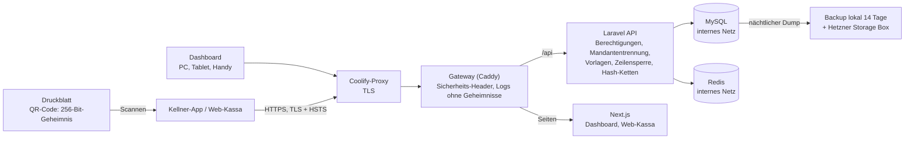

# GiftCard Pro – Sicherheits-Whitepaper

*Wie GiftCard Pro Gutscheinguthaben, Gästedaten und den Betrieb Ihres Lokals schützt – für Inhaberinnen und Inhaber, ihre IT-Betreuung, Steuerberatung und Partner. Technische Referenz mit Code-Verweisen: [docs/SECURITY.md](../../SECURITY.md).*

---

## 1. Zusammenfassung

Ein Gutschein ist Geld, und die Daten jedes Lokals müssen für jedes andere Lokal unsichtbar sein. Deshalb ist Sicherheit bei GiftCard Pro keine Zusatzfunktion, sondern die erste Vorgabe für jede Designentscheidung. Dieses Dokument beschreibt die Schutzmaßnahmen, die im Produkt tatsächlich umgesetzt sind – nicht mehr und nicht weniger.

Die wichtigsten Punkte in Kürze:

| Bereich | Umsetzung |
|---|---|
| Gutschein | Der druckbare QR-Code trägt ein zufälliges 256-Bit-Geheimnis, keinen Link, kein Guthaben, keine Personendaten. Der Server speichert nur dessen SHA-256-Hash. |
| Einlösen | Jede Abbuchung verbraucht eine **Vorlage**: den Nachweis, dass der Gutschein jetzt hier ist – einmalig, 60 Sekunden gültig, gebunden an Lokal, Gutschein, Person und Gerät. Die Gutscheinnummer ist nie ein Berechtigungsnachweis. |
| Buchungen | Jede Guthabenänderung ist atomar (Datenbank-Zeilensperre), idempotent (kein doppeltes Buchen bei Doppel-Tap oder Netzwerkfehler) und landet im Ledger. Jeder Verkauf und jede Aufladung hält die Zahlung fest. |
| Unveränderliche Historie | Ledger, Zahlungen und Audit-Log sind append-only (Datenbank-Trigger) und je Lokal über Hash-Ketten verknüpft; eine nächtliche Prüfung berechnet jede Kette und jedes Guthaben neu. |
| Mandantentrennung | Jedes Lokal sieht ausschließlich seine eigenen Daten; die Trennung wird auf mehreren Ebenen erzwungen. |
| Anmeldung | Passwörter mit mindestens 12 Zeichen, Kontosperre nach 10 Fehlversuchen ohne verräterische Antwort, Sitzungen und App-Tokens an das Gerät gebunden, verlorene Geräte sofort sperrbar. |
| Transport & Web | Nur HTTPS (TLS, HSTS), Content Security Policy, Sicherheits-Header, CSRF-Schutz, kein CORS, Logs ohne Geheimnisse. |
| Datenschutz | Hosting bei Hetzner Online GmbH in Rechenzentren in Deutschland (EU). Datenminimierung, DSGVO-Anonymisierung, keine Tracking-Cookies in der App. |
| Entwicklung | Missbrauchstests für jede Verbotsregel, statische Analyse (Larastan), Tests auf SQLite und MySQL, Integritätsprüfung in der CI, Abhängigkeitsprüfung, Browser-Akzeptanztest und Barrierefreiheits-Scan (WCAG 2.1 AA). |

**Transparenz:** GiftCard Pro ist **nicht** nach ISO 27001, SOC 2 oder PCI DSS zertifiziert, und es wurde bisher **kein** Penetrationstest durch einen externen Dienstleister durchgeführt. Die in diesem Dokument erwähnten Last- und Angriffstests wurden intern durchgeführt. PCI DSS ist für GiftCard Pro nicht einschlägig, weil keine Zahlungskartendaten verarbeitet werden – Gutscheine sind keine Zahlungskarten, und GiftCard Pro wickelt keine Zahlungen ab; es hält nur fest, wie bezahlt wurde.

---

## 2. Sicherheitsprinzipien

1. **Einlösen braucht einen Anwesenheitsnachweis.** Jede Abbuchung verbraucht eine Vorlage: einmalig, 60 Sekunden, gebunden an Person, Gerät, Lokal und Gutschein. Eine Gutscheinnummer ist nie ein Berechtigungsnachweis.
2. **Der Server ist die einzige Quelle der Wahrheit** für Guthaben; jede Änderung ist atomar, gesperrt, idempotent und im Ledger verbucht.
3. **Die Finanzhistorie ist unveränderlich.** Ledger, Zahlungen und Audit-Log sind nur erweiterbar (Datenbank-Trigger) und über Hash-Ketten verknüpft; eine nächtliche Prüfung kontrolliert jede Kette und jedes Guthaben.
4. **Standardmäßig verweigern.** Jede Schnittstelle verlangt eine Berechtigung; die Zuordnung zum Lokal erfolgt automatisch und wird mehrfach geprüft; Tokens sind zusätzlich durch ihre Abilities und – bei der Kellner-App – durch Methode und Pfad begrenzt.
5. **Mehrere Verteidigungslinien.** Prüfungen in der Benutzeroberfläche dienen nur dem Komfort; der Server prüft jede Anfrage erneut und vollständig.
6. **Datensparsamkeit.** Gästedaten sind optional. Ein Gutschein kann vollständig anonym verkauft werden.

---

## 3. Architektur und Datenfluss

GiftCard Pro ist eine Cloud-Anwendung (Software as a Service). Alle Bestandteile laufen als eine Coolify-Ressource auf einem Server bei Hetzner in Deutschland:

- Der **Coolify-Proxy** beendet TLS für die Domain; dahinter ist das **Gateway** (Caddy) der einzige Dienst mit Domain. Es setzt Sicherheits-Header, leitet `/api`, `/sanctum` und `/up` an Laravel und alles andere an Next.js weiter und schreibt Zugriffslogs ohne Geheimnisse.
- **Laravel 12 / PHP 8.4** als Programmierschnittstelle (API) mit der gesamten Geschäftslogik.
- **Next.js 15** für Dashboard und Web-Kassa.
- **GiftCard Waiter** (Android und iPhone) als native Kellner-App mit gerätegebundenem Token.
- **MySQL 8.4** für alle dauerhaften Daten (Gutscheine, Zahlungen, Ledger, Audit-Log).
- **Redis** für Sitzungen, Zwischenspeicher, Warteschlangen und Sperren.

Kein Dienst veröffentlicht einen Port am Server; Datenbank und Redis sind nur im internen Netzwerk erreichbar. Dashboard und API laufen unter **derselben Adresse** (Origin). Dadurch ist keine Freigabe für fremde Websites (CORS) nötig, und die Anmeldung im Browser erfolgt über ein für Skripte unlesbares Sitzungs-Cookie.

**Ablauf einer Einlösung:**

1. Die Servicekraft scannt den QR-Code des Gutscheins mit der Kamera (Kellner-App oder Web-Kassa).
2. Die App sendet den gescannten Text an `POST /presentments`. Der Server prüft die Sperre für Fehlversuche, sucht den Hash im Bestand **dieses** Lokals, prüft die Einlöseregel der Gutscheinart und legt eine Vorlage an (gültig 60 s, gebunden an Lokal, Gutschein, Zweck, Person und Gerät). Die App zählt die Restzeit herunter.
3. Die Servicekraft gibt den Betrag ein und bestätigt. Die App sendet `POST /vouchers/{id}/redemptions` mit der Vorlage und einem eindeutigen **Idempotenzschlüssel**; sie speichert den Versuch vorher verschlüsselt am Gerät.
4. Der Server sperrt Vorlage und Gutschein in der Datenbank, prüft den Schlüssel erneut, verbraucht die Vorlage, prüft Status, Guthaben und Grenzen, hängt Ledger- und Audit-Eintrag an die Hash-Ketten an, aktualisiert das Guthaben und bestätigt erst dann.
5. Bleibt die Antwort aus, fragt die App `GET /vouchers/{id}/redemptions/{key}` ab – sie bucht nie ein zweites Mal und zeigt nie „nichts gebucht“, solange das Ergebnis unbekannt ist.

---

## 4. Mandantentrennung

Alle Lokale teilen sich eine Datenbank; jede Zeile, die zu einem Lokal gehört, trägt dessen Kennung. Die Trennung wird auf mehreren Ebenen erzwungen:

1. Nach der Anmeldung wird das Lokal des Benutzers an die Anfrage gebunden.
2. Jede Datenbankabfrage wird automatisch auf dieses Lokal eingeschränkt.
3. Versucht der Code, einen Datensatz in ein fremdes Lokal zu schreiben, bricht die Anwendung mit einem Fehler ab.
4. Kennungen fremder Datensätze in Adressen verhalten sich wie nicht vorhandene Datensätze (Antwort „nicht gefunden“ – es wird nicht verraten, dass es sie gibt).
5. Schnittstellen eines Lokals verweigern die Arbeit, wenn kein Lokal gebunden ist – eine fehlende Zuordnung kann eine Abfrage also nie auf alle Lokale ausweiten. Die Plattform-Administration hat kein Lokal und handelt daher nie innerhalb eines Lokals.
6. Eingabeprüfungen und die Geschäftslogik prüfen die Zugehörigkeit zusätzlich.
7. Ein QR-Code wird nur unter den Gutscheinen des eigenen Lokals gesucht: Der Code eines anderen Lokals ist „nicht erkannt“ – genau wie ein unbekannter.

Diese Regeln sind durch automatisierte Tests (`TenantIsolationTest`) dauerhaft abgesichert.

---

## 5. Gutscheinsicherheit

### 5.1 Geheimnis statt Link

Der druckbare QR-Code enthält `GCPV1.` und 43 base64url-Zeichen – ein zufälliges 256-Bit-Geheimnis. Der Server speichert nur dessen SHA-256-Hash; das Geheimnis wird genau einmal, in der Antwort des Verkaufs, zurückgegeben und nie protokolliert. Weil es kein Link ist, landet es weder in Webserver-Logs noch im Browserverlauf. Das Druckblatt zeigt den QR-Code und das Lokal, nie die Gutscheinnummer oder den Wert.

Die 16-stellige Gutscheinnummer ist zufällig (nicht fortlaufend), hat eine Luhn-Prüfziffer und dient nur Personal und Support. Sie wird nie gedruckt und nie als Berechtigungsnachweis akzeptiert.

Wird ein Gutschein als verloren gemeldet, sperrt das Lokal ihn; ab sofort kann er nicht eingelöst werden.

### 5.2 Schutz gegen Erraten und Durchprobieren

Fehlgeschlagene Vorlagen (der gescannte Text beweist nichts) sind auf 10 pro 5 Minuten je Lokal, Person und Gerät begrenzt – nie je IP-Adresse, damit Gäste hinter demselben WLAN einander nicht aussperren. Jeder Fehlversuch wird im Audit-Log festgehalten (`presentment.failed`, `presentment.rejected`). Es gibt keine öffentliche Guthabenseite und keine öffentliche Gutscheinabfrage.

### 5.3 Die Vorlage

Jede Einlösung verbraucht eine geprüfte, nicht abgelaufene Vorlage dieses Gutscheins, erstellt von derselben Person auf demselben Gerät, in derselben Datenbanktransaktion (Sperrreihenfolge Vorlage → Gutschein). Vorlagen sind einmalig (`verified → consumed`), 60 Sekunden gültig, und ein Ledger-Eintrag verweist auf höchstens eine (eindeutiger Index). Einlöseregeln je Art: Digitale Gutscheine nur mit einer QR-Methode, Karten-Gutscheine nur mit Live-Authentifizierung.

### 5.4 Physische Karten: NTAG 424 DNA mit Live-Authentifizierung

Physische Karten sind ausschließlich als **NTAG 424 DNA** vorgesehen. Eine Karte wird nur nach **Live-Authentifizierung** eingelöst: Die Kellner-App leitet die Befehle des Chips über NFC an den **Krypto-Dienst** weiter, der die Kartenschlüssel in einem Hardware-Sicherheitsmodul hält und beweist, dass der echte Chip in diesem Moment vorliegt. Das Ergebnis ist eine Vorlage mit der Methode `live_auth` (Stufe A3). Solange dieser Dienst nicht in Betrieb ist, beantwortet der Server `live_auth` mit `422 PRESENTMENT_METHOD_UNAVAILABLE`; die Kellner-App hat keinen NFC-Code und keine NFC-Berechtigung. Kartenschlüssel sind nie Teil der Konfiguration. Details: [docs/NFC.md](../../NFC.md).

---

## 6. Integrität der Buchungen

| Maßnahme | Wirkung |
|---|---|
| **Zeilensperre** (`SELECT … FOR UPDATE`) innerhalb einer Datenbanktransaktion | Gleichzeitige Einlösungen desselben Gutscheins werden nacheinander verarbeitet. Das Guthaben wird immer aus der gesperrten Zeile gelesen, nie aus der Anfrage. Bei einem Deadlock wird wiederholt. |
| **Idempotenzschlüssel** (Pflicht bei Verkauf, Einlösung und Aufladung) | Doppel-Tap oder Netzwerk-Wiederholung liefert die ursprüngliche Buchung zurück, statt ein zweites Mal zu buchen; der Schlüssel wird nach der Zeilensperre erneut geprüft. Derselbe Schlüssel für eine andere Buchung wird abgelehnt. |
| **Abfrage bei unbekanntem Ergebnis** | Eine Kassa, deren Antwort verloren ging, fragt `GET /vouchers/{id}/redemptions/{key}` ab, statt erneut abzubuchen. |
| **Zahlungen** | Jeder Verkauf und jede Aufladung hält die Zahlung fest: bar, Kartenterminal mit Belegnummer, Überweisung mit Referenz oder gratis mit Begründung (nur mit `vouchers.sell_complimentary`, standardmäßig Owner). |
| **Unveränderliche Historie** | Datenbank-Trigger lehnen `UPDATE` und `DELETE` auf Ledger, Zahlungen und Audit-Log ab; die Anwendung verweigert sie schon vorher (`IMMUTABLE_RECORD`). Jede Zeile ist Teil einer SHA-256-Hash-Kette je Lokal. Es gilt immer: Guthaben = Summe aller Buchungen des Gutscheins. |
| **Nächtliche Integritätsprüfung** | `giftcard:verify-chains` berechnet jede Kette und jedes Guthaben neu und alarmiert per E-Mail bei jeder Abweichung; die CI führt dieselbe Prüfung auf MySQL aus. |
| **Storno als Gegenbuchung** | Eine falsche Einlösung oder Aufladung wird durch einen neuen, gegengleichen Eintrag korrigiert; höchstens einmal je Eintrag, die ursprüngliche Buchung bleibt unverändert sichtbar. |
| **Keine negativen Guthaben** | Die Datenbankspalte lässt keine negativen Werte zu. Beträge werden als ganze Cent gespeichert, nie als Gleitkommazahl. |
| **Missbrauchsgrenzen** | Maximaler Betrag je Einlösung, je Gutschein und Tag, Einlösungen je Gutschein und Stunde (Standard 10), maximales Guthaben – geprüft unter der Zeilensperre; Plattformobergrenzen für jede Einstellung. |
| **Kein Verlust von Gästegeld** | Kein Standardablauf; eine Gültigkeit beträgt mindestens 36 Monate; ein Ablauf behält das Guthaben, die Inhaberin bzw. der Inhaber kann den Gutschein wieder freigeben. |

Die automatisierten Tests (`IdempotencyAndConcurrencyTest`, auch gegen MySQL, sowie die Missbrauchstests in `tests/Feature/Abuse/`) decken gleichzeitige Einlösungen, wiederholte Schlüssel, fremde und abgelaufene Vorlagen, Manipulation der Historie und Zahlungen ohne Berechtigung ab.

---

## 7. Anmeldung und Sitzungen

- **Passwörter:** mindestens 12 Zeichen, Groß- und Kleinbuchstaben sowie eine Ziffer. In der Produktivumgebung werden zusätzlich Passwörter abgelehnt, die aus bekannten Datenlecks stammen (Abgleich über das k-Anonymitäts-Verfahren von „Have I Been Pwned“; dabei verlassen nur die ersten fünf Zeichen eines Hash-Werts den Server, nie das Passwort). Gespeichert wird nur ein bcrypt-Hash. Details: [Passwortrichtlinie](password-policy.md).
- **Schutz gegen Durchprobieren:** 5 Anmeldeversuche pro Minute je E-Mail-Adresse und IP, 30 pro Minute je IP; nach 10 aufeinanderfolgenden Fehlversuchen wird das Konto für 15 Minuten gesperrt. Ein gesperrtes Konto, ein falsches Passwort und eine unbekannte Adresse erhalten dieselbe Antwort in derselben Zeit; auch „Forgot password?“ antwortet immer gleich.
- **Einladungen statt Passwörtern:** Neue Teammitglieder erhalten per E-Mail einen einmaligen Link (gültig 72 Stunden) und wählen ihr Passwort selbst. Links zum Zurücksetzen gelten 60 Minuten. Einladungen und Zurücksetzungen liegen in getrennten Token-Speichern; das Token steht im URL-Fragment und erreicht nie einen Server. Passwörter werden nie per E-Mail verschickt.
- **Gerätebindung:** Jedes Gerät, das sich anmeldet, wird automatisch registriert. Eine Browser-Sitzung ist an das Gerät gebunden, auf dem sie begonnen wurde – ein kopiertes Sitzungs-Cookie ist auf einem anderen Gerät nutzlos. Ein gesperrtes Gerät wird sofort abgewiesen.
- **„Keep me signed in“:** standardmäßig aus; eine so wiederhergestellte Sitzung wird nur auf einem aktiven, bereits verwendeten Gerät der Person akzeptiert. Das Sperren eines Geräts beendet sie. Die Plattform-Administration meldet sich immer ausdrücklich an.
- **Kellner-App:** Das Token gilt nur mit der Gerätekennung des Telefons, erreicht nur die sieben Anfragen, die die App verwendet (Methode und Pfad), endet sofort beim Sperren des Geräts und läuft nach 30 Tagen ohne Nutzung ab.
- **Sitzungsdauer:** Sitzungen enden nach 8 Stunden Inaktivität.
- **Passwortwechsel oder -zurücksetzung** widerruft alle Tokens der Person (Kellner-App und Integrationen), beendet „Keep me signed in“ und alle anderen Browser-Sitzungen. **Deaktivieren** eines Benutzers widerruft alle seine Tokens und beendet seine Sitzungen.

---

## 8. Berechtigungen

GiftCard Pro kennt vier Rollen: Plattform-Administration (Betreiber), Inhaber/in (Owner), Betriebsleitung (Manager) und Servicekraft (Waiter). Jede Schnittstelle verlangt eine konkrete Berechtigung. Servicekräfte dürfen standardmäßig nur einlösen – mit dem gescannten Gutschein. Die Betriebsleitung führt den Tagesbetrieb, verwaltet aber weder Team noch Einstellungen noch API-Tokens; Ablauf, Wiederfreigabe und Gratis-Gutscheine sind Owner vorbehalten. Weitere Schutzregeln:

- Niemand kann seine eigene Rolle ändern oder sich selbst deaktivieren.
- Ein Lokal behält immer mindestens eine aktive Inhaberin bzw. einen aktiven Inhaber.
- Die Rolle „Plattform-Administration“ kann in keinem Lokal vergeben werden.
- API-Tokens können nie mehr dürfen als die Person, die sie erstellt hat.

Die vollständige Berechtigungsmatrix finden Sie im [Leitfaden Zugriffskontrolle](access-control-guide.md).

**Zugriff durch den Anbieter:** Die Plattform-Administration betreibt Lokale (anlegen, deaktivieren, archivieren, Einladungen), handelt aber nie innerhalb eines Lokals und berührt nie Gutscheine, Buchungen oder Kundendaten; Restaurant-Schnittstellen weisen sie ab. Sie kann keine API-Tokens anlegen oder verwenden. Jede Plattformaktion steht im plattformweiten Audit-Log.

---

## 9. Transport- und Web-Sicherheit

| Maßnahme | Details |
|---|---|
| HTTPS | Ausschließlich verschlüsselte Verbindungen; Zertifikate automatisch über den Coolify-Proxy (Let's Encrypt). |
| HSTS | `max-age` zwei Jahre, inkl. Subdomains – vom Gateway und von der API gesetzt; Browser verbinden sich nie unverschlüsselt. |
| Content Security Policy | Web-Oberfläche: Inhalte grundsätzlich nur von der eigenen Adresse; API: `default-src 'none'`. Einbettung in fremde Seiten verboten (`frame-ancestors 'none'`, `X-Frame-Options: DENY`). |
| Weitere Header | `X-Content-Type-Options: nosniff`, `Referrer-Policy: strict-origin-when-cross-origin`, `Permissions-Policy` (Kamera nur für die eigene Web-App, Mikrofon, Standort und NFC gesperrt), `Cross-Origin-Opener-Policy`. |
| Cookies | Sitzungs-Cookie `httpOnly` (für Skripte unlesbar), verschlüsselt, `Secure`, `SameSite=Lax`. |
| CSRF | Doppelter Token-Abgleich über das `XSRF-TOKEN`-Cookie; Tokens verwenden nie Cookies. |
| CORS | Deaktiviert: Keine fremde Website darf die API im Namen einer angemeldeten Person aufrufen. |
| Caching | API-Antworten mit `Cache-Control: no-store, private` (außer der öffentlichen App-Konfiguration). |
| Eingaben | Datenbankzugriffe ausschließlich mit gebundenen Parametern (Schutz vor SQL-Injection); Sortierspalten auf eine Liste beschränkt; React maskiert Ausgaben (Schutz vor XSS); E-Mail-Vorlagen maskieren jeden Platzhalter; CSV-Exporte neutralisieren Formeln. |
| IP-Adressen | Weitergeleitete Adressen werden nur aus privaten Netzbereichen akzeptiert – Angreifer können ihre IP nicht fälschen, um Sperren zu umgehen. |
| Langsame Anfragen | E-Mails werden immer aus der Warteschlange versendet (Timeout 10 s); PHP beendet jede Anfrage nach 30 s. |
| Logs | Das Gateway protokolliert keine Tokens, E-Mail-Parameter, Cookies, `Authorization`-, `X-Device-Id`- oder `Idempotency-Key`-Header; jedes Container-Log rotiert bei 10 MB × 5. |

---

## 10. Datenschutz

- **Rollen nach DSGVO:** Für Gäste- und Kundendaten ist das Lokal Verantwortlicher; GiftCard Pro ist Auftragsverarbeiter (Art. 28 DSGVO) auf Basis eines Auftragsverarbeitungsvertrags (AVV).
- **Hosting in der EU:** Hetzner Online GmbH, Rechenzentren in Deutschland. Unterauftragsverarbeiter sind im AVV aufgelistet (Hetzner für Hosting und Backups, `[E-Mail-Versanddienstleister mit EU-Hosting]` für Transaktions-E-Mails).
- **Datenminimierung:** Kundendaten (Name, E-Mail, Telefon, Notizen, Marketing-Einwilligung) sind optional. Gutscheine können anonym verkauft werden. Gäste-E-Mails enthalten nie Guthaben, Betrag, Gutscheinnummer oder Link.
- **Keine Personendaten im Audit-Log:** Änderungen an Namen, E-Mail, Telefon, Notizen oder Empfängernamen werden nur als Tatsache vermerkt; Passwörter, Tokens und Geheimnis-Hashes werden geschwärzt.
- **Anonymisierung:** Auf Wunsch eines Gastes entfernt die Anonymisierung alle Personendaten (inkl. Empfängernamen auf seinen Gutscheinen und E-Mail-Adressen im Versandprotokoll); die für die Buchhaltung nötigen Finanzdaten bleiben erhalten.
- **Keine Tracking-Cookies:** Die App verwendet nur technisch notwendige Cookies (Sitzung, CSRF-Schutz, optional „Keep me signed in“) und im Browser-Speicher eine zufällige Gerätekennung. Keine Analyse, keine Werbung, keine Cookies von Dritten.
- **Vertragsende:** Datenexport jederzeit möglich; Löschung 30 Tage nach Vertragsende, soweit keine gesetzliche Aufbewahrungspflicht besteht.

---

## 11. Protokollierung und Prüfspur

- **Audit-Log:** Jede sicherheits- und geldrelevante Aktion wird mit Person, Gerät, IP-Adresse, Zeitpunkt (Mikrosekunden) und Anfrage-Kennung (Request-ID) festgehalten, auch jede fehlgeschlagene Vorlage und jede fehlgeschlagene Anmeldung. Einträge können nicht geändert oder gelöscht werden und sind über eine Hash-Kette verknüpft.
- **Sicherheitsereignisse:** fehlgeschlagene Vorlagen, gesperrte Konten, Gratis-Gutscheine, Storni; Kontosperren und eine fehlgeschlagene Integritätsprüfung werden zusätzlich im Anwendungsprotokoll geschrieben, die Integritätsprüfung alarmiert per E-Mail.
- **Gutscheinverlauf:** jede Buchung und jedes Ereignis mit Zeit, Person, Gerät, Zahlungsart und Saldo danach.
- **API-Tokens:** Zeitpunkt und IP-Adresse der letzten Verwendung werden gespeichert.

---

## 12. Datensicherung und Verfügbarkeit

- **Nächtliche Datenbanksicherung** (konsistenter Dump mit den Append-only-Triggern, ohne Betriebsunterbrechung), 14 Tage lokal aufbewahrt und zusätzlich auf eine Hetzner Storage Box außerhalb des Servers übertragen. Nach jeder Wiederherstellung wird die Integrität aller Ketten geprüft.
- **Tägliche Snapshots** des gesamten Servers über Hetzner.
- **Keine endgültigen Löschungen** in der Anwendung; Lokale, Benutzer, Geräte und Kundendaten werden nur als gelöscht markiert; Fremdschlüssel aus Finanztabellen verhindern das Löschen abhängiger Daten.
- **Health-Check** `/up` prüft Datenbank und Cache, nicht nur den Webserver, und dient der Verfügbarkeitsüberwachung.
- **Zielwerte:** Verfügbarkeit 99,5 % pro Monat (Ziel, im Tarif Start keine Garantie), Datenverlust höchstens 24 Stunden (RPO), Wiederherstellung nach Totalausfall des Servers innerhalb von 4 Stunden (RTO, Ziel). Details: [Notfallwiederherstellungsplan](disaster-recovery-plan.md).
- **Aktualisierungen:** Jedes Deployment wird aus einem Commit gebaut und kann in Coolify auf ein früheres Deployment zurückgesetzt werden.

GiftCard Pro benötigt für Einlösungen eine Internetverbindung. Offline-Buchungen gibt es bewusst nicht, weil nur der Server Vorlagen prüfen und Doppelbuchungen sicher verhindern kann.

---

## 13. Sichere Entwicklung und Betrieb

- **Automatisierte Tests:** Backend-Tests laufen bei jeder Änderung, sowohl auf SQLite als auch auf MySQL. Eigene Testreihen decken Mandantentrennung, Berechtigungen, Vorlagen, Zahlungen, Anmeldung, Idempotenz und Gleichzeitigkeit ab. Jede Regel, die etwas verbietet, hat einen Missbrauchstest, der den verbotenen Weg versucht – auch jeden entfernten Pfad.
- **Integrität in der CI:** Die CI legt Demodaten auf MySQL an und prüft danach alle Hash-Ketten und Guthaben.
- **Statische Analyse:** Larastan, TypeScript-Prüfung, ESLint, `flutter analyze`.
- **Abhängigkeiten:** `composer audit` und `npm audit` in der CI-Pipeline.
- **Akzeptanztest im Browser:** Ein automatisierter Durchlauf spielt den ersten Tag eines Lokals in echten Browsern durch (Verkauf mit Zahlung, QR-Scan, Einlösung, Aufladung, Sperre) und bricht bei jedem Fehler ab.
- **Barrierefreiheit:** axe-Scan (WCAG 2.1 AA) auf den Hauptbildschirmen.
- **Interne Sicherheitsprüfung:** Der gesamte Code wurde intern auf Sicherheitsschwächen geprüft; die Befunde (u. a. an Geräte gebundene „Keep me signed in“-Sitzungen, keine Plattform-Tokens, Widerruf bei Passwortwechsel, einheitliche Antwort bei gesperrten Konten, getrennte Einladungs- und Reset-Tokens, Mailversand aus der Warteschlange, Logs ohne Geheimnisse) sind im Änderungsprotokoll dokumentiert und behoben.
- **Bereitstellung:** Coolify baut jedes Image aus dem Quellcode auf dem Server; es gibt keine Container-Registry. Die Produktivkonfiguration liegt nur in den Umgebungsvariablen der Coolify-Ressource; das Repository enthält keine `.env`. Serverzugang nur per SSH-Schlüssel, Firewall nur für die nötigen Ports, automatische Sicherheitsupdates des Betriebssystems.
- **Geheimnisse:** Anwendungsschlüssel im Passwortmanager und in Coolify; Signaturschlüssel der App nie im Repository. Kartenschlüssel für NTAG 424 DNA gehören in ein Hardware-Sicherheitsmodul hinter dem Krypto-Dienst, nie in die Konfiguration.

---

## 14. Umgang mit Sicherheitsvorfällen

GiftCard Pro verfügt über einen dokumentierten Prozess für Sicherheitsvorfälle mit Schweregraden, Verantwortlichkeiten und Checklisten ([Leitfaden Incident Response](incident-response-guide.md)). Kernpunkte:

- Erkennung über Audit-Log, Anwendungsprotokoll, die nächtliche Integritätsprüfung, Verfügbarkeitsüberwachung und Meldungen von Lokalen.
- Sofortmaßnahmen: Geräte sperren, Benutzer deaktivieren, Tokens widerrufen, Gutscheine sperren.
- **Datenschutzverletzungen:** GiftCard Pro informiert das betroffene Lokal als Verantwortlichen unverzüglich (Art. 33 Abs. 2 DSGVO), damit dieses seiner Meldepflicht gegenüber der Datenschutzbehörde innerhalb von 72 Stunden nachkommen kann (Art. 33 Abs. 1 DSGVO).
- Nach jedem Vorfall: Bericht und Verbesserungsmaßnahmen.

---

## 15. Geteilte Verantwortung

Sicherheit entsteht gemeinsam. Die folgende Tabelle zeigt, wer wofür zuständig ist.

| Bereich | GiftCard Pro (Anbieter) | Lokal (Kunde) |
|---|---|---|
| Server, Netzwerk, Betriebssystem | Betrieb, Härtung, Updates | – |
| Anwendung | Sicherheitsfunktionen, Fehlerbehebung, Updates | Missbrauchsgrenzen passend einstellen |
| Datensicherung | Nächtliche Backups, Off-Site-Kopie, Wiederherstellung, Integritätsprüfung | Bei Bedarf eigene CSV-Exporte |
| Benutzerkonten | Passwortregeln, Sperren, Gerätebindung | Ein Konto pro Person, starke Passwörter, Austritte am selben Tag deaktivieren |
| Rollen | Durchsetzung der Berechtigungen | Rollen nach dem Prinzip der geringsten Rechte vergeben, regelmäßig prüfen |
| Endgeräte | – | Bildschirmsperre, Betriebssystem-Updates, verlorene Geräte sofort sperren |
| Gutscheine | Geheimnis im QR-Code, Vorlage bei jeder Einlösung, unveränderliche Historie | Druckblätter wie Bargeld behandeln, nur per Scan einlösen, verdächtige Gutscheine sperren, Zahlungen korrekt erfassen |
| Audit-Log | Vollständige, unveränderliche Erfassung | Sicherheitsereignisse regelmäßig ansehen |
| API-Tokens | Hashing, Ablauf, Widerruf | Tokens sicher verwahren, minimale Rechte, nicht mehr benötigte widerrufen |
| Datenschutz | Auftragsverarbeitung nach AVV, technische Maßnahmen | Verantwortlicher für Gästedaten, Informationspflichten, Meldung an die Datenschutzbehörde |
| Kassa und Steuer | – | Buchung in der Registrierkasse, steuerliche Behandlung (GiftCard Pro ist keine Registrierkasse) |

Praktische Empfehlungen für Lokale: [Sicherheits-Best-Practices](security-best-practices.md).

---

## 16. Rechtlicher Hinweis (Österreich / EU)

Gutscheine unterliegen in Österreich grundsätzlich der 30-jährigen Verjährungsfrist; kürzere Gültigkeiten können als gröblich benachteiligend gelten, sofern sie nicht sachlich gerechtfertigt sind. Gutscheine haben kein Ablaufdatum, außer das Lokal stellt eine Gültigkeit von mindestens 36 Monaten ein, und ein abgelaufener Gutschein behält sein Guthaben. Lokale sollten ihre Bedingungen mit ihrer Rechtsberatung abstimmen.

---

## 17. Kontakt

- **Sicherheitslücken und Vorfälle:** security@giftcardpro.at – wir antworten innerhalb von 2 Werktagen, bei aktiven Vorfällen so schnell wie möglich.
- **Datenschutz:** datenschutz@giftcardpro.at
- **Support:** support@giftcardpro.at
- **Anbieter:** [Firmenname] [Rechtsform], [Anschrift], 1xxx Wien, [Firmenbuchnummer], [UID-Nummer]

Wir bitten darum, gefundene Schwachstellen vertraulich zu melden und uns angemessen Zeit zur Behebung zu geben, bevor Details veröffentlicht werden. Bitte testen Sie nicht mit den Daten anderer Lokale und beeinträchtigen Sie nicht den Betrieb.

---

Version 2.0 · Stand: September 2026
