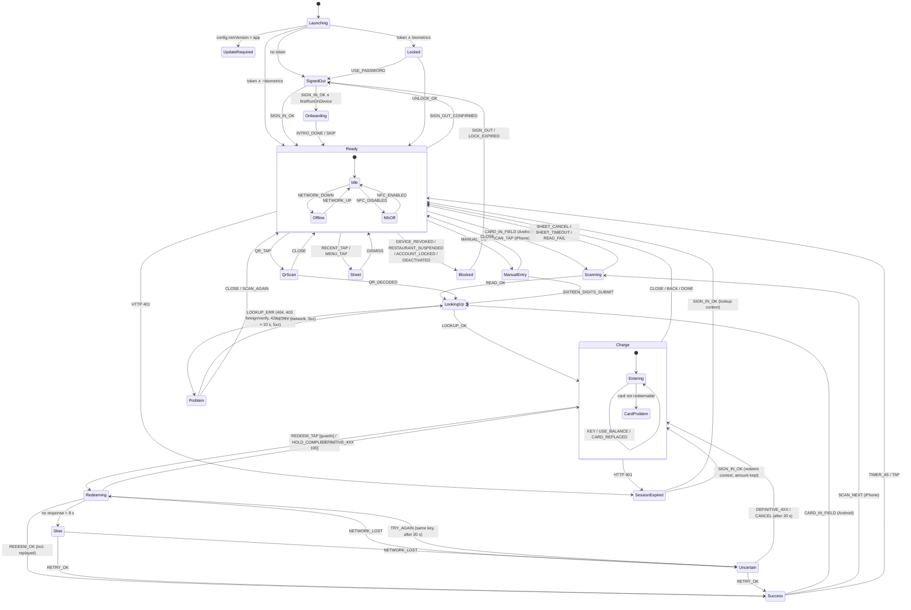

# 02 · Information Architecture and User Journey

How GiftCard Waiter is structured, how the waiter moves through it, and what every journey — happy, first-day, full-shift and edge case — looks, sounds and feels like, second by second.

| | |
|---|---|
| Document | 02 of 14 · Information architecture (§ 4) and user journeys (§ 5) |
| Audience | Design, engineering (state machine, navigation), QA (journey test scripts), product |
| Binding source | Design brief v1 — screen IDs S01–S17, card-state variants, timing budget, platform behaviour, copy keys |
| Read before | [01 · Product vision and principles](01-product-vision-and-principles.md) |
| Screen details | [03a · Access and scanning (S01–S06, S11, S12, S14–S17)](03a-screens-access-and-scanning.md) · [03b · Charge, redeem, success, problems (S07–S10, S13)](03b-screens-charge-redeem-success-problems.md) |
| Related | [06 · Motion](06-motion-guidelines.md) · [08 · Responsive behaviour](08-responsive-behaviour.md) · [09 · Flutter handoff](09-flutter-handoff.md) · [11 · Sound and haptics](11-sound-and-haptics.md) · [12 · UI copy and error messages](12-ui-copy-and-error-messages.md) |

Section numbering continues from [01](01-product-vision-and-principles.md) (§ 1–3), so § 4 and § 5 can be cited across the specification.

---

## Contents

4. [Information architecture](#4-information-architecture)
   4.1 [App map](#41-app-map) · 4.2 [Navigation model](#42-navigation-model) · 4.3 [Entry points](#43-entry-points) · 4.4 [Global elements](#44-global-elements) · 4.5 [App state machine](#45-app-state-machine) · 4.6 [Data shown per screen](#46-data-shown-per-screen)
5. [User journeys](#5-user-journeys)
   5.1 [Timing budget](#51-timing-budget) · 5.2 [Happy path — Android storyboard](#52-happy-path--android) · 5.3 [Happy path — iPhone storyboard](#53-happy-path--iphone) · 5.4 [Happy path — iPad and QR/manual](#54-happy-path--ipad-and-qr--manual) · 5.5 [First-day journey](#55-first-day-journey) · 5.6 [Shift journey](#56-shift-journey) · 5.7 [Edge journeys E01–E10](#57-edge-journeys) · 5.8 [Who acts — summary](#58-who-acts--summary)

---

## 4. Information architecture

### 4.1 App map

Seventeen screen IDs, one resting screen. Presentation types:

- **Full** — full-screen layer (covers S05, own safe-area layout).
- **Sheet** — app bottom sheet (`BottomSheet`, `radius.sheet` 32, scrim `color.scrim`).
- **System** — OS-owned UI (Apple NFC sheet, biometric prompt, OS settings).
- **State** — in-place state or variant of another screen; no navigation happens.

```
GiftCard Waiter
│
├── S01  Splash ................................................ Full · ≤ 600 ms
│
├── ACCESS (only before S05 is reachable)
│   ├── S02  Sign in ........................................... Full
│   │     └── "Forgot password" ................................ System (browser, web page)
│   ├── S03  Enable biometrics ................................. Full · once per device
│   │     └── Face ID / BiometricPrompt ........................ System
│   ├── S17  First-run intro (3 cards) ......................... Full · once · skippable · ≤ 30 s
│   └── S04  Unlock ............................................ Full · biometric prompt auto-shown
│         └── "Use password" → S02 (e-mail prefilled)
│
├── S05  READY (Home) ◄════════════════ the only resting screen ══════════════════╗
│   │    [TopBar: restaurant · avatar · Recent · Menu]                             ║
│   │    Variants: Android listening · iPhone button · iPad QR-first ·             ║
│   │              offline · maintenance banner · S16 NFC off / unsupported        ║
│   │                                                                              ║
│   ├── S06  Scanning                                                              ║
│   │     ├── Android: State of S05 (reading → lookup skeleton)                    ║
│   │     └── iPhone:  System (Apple NFC sheet, alert text ios.sheet.alert)        ║
│   ├── S12  QR scan ........................................... Full (camera)    ║
│   │     └── S16 camera denied .................................. State of S12    ║
│   ├── S11  Manual entry ...................................... Full             ║
│   ├── S13  Recent ............................................ Sheet            ║
│   │     └── S13  Recent detail ................................ Sheet on sheet   ║
│   ├── S14  Menu .............................................. Sheet            ║
│   │     └── Sign-out confirmation .............................. Dialog         ║
│   │                                                                              ║
│   └── S07  CHARGE ............................................ Full             ║
│         ├── Card-state variants (blocked, expired, inactive,                     ║
│         │   replaced, zero balance, partial disabled) ........ State            ║
│         ├── Inline guards (amount > balance, > max single,                       ║
│         │   velocity limit, offline) ......................... State            ║
│         ├── "Different card detected — Switch?" (Android) ...... Snackbar       ║
│         │     └── Switch-card confirmation (fallback) .......... Dialog         ║
│         ├── S08  Redeeming (tap / hold-to-redeem, slow,                          ║
│         │        uncertain) ....................................State of S07    ║
│         └── S09  SUCCESS ..................................... Full ═══ 4 s ═══╣
│                                                                                  ║
├── S10  Problem screens (not found, foreign, verify failed, throttled,           ║
│        network, server) .......................................Full ══ close ════╣
│                                                                                  ║
└── S15  Session & account states                                                  ║
          ├── Session expired ................................... Sheet (over any) ╝
          ├── Device revoked · Restaurant suspended ·
          │   Account locked · Account deactivated ................ Full (blocking)
          ├── Update required .................................... Full (blocking)
          └── Maintenance ........................................ Banner on S05
```

**S16 (permission states)** has no own place in the tree: NFC off / NFC unsupported are variants of S05; camera denied is a variant of S12. Notifications are never requested (the app is notification-free).

### 4.2 Navigation model

**No tab bar, no navigation stack, no drawer.** The app is a single resting screen with temporary layers.

```
  LAYER 3  System     Apple NFC sheet · biometric prompt · OS settings · browser
  ───────────────────────────────────────────────────────────────────────────────
  LAYER 2  Sheets     S13 Recent (+ detail) · S14 Menu · S15 Session expired
  ───────────────────────────────────────────────────────────────────────────────
  LAYER 1  Tasks      S07 Charge (+S08) · S09 Success · S10 Problem ·
                      S11 Manual · S12 QR
  ───────────────────────────────────────────────────────────────────────────────
  LAYER 0  Rest       S05 Ready   (S06 Android inline)
```

**Rules**

| # | Rule |
|---|---|
| N1 | S05 is the root. Every Layer 1 screen and every sheet returns to S05 — never to another Layer 1 screen, except the forward loop S11/S12 → S07 → S09 and Android's direct S09 → S07 on a new card. |
| N2 | Maximum depth is two layers above S05 (e.g. S05 → S13 → Recent detail). No screen opens a screen of its own layer. |
| N3 | Layer 1 screens appear with a vertical/scale transition from the scan origin, never a horizontal push (no "back stack" metaphor; see [06](06-motion-guidelines.md)). |
| N4 | **Back** (Android system back, iOS close `IconButton` or swipe-down on sheets) always removes exactly one layer. Back on S05 moves the app to background (Android default), never signs out. |
| N5 | Back is **ignored during S08 Redeeming** (tap and hold) and during the automatic-retry phase of the uncertain state (up to 20 s after the tap) — money may be moving. The attempt is not cancellable by navigation. In the final uncertain state, Back = "Cancel" ([03b §3.5](03b-screens-charge-redeem-success-problems.md)). |
| N6 | Back on S07 with a typed amount returns to S05 without confirmation (no money has moved; the amount is discarded). |
| N7 | Sheets can be opened only from S05 (Recent, Menu). S15 Session expired is the only sheet that may appear over any screen. |
| N8 | Blocking S15 states (device revoked, suspended, locked, deactivated, update required) replace the whole layer stack; nothing behind them is reachable. |
| N9 | When the app returns from background after > 15 min, the layer stack is discarded: S04 Unlock (if biometrics enabled) → S05. Card context on S07/S09/S10 is dropped. Under 15 min the app resumes on the exact layer. |
| N10 | Orientation changes (tablets) never change the layer stack or reset input ([08](08-responsive-behaviour.md)). |

**Platform differences in navigation**

| | Android | iPhone / iPad |
|---|---|---|
| Leave S07/S10/S11/S12 | System back or close `IconButton` (top-leading) | Close `IconButton` (top-leading); no edge-swipe on S07 |
| Dismiss sheets | Back, swipe down, tap scrim | Swipe down, tap scrim |
| New card while on S09 | Tap the card → S07 directly (300 ms cross-fade, `haptic.cardDetected`) | "Scan next card" → Apple NFC sheet → S07 |
| New card while on S07 | Amount 0: replaces card (300 ms cross-fade). Amount > 0: Snackbar "Different card detected — Switch?" | Not possible (no background reading while app is foreground) |

### 4.3 Entry points

| Entry | Condition | Route | Notes |
|---|---|---|---|
| **Cold start** | No token | S01 → S02 | Update check (`GET /app/config`) runs during S01; if below minimum version → S15 Update required. |
| | Token, biometrics enabled | S01 → S04 → S05 | Biometric prompt shows automatically on S04. |
| | Token, biometrics not enabled | S01 → S05 | Device passcode is the OS's job; no app PIN in v1. |
| | First sign-in on this device | S02 → S03 → S17 → S05 | S03 and S17 are shown once per install. |
| **Warm start** (background ≤ 15 min) | Signed in | Resume exact layer | S09 resumes on S05 if the 4 s countdown elapsed. A redeem in flight (S08) resumes on its outcome — the server result is fetched with the same `Idempotency-Key`. |
| **Warm start** (background > 15 min) | Signed in | S04 (if biometrics) → S05 | Card context discarded (N9). |
| **Universal link / App Link** `https://<domain>/c/<token>` | Card tapped to an idle or locked iPhone (background tag reading), QR scanned with the system camera, link opened | Unlocked: → S07 for that card (method `link`). Locked: S04 → S07. Signed out: S02 → S03 (if first time) → S07; S17 is deferred to the next time S05 is shown. | The pending link is kept for 120 s; after that the waiter lands on S05 and scans again. On Android, reader mode in the foreground takes precedence over the system tag dispatch. |
| **Card tap while app is foreground** | Android, S05/S07/S09 visible | Reader mode → S06 inline → S07 | See [§ 5.2](#52-happy-path--android). |
| **Notifications** | — | none | The app never requests notification permission and never sends notifications. |
| **Forgot password** | S02 / S04 fallback | System browser (web page) | Returning to the app lands on S02. |

### 4.4 Global elements

GiftCard Waiter deliberately has almost no global chrome.

| Element | Where | Contents | Rules |
|---|---|---|---|
| `TopBar` | **S05 only** | Restaurant name (`type.body.l` 600) · `Avatar` (waiter initials) · Recent `IconButton` · Menu `IconButton` | Never on S07/S09/S10 — those screens give the full height to the card and the amount (principle D2). Avatar and Menu both open S14. |
| `Banner` (maintenance) | S05, below TopBar | `color.info.bg`, notice text from `/app/config` | Non-blocking; dismissible until the next cold start. |
| `Banner` / offline state | S05 | `offline.title` "No connection" · `offline.body` | Reader mode stays active; details in [03a](03a-screens-access-and-scanning.md). |
| `Snackbar` | S07 (Android switch-card), S14 (setting changes) | One line + optional action | Never used for errors of the loop — those are banners or S10. |
| Close `IconButton` | S07, S10, S11, S12 | ✕, top-leading, 56 × 56 | The only element in the top 55 % that is interactive on those screens, and it is a secondary action. |
| Keep screen awake | S05, S07, S09 | — | Setting "Keep screen on" (default ON) in S14. |

### 4.5 App state machine

The state machine is binding for engineering and QA. State names are used in [09 · Flutter handoff](09-flutter-handoff.md) and in test scripts. Screens are given in brackets.

#### 4.5.1 Diagram



The same machine as a compact ASCII overview of the loop:

```
            ┌──────────┐ SCAN ┌──────────┐  OK  ┌──────────┐ REDEEM ┌───────────┐  OK   ┌──────────┐
  ─────────►│  Ready   ├─────►│ Scanning ├─────►│LookingUp ├──────► │  Charge   ├──────►│Redeeming │
            │   S05    │◄─────┤  S06     │      │ S06/S07  │        │   S07     │◄──┐   │   S08    │
            └──▲────▲──┘cancel└──────────┘      └────┬─────┘        └──┬────────┘   │   └─┬──┬──┬──┘
               │    │                                │ERR              │ close       │4xx  │  │  │ >8 s / lost
               │    │    ┌──────────┐                ▼                 │             │     │  │  ▼
               │    └────┤ Problem  │◄───────────────┘                 │             │     │  │ ┌──────────────┐
               │   close │   S10    │                                  │             └─────┼──┼─┤Slow/Uncertain│
               │         └──────────┘                                  │                   │  │ │ S08 (retry,  │
               │◄──────────────────────────────────────────────────────┘                   │  │ │  same key)   │
               │                        4 s / tap   ┌──────────┐              OK           │  │ └──────┬───────┘
               └────────────────────────────────────┤ Success  │◄──────────────────────────┘  │        │ OK
                          next card (Android) ─────►│   S09    │◄─────────────────────────────┴────────┘
                                                    └──────────┘
```

#### 4.5.2 States

| State | Screen(s) | Entry action | Exit action | Reader mode (Android) | Keep awake |
|---|---|---|---|---|---|
| Launching | S01 | Load token, fetch `/app/config` (timeout 2 s, non-blocking on failure) | — | off | — |
| SignedOut | S02 | Clear token + Recent | — | off | — |
| Onboarding | S03, S17 | — | Mark first run done | off | — |
| Locked | S04 | Show biometric prompt | — | off | — |
| Ready.Idle | S05 | Start reader mode (Android) | — | **on** | on |
| Ready.Offline | S05 variant | Show `offline.title` | — | on | on |
| Ready.NfcOff | S05 / S16 variant | Show NFC-off state | — | off | on |
| Sheet | S13, S14 | Pause reader mode | Resume | off | on |
| Scanning | S06 | iPhone: open NFC session with `ios.sheet.alert` | iPhone: invalidate session | on (Android: reading) | on |
| QrScan | S12 | Start camera | Stop camera | off | on |
| ManualEntry | S11 | — | — | off | on |
| LookingUp | S06 → S07 skeleton | `POST /scan`; skeleton after 150 ms | — | on | on |
| Charge.Entering | S07 | New card context; amount = 0 (or fixed = balance if partial disabled) | — | **on** | on |
| Charge.CardProblem | S07 variant | Status banner; sound/haptic per variant | — | on | on |
| Redeeming | S08 | Create or reuse `Idempotency-Key`; `POST /redeem`; spinner after 150 ms | — | on, but card taps ignored | on |
| Slow | S08 variant | "Connection slow" after 8 s; automatic retry, same key | — | ignored | on |
| Uncertain | S08 variant | `uncertain.title` / `uncertain.body`; silent automatic retries, same key, up to 20 s after the tap; then "Try again" (same key) / "Cancel" | — | ignored | on |
| Success | S09 | `haptic.success` + `sound.success`; append to Recent; start 4 s countdown | Stop countdown | **on** | on |
| Problem | S10 | Sound/haptic per variant | — | on (re-tap allowed) | on |
| SessionExpired | S15 sheet | Keep layer stack underneath | — | off | on |
| Blocked | S15 full | Stop reader mode; for revoked/deactivated: clear token + Recent | — | off | off |
| UpdateRequired | S15 full | — | — | off | off |

#### 4.5.3 Events

| Event | Source | Notes |
|---|---|---|
| CARD_IN_FIELD / READ_OK / READ_FAIL | NFC (Android reader mode; iPhone tag session) | READ_OK carries URL (+ UID for NTAG, + `picc`/`cmac` for 424 DNA) |
| SCAN_TAP / SCAN_NEXT | "Scan card" (S05) / "Scan next card" (S09), iPhone | Opens Apple NFC sheet |
| SHEET_CANCEL / SHEET_TIMEOUT | Apple NFC sheet | Timeout ≈ 60 s → S05 silently with hint text |
| QR_DECODED / SIXTEEN_DIGITS_SUBMIT | S12 / S11 | method `qr` / `manual` |
| LINK_OPENED | Universal link / App Link | method `link` |
| LOOKUP_OK / LOOKUP_ERR | `POST /api/v1/scan` | ERR carries HTTP code + error code |
| KEY / USE_BALANCE | `Keypad`, `QuickAmountChip` | Every change of amount invalidates a stored key (new attempt) |
| REDEEM_TAP / HOLD_COMPLETE / HOLD_RELEASED | `PrimaryButton` / `HoldButton` | HOLD_RELEASED before 600 ms → no event to server |
| REDEEM_OK / DEFINITIVE_4XX / NETWORK_LOST / TIMEOUT_8S | `POST /cards/{id}/redeem` | 4xx except 401/408/429-with-retry are definitive |
| TRY_AGAIN / CANCEL | "Try again" / "Cancel" in the final uncertain state (20 s after the tap) | TRY_AGAIN re-sends with the same key; CANCEL keeps the pending key ([03b §3.5](03b-screens-charge-redeem-success-problems.md)) |
| TIMER_4S / TAP | S09 countdown / any touch on S09 | |
| HTTP_401 / DEVICE_REVOKED / RESTAURANT_SUSPENDED / ACCOUNT_LOCKED | Any API call | Global handlers, independent of current state |
| NETWORK_DOWN / NETWORK_UP | OS reachability + failed requests | Reachability alone never blocks a request; the request result decides |
| BACKGROUND / FOREGROUND(Δt) | OS lifecycle | Δt > 15 min → Locked (if biometrics) and context drop |
| BUSINESS_DAY_ROLLOVER | Local clock 04:00 (restaurant time zone) | Clears Recent |

#### 4.5.4 Transitions and guards (loop)

| From | Event | Guard | To | Side effects |
|---|---|---|---|---|
| Ready | CARD_IN_FIELD | Android ∧ NFC on | Scanning (inline) | Breathing rings accelerate ([06](06-motion-guidelines.md)) |
| Scanning | READ_OK | — | LookingUp | `haptic.cardDetected` + `sound.cardDetected` (Android, after read) |
| LookingUp | LOOKUP_OK | status ∈ {active} ∧ balance > 0 | Charge.Entering | Balance card springs in (`motion.spring.card`) |
| LookingUp | LOOKUP_OK | status ∈ {blocked, expired, inactive, replaced, redeemed} ∨ balance = 0 ∨ is_expired | Charge.CardProblem | Card desaturated where specified, `StatusBanner` |
| LookingUp | LOOKUP_ERR | 404 / 403 foreign / 403 NFC_* / 429 SCAN_THROTTLED / 5xx / > 10 s | Problem (S10 variant) | `haptic.error` / `haptic.warning` per [11](11-sound-and-haptics.md) |
| Charge.Entering | KEY | — | Charge.Entering | Amount updates, announced; stored key discarded |
| Charge.Entering | REDEEM_TAP | 0 < amount ≤ balance ∧ amount < € 100,00 ∧ online ∧ card redeemable | Redeeming | New key unless a pending key exists for the same card + amount |
| Charge.Entering | HOLD_COMPLETE | amount ≥ € 100,00 ∧ amount ≤ balance ∧ online | Redeeming | `haptic.holdTick` at 33/66/100 % during the hold |
| Charge.Entering | CARD_IN_FIELD | Android ∧ amount = 0 | Charge.Entering (new card) | 300 ms cross-fade, `haptic.cardDetected` |
| Charge.Entering | CARD_IN_FIELD | Android ∧ amount > 0 | Charge.Entering | Snackbar "Different card detected — Switch?"; card unchanged until "Switch" |
| Redeeming | REDEEM_OK | — | Success | `replayed: true` handled identically; key discarded |
| Redeeming / Slow / Uncertain | DEFINITIVE_4XX | 422 INSUFFICIENT_BALANCE, INVALID_AMOUNT, CARD_BLOCKED, CARD_EXPIRED, CARD_NOT_REDEEMABLE · 409 INVALID_CARD_STATE · 429 VELOCITY_LIMIT_EXCEEDED | Charge (inline message or card-state variant) | Key discarded; card refreshed where the error concerns the card |
| Redeeming | TIMEOUT_8S | — | Slow | Automatic retry, same key |
| Redeeming / Slow | NETWORK_LOST | — | Uncertain | Automatic retry, same key |
| Uncertain | TRY_AGAIN | automatic retrying ended (20 s after the tap) | Redeeming | Same key |
| Uncertain | CANCEL | automatic retrying ended (20 s after the tap) | Charge | **Pending key kept** for this card + amount; a later Redeem of the same card + amount reuses it |
| Success | CARD_IN_FIELD | Android | LookingUp | Countdown cancelled |
| Success | TIMER_4S ∨ TAP | — | Ready | |
| Any | HTTP_401 | — | SessionExpired | Nothing was booked by the rejected request; in redeem context the attempt (same key, card, amount) is **kept** across re-authentication ([03b](03b-screens-charge-redeem-success-problems.md), [09](09-flutter-handoff.md) K6) |

**Idempotency key lifecycle** (the rule that makes M3 = 0 possible):

```
  REDEEM_TAP / HOLD_COMPLETE
          │
          ▼
   pending key for (card id, amount)? ──yes──► reuse it
          │ no
          ▼
   generate new UUID key ──► bind to (card id, amount)
          │
          ├── automatic retry (slow, uncertain) ............ same key
          ├── manual retry of the same card + amount ........ same key
          ├── 401 → re-sign-in → back on S07 ............... same key (kept)
          │
          ├── REDEEM_OK (incl. replayed) ................... discard
          ├── DEFINITIVE_4XX (not 401) ..................... discard
          ├── amount changed ............................... discard (new attempt)
          └── card changed / sign-out / 04:00 rollover ..... discard
```

### 4.6 Data shown per screen

Everything the app displays comes from the scan and redeem responses, the signed-in account, and local settings. **No customer data exists in the API responses, so none can be shown.**

| Screen | Card data | Money | Other data |
|---|---|---|---|
| S05 Ready | — | — | Restaurant name, waiter initials, connectivity, NFC state, maintenance notice |
| S06 Scanning | — | — | iPhone: `ios.sheet.alert` in the system sheet |
| S07 Charge | Restaurant name (on card), **full formatted card number** (tertiary, header), `•••• 6488` (on card), status badge, "Valid until" date, `blocked_reason` (blocked only) | Balance, typed amount, difference to balance, max single redemption (only after a 422) | — |
| S08 Redeeming | as S07 | Amount (in button) | Progress, retry state |
| S09 Success | `•••• 6488` | Redeemed amount, remaining balance | Countdown |
| S10 Problem | None (by definition) — S11 retains the typed number for correction only | — | Retry countdown (throttled) |
| S11 Manual entry | The 16 digits being typed (`CardNumberField`, Geist Mono) | — | — |
| S12 QR scan | — | — | Camera viewfinder |
| S13 Recent | Per row: time, `•••• 6488` | Amount, remaining balance; header total ("12 redemptions · € 486,40 today") | Detail: same + line "Wrong amount? A manager can reverse it in the dashboard." |
| S14 Menu | — | — | Waiter name + e-mail, restaurant, device name, app version, settings |
| S15 | — | — | Status and retry time (account locked: `retry_after`) |

**Never shown, anywhere:** customer or recipient names, e-mails, phone numbers, purchase details, card history, other waiters' redemptions, other devices, restaurant revenue or reports, the NFC UID or signature values, raw error codes, the idempotency key or request IDs (these go to logs only, [09](09-flutter-handoff.md)).

---

## 5. User journeys

### 5.1 Timing budget

Target: **< 5 s from tap to ready-for-next.** Binding per step:

| Step | Android | iPhone | Covered by |
|---|---|---|---|
| Open app (warm, unlocked) → Ready | 0.4 s | 0.4 s | Resume on exact layer |
| Start scan | 0 (always listening) | tap "Scan card" 0.4 s + sheet 0.3 s | Thumb-zone button |
| Card read + lookup | 0.3 s read + ≤ 0.4 s API | 0.5 s read + ≤ 0.4 s API | Skeleton after 150 ms |
| Transition to Charge | 0.24 s | 0.24 s | `motion.duration.base` |
| Type amount (4 digits) | ~1.2 s | ~1.2 s | POS keypad, 72 pt keys |
| Tap Redeem → server → Success | 0.1 + ≤ 0.5 s | same | Spinner after 150 ms |
| Success visible to guest | 0.8 s (can tap next card immediately) | 0.8 s | S09 hero |
| **Total (typical)** | **≈ 3.5 s** | **≈ 4.5 s** | |

**The totals (≈ 3.5 s Android, ≈ 4.5 s iPhone) are measured from the Ready (Home) screen S05 with the app already unlocked** — the normal case during service; the first row is not included, and opening the app adds its 0.4 s (plus biometric unlock if required). **Time-to-redeem** (metric M1, [01 § 1.7](01-product-vision-and-principles.md#17-success-metrics)) excludes the 0.8 s success dwell: ≈ 2.7 s Android, ≈ 3.6 s iPhone.

**Latency rules**

| Situation | ≤ 150 ms | 150 ms – 3 s | 3 – 10 s | > 10 s |
|---|---|---|---|---|
| Lookup | nothing extra | `Skeleton` balance card | + "Still looking…" | S10 network error |

| Situation | ≤ 150 ms | 150 ms – 8 s | > 8 s | Network lost |
|---|---|---|---|---|
| Redeem | button pressed state | `Spinner` in button, label kept | "Connection slow", automatic retry, same key | Uncertain state (`uncertain.title`), automatic retry, same key |

### 5.2 Happy path — Android

*Lukas, Samsung phone, Gasthaus on a Saturday. App on S05, reader mode on, screen awake. The guest pays € 24,90 with a € 100,00 card.*

| t (s) | Waiter does | Sees | Hears | Feels | System |
|---|---|---|---|---|---|
| −2.0 | Takes the card from the guest, holds phone in the right hand | S05: `ready.android.title` "Hold the card to the phone", saffron rings breathing | — | — | Reader mode listening |
| 0.00 | Touches the card to the back of the phone (top third) | Rings accelerate toward the centre | — | — | Tag in field |
| 0.30 | Holds still | Rings resolve into a card outline | `sound.cardDetected` (glass tick) | `haptic.cardDetected` | URL + UID read; `POST /scan` |
| 0.45 | Moves card away | `Skeleton` balance card fades in (150 ms rule) | — | — | Waiting for lookup |
| 0.70 | Glances at the screen | Balance card springs in: brand colour, "Gasthaus Zum Goldenen Hirschen", **€ 100,00**, `•••• 6488` | — | — | LOOKUP_OK |
| 0.94 | Thumb moves to keypad | S07 complete: amount "€ 0,00", keypad, disabled button | — | — | Charge.Entering |
| 1.25 | Taps `2` | "€ 0,02", button "Redeem € 0,02" | — | `haptic.key` | |
| 1.55 | Taps `4` | "€ 0,24" | — | `haptic.key` | |
| 1.85 | Taps `9` | "€ 2,49" | — | `haptic.key` | |
| 2.14 | Taps `0` | **"€ 24,90"**, button "Redeem € 24,90" | — | `haptic.key` | Amount announced (a11y) |
| 2.24 | Taps "Redeem € 24,90" | Button pressed state | — | — | Key generated; `POST /redeem` |
| 2.39 | — | Spinner in the button (150 ms rule) | — | — | |
| 2.74 | Turns the phone toward the guest | S09: check draws, "Redeemed", **€ 24,90**, "Remaining balance € 75,10", `•••• 6488` | `sound.success` (E6 → B6) | `haptic.success` | REDEEM_OK; row added to Recent |
| 3.54 | Guest has read it; Lukas hands the card back | `CountdownHairline` running; caption "Just tap the next card" | — | — | Ready for next card |
| 6.74 | (no touch) | Auto-return to S05 | — | — | TIMER_4S |

**Tap-to-ready: ≈ 3.5 s. Time-to-redeem: ≈ 2.7 s.** If the next card is tapped at 3.6 s, S09 is replaced by the next S07 directly.

### 5.3 Happy path — iPhone

*Ana, iPhone 15, same situation. App on S05.*

| t (s) | Waiter does | Sees | Hears | Feels | System |
|---|---|---|---|---|---|
| 0.00 | Thumb taps "Scan card" (bottom, 64 pt) | Button pressed | — | — | SCAN_TAP |
| 0.40 | — | Apple NFC sheet rising: `ios.sheet.alert` "Hold the card near the top of the iPhone" | System sheet sound (OS) | — | Tag reader session open |
| 0.70 | Holds the card to the top edge of the iPhone | Sheet ready | — | — | |
| 1.20 | Holds still | Sheet ✓ "Card found" | OS read feedback | per [11](11-sound-and-haptics.md) | URL + UID read; `POST /scan` |
| 1.60 | Moves card away | Sheet dismisses, balance card springs in with € 100,00 | — | — | LOOKUP_OK |
| 1.84 | Thumb to keypad | S07 complete | — | — | |
| 1.84–3.04 | Types `2 4 9 0` | "€ 24,90", "Redeem € 24,90" | — | `haptic.key` ×4 | |
| 3.14 | Taps "Redeem € 24,90" | Pressed → spinner at 3.29 | — | — | `POST /redeem` |
| 3.64 | Turns phone to guest | S09 success | `sound.success` | `haptic.success` | REDEEM_OK |
| 4.44 | — | "Scan next card" button in the same position as "Scan card" | — | — | Ready for next |

**Tap-to-ready: ≈ 4.5 s. Time-to-redeem: ≈ 3.6 s.** Next card: one tap on "Scan next card" opens the sheet directly (saves returning to S05). If the sheet times out (≈ 60 s) or is cancelled, the app returns to S05 silently with a hint text.

**Happy-path emotion curve (both platforms)**

```
 calm    +2 │                                              ●──── relief, pride (guest sees ✓)
         +1 │ ●───────●                         ●─────────●
 neutral  0 │          ╲         ●─────────────●
         −1 │           ●───────●   focus (typing)
          ──┼─────────────────────────────────────────────────────────
             card     tap   card appears   amount   redeem   success  next
             handed        (tiny wait)     typed    tapped    shown
```

The only dip is the tiny wait between tap and card appearing — covered by immediate feedback (`haptic.cardDetected` on Android; the system ✓ on iPhone) and the skeleton.

### 5.4 Happy path — iPad and QR / manual

| Step | iPad (no NFC) | Any phone, QR | Any phone, manual |
|---|---|---|---|
| Start | S05 hero is "Scan QR code" (QR-first variant) | S05 secondary action "Scan QR code" → S12 | S05 secondary action "Card number" → S11 |
| Read | S12 viewfinder; QR decoded automatically; `haptic.cardDetected` | same | Type 16 digits (auto-grouped in fours); lookup starts automatically after the 16th digit |
| Lookup → S07 | method `qr` | method `qr` | method `manual` |
| Typical time to S07 | ≈ 1.5–2.5 s | ≈ 1.5–2.5 s | ≈ 6–9 s |
| Charge → Success | identical to § 5.2 | identical | identical |

Landscape on tablets: S07 becomes two panes (balance card left, keypad right); see [08](08-responsive-behaviour.md).

### 5.5 First-day journey

*Ana's first shift. The manager invited her in the dashboard; she has her e-mail and password. She installs the app from the store 10 minutes before service.*

| # | Step | Screen | What Ana sees / does | Time |
|---|---|---|---|---|
| 1 | Open app | S01 → S02 | Splash ≤ 600 ms, then sign-in: e-mail, password, "Sign in". | 0:00 |
| 2 | Sign in | S02 | Types credentials; keyboard "next"/"go" moves focus and submits. Wrong password → inline error under the field (copy in [12](12-ui-copy-and-error-messages.md)); 423 → S15 account locked with the retry time. | ~0:40 |
| 3 | Enable biometrics | S03 | "Use Face ID" / "Not now". She taps "Use Face ID"; iOS permission prompt; confirmed. | ~0:50 |
| 4 | Intro | S17 | 3 cards (≤ 30 s, skippable): how to read a card on *this* platform, type-and-redeem, why a connection is needed (content in [03a](03a-screens-access-and-scanning.md)). | ~1:20 |
| 5 | Arrive | S05 | TopBar with restaurant name and her initials; big "Scan card" button. No tour, no tooltips. | ~1:21 |
| 6 | First redemption (with manager watching) | S06 → S07 → S09 | Taps "Scan card", holds the card to the top of the iPhone, card appears; types `1 2 5 0`; "Redeem € 12,50"; ✓. | ~1:30 |
| 7 | Curiosity | S13 | Taps Recent: "1 redemption · € 12,50 today" and the row. Swipes down. | ~1:40 |

**First-day success criteria:** steps 5–6 happen without any explanation from the manager (metric M4 ≥ 95 %). If Ana skipped S03 ("Not now"), biometrics can be enabled later in S14; S03 is not shown again.

**Emotion curve:** apprehensive (−1, "new job, money app") → neutral (0, sign-in is familiar) → reassured (+1, intro says the system prevents double bookings) → confident (+2, first ✓ with the manager nodding).

### 5.6 Shift journey

*Lukas, Saturday evening, 17:00–01:00, personal Android phone assigned as his device, ~110 redemptions.*

```
 17:00          18:00 ─────────────── 22:30 ── 22:45 ──────────── 00:45   01:00   04:00
   │              │                     │        │                  │       │       │
 unlock      service peak:           break    back from          last    end of   business-
 (Face/      ~110 × tap loop,        (phone   break (> 15 min    card    shift    day rollover:
 fingerprint) S05 always awake       in       → unlock)                  lock or  Recent cleared
   │                                 pocket)                             sign out
```

| Phase | What happens | Screens | Rules applied |
|---|---|---|---|
| **Start of shift** | Opens the app: cold start → S04 biometric prompt auto-shown → S05 in < 1.5 s. First card of the evening works immediately. | S01 → S04 → S05 | Token 30-day rolling, refreshed on use. No password during a normal week. |
| **Service** | Repeats the tap loop ~110 times. Between tables the phone sits in his apron with the screen locked by the OS; unlocking the phone returns straight to S05 (background ≤ 15 min, no app unlock). | S05 → S07 → S09 → S05 | Keep screen on while S05/S07/S09 are visible; reader mode resumes on foreground. |
| **Busy moment** | Two guests at one table with two cards: taps card 1, redeems; while S09 shows, taps card 2 → S07 for card 2 directly. | S09 → S07 | Android replace-on-S09 (300 ms cross-fade). |
| **Manager asks "how many cards tonight?"** | Opens Recent: "37 redemptions · € 1.486,40 today". Taps a row → detail with remaining balance and the reversal line. | S13 → detail | Read-only, local, max 200 rows. |
| **Break** (22:30–22:45+) | Phone in pocket, app backgrounded for 18 min. On return: S04 unlock → S05. A card that was left open on S07 before the break is gone. | S04 → S05 | > 15 min → unlock + context drop (N9). |
| **Connection hiccups** | Terrace Wi-Fi drops twice; S05 shows the offline state for ~20 s, then returns to normal. No redemptions are attempted while offline. | S05 offline variant | Never redeem offline. |
| **End of shift** | Personal phone: simply locks the phone; next shift starts with biometric unlock. Shared or handed-over phone: Menu → Sign out → confirmation Dialog → S02; token and Recent cleared. | S14 → Dialog → S02 | Sign-out is the only `DangerButton` in the app. |
| **04:00** | Recent clears automatically (new business day). | — | Restaurant time zone. |

**Emotion curve:** routine (+1) → flow (+2 during the loop, the rhythm of tick–keys–chime) → mild irritation at the post-break unlock (0, one glance) → done (+1). The design goal for a shift is *invisibility*: the app should not be remembered.

### 5.7 Edge journeys

Format per journey: trigger · steps (screen · copy key · feedback) · recovery · who acts · emotion curve. Copy keys are from the brief; strings without a binding key are defined in [12](12-ui-copy-and-error-messages.md). Feedback tokens are detailed in [11](11-sound-and-haptics.md); layouts in [03b](03b-screens-charge-redeem-success-problems.md).

---

#### E01 · Partial redemption disabled

**Trigger:** Restaurant setting `allow_partial_redemption = false`. Guest's card has € 32,50; the bill is € 41,00.

| # | Step | Screen | Copy / feedback |
|---|---|---|---|
| 1 | Card read, lookup OK | S07 variant "partial disabled" | Keypad hidden; amount fixed at **€ 32,50** |
| 2 | Waiter sees one button | S07 | `charge.redeemFull` "Redeem full balance · € 32,50" |
| 3 | Taps | S08 → S09 | "Redeemed € 32,50", `success.remaining` "Remaining balance € 0,00"; `haptic.success`, `sound.success` |
| 4 | Collects € 8,50 by cash/card at the till | — | outside the app |

**Variants:** full balance ≥ € 100,00 → `HoldButton` with `charge.hold`. If the bill is *lower* than the balance, the app still offers only the full balance — the restaurant's policy decides how the difference is handled.
**Recovery:** none needed. **Who acts:** waiter; manager only if the guest disputes the policy.
**Emotion:** neutral (0) → slightly surprised by the missing keypad (−1, first time only) → clear (+1, the button says exactly what happens).

---

#### E02 · Amount greater than balance

**Trigger:** Balance € 32,50, bill € 40,00.

| # | Step | Screen | Copy / feedback |
|---|---|---|---|
| 1 | Types `4 0 0 0` | S07 | "€ 40,00" |
| 2 | Inline guard | S07 (inline, not a screen) | `charge.overBalance` "€ 7,50 more than the balance" in `color.warning`; button disabled; `QuickAmountChip` `charge.useBalance` "Use balance · € 32,50"; `haptic.warning` once when the threshold is crossed |
| 3 | Taps the chip | S07 | Amount becomes € 32,50; button "Redeem € 32,50"; `haptic.select` |
| 4 | Redeems | S08 → S09 | "Remaining balance € 0,00" |
| 5 | Collects € 7,50 otherwise | — | — |

**Recovery:** one tap on the chip, or ⌫ to correct. **Who acts:** waiter.
**Emotion:** focused (0) → brief doubt (−1) → helped (+1, the fix is offered, the difference is calculated for her).

---

#### E03 · Hold to redeem (amount ≥ € 100,00)

**Trigger:** Company dinner, card with € 250,00, bill € 186,00.

| # | Step | Screen | Copy / feedback |
|---|---|---|---|
| 1 | Types `1 8 6 0 0` | S07 | "€ 186,00"; button becomes `HoldButton`: "Redeem € 186,00" with hint `charge.hold` "Hold to redeem" |
| 2a | Taps briefly (habit) | S07 | Ring starts and retracts; hint emphasised; nothing is sent; `haptic.warning` |
| 2b | Presses and holds | S08 (hold) | Saffron `ProgressRing` fills over 600 ms; `haptic.holdTick` at 33 / 66 / 100 % |
| 3 | Released at 100 % | S08 → S09 | Standard redeem; `sound.success` |

**Recovery:** releasing early cancels without any server call. Assistive technologies get an equivalent explicit action ([07](07-accessibility-guidelines.md)).
**Who acts:** waiter. **Emotion:** routine (+1) → deliberate (0, a moment of weight appropriate to the amount) → secure (+2).

---

#### E04 · Blocked card with the guest present

**Trigger:** Card status `blocked` (e.g. reported lost by the buyer), `blocked_reason` present.

| # | Step | Screen | Copy / feedback |
|---|---|---|---|
| 1 | Card read, lookup OK | S07 card-state variant | Balance card 40 % desaturated, `StatusBadge` "Blocked"; balance still visible |
| 2 | Danger banner | S07 | `card.blocked` "Card blocked" · `blocked_reason` · `getManager` "Please get a manager"; keypad and Redeem not shown; `haptic.error`, `sound.error` |
| 3 | Waiter to guest | — | "This card is blocked — I'll get the manager." (no accusation; the screen blames nobody) |
| 4 | Manager arrives, reads the full card number from the S07 header | S07 | Full formatted number in tertiary text |
| 5 | Manager resolves in the dashboard (out of app) | — | — |
| 6 | Waiter closes | S07 → S05 | Close / "Done" |

**Recovery:** none in the app — the waiter cannot unblock (no `cards.block`). If the manager unblocks, the waiter scans again.
**Who acts:** **manager.** **Emotion:** routine (+1) → alarm (−2, social tension at the table) → contained (0, the screen gives the sentence and the next step) → resolved (+1).

---

#### E05 · Expired card

**Trigger:** `is_expired = true` or status `expired`; balance € 45,00.

| # | Step | Screen | Copy / feedback |
|---|---|---|---|
| 1 | Card read, lookup OK | S07 card-state variant | Balance card 40 % desaturated, badge "Expired"; "Valid until" date shown |
| 2 | Warning banner | S07 | `card.expired` "Card expired" + `getManager`; Redeem not available; `haptic.warning`, `sound.warning` |
| 3 | Waiter tells the guest the balance and the expiry date | — | Both visible on the card |
| 4 | Manager decides in the dashboard | — | out of app |

**Similar card states (same journey shape):** `card.inactive` "Card not activated yet" (warning; the manager activates it in the dashboard, then the waiter scans again) · `card.replaced` "Card was replaced" (desaturated, the guest should have a newer card) · `card.empty` "No balance left" (warning, no manager needed — the waiter tells the guest and closes).
**Who acts:** manager (expired, inactive, replaced); waiter (empty). **Emotion:** routine (+1) → disappointment on the guest's behalf (−1) → informed (0).

---

#### E06 · Card from another restaurant

**Trigger:** `403 CARD_FOREIGN_RESTAURANT` — a valid GiftCard Pro card of a different restaurant.

| # | Step | Screen | Copy / feedback |
|---|---|---|---|
| 1 | Card read, lookup error | S10 variant "foreign" | `problem.foreign.title` "Card from another restaurant" + one line what to do ([12](12-ui-copy-and-error-messages.md)); `haptic.error`, `sound.error` |
| 2 | Waiter explains; guest pays otherwise | — | No card data shown (not even the other restaurant's name) |
| 3 | "Scan another card" or close | S10 → S05 (Android: a new tap on S10 goes straight to lookup) | — |

**Who acts:** waiter. **Emotion:** routine (+1) → puzzled (−1) → clear (0, one sentence to say).

---

#### E07 · Clone or verification failed

**Trigger:** `403 NFC_UID_MISMATCH` (NTAG chip UID does not match the card), `NFC_SIGNATURE_INVALID` or `NFC_REPLAY_DETECTED` (NTAG 424 DNA).

| # | Step | Screen | Copy / feedback |
|---|---|---|---|
| 1 | Card read, lookup error | S10 variant "verify" | `problem.verify.title` "Card could not be verified"; `haptic.error`, `sound.error` |
| 2 | One re-tap allowed | S10 → S06 | "Try again" (Android: tap the card again; iPhone: opens the NFC sheet). A fresh tap produces a fresh read (and, on 424 DNA, a fresh signature). |
| 3a | Succeeds | → S07 | Journey continues normally (a misread was the cause) |
| 3b | Fails again | S10 | Body now shows `getManager`; "Try again" is removed; only "Close" |

**Rule:** S10 "verify" never offers QR or manual entry as a workaround — that would bypass chip verification. The app never re-sends a signed read automatically.
**Who acts:** **manager** (suspected clone: keep the card, check the original in the dashboard). **Emotion:** routine (+1) → suspicion (−2) → protected (0, the system caught it; the waiter did not have to judge).

---

#### E08 · Connection lost during redeem

**Trigger:** Terrace Wi-Fi drops between the tap on "Redeem € 38,00" and the server response.

| # | t | Step | Screen | Copy / feedback |
|---|---|---|---|---|
| 1 | 0 s | Taps "Redeem € 38,00" | S08 | Key K1 generated; spinner after 150 ms |
| 2 | ~1 s | Network error | S08 uncertain | `uncertain.title` "Connection interrupted" · `uncertain.body` "Checking … Nothing is ever booked twice."; `haptic.warning` once; no sound loop |
| 2′ | 8 s | (variant: no response at all) | S08 slow | "Connection slow" — automatic retry, same K1 |
| 3 | 1–20 s | Silent automatic retries with K1 (back-off 1 s / 2 s / 4 s, [03b §3.1](03b-screens-charge-redeem-success-problems.md)) | S08 uncertain | Calm progress; Back ignored (N5) |
| 4a | any | Connection returns → server answers | S09 | Normal success. If the first request had already booked, the server returns `replayed: true` — shown identically. |
| 4b | any | Server answers with a definitive 4xx | S07 | Inline message / card state; K1 discarded |
| 5 | 20 s after the tap | Still no answer | S08 uncertain (final) | Automatic retrying stops; "Try again" (same K1) and "Cancel" appear |
| 6a | — | Waiter taps "Try again" | S08 | Re-sent with **K1**; success or `replayed: true` → S09 |
| 6b | — | Waiter taps "Cancel" | S07 | Card and amount remain; **K1 stays pending** for this card + € 38,00. Tapping Redeem again later reuses K1 — it can only ever book once. Banner recommends a fresh scan first. |

**Recovery:** automatic in most cases (waiter does nothing). If the connection stays down, the waiter can check the booking by scanning the card again once online (the balance shows whether € 38,00 was deducted) or ask the manager to check the dashboard.
**Who acts:** system; waiter waits; manager only if still unconfirmed after "Try again" / "Cancel". **Emotion:** confident (+1) → alarm (−2, "did it book?") → reassured (0, the screen answers the question before it is asked) → relief (+2).

---

#### E09 · Session expired mid-shift

**Trigger:** `401 UNAUTHENTICATED` on a lookup or redeem (token revoked by password change, or expired after 30 days without use).

| # | Step | Screen | Copy / feedback |
|---|---|---|---|
| 1 | Any request returns 401 | S15 session-expired sheet over the current screen | `session.expired` "Session expired"; password field, e-mail prefilled; `haptic.warning` |
| 2 | Waiter enters password (biometrics cannot renew an expired server session) | S15 | — |
| 3a | Context was a lookup | → S05 | Card must be tapped again (fresh read) |
| 3b | Context was a redeem | → S07 | Same card, **amount kept**; the rejected request booked nothing; the attempt (same key) is kept, so Redeem with the unchanged amount reuses it |
| 4 | Forgot password | → system browser | Waiter asks the manager to redeem at the dashboard meanwhile |

**Related blocking states (S15 full screen):** `DEVICE_REVOKED` (manager removed this device → sign out, S02) · `RESTAURANT_SUSPENDED` (nothing the waiter can do; `getManager`) · `ACCOUNT_LOCKED` (423, shows `retry_after` countdown) · account deactivated.
**Who acts:** waiter (password); manager (revoked, suspended, deactivated). **Emotion:** flow (+1) → interrupted (−1) → back in (+1, 10 s, context preserved where safe).

---

#### E10 · NFC off, no NFC, or iPad → QR / manual

| Variant | Screen | What the waiter sees | Recovery |
|---|---|---|---|
| **Android, NFC switched off** | S05 / S16 "NFC off" | NFC-off state with a button that deep-links to the NFC settings; "Scan QR code" and "Card number" remain available | Turns NFC on → returns to the app → reader mode resumes automatically, S05 normal |
| **Android device without NFC** | S05 / S16 "NFC unsupported" | QR-first S05 (like iPad) with a one-line explanation | QR (S12) and manual (S11) |
| **iPad** | S05 iPad variant | "Scan QR code" as hero, "Card number" secondary; no NFC wording anywhere | By design, not an error |
| **Camera denied** (first QR use) | S12 / S16 "camera denied" | Explanation + button to the app's system settings; "Card number" as alternative | Grants camera → S12 works; or manual entry |
| **Card number typed wrong** | S11 → S10 "not found" | `problem.notFound.title` "Card not found"; action returns to S11 with the digits kept for correction | Correct digits → lookup |
| **Scan throttled** (many failed lookups) | S10 "throttled" | Countdown from `retry_after`; no action until it ends | Wait; then scan again |

**Who acts:** waiter (NFC, camera, typing); manager only if the phone is managed and NFC is disabled by policy. **Emotion:** ready (+1) → blocked (−1, "my phone doesn't work") → alternative found (+1, QR or number in one tap).

### 5.8 Who acts — summary

| Situation | Screen | Waiter alone | Needs manager | Copy key (binding) |
|---|---|---|---|---|
| Amount > balance | S07 inline | ✓ | | `charge.overBalance`, `charge.useBalance` |
| Partial disabled | S07 variant | ✓ | (policy questions) | `charge.redeemFull` |
| Amount ≥ € 100 | S07 / S08 | ✓ | | `charge.hold` |
| Zero balance | S07 variant | ✓ | | `card.empty` |
| Blocked | S07 variant | | ✓ | `card.blocked`, `getManager` |
| Expired | S07 variant | | ✓ | `card.expired`, `getManager` |
| Inactive | S07 variant | | ✓ | `card.inactive` |
| Replaced | S07 variant | | ✓ | `card.replaced` |
| Amount > max single / velocity limit | S07 inline | ✓ (smaller amount / wait) | if repeated | → [12](12-ui-copy-and-error-messages.md) |
| Card not found | S10 | ✓ | | `problem.notFound.title` |
| Wrong restaurant | S10 | ✓ | | `problem.foreign.title` |
| Verification failed | S10 | 1 retry | ✓ | `problem.verify.title`, `getManager` |
| Scan throttled | S10 | ✓ (wait) | | → [12](12-ui-copy-and-error-messages.md) |
| Network / server error (lookup) | S10 | ✓ | | → [12](12-ui-copy-and-error-messages.md) |
| Offline | S05 variant | ✓ | | `offline.title`, `offline.body` |
| Uncertain redeem | S08 | ✓ (wait; after 20 s "Try again" / "Cancel") | if still unconfirmed | `uncertain.title`, `uncertain.body` |
| Session expired | S15 sheet | ✓ | | `session.expired` |
| Device revoked / suspended / deactivated | S15 full | | ✓ | → [12](12-ui-copy-and-error-messages.md) |
| Account locked | S15 full | ✓ (wait) | | → [12](12-ui-copy-and-error-messages.md) |
| NFC off / camera denied | S16 | ✓ | | → [12](12-ui-copy-and-error-messages.md) |
| Update required / maintenance | S15 | ✓ (update) | | → [12](12-ui-copy-and-error-messages.md) |

Metric M5 (≥ 80 % recovery without a manager) is measured over the rows marked "Waiter alone" that are not card problems.

---

Version 1.0 · September 2026 · GiftCard Waiter design specification
